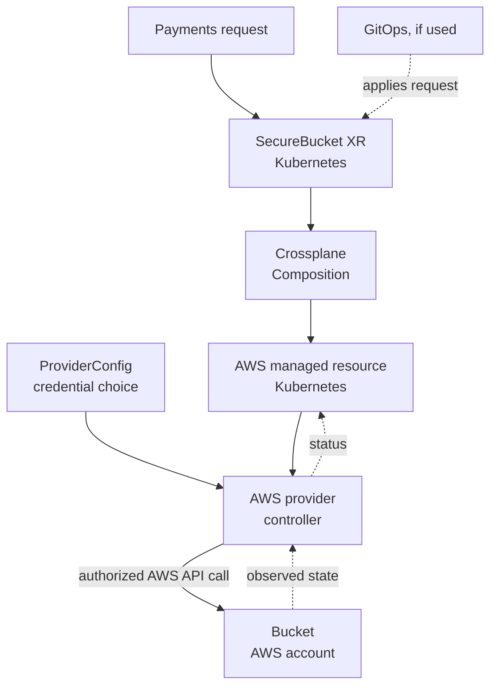

# Crossplane on AWS

## What it is for

Crossplane lets a Kubernetes cluster hold **requests for external
resources**, such as an AWS bucket. A Crossplane provider turns a
Kubernetes managed resource into AWS API calls, then keeps comparing
the requested settings with what it observes. The Kubernetes object
and the AWS object are related, but they are not the same object.
[^crossplane-providers][^crossplane-managed]

This guide explains the AWS-specific boundaries. Start with
[Crossplane foundations](../kubernetes/crossplane/index.md) if
*provider*, *managed resource*, and *composition* are new terms.
Use [How an AWS resource request moves through Crossplane](../kubernetes/crossplane/aws-resource-workflow.md)
to follow the full handoff. For a hands-on install and provider test,
use the [local AWS S3 lab](../kubernetes/crossplane/local-aws-s3-lab.md).
This page does not contain an install procedure.

Think of a library request desk: a reader asks for a book, and a
librarian obtains it and records what is on the shelf. A platform
API can similarly accept a simple request while a provider handles
AWS details. The analogy ends there. Crossplane keeps reconciling
after the first request; AWS can reject changes because of IAM or
service rules; and deleting a Kubernetes request can delete an
external resource, depending on its lifecycle settings. Check those
settings before treating a request like a harmless form.
[^crossplane-managed]

## The three objects to keep separate

| Object | Where it lives | What it says |
| --- | --- | --- |
| Composite resource (XR), if your platform defines one | Kubernetes API | The user-facing request, such as a platform-defined `SecureBucket`. |
| Managed resource (MR) | Kubernetes API | The provider-specific desired AWS resource and its observed status. |
| External resource | AWS account and region | The real bucket, queue, database, or other service object. |

A **Composition** can translate one XR into one or more managed
resources. The AWS provider installs the managed-resource APIs and
runs a controller that makes AWS calls. A `ProviderConfig` tells
the selected provider how to authenticate; the managed resource
references it. The exact API group, scope, schema, and credential
options depend on the installed provider package and version.
Crossplane v2 supports namespaced XRs and managed resources, but
existing v1-style APIs may still appear in a real cluster.
[^crossplane-composition][^crossplane-providers][^crossplane-v2]

## Example: a team requests a bucket

This `payments` example is invented. No provider, bucket, IAM role,
Composition, GitOps controller, or request was run or checked.

1. A platform team has already created an EKS management cluster
   and installed Crossplane, an AWS provider, and a reviewed
   `SecureBucket` platform API.
2. The payments team submits an XR asking for a bucket in its
   approved environment. GitOps *may* apply the request from Git;
   GitOps is optional and does not itself create the AWS bucket.
3. Crossplane selects a compatible Composition. It creates the
   provider-specific managed resources for the bucket and whatever
   additional controls that Composition actually defines.
4. The provider reads each MR and its `ProviderConfig`, gets
   credentials, and calls the appropriate AWS API in the target
   account. AWS authorizes or rejects that call.
5. The provider reports observed state back to the MR. The team
   still needs an application-level check before claiming the
   bucket is usable for its real workload.
   [^crossplane-composition][^crossplane-managed]

Text alternative: the team's request becomes a Kubernetes XR. A
Composition turns it into an AWS managed resource. The provider
uses the referenced credential configuration to call AWS, then
reports what it observes to the managed resource. An optional
GitOps controller applies the request to Kubernetes; it does not
replace Crossplane or the AWS provider.

The name `SecureBucket` describes a **platform promise**, not a
native Crossplane or AWS kind. It is secure only if its actual
Composition, IAM policy, AWS configuration, and tests enforce
the promised properties. Do not infer encryption, public-access
blocking, logging, or retention from the name alone.

## Four boundaries a platform must choose

| Boundary | Decision to make | What can go wrong |
| --- | --- | --- |
| Bootstrap | Which tool creates the first cluster, network, and provider identity? | Crossplane cannot create or repair the cluster it needs to run if that bootstrap path depends entirely on that failed cluster. |
| AWS identity | Which provider Pod identity and target-account role can make the call? | A valid Kubernetes request can be rejected by AWS, or a broad role can affect resources beyond the intended API. |
| API exposure | Which users may create XRs, MRs, or `ProviderConfig` references? | A narrow user-facing XR is ineffective if users can bypass it and select a privileged provider config directly. |
| Resource ownership | Which controller may update and delete each external resource? | Terraform and Crossplane can repeatedly overwrite one another, or a deletion can remove state the team meant to retain. |

For bootstrap, Terraform, CloudFormation, CDK, or another operator
managed tool may create the first EKS cluster and IAM foundation.
Afterward, Crossplane can own selected resources whose lifecycle
the team has explicitly assigned to it. This is a design choice,
not a requirement to use a particular bootstrap product.

For identity on EKS, **Pod Identity** can associate a provider Pod's
service account with an IAM role if the agent and the provider's
AWS SDK credential path support it. The associated role is in the
cluster's AWS account; cross-account calls need a delegated role
path. **IRSA** instead uses a service-account web identity token and
an IAM role trust policy. Either way, check the *provider Pod's*
effective identity and permissions. Running `aws sts
get-caller-identity` in your own shell proves only your shell's
identity.[^eks-pod-identity][^eks-pod-identity-flow][^eks-irsa]

For API exposure, the AWS provider described in current Crossplane
documentation supports namespaced `ProviderConfig` and
cluster-wide `ClusterProviderConfig`. A managed resource must
select the intended kind and name. Namespace scope alone is not
the whole authorization model: Kubernetes RBAC and admission
rules must also limit who can create MRs and choose credentials.
Verify these APIs against the provider you install.
[^crossplane-providers]

For ownership, Crossplane's `managementPolicies` can limit actions
such as create, update, observe, and delete **when the installed
provider supports them**. Defaults can grant full control. Set
deletion and recovery expectations before exposing an XR; do not
assume removing a YAML file merely stops future reconciliation.
Avoid two active tools writing the same AWS fields.
[^crossplane-managed]

## If the bucket does not appear

Trace the first failed handoff instead of repeating the request:

1. Was the XR admitted, and did a compatible Composition produce
   the expected MR?
2. Is the provider installed and healthy, and does the MR name the
   intended `ProviderConfig`?
3. Did the provider Pod receive the expected AWS identity? Inspect
   its controller status and relevant AWS audit events; your laptop
   identity is not evidence for the Pod.
4. Did AWS deny the call, reject a setting, or create the resource
   in a different account or region?
5. If the MR reports ready, does the application using the bucket
   actually have its *own* required access? Provider identity and
   application identity are separate.

See [Find the first failing Crossplane handoff](../kubernetes/crossplane/troubleshooting.md)
for the operational commands. A failed provider can leave a
Kubernetes request present while the external AWS resource is
absent or stale; a healthy provider status alone is not an
application test.

## Check your understanding

1. Which object is the actual AWS bucket, and which objects exist
   only in Kubernetes?
2. Why might Git show an approved `SecureBucket` request while
   AWS has no bucket?
3. Whose AWS identity matters for creation: your terminal's,
   the provider Pod's, or the application Pod's?
4. What must you decide before deleting an XR or managed resource
   that represents important data?

## Deeper study

- [Crossplane providers](https://docs.crossplane.io/latest/packages/providers/)
  for installed APIs, runtime, and configuration.
- [Crossplane managed resources](https://docs.crossplane.io/latest/managed-resources/managed-resources/)
  for desired state, observed state, and lifecycle controls.
- [Crossplane compositions](https://docs.crossplane.io/latest/composition/compositions/)
  for the XR-to-MR translation.
- [EKS Pod Identity](https://docs.aws.amazon.com/eks/latest/userguide/pod-identities.html)
  and [IRSA](https://docs.aws.amazon.com/eks/latest/userguide/iam-roles-for-service-accounts.html)
  for workload credential paths.
- [How an AWS resource request moves through Crossplane](../kubernetes/crossplane/aws-resource-workflow.md)
  for the request-to-AWS handoffs.

[Back to cross-topic guides](index.md)

[^crossplane-providers]: [Crossplane - Providers](https://docs.crossplane.io/latest/packages/providers/).
[^crossplane-managed]: [Crossplane - Managed Resources](https://docs.crossplane.io/latest/managed-resources/managed-resources/).
[^crossplane-composition]: [Crossplane - Compositions](https://docs.crossplane.io/latest/composition/compositions/).
[^crossplane-v2]: [Crossplane - What's New in v2](https://docs.crossplane.io/latest/whats-new/).
[^eks-pod-identity]: [Amazon EKS - Pod Identity](https://docs.aws.amazon.com/eks/latest/userguide/pod-identities.html).
[^eks-pod-identity-flow]: [Amazon EKS - How Pod Identity Works](https://docs.aws.amazon.com/eks/latest/userguide/pod-id-how-it-works.html).
[^eks-irsa]: [Amazon EKS - IAM Roles for Service Accounts](https://docs.aws.amazon.com/eks/latest/userguide/iam-roles-for-service-accounts.html).
