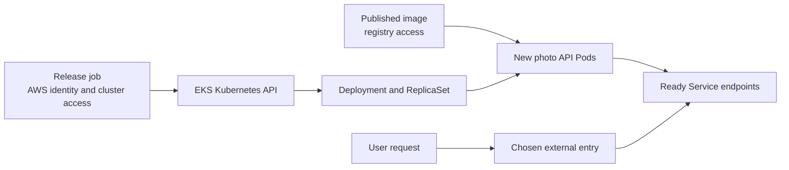

# Deploying to EKS

## Purpose

A deployment to Amazon EKS is a chain of agreements: the deployer can
reach and change the intended cluster, nodes can obtain the image,
Kubernetes can run the new Pods, and users can reach an application that
behaves correctly. This page explains what each agreement means and how
to tell where the chain broke. It is a planning explanation, not a set
of commands to run against an unknown cluster.

Read [Kubernetes fundamentals](../kubernetes/fundamentals/kubernetes-fundamentals.md)
first if Pods, Deployments, and Services are unfamiliar. For a general
release path, see [End-to-end deployment](end-to-end-deployment.md).

## Follow one photo API release

Imagine delivering a new appliance: a delivery person needs access to
the right building, the appliance must arrive, it must be installed, and
someone must confirm it works. On EKS these are separate access, image,
rollout, and user checks. The analogy stops at the rollout: Kubernetes
keeps reconciling after delivery, and a working Pod does not necessarily
mean the application works for a user.

The photo API and release below are invented. No AWS account, registry,
cluster, Pod, or user request was accessed or tested.

1. **Access the right cluster.** The release job uses an AWS identity
   and a kubeconfig entry for a named EKS cluster. EKS uses an AWS token
   for `kubectl` authentication; cluster authorization is a separate
   decision. AWS permission to describe a cluster does not by itself
   grant permission to update a Kubernetes Deployment.
   [^eks-kubeconfig][^eks-k8s-access]
2. **Name the intended image.** The Deployment's Pod template points to
   a published photo API image. A digest gives the rollout an immutable
   image reference. If it lives in private Amazon ECR, image-pull
   permissions belong to the node role or Fargate pod execution role,
   according to the compute path. This is distinct from the photo API
   Pod's IAM permission to call S3 at runtime.[^eks-ecr-images]
   [^eks-service-accounts]
3. **Let Kubernetes roll out.** Applying the desired Deployment changes
   its Pod template. The Deployment controller creates a new ReplicaSet
   and replaces Pods according to its strategy. Pods must be scheduled,
   pull the image, start, and become Ready before they can carry Service
   traffic.[^k8s-deployments][^k8s-pod-lifecycle]
4. **Check a user request.** The Service selects Ready application
   endpoints, but external routing and the photo API's response still
   need their own checks. A completed rollout establishes Kubernetes
   availability under the Deployment's settings; it does not prove a
   photo upload or download works.[^k8s-services][^k8s-deployments]

Text alternative: the release job authenticates to the EKS Kubernetes
API and changes a Deployment. Kubernetes creates new Pods, which need
access to the published image. Ready Pods become Service endpoints.
A user request also needs the chosen external entry to route to that
Service, then the application must answer correctly. The diagram does
not prescribe an Ingress, Gateway, or load-balancer implementation.

## Match a failure to its owner

| Observation | First boundary to inspect | What it does not establish |
| --- | --- | --- |
| The release job cannot connect or is forbidden. | AWS caller, cluster name and region, kubeconfig context, endpoint reachability, then EKS access entry or Kubernetes RBAC. | A valid kubeconfig is not proof of write authorization. |
| New Pods report an image-pull error. | Image reference, registry reachability, and the pull identity for the compute path. | The photo API's S3 role is not normally the image-pull identity. |
| Pods start but are not Ready. | Container logs, events, startup/readiness probes, and dependencies. | A running container is not yet a Service endpoint. |
| Rollout finishes but the photo route fails. | Service selection, external routing, target health, and the application response. | Rollout completion is not an end-to-end request test. |

An EKS Pod that calls S3 may use IRSA or EKS Pod Identity through its
service account. That credential path is for **runtime AWS API calls**.
See [EKS workload identity](eks-workload-identity.md) for the two options,
and [EKS human identity and Kubernetes RBAC](../security/identity-federation/eks-human-identity-and-rbac.md)
for deployer access.[^eks-service-accounts]

## A safe release decision

Before changing a real cluster, record the account, region, cluster,
namespace, workload owner, image reference, expected user behavior, and
the earlier working revision. Review the change through the team's
normal manifest, Helm, Kustomize, or GitOps path. A direct `kubectl set
image` outside that path may be overwritten by a controller or leave
Git out of sync; use the declared owner of the workload.

After the change, compare the **intended revision** with the Deployment
and its new Pods. `kubectl rollout status` watches the latest rollout by
default; if another rollout starts during the watch, it follows that
newer one unless a revision is specified. Then test the actual user
route and watch errors. A green status for the wrong revision is not
release evidence.[^k8s-rollout-status]

If the new version fails, restore the prior desired image through the
same ownership path and verify that the previous user behavior returns.
Kubernetes can roll back a Deployment when a prior ReplicaSet is
retained, but this does not roll back data migrations or external side
effects. See [GitOps on EKS](gitops-on-eks.md) if a GitOps controller
owns the objects.[^k8s-deployments]

## Check your understanding

1. Why can a job run `aws eks update-kubeconfig` successfully and still
   be forbidden from editing a Deployment?
2. If an ECR image cannot be pulled, which identity path should you
   check before changing the photo API Pod's S3 permissions?
3. What does a completed Deployment rollout establish, and which photo
   request must still be tested?
4. Why might a manual image change be short-lived in a GitOps-managed
   cluster?

## Deeper study

- [Connect kubectl to EKS](https://docs.aws.amazon.com/eks/latest/userguide/create-kubeconfig.html)
  and [grant Kubernetes access](https://docs.aws.amazon.com/eks/latest/userguide/grant-k8s-access.html)
  for deployer authentication and authorization.
- [Use ECR images with EKS](https://docs.aws.amazon.com/AmazonECR/latest/userguide/ECR_on_EKS.html)
  for pull permissions on nodes and Fargate.
- [Kubernetes Deployments](https://kubernetes.io/docs/concepts/workloads/controllers/deployment/),
  [Pod lifecycle](https://kubernetes.io/docs/concepts/workloads/pods/pod-lifecycle/),
  and [Services](https://kubernetes.io/docs/concepts/services-networking/service/)
  for rollout, readiness, and routing behavior.
- [Review and apply a Kubernetes manifest change](../kubernetes/commands/common-commands.md)
  for a reviewed live change, and [EKS operations](eks-operations.md)
  for boundary-led inspection.

[Back to cross-topic guides](index.md)

[^eks-kubeconfig]: [Amazon EKS - Connect kubectl](https://docs.aws.amazon.com/eks/latest/userguide/create-kubeconfig.html).
[^eks-k8s-access]: [Amazon EKS - Kubernetes API access](https://docs.aws.amazon.com/eks/latest/userguide/grant-k8s-access.html).
[^eks-ecr-images]: [Amazon ECR - ECR images with EKS](https://docs.aws.amazon.com/AmazonECR/latest/userguide/ECR_on_EKS.html).
[^eks-service-accounts]: [Amazon EKS - Workload AWS permissions](https://docs.aws.amazon.com/eks/latest/userguide/service-accounts.html).
[^k8s-deployments]: [Kubernetes - Deployments](https://kubernetes.io/docs/concepts/workloads/controllers/deployment/).
[^k8s-pod-lifecycle]: [Kubernetes - Pod lifecycle](https://kubernetes.io/docs/concepts/workloads/pods/pod-lifecycle/).
[^k8s-services]: [Kubernetes - Service](https://kubernetes.io/docs/concepts/services-networking/service/).
[^k8s-rollout-status]: [Kubernetes - kubectl rollout status](https://kubernetes.io/docs/reference/kubectl/generated/kubectl_rollout/kubectl_rollout_status/).
