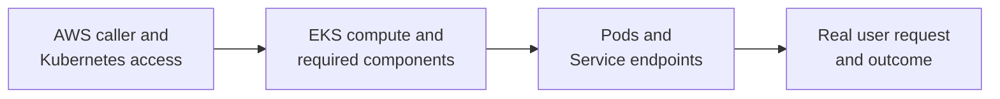

# EKS operations

## Purpose

When an application on Amazon EKS fails, first locate the failed
**boundary**. AWS reports cluster and infrastructure state; Kubernetes
reports objects and their reconciliation; the application and an actual
request reveal whether users can complete their task. A green signal
from one boundary is not proof that the next one works.

**Reconciliation** means Kubernetes controllers repeatedly compare the
objects you declared with what is running and try to close the gap.
**Ready** means a Pod currently passes Kubernetes' readiness checks; it
does not establish that a user's whole request succeeds.

This page is a symptom-first explanation. For the next task, use the
[safe kubectl inspection guide](../kubernetes/commands/daily-usage.md),
the [resource-pressure investigation](../kubernetes/commands/workflows.md),
or [the EKS control-path guide](../kubernetes/commands/eksctl-commands.md).

## Four questions before a fix

Imagine a library whose doors are open but whose catalog, staff, or
book checkout may still fail. EKS cluster health is like the building;
Kubernetes controllers and Pods are the staff; the application response
is the checkout. The analogy stops at the details: Kubernetes is a
distributed control system, and each status is a point-in-time signal.

Use these questions in order, then follow the first failed handoff:

| Question | Evidence to inspect | What a good result cannot prove |
| --- | --- | --- |
| Am I looking at the intended account, region, cluster, and namespace? | AWS caller and the identity selected by kubeconfig; context; API reachability; namespace. | Being authenticated does not grant permission to read or change every Kubernetes object. |
| Can this cluster provide the platform capabilities the app needs? | EKS cluster status and health issues; selected compute path; relevant add-on and controller status. | EKS health issues can lag, and a healthy cluster does not guarantee the app can schedule or pull its image. |
| Did Kubernetes produce ready application endpoints? | Deployment and Pod conditions; events; container logs; Service selectors and EndpointSlices. | Ready Pods do not prove the external route or business response. |
| Does the user path work? | Request through the real entry, response, error rate, and application-side evidence. | One successful request does not prove every route or sustained availability. |

Text alternative: check the intended AWS and Kubernetes identity first,
then EKS compute and required components, then the workload Pods and
Service endpoints, and finally a real user request. Each step can pass
while the next one fails.

## Example: the lesson API stopped answering

This incident is invented. No EKS cluster, Pod, request, or AWS resource
was inspected or changed.

A lesson API release says its Deployment is available, but users receive
an error from `/lessons`. Rather than restart nodes or grant new IAM
permissions immediately, an operator records the affected route and
time, then checks whether the Service selects ready lesson API Pods.
First confirm the account, cluster, and namespace being inspected. An
available Deployment can still report success from older Pods during a
rollout, so identify which revision owns the running Pods. In this
invented case, the Pods have the label `app: lesson-api`, while
the Service selects `app: lessons-api`. The mismatch leaves the Service
without lesson API endpoints even though the Deployment is available.
An **EndpointSlice** is a Kubernetes record of the network endpoints a
Service can use; inspecting its endpoints and readiness helps confirm
whether the Service has a destination. Compare the Service selector with
the Pod labels, correct the declared configuration through its owning
release path, and then check the endpoints and a real `/lessons` request.
Record the response code and whether it came from the external entry
or the application; that helps choose the next boundary.
Kubernetes documents this selector check.[^k8s-debug-services]

If the Service does have ready lesson API endpoints, investigate the
external entry and the application's response instead. If Pods are not
Ready, their conditions, events, and logs can separate image-pull,
readiness, and startup problems.[^k8s-debug-pods]

If the operator cannot read the namespace at all, the investigation
starts one boundary earlier. A kubeconfig entry records how to contact
and authenticate to a cluster; creating it grants no Kubernetes access.
Check the identity used by its `exec` entry: it may select a role or
profile different from the shell's default AWS caller. An EKS access
entry or legacy `aws-auth` mapping admits that IAM principal, while an
associated EKS access policy or Kubernetes RBAC binding grants the
needed action. An assumed-role session ARN is not the IAM role ARN used
as an access-entry principal.[^eks-kubeconfig][^eks-access-entries]
[^eks-troubleshooting]

| Observed error | First check |
| --- | --- |
| Cannot obtain an AWS token (`AccessDenied`) | AWS credentials, selected role, and permission for the failing AWS call. |
| Kubernetes API says `Unauthorized` | Credential validity, kubeconfig target and selected IAM principal, then the cluster's access entry or legacy mapping. |
| Kubernetes API says `Forbidden` for a namespace action | The access policy scope or RBAC binding for that specific action and namespace. |

These are starting points, not a reason to grant cluster-wide access.
Match the actual error and the cluster's authentication mode before
changing permissions.[^eks-troubleshooting][^eks-access-entries]

## Keep AWS and Kubernetes evidence separate

| Need | Start with | Then check |
| --- | --- | --- |
| Human or automation cannot use `kubectl` | Intended AWS caller, cluster and region, kubeconfig, network path to the API. | Cluster authentication mode, matching access entry or legacy mapping, associated access policy or Kubernetes RBAC. |
| Pods remain unscheduled | Pod scheduling events and requirements such as resources, placement, and storage. | Only then inspect nodes and the compute path if the events point to capacity or node availability. |
| Pods wait for an image | Image reference, registry reachability, and image-pull error. | For private ECR, inspect the node IAM role or Fargate Pod execution role, not the app's runtime role.[^eks-ecr-images] |
| Pod cannot call an AWS service | Pod's namespace and service account, then selected workload identity mechanism. | IAM role, association or IRSA trust, Pod Identity Agent on non-Auto Mode nodes, SDK credential path, and service-specific permission error. |
| User cannot reach a ready Pod | Service endpoints and the actual external entry, such as a load balancer or gateway. | Target health, routing, relevant security groups, network policy if enabled, and application response. |

The EKS cluster health-issues view reports infrastructure and
configuration problems, but AWS says detection or resolution can take
up to three hours. Use it alongside current Kubernetes events and the
user symptom, not as proof of present application health.
[^eks-troubleshooting]

An EKS add-on is software supporting cluster operations, such as
networking or DNS. Its EKS API status and its Kubernetes Pods or
controllers answer different questions. First identify whether a
capability is a managed add-on, self-managed component, or part of EKS
Auto Mode. `aws eks list-addons` lists add-ons installed through the EKS
add-on API. A missing entry does not, by itself, prove the capability is
absent. Self-managed components may supply it. Some Auto Mode controllers
are managed by AWS as core components and may not appear as add-ons or
Pods you manage. A cluster mixing Auto Mode and other compute may still
need add-ons for those other nodes.[^eks-addons][^eks-auto-mode]

Likewise, absence of a managed node group does not prove there is no
compute: clusters may use self-managed or hybrid nodes, Fargate, or EKS
Auto Mode. Inspect the capacity model the cluster actually uses before
investigating node-group settings.[^eks-auto-mode]

### Workload IAM is not cluster access

EKS Pod Identity associates an IAM role with a **cluster, namespace,
and service account in the EKS API**. AWS explicitly says there is no
association metadata or annotation in Kubernetes objects. Therefore,
viewing the service account alone cannot confirm the role binding.
Check the EKS API association and the selected service account; on a
newly created Pod, the injected `AWS_CONTAINER_AUTHORIZATION_TOKEN_FILE`
is a further Pod Identity clue. Finally, verify which AWS principal the
application actually uses: a Pod can appear to work through node
credentials when those remain reachable. On clusters without Auto Mode,
also check that the Pod Identity Agent runs on the relevant nodes, that
the node role permits `eks-auth:AssumeRoleForPodIdentity`, and that nodes
can reach the EKS Auth API. Auto Mode includes this agent capability.
[^eks-pod-id-agent]

IRSA (IAM roles for service accounts) instead uses the
`eks.amazonaws.com/role-arn` service-account
annotation and an IAM OpenID Connect trust path. Neither mechanism
gives a human permission to edit Kubernetes Deployments.
[^eks-pod-id-association][^eks-pod-id-configure][^eks-irsa-pod-config]

Use [EKS workload identity](eks-workload-identity.md) for the two Pod
credential paths and [EKS human identity and Kubernetes RBAC](../security/identity-federation/eks-human-identity-and-rbac.md)
for human cluster access.

## A useful incident record

For a real investigation, record the observed user symptom and time;
account, region, cluster, namespace, and workload; the exact version or
change under test; the first failed boundary; and the evidence that
supports it. Record what improved the user path after a change. This
keeps a healthy cluster summary from being mistaken for a resolved
incident and makes a later review possible.

Do not change IAM, node groups, add-ons, or workloads solely because a
summary command looks unusual. Match a proposed change to the failure
signal and the owner of that component first.

## Check your understanding

1. A user gets an error but Pods are Ready. Which evidence would you
   inspect before replacing nodes?
2. Why can `kubectl` authenticate yet still be forbidden from reading
   one namespace?
3. Why does a service account with no IAM annotation tell you little
   about whether EKS Pod Identity is configured, and where would you
   check the association?
4. If `aws eks list-addons` does not show a networking component, what other
   cluster ownership models should you check?

## Deeper study

- [EKS kubeconfig](https://docs.aws.amazon.com/eks/latest/userguide/create-kubeconfig.html)
  and [access entries](https://docs.aws.amazon.com/eks/latest/userguide/access-entries.html)
  for the operator's cluster access.
- [EKS add-ons](https://docs.aws.amazon.com/eks/latest/userguide/eks-add-ons.html)
  and [Auto Mode](https://docs.aws.amazon.com/eks/latest/userguide/automode.html)
  for cluster component ownership.
- [Debug Pods](https://kubernetes.io/docs/tasks/debug/debug-application/debug-pods/)
  and [debug Services](https://kubernetes.io/docs/tasks/debug/debug-application/debug-service/)
  for workload evidence.
- [Deploying to EKS](deploying-to-eks.md) for the earlier release gates;
  [Kubernetes on AWS](kubernetes-on-aws.md) for platform boundaries.

[Back to cross-topic guides](index.md)

[^eks-kubeconfig]: [Amazon EKS - Connect kubectl](https://docs.aws.amazon.com/eks/latest/userguide/create-kubeconfig.html).
[^eks-access-entries]: [Amazon EKS - Access entries](https://docs.aws.amazon.com/eks/latest/userguide/access-entries.html).
[^eks-addons]: [Amazon EKS - Add-ons](https://docs.aws.amazon.com/eks/latest/userguide/eks-add-ons.html).
[^eks-auto-mode]: [Amazon EKS - Auto Mode](https://docs.aws.amazon.com/eks/latest/userguide/automode.html).
[^eks-pod-id-association]: [Amazon EKS - Pod Identity association](https://docs.aws.amazon.com/eks/latest/userguide/pod-id-association.html).
[^eks-irsa-pod-config]: [Amazon EKS - IRSA Pod configuration](https://docs.aws.amazon.com/eks/latest/userguide/pod-configuration.html).
[^k8s-debug-pods]: [Kubernetes - Debug Pods](https://kubernetes.io/docs/tasks/debug/debug-application/debug-pods/).
[^k8s-debug-services]: [Kubernetes - Debug Services](https://kubernetes.io/docs/tasks/debug/debug-application/debug-service/).
[^eks-troubleshooting]: [Amazon EKS - Troubleshoot clusters and nodes](https://docs.aws.amazon.com/eks/latest/userguide/troubleshooting.html).
[^eks-pod-id-configure]: [Amazon EKS - Configure Pods for Pod Identity](https://docs.aws.amazon.com/eks/latest/userguide/pod-id-configure-pods.html).
[^eks-pod-id-agent]: [Amazon EKS - Set up the Pod Identity Agent](https://docs.aws.amazon.com/eks/latest/userguide/pod-id-agent-setup.html).
[^eks-ecr-images]: [Amazon ECR - Use ECR images with EKS](https://docs.aws.amazon.com/AmazonECR/latest/userguide/ECR_on_EKS.html).
