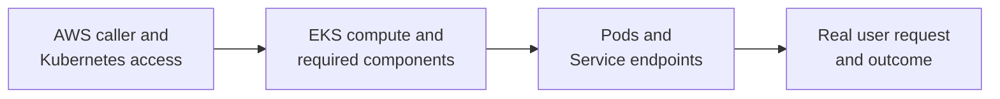

# EKS operations

## Purpose

When an application on Amazon EKS fails, first locate the failed
**boundary**. AWS reports cluster and infrastructure state; Kubernetes
reports objects and their reconciliation; the application and an actual
request reveal whether users can complete their task. A green signal
from one boundary is not proof that the next one works.

This page is a symptom-first explanation. For the next task, use the
[safe kubectl inspection guide](../kubernetes/commands/daily-usage.md),
the [resource-pressure investigation](../kubernetes/commands/workflows.md),
or [the EKS control-path guide](../kubernetes/commands/eksctl-commands.md).

## Four questions before a fix

Imagine a library whose doors are open but whose catalog, staff, or
book checkout may still fail. EKS cluster health is like the building;
Kubernetes controllers and Pods are the staff; the application response
is the checkout. The analogy stops at the details: Kubernetes is a
distributed control system, and each status is a point-in-time signal.

Use these questions in order, then follow the first failed handoff:

| Question | Evidence to inspect | What a good result cannot prove |
| --- | --- | --- |
| Am I looking at the intended account, region, cluster, and namespace? | AWS caller identity; kubeconfig context; API reachability; namespace. | Being authenticated does not grant permission to read or change every Kubernetes object. |
| Can this cluster provide the platform capabilities the app needs? | EKS cluster and compute health; selected node or Auto Mode path; relevant add-on and controller status. | A healthy cluster does not guarantee the app can schedule or pull its image. |
| Did Kubernetes produce ready application endpoints? | Deployment and Pod conditions; events; container logs; Service selectors and EndpointSlices. | Ready Pods do not prove the external route or business response. |
| Does the user path work? | Request through the real entry, response, error rate, and application-side evidence. | One successful request does not prove every route or sustained availability. |

Text alternative: check the intended AWS and Kubernetes identity first,
then EKS compute and required components, then the workload Pods and
Service endpoints, and finally a real user request. Each step can pass
while the next one fails.

## Example: the lesson API stopped answering

This incident is invented. No EKS cluster, Pod, request, or AWS resource
was inspected or changed.

A lesson API release says its Deployment is available, but users receive
an error from `/lessons`. Rather than restart nodes or grant new IAM
permissions immediately, an operator records the affected route and
time, then checks whether the Service selects ready lesson API Pods.
If it does, the next evidence is the external entry and the response
from the application. If it does not, Pod conditions, events, and logs
can separate an image-pull problem, failed readiness, and an application
startup error. Kubernetes documents those Pod and Service debugging
paths.[^k8s-debug-pods][^k8s-debug-services]

If the operator cannot read the namespace at all, the investigation
starts one boundary earlier. EKS can use an IAM principal to authenticate
`kubectl`, while access entries or Kubernetes RBAC determine its
permissions. A kubeconfig entry records how to contact and authenticate
to a cluster; it is not itself a grant of administrator access.
[^eks-kubeconfig][^eks-access-entries]

## Keep AWS and Kubernetes evidence separate

| Need | Start with | Then check |
| --- | --- | --- |
| Human or automation cannot use `kubectl` | Intended AWS caller, cluster and region, kubeconfig, network path to the API. | Cluster authentication mode, matching access entry or legacy mapping, associated access policy or Kubernetes RBAC. |
| Pods cannot schedule or networking is absent | Compute path and relevant EKS-managed components. | Kubernetes nodes, Pod scheduling events, and the exact controller or add-on used by this cluster. |
| Pod cannot call an AWS service | Pod's namespace and service account, then selected workload identity mechanism. | IAM role, association or IRSA trust, SDK credential path, and service-specific permission error. |
| User cannot reach a ready Pod | Service endpoints and selected entry implementation. | Load-balancer targets, gateway or Ingress route, network policy, and application response. |

An EKS add-on is software supporting cluster operations, such as
networking or DNS. Its EKS API status and its Kubernetes Pods or
controllers answer different questions. First identify whether a
capability is a managed add-on, self-managed component, or part of EKS
Auto Mode. A missing managed add-on entry does not, by itself, prove
the capability is absent.[^eks-addons][^eks-auto-mode]

Likewise, absence of a managed node group does not prove there is no
compute: clusters may use other node types or EKS Auto Mode. Inspect
the capacity model the cluster actually uses before investigating
node-group settings.[^eks-auto-mode]

### Workload IAM is not cluster access

EKS Pod Identity associates an IAM role with a **cluster, namespace,
and service account in the EKS API**. AWS explicitly says there is no
association metadata or annotation in the Kubernetes service account.
Therefore, viewing that service account alone cannot confirm the role
binding. IRSA uses a different service-account annotation and OIDC
trust path. Neither gives a human permission to edit Kubernetes
Deployments.[^eks-pod-id-association][^eks-irsa-pod-config]

Use [EKS workload identity](eks-workload-identity.md) for the two Pod
credential paths and [EKS human identity and Kubernetes RBAC](../security/identity-federation/eks-human-identity-and-rbac.md)
for human cluster access.

## A useful incident record

For a real investigation, record the observed user symptom and time;
account, region, cluster, namespace, and workload; the exact version or
change under test; the first failed boundary; and the evidence that
supports it. Record what improved the user path after a change. This
keeps a healthy cluster summary from being mistaken for a resolved
incident and makes a later review possible.

Do not change IAM, node groups, add-ons, or workloads solely because a
summary command looks unusual. Match a proposed change to the failure
signal and the owner of that component first.

## Check your understanding

1. A user gets an error but Pods are Ready. Which evidence would you
   inspect before replacing nodes?
2. Why can `kubectl` authenticate yet still be forbidden from reading
   one namespace?
3. Why does a service account with no IAM annotation tell you little
   about whether EKS Pod Identity is configured?
4. If `list-addons` does not show a networking component, what other
   cluster ownership models should you check?

## Deeper study

- [EKS kubeconfig](https://docs.aws.amazon.com/eks/latest/userguide/create-kubeconfig.html)
  and [access entries](https://docs.aws.amazon.com/eks/latest/userguide/access-entries.html)
  for the operator's cluster access.
- [EKS add-ons](https://docs.aws.amazon.com/eks/latest/userguide/eks-add-ons.html)
  and [Auto Mode](https://docs.aws.amazon.com/eks/latest/userguide/automode.html)
  for cluster component ownership.
- [Debug running Pods](https://kubernetes.io/docs/tasks/debug/debug-application/debug-running-pod/)
  and [debug Services](https://kubernetes.io/docs/tasks/debug/debug-application/debug-service/)
  for workload evidence.
- [Deploying to EKS](deploying-to-eks.md) for the earlier release gates;
  [Kubernetes on AWS](kubernetes-on-aws.md) for platform boundaries.

[Back to cross-topic guides](index.md)

[^eks-kubeconfig]: [Amazon EKS - Connect kubectl](https://docs.aws.amazon.com/eks/latest/userguide/create-kubeconfig.html).
[^eks-access-entries]: [Amazon EKS - Access entries](https://docs.aws.amazon.com/eks/latest/userguide/access-entries.html).
[^eks-addons]: [Amazon EKS - Add-ons](https://docs.aws.amazon.com/eks/latest/userguide/eks-add-ons.html).
[^eks-auto-mode]: [Amazon EKS - Auto Mode](https://docs.aws.amazon.com/eks/latest/userguide/automode.html).
[^eks-pod-id-association]: [Amazon EKS - Pod Identity association](https://docs.aws.amazon.com/eks/latest/userguide/pod-id-association.html).
[^eks-irsa-pod-config]: [Amazon EKS - IRSA Pod configuration](https://docs.aws.amazon.com/eks/latest/userguide/pod-configuration.html).
[^k8s-debug-pods]: [Kubernetes - Debug Running Pods](https://kubernetes.io/docs/tasks/debug/debug-application/debug-running-pod/).
[^k8s-debug-services]: [Kubernetes - Debug Services](https://kubernetes.io/docs/tasks/debug/debug-application/debug-service/).
