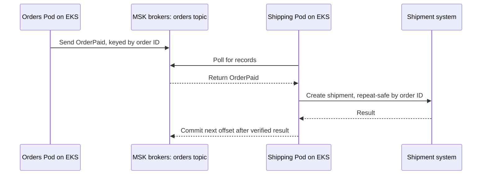

# EKS to MSK applications

## Purpose

A Pod running on Amazon EKS can produce to or consume from an Amazon MSK
topic. A correct end-to-end result needs **three gates**: a network path
to the brokers, a client identity and authorization method the cluster
accepts, and application logic that handles events correctly. A
connection can pass the first two gates while the business result still
fails.[^msk-client-access][^msk-iam]

Read [Kafka fundamentals](../databases/kafka/fundamentals.md) and
[Amazon MSK](../cloud/aws/databases/amazon-msk.md) first if their basic
objects are new. This guide connects those objects to an EKS workload.

## The three gates

Think of a delivery driver. A road reaches the warehouse, a badge allows
entry to a particular area, and a delivery instruction tells the driver
what to do with a parcel. For an EKS application, those correspond to
network reachability, client authentication and Kafka authorization,
and event processing. The analogy stops at Kafka semantics: topics
retain ordered records per partition, consumers track their own
positions, and retries can repeat an application effect.

| Gate | Required agreement | A first signal of failure |
| --- | --- | --- |
| Network | Pod DNS, routes, discovered broker addresses, ports, security groups, and any network policy permit the path. | Connection timeout, disconnect, or unreachable broker. |
| Identity | Client mechanism matches the MSK listener; the Pod gets the intended credentials and Kafka permissions. | Authentication or authorization error; a wrong listener can also look like a connection failure. |
| Application | Topic, partition key, group, event format, retries, and side effects meet the contract. | Failed produce/consume, growing lag, or wrong business outcome. |

For an MSK Provisioned cluster, same-VPC client access is private by
default and the broker security group must allow inbound traffic on the
chosen listener port from the client, for example by referencing its
security group. Other VPC arrangements need an explicit supported
connectivity design, such as VPC peering or MSK multi-VPC private
connectivity. A bootstrap broker list is only a starting address: the
client then discovers other broker addresses and must be able to
resolve and reach the partition leaders and group coordinator it uses.
Reaching one bootstrap endpoint does not authorize the Pod or prove the
full client path works.[^msk-client-access][^msk-bootstrap]
[^kafka-producer-config]

For Pods on EC2 nodes using the standard Amazon VPC CNI, broker traffic
uses the node's security group by default. Security Groups for Pods or
custom networking can change the group used for Pod traffic; confirm
the actual source group before changing an MSK inbound rule. A network
policy may also restrict Pod egress.
[^eks-pod-security-groups][^eks-custom-networking]

## Example: paid orders to shipments

The shop, event, identities, and outcomes below are invented. Assume an
MSK Provisioned cluster with IAM client access for this example. No EKS
Pod, MSK cluster, IAM role, network rule, or shipment was created or
tested.

An orders API Pod publishes `OrderPaid`, keyed by order ID, to an MSK
topic. A shipping consumer Pod reads it and creates a shipment in an
external system. Both Pods run on EKS, but they need different Kafka
permissions. Under MSK IAM access control, a role that can connect is
not automatically allowed to produce to or read every topic.
[^msk-iam-use-cases]

Text alternative: the orders Pod sends `OrderPaid` to an MSK broker,
which appends it to a partition of the `orders` topic. The shipping Pod polls a broker
for records and receives `OrderPaid`; the broker does not push it to an
idle Pod. The shipping Pod creates a shipment outside Kafka. Both Pod
connections need reachable brokers and authorized clients; the final
effect needs repeat-safe application logic and its own evidence. After
checking the shipment result, the consumer commits the next offset to
record where the group should resume. The last arrow shows this
separate step.[^kafka-documentation]

This diagram assumes **automatic offset commits are disabled** and the
shipping application checks the external result before it commits.
The Java consumer enables automatic commits by default. That setting
cannot by itself guarantee this order for a slow external operation. The
[delivery guide](../databases/kafka/delivery-guarantees-and-failure-handling.md)
explains the commit window.[^kafka-consumer-api][^kafka-consumer-config]

If the shipping Pod creates a shipment but stops before it commits its
consumer offset (its saved position), its group may receive `OrderPaid`
again, possibly on a different Pod. Its business operation therefore
needs a stable order identifier and a repeat-safe way to recognize an
already created shipment. See
[Kafka delivery guarantees](../databases/kafka/delivery-guarantees-and-failure-handling.md)
for that failure window. The reverse order is also risky: committing an
offset before the shipment exists can skip the business effect after a
crash. A rollout or scale change can reassign partitions to another
consumer instance and expose either timing mistake. A long processing
step that exceeds the client's polling interval can also cause a
rebalance.[^kafka-consumer-api]

The event can also be lost between the orders database update and the
Kafka send if those are separate operations. Conversely, publishing
before the database commit can expose an `OrderPaid` event when the
database commit then fails. A successful database write alone does not
prove that `OrderPaid` reached Kafka. The
[delivery guide](../databases/kafka/delivery-guarantees-and-failure-handling.md)
explains the transactional outbox pattern for this gap. A producer must
also allow pending asynchronous sends to finish, or handle their
failure, during shutdown.[^debezium-outbox][^kafka-producer-api]

During a rollout, the Pod's termination grace period gives the
application time to finish or safely stop in-flight work. Handle the
stop signal, check producer results, and close the consumer before the
container exits. If the grace period ends first, Kubernetes can force
termination and the group may replay uncommitted records.
[^kubernetes-pod-lifecycle][^kafka-producer-api][^kafka-consumer-api]

## Identity and client configuration

The Kafka client must use the authentication method of the listener it
connects to. This determines what identity the brokers see:

| Broker authentication | What the client presents | What grants Kafka actions |
| --- | --- | --- |
| MSK IAM | AWS credentials (temporary when supplied by IRSA or Pod Identity) through a compatible IAM Kafka client mechanism. | `kafka-cluster:` permissions scoped to cluster, topic, and group resources. |
| SASL/SCRAM | A username and password. | Kafka ACLs and the cluster's ACL defaults. |
| Mutual TLS | A client certificate and private key. | Kafka ACLs and the cluster's ACL defaults. |

The invented example uses **MSK IAM**. EKS supports IAM roles for service
accounts (IRSA) and EKS Pod Identity; both can supply role credentials
to a Pod by different paths. The Pod must use the intended service
account, a compatible IAM Kafka client mechanism, and a role policy
with the actions needed for its producer or consumer task. Under
SASL/SCRAM or mutual TLS, the Kafka client instead authenticates with
its password or certificate. An AWS role may still let the Pod fetch a
Secret, but it is not the broker identity in those modes.
[^eks-service-accounts][^eks-pod-identities][^msk-iam-clients]

For the invented IAM example, AWS lists these **Kafka data-plane**
actions. A policy also needs the correct cluster, topic, and group
resource ARNs:

| Client task | Cluster actions | Topic actions | Group actions |
| --- | --- | --- | --- |
| Produce | `Connect`; add `WriteDataIdempotently` when producer idempotence is enabled. | `DescribeTopic`, `WriteData` | None. |
| Consume in a group | `Connect` | `DescribeTopic`, `ReadData` | `DescribeGroup`, `AlterGroup` |

All action names in the table use the `kafka-cluster:` prefix. The
topic and group ARNs include the cluster name and UUID. The Apache
Kafka Java producer enables idempotence by default unless a conflicting
setting disables it; other client libraries may differ. Check the
actual client and policy. AWS `kafka:` actions for MSK control-plane
calls, such as getting bootstrap brokers, are separate from
`kafka-cluster:` actions for client traffic.
[^msk-iam-use-cases][^msk-kafka-actions][^kafka-producer-config]

Obtaining role credentials is another path. Pods without internet
egress need access to AWS STS for IRSA or the EKS Auth API for Pod
Identity; broker connectivity alone does not supply a role. Check the
IAM client library's credential provider and the
identity it actually selects. An older SDK, an earlier credential
source in the chain, or access to the node's instance role through the
instance metadata service can change the result.
[^eks-private-clusters][^eks-pod-id-sdk][^eks-service-accounts]

Choose bootstrap endpoints and client settings that match the enabled
listener and port. MSK Serverless requires IAM access control; the
alternative methods in the table apply to suitable Provisioned
clusters. With IAM, Kafka ACLs do not authorize IAM identities. With
SASL/SCRAM or mutual
TLS, check actual ACLs and MSK's default ACL behavior rather than
assuming authentication restricts every topic. MSK Provisioned can
also have an unauthenticated listener, which does not check a client
identity, and one cluster can enable multiple methods; inspect the
actual security settings. The Pod's ability to call an AWS
control-plane API is separate from permission to produce to a Kafka
topic. See [EKS workload identity](eks-workload-identity.md)
before selecting the credential path.[^msk-serverless][^msk-iam]
[^msk-acls][^msk-bootstrap][^msk-security-settings]

## What to observe after a connection succeeds

- **Producer path:** returning from an asynchronous `send()` call can
  mean only that the client queued a record. Even a completed send with
  `acks=0` has no broker acknowledgment. With `acks=1` or `acks=all`,
  a successful completion reports the configured level of broker
  acknowledgment; none of these proves a shipping system acted on the
  record.[^kafka-producer-config]
- **Consumer path:** consumer lag measures how far the group's offset
  trails the latest records in a topic. It measures Kafka progress, not
  completed shipments. MSK lag metrics can be absent when the group is
  unstable, its name contains a colon or non-ASCII characters, or it has
  no offset yet. An absent lag series is not measured zero lag.[^msk-lag]
- **Business path:** compare event identifiers with shipment records and
  investigate missing or duplicate outcomes. Keep application errors
  and retry handling visible alongside Kafka metrics.

In a traditional consumer group, at most one consumer instance owns a
partition at a time. Count consumer instances, not Pods, against the
partition count: a Pod can run more than one instance, but instances
beyond the partition count wait idle. A hot key stays on one partition;
adding Pods cannot divide that key's work. Partition count, ordering
needs, rebalances, and the slowest processing step belong in the
scaling decision.[^kafka-documentation]

## Check your understanding

1. If a Pod times out before reaching a broker, which gate should you
   investigate first?
2. If a Pod connects but gets a topic authorization error, why will a
   network-rule change not solve it?
3. Why does an EKS service-account role identify a client using MSK IAM
   but not a client using SASL/SCRAM or mutual TLS?
4. Why can a shipping consumer create the same shipment twice after a
   restart, and what would an early offset commit risk instead?

## Deeper study

- [MSK client access](https://docs.aws.amazon.com/msk/latest/developerguide/client-access.html)
  and [bootstrap brokers](https://docs.aws.amazon.com/msk/latest/developerguide/msk-get-bootstrap-brokers.html)
  for the network and listener path.
- [MSK IAM access control](https://docs.aws.amazon.com/msk/latest/developerguide/iam-access-control.html)
  and [client authorization actions](https://docs.aws.amazon.com/msk/latest/developerguide/iam-access-control-use-cases.html)
  for Kafka permissions.
- [EKS workload IAM options](https://docs.aws.amazon.com/eks/latest/userguide/service-accounts.html)
  and [MSK consumer lag](https://docs.aws.amazon.com/msk/latest/developerguide/consumer-lag.html)
  for Pod credentials and operational signals.
- [Apache Kafka documentation](https://kafka.apache.org/documentation/)
  for partitions, consumer groups, and delivery behavior.
- [Kafka producer settings](https://kafka.apache.org/43/configuration/producer-configs/)
  for what `acks=0`, `acks=1`, and `acks=all` actually prove.

Continue to [Kafka operations](../databases/kafka/operations.md) for
symptom-based investigation. [Back to cross-topic guides](index.md)

[^msk-client-access]: [Amazon MSK - Client access](https://docs.aws.amazon.com/msk/latest/developerguide/client-access.html).
[^msk-bootstrap]: [Amazon MSK - Bootstrap brokers](https://docs.aws.amazon.com/msk/latest/developerguide/msk-get-bootstrap-brokers.html).
[^msk-iam]: [Amazon MSK - IAM access control](https://docs.aws.amazon.com/msk/latest/developerguide/iam-access-control.html).
[^msk-iam-use-cases]: [Amazon MSK - Client authorization use cases](https://docs.aws.amazon.com/msk/latest/developerguide/iam-access-control-use-cases.html).
[^eks-service-accounts]: [Amazon EKS - Workload IAM permissions](https://docs.aws.amazon.com/eks/latest/userguide/service-accounts.html).
[^eks-pod-identities]: [Amazon EKS - EKS Pod Identity](https://docs.aws.amazon.com/eks/latest/userguide/pod-identities.html).
[^msk-lag]: [Amazon MSK - Consumer lag](https://docs.aws.amazon.com/msk/latest/developerguide/consumer-lag.html).
[^kafka-documentation]: [Apache Kafka - Documentation](https://kafka.apache.org/documentation/).
[^kafka-producer-config]: [Apache Kafka 4.3 - Producer Configs](https://kafka.apache.org/43/configuration/producer-configs/).
[^kafka-producer-api]: [Apache Kafka 4.3 - KafkaProducer API](https://kafka.apache.org/43/javadoc/org/apache/kafka/clients/producer/KafkaProducer.html).
[^kafka-consumer-api]: [Apache Kafka 4.3 - KafkaConsumer API](https://kafka.apache.org/43/javadoc/org/apache/kafka/clients/consumer/KafkaConsumer.html).
[^kafka-consumer-config]: [Apache Kafka 4.3 - Consumer Configs](https://kafka.apache.org/43/configuration/consumer-configs/).
[^debezium-outbox]: [Debezium - Outbox Event Router](https://debezium.io/documentation/reference/stable/transformations/outbox-event-router.html).
[^msk-serverless]: [Amazon MSK - What is MSK Serverless?](https://docs.aws.amazon.com/msk/latest/developerguide/serverless.html).
[^msk-security-settings]: [Amazon MSK - Update security settings](https://docs.aws.amazon.com/msk/latest/developerguide/msk-update-security.html).
[^msk-iam-clients]: [Amazon MSK - Configure clients for IAM access control](https://docs.aws.amazon.com/msk/latest/developerguide/configure-clients-for-iam-access-control.html).
[^msk-acls]: [Amazon MSK - Apache Kafka ACLs](https://docs.aws.amazon.com/msk/latest/developerguide/msk-acls.html).
[^msk-kafka-actions]: [Amazon MSK - IAM authorization actions and resources](https://docs.aws.amazon.com/msk/latest/developerguide/kafka-actions.html).
[^eks-private-clusters]: [Amazon EKS - Deploy private clusters with limited internet access](https://docs.aws.amazon.com/eks/latest/userguide/private-clusters.html).
[^eks-pod-security-groups]: [Amazon EKS - Security Groups Per Pod](https://docs.aws.amazon.com/eks/latest/best-practices/sgpp.html).
[^eks-custom-networking]: [Amazon EKS - Custom Networking](https://docs.aws.amazon.com/eks/latest/best-practices/custom-networking.html).
[^eks-pod-id-sdk]: [Amazon EKS - Use Pod Identity with the AWS SDK](https://docs.aws.amazon.com/eks/latest/userguide/pod-id-minimum-sdk.html).
[^kubernetes-pod-lifecycle]: [Kubernetes - Pod Lifecycle](https://kubernetes.io/docs/concepts/workloads/pods/pod-lifecycle/).
