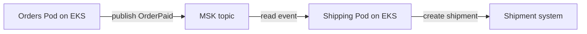

# EKS to MSK applications

## Purpose

A Pod running on Amazon EKS can produce to or consume from an Amazon MSK
topic. A working connection needs **three gates**: a network path to the
brokers, a client identity and authorization method the cluster accepts,
and application logic that handles events correctly. Passing one gate
does not prove the next.[^msk-client-access][^msk-iam]

Read [Kafka fundamentals](../databases/kafka/fundamentals.md) and
[Amazon MSK](../cloud/aws/databases/amazon-msk.md) first if their basic
objects are new. This guide connects those objects to an EKS workload.

## The three gates

Think of a delivery driver. A road reaches the warehouse, a badge allows
entry to a particular area, and a delivery instruction tells the driver
what to do with a parcel. For an EKS application, those correspond to
network reachability, Kafka authorization, and event processing. The
analogy stops at Kafka semantics: topics retain ordered records per
partition, consumers track their own positions, and retries can repeat
an application effect.

| Gate | Required agreement | A first signal of failure |
| --- | --- | --- |
| Network | Pod route, broker addresses, ports, security groups, and any network policy permit the path. | Connection timeout or unreachable broker. |
| Identity | Client mechanism matches the MSK listener; the Pod gets the intended credentials and Kafka permissions. | Authentication or authorization error. |
| Application | Topic, partition key, group, event format, retries, and side effects meet the contract. | Failed produce/consume, growing lag, or wrong business outcome. |

For an MSK Provisioned cluster, same-VPC client access is private by
default and the cluster security group must accept traffic from the
client's security group. Other VPC arrangements need an explicit supported
connectivity design. A bootstrap broker list is only a starting address;
it does not authorize the Pod or prove the full client path works.
[^msk-client-access][^msk-bootstrap]

## Example: paid orders to shipments

The shop, event, identities, and outcomes below are invented. No EKS Pod,
MSK cluster, IAM role, network rule, or shipment was created or tested.

An orders API Pod publishes `OrderPaid` to an MSK topic. A shipping
consumer Pod reads it and creates a shipment in an external system. Both
Pods run on EKS, but they need different Kafka permissions: the producer
needs write access to the topic, and the consumer needs read access to
the topic plus access to its consumer group. Under MSK IAM access control,
AWS documents distinct actions for these cases; an IAM identity that can
connect is not automatically allowed to write or read every topic.
[^msk-iam-use-cases]

Text alternative: an orders Pod produces `OrderPaid` to an MSK topic.
A shipping Pod consumes the event and creates a shipment outside Kafka.
The first two arrows need reachable brokers and authorized clients; the
last arrow needs repeat-safe application logic and its own evidence.

If the shipping Pod creates a shipment but stops before its consumer
position is safely recorded, it may read `OrderPaid` again. Its business
operation therefore needs a stable order identifier and a repeat-safe
way to recognize an already created shipment. See
[Kafka delivery guarantees](../databases/kafka/delivery-guarantees-and-failure-handling.md)
for that failure window.

## Identity and client configuration

EKS supports IAM roles for service accounts (IRSA) and EKS Pod Identity.
Both associate AWS permissions with a Kubernetes service account by
different credential paths. The workload must use the intended service
account, a compatible client authentication implementation, and a role
policy scoped to the required MSK cluster, topic, and group actions.
See [EKS workload identity](eks-workload-identity.md) before selecting
the credential path.[^eks-service-accounts][^eks-pod-identities]
[^msk-iam-use-cases]

The cluster may use IAM, SASL/SCRAM, or mutual TLS client authentication.
Choose the bootstrap endpoints and Kafka client configuration that match
the cluster's enabled listener. With IAM access control, IAM authorizes
Kafka actions; Kafka ACLs do not authorize IAM identities. The Pod's
ability to call an AWS control-plane API or read a Secret is a separate
permission from producing to a topic.[^msk-iam][^msk-bootstrap]

## What to observe after a connection succeeds

- **Producer path:** a successful send response is evidence the broker
  accepted the record under the configured producer guarantees; it does
  not prove a shipping system acted on it.
- **Consumer path:** group membership and lag show Kafka position.
  MSK lag metrics can be absent for some group states or naming and
  offset conditions. An absent lag series is not measured zero lag.
  [^msk-lag]
- **Business path:** compare event identifiers with shipment records and
  investigate missing or duplicate outcomes. Keep application errors
  and retry handling visible alongside Kafka metrics.

A consumer group can use at most the topic's partition count for active
parallel consumption of that topic. Adding Pods beyond useful partition
parallelism does not automatically increase throughput. Partition count,
ordering needs, and the slowest processing step belong in the scaling
decision.[^kafka-documentation]

## Check your understanding

1. If a Pod times out before reaching a broker, which gate should you
   investigate first?
2. If a Pod connects but gets a topic authorization error, why will a
   network-rule change not solve it?
3. Which AWS identity does the Kafka client inside the Pod use?
4. Why can a shipping consumer create the same shipment twice after a
   restart unless its external effect is repeat-safe?
5. What proves a shipment was created, beyond a small consumer lag?

## Deeper study

- [MSK client access](https://docs.aws.amazon.com/msk/latest/developerguide/client-access.html)
  and [bootstrap brokers](https://docs.aws.amazon.com/msk/latest/developerguide/msk-get-bootstrap-brokers.html)
  for the network and listener path.
- [MSK IAM access control](https://docs.aws.amazon.com/msk/latest/developerguide/iam-access-control.html)
  and [client authorization actions](https://docs.aws.amazon.com/msk/latest/developerguide/iam-access-control-use-cases.html)
  for Kafka permissions.
- [EKS workload IAM options](https://docs.aws.amazon.com/eks/latest/userguide/service-accounts.html)
  and [MSK consumer lag](https://docs.aws.amazon.com/msk/latest/developerguide/consumer-lag.html)
  for Pod credentials and operational signals.
- [Apache Kafka documentation](https://kafka.apache.org/documentation/)
  for partitions, consumer groups, and delivery behavior.

Continue to [Kafka operations](../databases/kafka/operations.md) for
symptom-based investigation. [Back to cross-topic guides](index.md)

[^msk-client-access]: [Amazon MSK - Client access](https://docs.aws.amazon.com/msk/latest/developerguide/client-access.html).
[^msk-bootstrap]: [Amazon MSK - Bootstrap brokers](https://docs.aws.amazon.com/msk/latest/developerguide/msk-get-bootstrap-brokers.html).
[^msk-iam]: [Amazon MSK - IAM access control](https://docs.aws.amazon.com/msk/latest/developerguide/iam-access-control.html).
[^msk-iam-use-cases]: [Amazon MSK - Client authorization use cases](https://docs.aws.amazon.com/msk/latest/developerguide/iam-access-control-use-cases.html).
[^eks-service-accounts]: [Amazon EKS - Workload IAM permissions](https://docs.aws.amazon.com/eks/latest/userguide/service-accounts.html).
[^eks-pod-identities]: [Amazon EKS - EKS Pod Identity](https://docs.aws.amazon.com/eks/latest/userguide/pod-identities.html).
[^msk-lag]: [Amazon MSK - Consumer lag](https://docs.aws.amazon.com/msk/latest/developerguide/consumer-lag.html).
[^kafka-documentation]: [Apache Kafka - Documentation](https://kafka.apache.org/documentation/).
