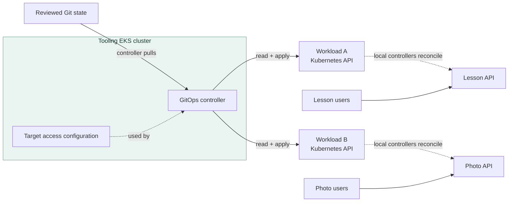

# EKS tooling cluster architecture

## Purpose

A **tooling cluster** is an EKS cluster chosen to host platform tools
or their configuration for other workload clusters. It is an
architecture role, not a special EKS cluster type. A self-managed
GitOps controller can run on its nodes; the EKS-managed Argo CD
capability instead runs in the AWS control plane while using a cluster
as its management hub.[^eks-managed-argo] The design question
is whether separating platform tools from application clusters makes
ownership and recovery clearer **for the clusters you actually have**.
This page focuses on a GitOps controller because it makes the cross-
cluster permissions and outage behavior concrete.

For the generic pattern, read [Tooling clusters](../kubernetes/applications-and-tools/tooling-clusters.md).
For a controller's EKS workload path, read [GitOps on EKS](gitops-on-eks.md).

## Three layouts, different responsibilities

Think of a school district. Each school can keep its own office, or
several schools can use one central office. A central office can apply
consistent policies, but it needs a way to reach every school and has
more records to protect. The analogy stops at control: GitOps
controllers reconcile asynchronously, and an office outage does not
automatically close every school, though a shared service that admits
new students might stop new arrivals.

| Layout | Useful when | Added concern |
| --- | --- | --- |
| Controller in each workload cluster | A small set of clusters can manage their own releases and failure boundaries. | Repeat installation and policy across clusters. |
| Self-managed controller in a tooling cluster | Multiple workload clusters need a centrally operated deployment service. | Operate the controller, its target access, and the management cluster. |
| EKS-managed Argo CD attached to a management cluster | The team wants AWS to operate Argo CD while it manages multiple EKS targets. | Protect hub configuration and target authorization; understand the capability's separate availability and recovery model. |

The managed capability registers EKS targets by cluster ARN; its
registration method differs from the self-managed controller shown
below.[^eks-managed-argo-targets]

No layout is automatically safer. A dedicated cluster isolates
some platform workloads from applications, but a central controller
with broad access can change many clusters. Argo CD supports adding
external clusters; Flux Kustomizations can target remote clusters with
a kubeconfig. Flux can use a Secret containing a static kubeconfig or
build one from a ConfigMap and cloud workload identity. A kubeconfig
holds connection details and an authentication method for a Kubernetes
API; it is not proof of narrow permissions. The target cluster decides
which actions that identity may take.[^argo-clusters]
[^flux-remote-clusters]

## Example: one tooling cluster, two applications

The clusters, applications, permissions, and outage below are invented.
No EKS cluster, GitOps controller, network route, credential, or
application was created or tested.

Suppose a platform team runs a self-managed GitOps controller in a
tooling EKS cluster. A lesson API runs in workload cluster A; a photo
API runs in workload cluster B.
The GitOps controller pulls reviewed manifests, reads each target's
live state, and applies desired resources through its Kubernetes API.
Kubernetes controllers in each workload cluster then reconcile those
resources. User traffic reaches the two applications through their own
cluster entry paths. It does **not** pass through
the tooling cluster just because that cluster hosts GitOps.

Text alternative: the controller in the tooling cluster pulls reviewed
Git state and uses target access configuration to read and apply objects
through the separate Kubernetes APIs of clusters A and B. Each target
API authenticates and authorizes that controller before accepting its
reads or writes. Controllers in each workload cluster then reconcile
each application from those objects. Lesson and
photo users reach their respective applications directly; their
requests do not traverse the tooling cluster in this example.

First ask who may change the trusted Git source or tell the controller
to sync, delete, or change an Application. Those users can act through
the controller's target identity. Argo CD RBAC controls its users; the
managed capability can map AWS Identity Center users and groups to
roles. Then, for this self-managed layout, each target connection has
three more gates.[^eks-managed-argo-considerations]

| Gate | What the team checks | What passing it does not prove |
| --- | --- | --- |
| Network | Can the controller resolve and reach the target API endpoint? A private-only EKS endpoint needs traffic from its VPC or a connected network, with private-endpoint security-group access. A restricted public endpoint needs to allow the controller's public egress IP. Check the actual DNS result and route from the tooling cluster. | The API will recognize the caller. |
| Authentication | Does the target accept the configured Kubernetes service-account token or IAM identity? A service-account token does not use an EKS access entry. For IAM, use EKS access entries on a compatible cluster; older clusters may still use the deprecated `aws-auth` ConfigMap. | The caller may change an application. |
| Authorization | Do the target's access policy or Kubernetes RBAC rules permit the required discovery, health reads, and scoped writes? | The application serves users correctly. |

The controller must be able to read target state as well as apply
changes. Argo CD's common `argocd cluster add` path creates an
`argocd-manager` service account with an admin-level ClusterRole and
stores a bearer-token-based target connection. That is convenient for
learning, but it gives the controller broad authority. A production
design can scope writes to needed namespaces while preserving the
discovery and health reads its chosen configuration needs. AWS's
managed Argo CD guidance shows a cluster-wide read pattern; that
would include Secrets in every target namespace, so evaluate the
credential's full read scope too. Self-managed Argo CD also supports
restricting a cluster connection to named namespaces. An IAM-based
EKS connection is another documented option; its target access entry
or legacy `aws-auth` mapping and permissions must be configured
explicitly. Access entries require `API` or `API_AND_CONFIG_MAP`
authentication mode on the target.
[^eks-endpoint][^eks-access-entries][^eks-auth-mode]
[^eks-aws-auth][^argo-getting-started][^argo-declarative]
[^eks-managed-argo-targets]

The EKS-managed Argo CD capability has a different connection path:
AWS manages connectivity to fully private EKS targets, without the
self-managed VPC link above. Confirm any public-endpoint CIDR policy
against your actual design. The capability's IAM role needs an access
entry and scoped permissions in each **remote** target. EKS creates an
entry for that role on the management cluster, but grants no local
deployment permission or target registration automatically. AWS's
quick-start cluster-admin policy is for initial learning, not a
production boundary.[^eks-managed-argo-targets]

## Bound the central controller

- Give each managed cluster, environment, or team a defined deployment
  scope. An Argo CD `AppProject` can restrict source repositories,
  destinations, and resource kinds, but its `default` project initially
  permits all of them. A Project is an Argo CD policy, not a reduction
  of the underlying credential's target-cluster privileges. Argo CD
  also supports sync impersonation in self-managed installations, but
  it is a beta feature disabled by default and needs explicit
  configuration. It scopes sync actions through target service accounts;
  the controller connection still needs its own read and impersonation
  permissions.[^argo-projects]
  [^argo-impersonation]
- For Flux, a remote Kustomization can impersonate a service account
  that exists in the target cluster, with target RBAC set to the actions
  it needs. Without an enforced default service account or an explicit
  `serviceAccountName`, reconciliation can use the broader kubeconfig
  identity. Check both its ability to impersonate and the permissions
  of the account it becomes.[^flux-remote-clusters][^flux-multitenancy]
- Separate target credentials or roles so a target can revoke its own
  access and audit its changes. One compromised central controller that
  can use all those credentials can still affect every connected target.
  An administrator of the tooling cluster may also be able to alter
  controller configuration or read connection Secrets, so treat that
  role as privileged in every target it can reach.
  Protect the trusted Git source, cluster connection configuration,
  Project policy, and any Secrets that hold credentials. Keep untrusted
  CI jobs and tenant workloads away from the management control plane.
- Decide which platform functions truly need to be central. A local
  admission policy or workload identity mechanism may need to keep
  working inside each workload cluster even when the central GitOps
  service is unavailable. This is a design choice to verify, not a
  capability guaranteed by the word "tooling."

The tooling cluster itself also needs capacity, upgrades, access
control, monitoring, and a recovery owner. A separate cluster adds
operational work; it does not remove the need to maintain the platform
tools running in it. With EKS-managed Argo CD, AWS operates the
controller, but the team still owns source, Projects, target access,
and the management-cluster configuration.[^eks-managed-argo]

## What a tooling-cluster outage changes

If the tooling cluster fails in the invented **self-managed** example,
the GitOps controller stops reconciling changes into A and B until
restored. Existing application Pods **may** continue serving: their
Kubernetes controllers and request paths remain in the workload
clusters. That expectation fails when a workload needs a runtime
dependency hosted centrally. For example, if a workload cluster calls
an admission webhook at an external URL served by the tooling cluster
and its `failurePolicy` is `Fail`, unavailable webhook calls can reject
new Pod creations. Existing Pods might keep serving while replacements
after a node failure cannot start. A central secrets or telemetry
service can create different dependencies. These are design inferences,
not results of an outage test.[^k8s-admission-webhooks]

| Function | During this example outage | Recovery question |
| --- | --- | --- |
| Existing lesson and photo traffic | May continue through workload clusters; replacement Pods may fail if they need a central dependency. | Do user paths and new Pod creation work after a node failure? |
| GitOps deployments and drift repair | Stop until the controller can run and reconnect. | Which desired revision is pending for each target? |
| Central dashboards or automation, if hosted there | May be unavailable. | Is there an independent way to see workload health and make an urgent change? |

Plan a bootstrap path that does not require the failed tooling cluster
to recreate itself. Keep the cluster definition, controller install
method, source configuration, target-cluster access, and required
secrets or identity material recoverable outside the failed cluster.
An Argo CD export may contain target and repository credentials; treat
it as sensitive and verify the desired Git revision before restoring.
Check Application deletion behavior too: a cascading finalizer can
delete resources in a workload cluster when the Application is deleted.
Flux bootstrap can reinstall controllers from Git, but remote-cluster
credentials need their own recovery path if they are not safely
recoverable from Git. If a replacement management cluster has a new
identity, recheck its IRSA OIDC trust or Pod Identity associations and
the IAM role recognized by each target. Keep a human access path to
each target EKS API that does not depend on the tooling cluster.
[^argo-disaster-recovery][^argo-app-deletion][^flux-bootstrap]
[^eks-irsa][^eks-pod-identity][^eks-access-entries]

Before returning GitOps to normal reconciliation, compare pending Git
changes with any emergency fixes made directly in the targets. Argo CD
self-healing can undo those fixes; Flux drift correction can do the
same. Plan a pause using an Argo CD sync window or Flux
`spec.suspend`, put the intended emergency state into Git, and resume
one target at a time while checking its application path. Confirm each
target registration and its permissions before resuming its
Applications. Avoid deleting an Argo CD Application with a cascading
finalizer unless its workload resources should also go.
[^eks-managed-argo-considerations]
[^argo-auto-sync][^flux-remote-clusters][^argo-app-deletion]

With EKS-managed Argo CD, hub worker-node failure does not stop a
controller Pod there: AWS runs the capability in its control plane.
The management cluster still holds its Applications, Projects, and
target registration Secrets. A replacement cluster needs its own
capability because capability resources are tied to one cluster; keep
these configuration objects declarative and recoverable. Deleting a
capability leaves Applications and deployed resources behind, which
also means their future reconciliation must be planned explicitly.
[^eks-managed-argo][^eks-managed-argo-targets]
[^eks-capability-lifecycle]

## Check your understanding

1. For a self-managed controller, how do network reachability,
   authentication, and authorization differ for each target?
2. If the tooling cluster goes down, why might existing user requests
   still work while new deployments stop?
3. Why do a restricted Argo CD Project and separate target credentials
   not automatically contain a compromised central controller?
4. Which information must be available outside the failed tooling
   cluster to recover its controller and target connections?

## Deeper study

- [EKS cluster API endpoints](https://docs.aws.amazon.com/eks/latest/userguide/cluster-endpoint.html)
  and [access entries](https://docs.aws.amazon.com/eks/latest/userguide/access-entries.html)
  for target network and IAM access boundaries.
- [EKS-managed Argo CD](https://docs.aws.amazon.com/eks/latest/userguide/argocd.html)
  and [target registration](https://docs.aws.amazon.com/eks/latest/userguide/argocd-register-clusters.html)
  for the AWS-managed layout and its permissions.
- [Argo CD cluster management](https://argo-cd.readthedocs.io/en/stable/operator-manual/cluster-management/)
  and [Projects](https://argo-cd.readthedocs.io/en/stable/user-guide/projects/)
  for remote targets and tool-level scope.
- [Flux remote Kustomizations](https://fluxcd.io/flux/components/kustomize/kustomizations/)
  and [bootstrap](https://fluxcd.io/flux/installation/bootstrap/)
  for its alternative path.
- [GitOps security and multi-tenancy](../kubernetes/applications-and-tools/gitops-security-and-multitenancy.md)
  for repository and controller authority.

[Back to cross-topic guides](index.md)

[^eks-endpoint]: [Amazon EKS - Cluster API endpoint](https://docs.aws.amazon.com/eks/latest/userguide/cluster-endpoint.html).
[^eks-access-entries]: [Amazon EKS - Access entries](https://docs.aws.amazon.com/eks/latest/userguide/access-entries.html).
[^eks-auth-mode]: [Amazon EKS - Access entry authentication mode](https://docs.aws.amazon.com/eks/latest/userguide/setting-up-access-entries.html).
[^eks-aws-auth]: [Amazon EKS - Deprecated aws-auth ConfigMap](https://docs.aws.amazon.com/eks/latest/userguide/auth-configmap.html).
[^eks-managed-argo]: [Amazon EKS - Managed Argo CD](https://docs.aws.amazon.com/eks/latest/userguide/argocd.html).
[^eks-managed-argo-targets]: [Amazon EKS - Register Argo CD target clusters](https://docs.aws.amazon.com/eks/latest/userguide/argocd-register-clusters.html).
[^eks-managed-argo-considerations]: [Amazon EKS - Argo CD considerations](https://docs.aws.amazon.com/eks/latest/userguide/argocd-considerations.html).
[^eks-capability-lifecycle]: [Amazon EKS - Capability lifecycle](https://docs.aws.amazon.com/eks/latest/userguide/working-with-capabilities.html).
[^eks-irsa]: [Amazon EKS - IAM roles for service accounts](https://docs.aws.amazon.com/eks/latest/userguide/iam-roles-for-service-accounts.html).
[^eks-pod-identity]: [Amazon EKS - EKS Pod Identity](https://docs.aws.amazon.com/eks/latest/userguide/pod-identities.html).
[^argo-getting-started]: [Argo CD - Getting Started](https://argo-cd.readthedocs.io/en/stable/getting_started/).
[^argo-impersonation]: [Argo CD - Application sync using impersonation](https://argo-cd.readthedocs.io/en/stable/operator-manual/app-sync-using-impersonation/).
[^argo-declarative]: [Argo CD - Declarative Setup](https://argo-cd.readthedocs.io/en/stable/operator-manual/declarative-setup/).
[^argo-app-deletion]: [Argo CD - App Deletion](https://argo-cd.readthedocs.io/en/stable/user-guide/app_deletion/).
[^argo-auto-sync]: [Argo CD - Automated Sync Policy](https://argo-cd.readthedocs.io/en/stable/user-guide/auto_sync/).
[^argo-clusters]: [Argo CD - Cluster Management](https://argo-cd.readthedocs.io/en/stable/operator-manual/cluster-management/).
[^argo-projects]: [Argo CD - Projects](https://argo-cd.readthedocs.io/en/stable/user-guide/projects/).
[^argo-disaster-recovery]: [Argo CD - Disaster Recovery](https://argo-cd.readthedocs.io/en/stable/operator-manual/disaster_recovery/).
[^flux-remote-clusters]: [Flux - Remote Kustomizations](https://fluxcd.io/flux/components/kustomize/kustomizations/).
[^flux-bootstrap]: [Flux - Bootstrap](https://fluxcd.io/flux/installation/bootstrap/).
[^flux-multitenancy]: [Flux - Multi-tenancy](https://fluxcd.io/flux/installation/configuration/multitenancy/).
[^k8s-admission-webhooks]: [Kubernetes - Dynamic Admission Control](https://kubernetes.io/docs/reference/access-authn-authz/extensible-admission-controllers/).
