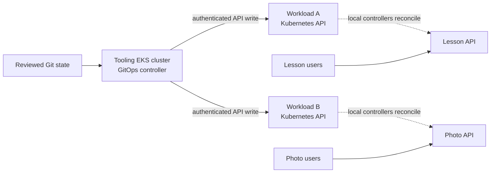

# EKS tooling cluster architecture

## Purpose

A **tooling cluster** is an EKS cluster chosen to run platform tools,
such as a GitOps controller, for other workload clusters. It is an
architecture role, not a special EKS cluster type. The design question
is whether separating platform tools from application clusters makes
ownership and recovery clearer **for the clusters you actually have**.
This page focuses on a GitOps controller because it makes the cross-
cluster permissions and outage behavior concrete.

For the generic pattern, read [Tooling clusters](../kubernetes/applications-and-tools/tooling-clusters.md).
For a controller's EKS workload path, read [GitOps on EKS](gitops-on-eks.md).

## Two layouts, different responsibilities

Think of a school district. Each school can keep its own office, or
several schools can use one central office. A central office can apply
consistent policies, but it needs a way to reach every school and has
more records to protect. The analogy stops at control: GitOps
controllers reconcile asynchronously, and an office outage does not
automatically close every school.

| Layout | Useful when | Added concern |
| --- | --- | --- |
| Controller in each workload cluster | A small set of clusters can manage their own releases and failure boundaries. | Repeat installation and policy across clusters. |
| Shared controller in a tooling cluster | Multiple workload clusters need a centrally operated deployment service. | Cross-cluster API access, concentrated credentials, and a management-cluster recovery plan. |

Neither layout is automatically safer. A dedicated cluster isolates
some platform workloads from applications, but a central controller
with broad access can change many clusters. Argo CD supports adding
external clusters; Flux Kustomizations can target remote clusters with
a kubeconfig. The credentials and target-cluster permissions determine
what those controllers can actually change.[^argo-clusters]
[^flux-remote-clusters]

## Example: one tooling cluster, two applications

The clusters, applications, permissions, and outage below are invented.
No EKS cluster, GitOps controller, network route, credential, or
application was created or tested.

Suppose a platform team runs GitOps in a tooling EKS cluster. A lesson
API runs in workload cluster A; a photo API runs in workload cluster B.
The GitOps controller reads reviewed manifests and writes desired
resources to each target's Kubernetes API. Kubernetes controllers in
each workload cluster then reconcile those resources. User traffic reaches the two applications
through their own cluster entry paths. It does **not** pass through
the tooling cluster just because that cluster hosts GitOps.

Text alternative: Git holds reviewed desired state. A controller in
the tooling cluster connects separately to the Kubernetes APIs of
workload clusters A and B. Local controllers reconcile each application
from resources stored through its API. Lesson
and photo users reach their respective applications directly; their
request paths do not traverse the tooling cluster in this example.

The tooling controller needs **both** an authenticated Kubernetes API
identity in each target cluster and a network path to each API server.
For a private-only EKS endpoint, traffic must come from its VPC or a
connected network. If the controller uses an AWS IAM principal, that
principal's authentication and target-cluster permissions are separate
from the network connection.[^eks-endpoint]
[^eks-access-entries]

## Bound the central controller

- Give each managed cluster, environment, or team a defined deployment
  scope. An Argo CD Project can restrict source repositories, target
  clusters and namespaces, and resource kinds; its default project is
  permissive unless changed. Flux can use target-cluster service-account
  impersonation for scoped reconciliation.[^argo-projects]
  [^flux-remote-clusters]
- Keep credentials for different targets separate where the controller
  supports it. Protect who can modify the Git path and controller
  configuration, because those changes can become target-cluster writes.
- Decide which platform functions truly need to be central. A local
  admission policy or workload identity mechanism may need to keep
  working inside each workload cluster even when the central GitOps
  service is unavailable. This is a design choice to verify, not a
  capability guaranteed by the word "tooling."

The tooling cluster itself also needs capacity, upgrades, access
control, monitoring, and a recovery owner. A separate cluster adds
operational work; it does not remove the need to maintain the platform
tools running in it.

## What a tooling-cluster outage changes

If the tooling cluster fails in the invented example, the GitOps
controller stops reconciling new desired changes into A and B until
restored. Existing application Pods **may** continue serving if their
clusters, networking, data stores, and required external dependencies
remain healthy. A central observability or secrets service hosted in
the tooling cluster could make the outage more visible to applications;
do not assume independence without tracing those dependencies. These
are inferences from the example's control and request paths, not an
outage test.

| Function | During this example outage | Recovery question |
| --- | --- | --- |
| Existing lesson and photo traffic | May continue through workload clusters. | Do their real user paths and dependencies still work? |
| GitOps deployments and drift repair | Stop until the controller can run and reconnect. | Which desired revision is pending for each target? |
| Central dashboards or automation, if hosted there | May be unavailable. | Is there an independent way to see workload health and make an urgent change? |

Plan a bootstrap path that does not require the failed tooling cluster
to recreate itself. Keep the cluster definition, controller install
method, source configuration, target-cluster access, and required
secrets or identity material recoverable. Argo CD documents export and
import of its data; Flux documents bootstrap from Git. The exact plan
depends on the installed controller and must be rehearsed, including
how a human regains target-cluster access if GitOps is down.
[^argo-disaster-recovery][^flux-bootstrap][^eks-access-entries]

## Check your understanding

1. Why does a central GitOps controller need both network reachability
   and Kubernetes permission for each workload cluster?
2. If the tooling cluster goes down, why might existing user requests
   still work while new deployments stop?
3. What broad access can an unmodified Argo CD default project allow?
4. Which information must be available outside the failed tooling
   cluster to recover its controller and target connections?

## Deeper study

- [EKS cluster API endpoints](https://docs.aws.amazon.com/eks/latest/userguide/cluster-endpoint.html)
  and [access entries](https://docs.aws.amazon.com/eks/latest/userguide/access-entries.html)
  for the two target-cluster access boundaries.
- [Argo CD cluster management](https://argo-cd.readthedocs.io/en/stable/operator-manual/cluster-management/)
  and [Projects](https://argo-cd.readthedocs.io/en/stable/user-guide/projects/)
  for remote targets and scope.
- [Flux remote Kustomizations](https://fluxcd.io/flux/components/kustomize/kustomizations/)
  and [bootstrap](https://fluxcd.io/flux/installation/bootstrap/)
  for its alternative path.
- [GitOps security and multi-tenancy](../kubernetes/applications-and-tools/gitops-security-and-multitenancy.md)
  for repository and controller authority.

[Back to cross-topic guides](index.md)

[^eks-endpoint]: [Amazon EKS - Cluster API endpoint](https://docs.aws.amazon.com/eks/latest/userguide/cluster-endpoint.html).
[^eks-access-entries]: [Amazon EKS - Access entries](https://docs.aws.amazon.com/eks/latest/userguide/access-entries.html).
[^argo-clusters]: [Argo CD - Cluster Management](https://argo-cd.readthedocs.io/en/stable/operator-manual/cluster-management/).
[^argo-projects]: [Argo CD - Projects](https://argo-cd.readthedocs.io/en/stable/user-guide/projects/).
[^argo-disaster-recovery]: [Argo CD - Disaster Recovery](https://argo-cd.readthedocs.io/en/stable/operator-manual/disaster_recovery/).
[^flux-remote-clusters]: [Flux - Remote Kustomizations](https://fluxcd.io/flux/components/kustomize/kustomizations/).
[^flux-bootstrap]: [Flux - Bootstrap](https://fluxcd.io/flux/installation/bootstrap/).
