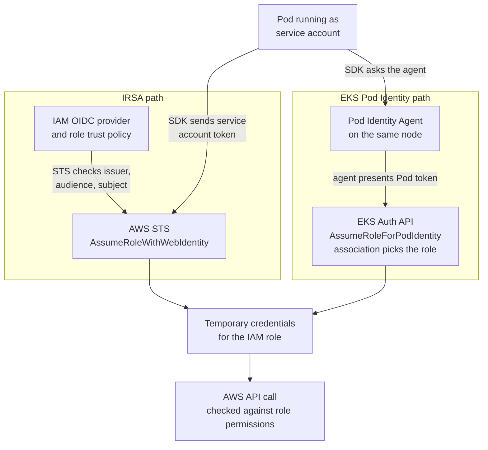

# EKS workload identity

## Purpose

Use this page to understand how an application running in a Pod on Amazon
Elastic Kubernetes Service (Amazon EKS) obtains temporary AWS permissions, and
how to choose between the two EKS mechanisms for a particular workload. It is
a conceptual explanation; the procedures are in the official pages linked in
[Official documentation for deeper study](#official-documentation-for-deeper-study).

Terms used on this page:

| Term | Meaning |
| --- | --- |
| AWS IAM role | An AWS Identity and Access Management identity with a **trust policy** (who may assume it) and **permissions policies** (what it may do). |
| AWS STS | AWS Security Token Service, which issues temporary credentials for a role. |
| Service account | A Kubernetes identity for processes that run in a Pod.[^aws-eks-service-accounts] |
| Service account token | A signed JSON Web Token (JWT) that Kubernetes can project into a Pod. It names the service account and an intended audience. |
| IRSA | IAM roles for service accounts: the Pod exchanges its token with STS through an IAM OpenID Connect (OIDC) provider. |
| EKS Pod Identity | An EKS feature in which an agent on the node obtains role credentials for the Pod from the EKS Auth API. |
| SDK credential chain | The ordered list of places an AWS SDK searches for credentials. It stops at the first valid source.[^aws-eks-pod-id-how-it-works] |
| IMDS | The Amazon EC2 Instance Metadata Service, which can supply the node's own IAM role credentials. |

## Simple definition

Workload identity on EKS means that a Pod can receive temporary AWS
credentials for an IAM role linked to the **Kubernetes service account** it
runs as. In the intended credential path, other service accounts do not get
that role. This does not prevent access through separate credentials or an
exposed node instance profile, discussed below.[^aws-eks-pod-identities][^aws-eks-irsa]

## Why it matters

Every AWS API request must be signed with AWS credentials. Without workload
identity, teams tend to copy long-lived access keys into containers, or let
every Pod rely on the node's IAM role, which gives all Pods on the node the
same permissions. Both IRSA and EKS Pod Identity replace that with a role per
service account.[^aws-eks-pod-identities]

Keep this separate from human access to the cluster. Kubernetes RBAC decides
what a person or a service account may do **through the Kubernetes API**. The
IAM role decides what the Pod may do **through AWS APIs**. A Pod can have full
access to an Amazon S3 bucket and no Kubernetes permissions at all, or the
reverse. For people, see [EKS human identity and Kubernetes
RBAC](../security/identity-federation/eks-human-identity-and-rbac.md).

## The mental model: the same start, two credential paths

Both mechanisms start the same way: a Pod runs as a service account, and the
AWS SDK in the container uses its default credential chain. They differ in
who exchanges which token, and where the binding between service account and
role is recorded.

| Step | IRSA | EKS Pod Identity |
| --- | --- | --- |
| Where the service account is linked to a role | An annotation on the service account names the role ARN. The role's trust policy names the cluster's IAM OIDC provider and, ideally, the exact service account.[^aws-eks-irsa-pod-configuration][^aws-eks-bp-iam] | A Pod Identity **association** in the EKS API maps one service account in one namespace of one cluster to a role.[^aws-eks-pod-identities] |
| What trusts what | IAM trusts the cluster's OIDC issuer. EKS publishes a discovery endpoint with the signing keys so IAM can validate the tokens.[^aws-eks-irsa] | The role trusts the service principal `pods.eks.amazonaws.com`, with `sts:AssumeRole` and `sts:TagSession`.[^aws-eks-pod-id-association] |
| What the Pod receives | Environment variables such as `AWS_ROLE_ARN` and `AWS_WEB_IDENTITY_TOKEN_FILE`, and a token file.[^aws-eks-irsa-pod-configuration] | Environment variables pointing to the agent, and a token with audience `pods.eks.amazonaws.com`.[^aws-eks-pod-id-how-it-works] |
| Who exchanges the token | The SDK in the Pod calls STS `AssumeRoleWithWebIdentity`.[^aws-eks-irsa-sdk] | The Pod Identity Agent on the node calls the EKS Auth API's `AssumeRoleForPodIdentity`, then hands the credentials to the SDK.[^aws-eks-pod-id-how-it-works] |
| What else is on the node | Nothing extra is required on the node. | The Pod Identity Agent DaemonSet must run on the node.[^aws-eks-pod-identities] |

One naming trap: the component that injects the IRSA environment variables is
called the **Amazon EKS Pod Identity Webhook**. Despite the name, it belongs to
the IRSA path.[^aws-eks-irsa-pod-configuration]

Text alternative: a Pod runs as a service account. On the IRSA path, the SDK
in the Pod sends the service account token to AWS STS, which checks it against
the IAM OIDC provider and the role's trust policy and returns temporary
credentials. On the EKS Pod Identity path, the SDK asks the Pod Identity Agent
on the same node; the agent presents the Pod's token to the EKS Auth API,
which uses the association to choose the role and return temporary
credentials. Either way, the resulting credentials sign the AWS API call, and
the role's permissions policies decide whether it succeeds. Use the diagram
to see which component must be present and trusted for each option.

## An analogy: a hotel guest and a partner gym

Imagine a hotel guest who wants to use a partner gym down the street.

- **IRSA is a signed letter.** The hotel gives the guest a letter on its
  letterhead. The gym has registered the hotel's letterhead and keeps a list
  of which guests may get which pass. The guest walks over and exchanges the
  letter for a day pass.
- **EKS Pod Identity is a concierge.** The guest asks the concierge on their
  floor. The concierge checks the hotel's booking system, which records which
  guest gets which pass, and hands the guest the pass.

Where the analogy breaks, and what is true instead:

- **The pass is a bearer credential.** Anyone who copies the temporary
  credentials can use them until they expire. Do not log them.
- **The hotel master key may be lying around.** If access to IMDS is not
  restricted, containers can reach the node's IAM role and may be able to get
  credentials of other Pods' roles on the same node. Pods with
  `hostNetwork: true` always have IMDS
  access.[^aws-eks-pod-identities][^aws-eks-irsa]
- **Rooms are not vaults.** Containers are not a security boundary. Pods on
  the same node share a kernel, and neither mechanism changes
  that.[^aws-eks-pod-identities]
- **Guests who carry their own pass skip the concierge.** If a container
  already has credentials earlier in the SDK credential chain, such as access
  keys in environment variables, the SDK keeps using them even after an
  association is added.[^aws-eks-pod-id-how-it-works]
- **Anyone who can check in as a guest gets that guest's pass.** Kubernetes
  notes that permission to create workloads in a namespace effectively grants
  the access of any service account there.[^k8s-rbac-good-practices] This page
  concludes that the same holds for the AWS role mapped to that service
  account, so RBAC over Pod creation protects the AWS role too.

## Choose by conditions, not by a universal winner

AWS recommends EKS Pod Identity whenever possible.[^aws-eks-service-accounts]
That recommendation still depends on the workload meeting its conditions.
Check each row for the specific workload:

| Condition | Points toward | Why |
| --- | --- | --- |
| The workload runs on Linux Amazon EC2 worker nodes in Amazon EKS. | Either; Pod Identity is available. | Pod Identity is only available on EKS and only for Pods on Linux EC2 nodes.[^aws-eks-pod-identities] |
| The workload runs on AWS Fargate, Windows EC2 nodes, AWS Outposts, EKS Anywhere, or self-managed Kubernetes on EC2. | Check IRSA support for the exact environment. | Pod Identity is not available there. IRSA supports several Kubernetes environments, but its own prerequisites still need checking.[^aws-eks-pod-identities][^aws-eks-service-accounts][^aws-eks-irsa] |
| You cannot run the Pod Identity Agent DaemonSet on the nodes. | IRSA. | The agent is required for Pod Identity. EKS Auto Mode clusters do not need the separate agent setup.[^aws-eks-pod-identities] |
| The application's AWS SDK, or a third-party controller, is older than the listed minimum for a mechanism. | The mechanism the SDK supports, or upgrade first. | Each mechanism needs a supported SDK version that uses the default credential chain.[^aws-eks-pod-identities][^aws-eks-irsa-sdk] |
| The same role must be used by many clusters. | Pod Identity. | Its trust policy trusts one service principal. IRSA needs the trust policy updated for each new cluster's OIDC provider.[^aws-eks-service-accounts] |
| The account has, or will have, more than 100 clusters. | Pod Identity. | IRSA needs one IAM OIDC provider per cluster, and IAM's default limit is 100 per account.[^aws-eks-service-accounts] |
| One role should serve several service accounts with different access through tags. | Pod Identity. | Its credentials carry session tags such as cluster, namespace, and service account name. IRSA does not support session tags.[^aws-eks-service-accounts] |
| The role is in a different AWS account from the cluster. | Either, with different mechanics. | IRSA can use an OIDC provider in the other account or chained `AssumeRole` calls.[^aws-eks-irsa-cross-account] Pod Identity's association role must be in the cluster's account; an optional target IAM role in another account is then assumed by role chaining.[^aws-eks-pod-id-target-role] |

## Keep the permission boundary narrow

- **One service account per application, one role per application.** AWS
  recommends both for isolation and least privilege. With Pod Identity, a
  shared role can be acceptable when session-tag conditions do the
  separation.[^aws-eks-bp-iam]
- **Scope IRSA trust to the exact service account.** Without a `sub`
  condition, any service account in the cluster can assume the role. The
  subject has the form `system:serviceaccount:NAMESPACE:NAME`.[^aws-eks-irsa-cross-account][^aws-eks-bp-iam]
- **Restrict the node role.** Both mechanisms are placed ahead of the node's
  instance profile in the Pod's credential chain, but a Pod can still inherit
  the instance profile's permissions. Block IMDS for Pods that do not need it; AWS warns that doing so
  also cuts off Pods that rely on the node role.[^aws-eks-bp-iam]
- **Plan for delays.** Pod Identity associations are eventually consistent,
  and the agent caches credentials. Changing an association does not clear
  that cache immediately; the official target-role guide gives the current
  durations and options for applying a change sooner.[^aws-eks-pod-identities][^aws-eks-pod-id-target-role]

## Follow an invented example

This example is illustrative. The cluster, namespace, bucket, roles, and
workloads are invented, and nothing was created or run.

The `billing` team runs `invoice-exporter` in the `billing` namespace. It
uploads monthly invoice files to one S3 bucket. Today it has no service
account of its own and uses whatever the node role allows.

1. **Separate the identity.** The team creates a dedicated service account,
   `invoice-exporter`, and an IAM role, `billing-invoice-exporter`, whose
   permissions allow only uploads to the invoice bucket's `exports/` prefix.
2. **Check the conditions.** The Pods run on Linux EC2 nodes where the Pod
   Identity Agent is installed, and the application's SDK meets the Pod
   Identity minimum. The role and the bucket are in the cluster's account.
   Pod Identity fits.
3. **Link and run.** An association maps `billing/invoice-exporter` to the
   role. When the new Pods start, EKS injects the agent settings. The SDK
   asks the agent, the agent calls the EKS Auth API, and the SDK receives
   role credentials.
4. **Test the boundary in thought.** An upload to `exports/` is allowed by the
   role. A delete in the same bucket is denied, because the role never granted
   it. A different Pod in `billing` that runs as the `default` service account
   receives nothing from this association.
5. **A second workload changes the answer.** A `report-renderer` workload
   must run on AWS Fargate. Pod Identity is not available there, so the team
   would use IRSA for it, with a trust policy scoped to
   `system:serviceaccount:billing:report-renderer`.

The example ends with each workload holding only its own role, and with the
choice made from the workload's conditions rather than from a default.

## Troubleshoot at the right boundary

| Symptom | First question |
| --- | --- |
| The Pod acts with the node role's permissions. | Does the Pod actually run as the intended service account, and is there an association or IRSA annotation for it? Are older credentials earlier in the SDK chain? |
| STS denies the IRSA role assumption. | Does the role trust the cluster's OIDC provider, with the expected audience and the exact service account subject? |
| Pod Identity requests fail before reaching AWS. | Is the agent running on that node? If the Pod uses a proxy, are the agent's link-local addresses excluded through `NO_PROXY`?[^aws-eks-pod-identities] |
| Credentials arrive, but the AWS call is denied. | Do the role's permissions policies allow that action on that resource? |
| A role change does not take effect. | Is the Pod Identity Agent still serving cached credentials?[^aws-eks-pod-id-target-role] |

Do not broaden a trust policy or a permissions policy only to clear an error.
Confirm which workload needs which action first.

## Check your understanding

1. Which Kubernetes object decides which IAM role a Pod can obtain, under both
   mechanisms?
2. In IRSA, which component calls AWS STS? In EKS Pod Identity, which
   component obtains the credentials?
3. Name two workload conditions that would rule out EKS Pod Identity.
4. Why can a Pod with an IRSA role still reach the node's IAM role, and what
   reduces that risk?

## Next steps

- Separate this from human access in [EKS human identity and Kubernetes
  RBAC](../security/identity-federation/eks-human-identity-and-rbac.md).
- Review how AWS trusts an external OIDC issuer in [IAM OIDC provider and STS
  web identity](../cloud/aws/security/iam-oidc-provider-and-sts-web-identity.md).
- Revisit issuer, audience, and subject claims in [OIDC
  fundamentals](../security/identity-federation/oidc-fundamentals.md).
- See where workload identity fits in a broader EKS design in [Kubernetes on
  AWS](kubernetes-on-aws.md).

## Official documentation for deeper study

- The AWS comparison of both mechanisms and its recommendation: [Grant
  Kubernetes workloads access to AWS using Kubernetes Service
  Accounts](https://docs.aws.amazon.com/eks/latest/userguide/service-accounts.html).
- Pod Identity benefits, agent, limits, and restrictions: [Learn how EKS Pod
  Identity grants pods access to AWS
  services](https://docs.aws.amazon.com/eks/latest/userguide/pod-identities.html).
- The agent and credential-chain flow: [Understand how EKS Pod Identity
  works](https://docs.aws.amazon.com/eks/latest/userguide/pod-id-how-it-works.html).
- Pod Identity cross-account access: [EKS Pod Identity target IAM
  roles](https://docs.aws.amazon.com/eks/latest/userguide/pod-id-assign-target-role.html).
- IRSA background and setup order: [IAM roles for service
  accounts](https://docs.aws.amazon.com/eks/latest/userguide/iam-roles-for-service-accounts.html).
- IRSA cross-account options: [Authenticate to another account with
  IRSA](https://docs.aws.amazon.com/eks/latest/userguide/cross-account-access.html).
- Trust scoping, IMDS restriction, and per-application roles: [EKS Best
  Practices - Identity and Access
  Management](https://docs.aws.amazon.com/eks/latest/best-practices/identity-and-access-management.html).

## Related links

- [EKS human identity and Kubernetes RBAC](../security/identity-federation/eks-human-identity-and-rbac.md)
- [OIDC fundamentals](../security/identity-federation/oidc-fundamentals.md)
- [IAM OIDC provider and STS web identity](../cloud/aws/security/iam-oidc-provider-and-sts-web-identity.md)
- [Back to cross-topic guides](index.md)
- [Back to root index](../../README.md)

[^aws-eks-service-accounts]: [Amazon EKS User Guide - Grant Kubernetes workloads access to AWS using Kubernetes Service Accounts](https://docs.aws.amazon.com/eks/latest/userguide/service-accounts.html), source record `aws-eks-service-accounts`.
[^aws-eks-pod-identities]: [Amazon EKS User Guide - Learn how EKS Pod Identity grants pods access to AWS services](https://docs.aws.amazon.com/eks/latest/userguide/pod-identities.html), source record `aws-eks-pod-identities`.
[^aws-eks-pod-id-how-it-works]: [Amazon EKS User Guide - Understand how EKS Pod Identity works](https://docs.aws.amazon.com/eks/latest/userguide/pod-id-how-it-works.html), source record `aws-eks-pod-id-how-it-works`.
[^aws-eks-pod-id-association]: [Amazon EKS User Guide - Assign an IAM role to a Kubernetes service account](https://docs.aws.amazon.com/eks/latest/userguide/pod-id-association.html), source record `aws-eks-pod-id-association`.
[^aws-eks-pod-id-target-role]: [Amazon EKS User Guide - Access AWS Resources using EKS Pod Identity Target IAM Roles](https://docs.aws.amazon.com/eks/latest/userguide/pod-id-assign-target-role.html), source record `aws-eks-pod-id-target-role`.
[^aws-eks-irsa]: [Amazon EKS User Guide - IAM roles for service accounts](https://docs.aws.amazon.com/eks/latest/userguide/iam-roles-for-service-accounts.html), source record `aws-eks-irsa`.
[^aws-eks-irsa-pod-configuration]: [Amazon EKS User Guide - Configure Pods to use a Kubernetes service account](https://docs.aws.amazon.com/eks/latest/userguide/pod-configuration.html), source record `aws-eks-irsa-pod-configuration`.
[^aws-eks-irsa-sdk]: [Amazon EKS User Guide - Use IRSA with the AWS SDK](https://docs.aws.amazon.com/eks/latest/userguide/iam-roles-for-service-accounts-minimum-sdk.html), source record `aws-eks-irsa-sdk`.
[^aws-eks-irsa-cross-account]: [Amazon EKS User Guide - Authenticate to another account with IRSA](https://docs.aws.amazon.com/eks/latest/userguide/cross-account-access.html), source record `aws-eks-irsa-cross-account`.
[^aws-eks-bp-iam]: [Amazon EKS Best Practices Guide - Identity and Access Management](https://docs.aws.amazon.com/eks/latest/best-practices/identity-and-access-management.html), source record `aws-eks-bp-iam`.
[^k8s-rbac-good-practices]: [Kubernetes Documentation - Role Based Access Control Good Practices](https://kubernetes.io/docs/concepts/security/rbac-good-practices/), source record `k8s-rbac-good-practices`.
