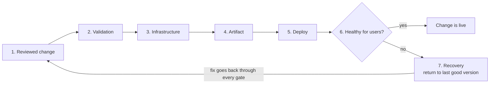

# End-to-end deployment

## Purpose

Use this page to see a software delivery path as one chain: a reviewed change,
automated validation, infrastructure, a built artifact, a deployment, a check
that users are served, and a way back. After reading it you should be able to
say, for any stage, what evidence it produces and what that evidence does not
prove.

This is a map, not a production deployment recipe. Each stage links to the
page that covers it properly.

## What a delivery chain is

A delivery chain is the sequence of steps that turns a change in a repository
into a change in a running system. Each step is a **gate**: a point where
something is checked and the change either continues or stops.

Three terms used below:

- **CI (continuous integration)** is the automation that checks a change
  before it is merged, such as tests and linting.
- An **artifact** is the built thing that is deployed, for example a container
  image.
- A **rollout** is the process of replacing the running version with a new
  one.

## Why it matters

The most common misreading of a pipeline is "CI is green, so it works". CI
runs before deployment, against the code and a test environment. It says
nothing about whether the new version started in the real environment, whether
it can reach its database, or whether users are being served.

Every gate answers one narrow question. Trouble starts when a team treats the
answer to one question as the answer to another.

## The stages and what each one proves

| Stage | Question it answers | Evidence it produces | What it does not prove |
| --- | --- | --- | --- |
| 1. Reviewed change | Did someone other than the author agree to this change? | An approved pull request on a specific commit. | That the change works. |
| 2. Validation (CI) | Does the code build and pass its automated checks? | Check results tied to that commit. | That it works in the target environment. |
| 3. Infrastructure | Do the environment's resources match what the configuration declares? | A reviewed plan, then an apply result. | That the application running on them is healthy. |
| 4. Artifact | Exactly which build will run? | An image identified by its digest. | That the image behaves correctly. |
| 5. Deploy | Did the platform replace the old version with the new one? | A completed rollout. | That users get correct responses. |
| 6. Health and user check | Is the service doing its job for users? | Health signals and a user-level check. | That it will stay healthy. |
| 7. Recovery | Can we return to a working state? | A rollback rehearsed for this kind of change, with a named owner. | That every infrastructure or data change can be reversed. |

Some supporting facts from the tools involved:

- **A gate can require a person.** In GitHub Actions, a deployment environment
  can have protection rules, such as required reviewers or a restriction on
  which branches may deploy. A job that references the environment cannot use
  the environment's secrets until a required reviewer approves
  it.[^github-deployment-environments]
- **An infrastructure plan is a proposal.** `terraform plan` does not carry out
  the changes it proposes.[^terraform-plan] The evidence for stage 3 is the
  plan someone reviewed plus the result of applying it.
- **A digest identifies one exact image.** A tag can be moved to point at a
  different image; a digest is a hash of the image's content and is
  fixed.[^kubernetes-container-images] Deploying by digest is what lets you
  say the artifact that was tested is the artifact that is running.
- **A completed rollout is a platform statement.** Kubernetes marks a
  Deployment complete when all replicas are updated, all are available, and no
  old replicas are running.[^kubernetes-deployments] That is about Pods, not
  about whether a user's request succeeds.

## Visual: the chain and its way back

Text alternative: the chain runs left to right through a reviewed change,
validation, infrastructure, artifact, and deploy. It then reaches a decision:
is the service healthy for users? If yes, the change is live. If no, recovery
returns the system to the last good version, and the fix starts again at a
reviewed change and passes every gate.

The diagram makes one point that a list hides: the decision comes after the
deploy, so a pipeline that ends at "deploy succeeded" has not reached it.

## Example: one change to a fictional service

This example is illustrative. The service, names, and results are invented,
and nothing here was run.

A team owns `bookings-api`, a small service running on Kubernetes with a
database managed through Terraform. A developer changes how booking dates are
validated.

| Stage | What happens | Evidence | Owner |
| --- | --- | --- | --- |
| 1 | A teammate reviews and approves the pull request. | Approval on commit `a1b2c3d`. | Author and reviewer. |
| 2 | CI builds the code and runs tests. | All checks pass on `a1b2c3d`. | Author. |
| 3 | No infrastructure change is needed this time. | The Terraform plan reports no changes. | Infrastructure owner. |
| 4 | The build publishes a container image. | An image digest recorded for `a1b2c3d`. | Pipeline. |
| 5 | The deployment job, after approval in the production environment, updates the Deployment to that digest. | The rollout completes. | Deployer. |
| 6 | The error rate for `POST /bookings` rises, and a test booking fails. | Metrics and a failed user-level check. | On-call engineer. |
| 7 | The on-call engineer rolls back to the previous digest. The author prepares a fix. | Error rate returns to normal. | On-call engineer, then author. |

What went wrong: the new validation rejected a date format that a mobile
client still sends. The tests did not include that format, so stages 1 to 5
were all green. Only stage 6 looked at real requests.

What to notice:

- Five gates passed and the change was still wrong. Each gate did its job;
  none of them was designed to answer the question stage 6 asks.
- The rollback was quick because stage 4 recorded an exact previous digest to
  return to.
- The rollback did not fix the code. The repository still contains the faulty
  change until a new change goes through the chain.

## Who owns rollback

"Roll back" means different things at different layers, and they are not
equally reversible.

| Layer | How it is reversed | Typical owner | Limit |
| --- | --- | --- | --- |
| Source | A new commit that reverses the change. See [Git undo and recovery](../git/troubleshooting/undo-and-recovery.md). | The authoring team. | Reverting code does not by itself change what is running. |
| Running version | Return the workload to a retained previous revision or image. Kubernetes Deployment history depends on `.spec.revisionHistoryLimit`; setting it to zero removes the ability to roll back after cleanup.[^kubernetes-deployments] | Whoever is on call for the service. | Requires the old image and revision to be available; it restores neither old data nor schema. |
| Infrastructure | A new reviewed plan that moves resources back. | The infrastructure owner. | Terraform has no undo; some changes replace or destroy resources. |
| Data | Depends on the change. A schema or data migration may not be reversible. | The service team, often with the database owner. | Plan this before the change, not during the incident. |

The practical rule: decide who may trigger each kind of rollback, and how,
before the deployment starts. During an incident is too late to find out that
nobody has permission.

## An analogy: a relay of sign-offs

Think of a building project that needs separate sign-offs: the drawings are
approved, the materials are inspected, the wiring is certified, and the keys
are handed over.

Where the analogy stops being accurate:

- **Software gates are much narrower than they sound.** "Tests passed" covers
  only the cases someone wrote.
- **The last sign-off is never final.** A building is inspected once. A
  service has to keep proving it is healthy for as long as it runs.
- **Going back takes preparation.** Returning to a previous version depends
  on a retained revision, an available image, and compatible data and
  infrastructure. Rehearse the recovery path for the kind of change you make.

## Check your understanding

- CI passed and the rollout completed. Name two things that are still
  unknown.
- Why does deploying by image digest make a rollback more trustworthy than
  deploying by a tag such as `latest`?
- In the example, which stage detected the problem, and why could the earlier
  stages not have detected it?
- After the rollback in the example, what state is the repository in, and
  what has to happen next?

## Next steps

- Source control and review: [Git fundamentals](../git/git-fundamentals.md) and
  the [GitHub Actions section](../git/github-actions/index.md).
- Infrastructure stage: [Terraform fundamentals](../terraform/fundamentals/terraform-fundamentals.md)
  and [GitHub Actions with Terraform](github-actions-with-terraform.md).
- Deploy stage: [Kubernetes fundamentals](../kubernetes/fundamentals/kubernetes-fundamentals.md)
  and [GitHub Actions with Kubernetes](github-actions-with-kubernetes.md).
- Health and user check: [Observability stack](observability-stack.md).
- Practise the whole loop locally, including a deliberate failure and a
  rollback: [Local deployment learning path](local-deployment-learning-path.md).

## Official documentation for deeper study

- Approval gates, branch restrictions, and environment secrets: [GitHub Docs - Deployments and environments](https://docs.github.com/en/actions/reference/workflows-and-actions/deployments-and-environments).
- What a plan is and is not: [`terraform plan` command](https://developer.hashicorp.com/terraform/cli/commands/plan).
- Tags versus digests: [Kubernetes - Images](https://kubernetes.io/docs/concepts/containers/images/).
- Rollout completion, failure, and rolling back: [Kubernetes - Deployments](https://kubernetes.io/docs/concepts/workloads/controllers/deployment/).

## Related links

- [Git index](../git/index.md)
- [Terraform index](../terraform/index.md)
- [Kubernetes index](../kubernetes/index.md)
- [AWS index](../cloud/aws/index.md)
- [Deploying to EKS](deploying-to-eks.md)
- [Back to cross-topic guides](index.md)
- [Back to knowledge index](../index.md)

[^github-deployment-environments]: [GitHub Docs - Deployments and environments](https://docs.github.com/en/actions/reference/workflows-and-actions/deployments-and-environments), source record `github-deployment-environments`.
[^terraform-plan]: [terraform plan command](https://developer.hashicorp.com/terraform/cli/commands/plan), source record `terraform-plan`.
[^kubernetes-container-images]: [Kubernetes - Images](https://kubernetes.io/docs/concepts/containers/images/), source record `kubernetes-container-images`.
[^kubernetes-deployments]: [Kubernetes - Deployments](https://kubernetes.io/docs/concepts/workloads/controllers/deployment/), source record `kubernetes-deployments`.
