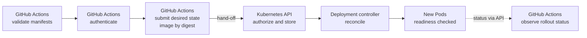

# GitHub Actions with Kubernetes

## Purpose

Use this page to understand a deployment from GitHub Actions to Kubernetes as
two systems doing two different jobs. After reading it you should be able to
say which system is responsible for each step, and what a green workflow run
does and does not tell you.

The page is conceptual. It contains no workflow file to copy. For workflow
syntax and permissions, use the [GitHub Actions section](../git/github-actions/index.md).

## What each system does

**GitHub Actions** runs jobs in response to repository events. In a
deployment, a job checks things, proves who it is, tells the cluster what
should run, and reports what it saw.

**Kubernetes** stores that request as desired state, and its controllers do
the work of making it true: starting new Pods, waiting for them to be ready,
and removing old ones. [Kubernetes fundamentals](../kubernetes/fundamentals/kubernetes-fundamentals.md)
explains that model.

The workflow does not deploy anything in the sense of starting containers. It
submits a change and then watches.

## Why it matters

If you picture the workflow as "the thing that deploys", two mistakes follow.
You expect the job's success to mean the application works, and you look in
the workflow log for failures that actually happened inside the cluster,
minutes after the job's last command.

Knowing the hand-off point tells you where to look and whose permissions
matter.

## Visual: the hand-off

Text alternative: the GitHub Actions job validates manifests, authenticates,
and submits desired state that names the image by digest. That submission is
the hand-off to the Kubernetes API server, which checks permission and stores
the object. The Deployment controller then creates new Pods, whose readiness
is checked. The job asks the API for rollout status, shown as a dashed final
step after the Pods.

Everything to the right of the hand-off happens in the cluster, on the
cluster's schedule.

## The ideas a deployment job depends on

### Manifest validation

Validation can catch malformed manifests, known schema errors, or mistakes in
repository policy before anything reaches the cluster. Its coverage depends
on the validator, the cluster version, installed custom resources, and live
admission rules. The API server still makes the final acceptance decision.
Even a valid manifest can name the wrong image or replica count.

### Image identity

An image can be referenced by tag or by digest. A tag can be moved to point at
a different image. A digest is a hash of the image's content and does not
change.[^kubernetes-container-images] Submitting the digest that the build
produced means the cluster requests that exact built image and gives you an
exact value to return to. To claim the deployed artifact was tested, the tests
must exercise that same image.

### Target context and namespace

The same manifests can be sent to any cluster the job can reach. Which cluster
and which namespace the job is pointed at is part of the change, even though
it does not appear in the manifest diff. A deployment job should make its
target explicit and should fail if the target is not the one intended for that
environment.

### Scoped authentication

The job needs an identity that the cluster accepts. Two properties matter:

- **Short-lived.** A job can request an OIDC token from GitHub and exchange it
  with a cloud provider for temporary credentials, instead of storing a
  long-lived cluster credential as a secret. The workflow permission
  `id-token: write` only allows the job to request that token; it grants no
  write access to anything else.[^github-oidc-reference] [OIDC fundamentals](../security/identity-federation/oidc-fundamentals.md)
  explains the trust model.
- **Narrow.** Inside the cluster, role-based access control decides what the
  identity may do. A Role sets permissions within one
  namespace.[^kubernetes-rbac] A deployment identity that can only change
  workloads in its own namespace limits the damage of a mistake or a leaked
  credential.

### Protected environment

A GitHub deployment environment can carry protection rules: required
reviewers, a wait timer, or a restriction on which branches and tags may
deploy. Secrets stored in the environment are not available to a job until a
required reviewer approves it.[^github-deployment-environments] This is where
a human decision enters an otherwise automatic path.

### Rollout observation

After the hand-off, the job can wait and ask the cluster how the rollout is
going. Kubernetes marks a Deployment complete when all replicas are updated,
all are available, and no old replicas are running. `kubectl rollout status`
returns a zero exit code when that happens. If a Deployment makes no progress
within its progress deadline, the controller records that it has
stalled.[^kubernetes-deployments]

Know the limits of this signal:

- "Available" depends on the readiness probe. A readiness probe decides when a
  container is ready to accept traffic.[^kubernetes-probes] If the probe is
  missing or only checks that the process started, a broken application can
  still count as available.
- A completed rollout describes Pods. It does not show that requests from
  users succeed, that dependencies are reachable, or that the right
  configuration is in effect. Treat that as a separate check; see
  [Observability stack](observability-stack.md).

### Failure recovery

When a rollout stalls, check which Pods are actually serving. Depending on
the update strategy and the health of old Pods, some old replicas may still
serve, or availability may already be reduced. Decide whether to fix forward
or go back. A Deployment can return to a previous revision only while that
revision is retained; `.spec.revisionHistoryLimit` controls the retained
history.[^kubernetes-deployments]

A rollback performed directly in the cluster leaves the repository describing
the newer version. The next deployment from the repository would reintroduce
the problem. A recovery is finished only when the repository and the cluster
agree again.

## Example: one deployment, step by step

This example is illustrative. The service, names, and outcomes are invented,
and nothing here was run.

A team deploys `bookings-api` to the `bookings` namespace of a production
cluster.

| Step | Who acts | What happens | If it fails |
| --- | --- | --- | --- |
| 1 | GitHub Actions | Manifests are validated. | The job stops. Nothing reached the cluster. |
| 2 | GitHub Actions and a reviewer | The job references the `production` environment and waits for approval. | No approval, no deployment, and no access to environment secrets. |
| 3 | GitHub Actions and the cloud provider | The job exchanges an OIDC token for short-lived cloud credentials. Separately, Kubernetes authorizes its cluster identity only for the `bookings` namespace. | If the exchange fails, check cloud trust. If the API denies the change, check cluster identity and role permissions. |
| 4 | GitHub Actions | The job submits the Deployment with the new image digest. | The API server rejects it, for example for lack of permission. |
| 5 | Kubernetes | The Deployment controller starts new Pods. They fail their readiness probe because a required setting is missing. | The rollout stalls. Old Pods keep serving. |
| 6 | GitHub Actions | The observation step sees no progress before the deadline and fails the job. | The team reads Pod events and logs in the cluster, not the workflow log. |
| 7 | On-call engineer and author | The engineer confirms the old version is still serving. The author adds the missing setting in a new pull request. | The fix passes through the same steps. |

What to notice: the workflow submits desired state in step 4. Kubernetes
performs the rollout in step 5; the workflow observes it in step 6, and people
decide how to recover in step 7. The red job reports a cluster outcome. The
cause is found with cluster tools such as those in
[kubectl basics](../kubernetes/commands/kubectl-basics.md) and
[Kubernetes troubleshooting](../kubernetes/troubleshooting/index.md).

## An analogy: a courier and a building manager

The workflow is a courier who delivers a signed work order to a building. The
building manager, Kubernetes, reads the order and carries out the work.

Where the analogy stops being accurate:

- **The courier waits and reports.** A real courier leaves. A deployment job
  usually stays to observe the rollout, which is why a cluster failure shows
  up as a failed job.
- **The manager never stops.** Controllers keep comparing desired and actual
  state long after the job has finished.
- **The work order does not describe the building.** Which cluster and
  namespace the job targets is decided by the job's configuration and
  credentials, not by the manifest.

## Trade-off: push or pull

This page describes a **push** model: a job outside the cluster submits
changes. In a **pull** model, often called GitOps, a controller inside the
cluster reads the repository and applies changes itself, so the pipeline needs
no cluster credentials. Each has costs. See [GitOps](../kubernetes/applications-and-tools/gitops.md)
and [GitOps on EKS](gitops-on-eks.md).

## Check your understanding

- The workflow run is green. Which of these does that establish: the manifests
  were accepted, the Pods are available, users are being served?
- Why is `id-token: write` not, by itself, permission to change anything in a
  cluster?
- A rollout stalls at step 5. Where do you look for the cause, and why not in
  the workflow log?
- After rolling back directly in the cluster, what is still inconsistent?

## Next steps

- Workflow structure and permissions: [GitHub Actions workflow structure](../git/github-actions/workflow-structure.md)
  and [security, secrets, and permissions](../git/github-actions/security-secrets-and-permissions.md).
- Federated credentials: [AWS OIDC federation](../git/github-actions/aws-oidc-federation.md).
- The cluster side: [Kubernetes fundamentals](../kubernetes/fundamentals/kubernetes-fundamentals.md).
- The wider chain this step sits in: [End-to-end deployment](end-to-end-deployment.md).
- An applied route on AWS: [Deploying to EKS](deploying-to-eks.md).

## Official documentation for deeper study

- Protection rules and environment secrets: [GitHub Docs - Deployments and environments](https://docs.github.com/en/actions/reference/workflows-and-actions/deployments-and-environments).
- Token claims, subject formats, and the `id-token` permission: [GitHub Docs - OpenID Connect reference](https://docs.github.com/en/actions/reference/security/oidc).
- Rollout status, progress deadline, and rollback: [Kubernetes - Deployments](https://kubernetes.io/docs/concepts/workloads/controllers/deployment/).
- Tags and digests: [Kubernetes - Images](https://kubernetes.io/docs/concepts/containers/images/).
- Namespaced permissions: [Kubernetes - Using RBAC Authorization](https://kubernetes.io/docs/reference/access-authn-authz/rbac/).
- What readiness means: [Kubernetes - Liveness, Readiness, and Startup Probes](https://kubernetes.io/docs/concepts/configuration/liveness-readiness-startup-probes/).

## Related links

- [GitHub Actions documentation](https://docs.github.com/actions)
- [Kubernetes deployments documentation](https://kubernetes.io/docs/concepts/workloads/controllers/deployment/)
- [GitHub Actions section](../git/github-actions/index.md)
- [End-to-end deployment](end-to-end-deployment.md)
- [Back to cross-topic guides](index.md)
- [Back to knowledge index](../index.md)

[^github-deployment-environments]: [GitHub Docs - Deployments and environments](https://docs.github.com/en/actions/reference/workflows-and-actions/deployments-and-environments), source record `github-deployment-environments`.
[^github-oidc-reference]: [GitHub Docs - OpenID Connect reference](https://docs.github.com/en/actions/reference/security/oidc), source record `github-oidc-reference`.
[^kubernetes-container-images]: [Kubernetes - Images](https://kubernetes.io/docs/concepts/containers/images/), source record `kubernetes-container-images`.
[^kubernetes-deployments]: [Kubernetes - Deployments](https://kubernetes.io/docs/concepts/workloads/controllers/deployment/), source record `kubernetes-deployments`.
[^kubernetes-rbac]: [Kubernetes - Using RBAC Authorization](https://kubernetes.io/docs/reference/access-authn-authz/rbac/), source record `kubernetes-rbac`.
[^kubernetes-probes]: [Kubernetes - Liveness, Readiness, and Startup Probes](https://kubernetes.io/docs/concepts/configuration/liveness-readiness-startup-probes/), source record `kubernetes-probes`.
