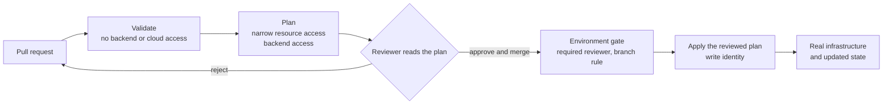

# GitHub Actions with Terraform

## Purpose

Use this page to understand what changes when Terraform runs in a pipeline
instead of on your laptop. After reading it you should be able to tell three
CI activities apart, say which of them can change real infrastructure, and
explain why a plan file is a sensitive artifact.

The page assumes the model in [Terraform fundamentals](../terraform/fundamentals/terraform-fundamentals.md):
configuration, provider, state, plan, and apply. It is not a workflow to copy.
The command sequence itself is in the [core Terraform workflow](../terraform/commands/core-workflow.md).

## What running Terraform in CI means

Running Terraform in CI means a GitHub Actions job, not a person at a
terminal, runs Terraform commands. That job needs the same three things a
person needs: the configuration, access to the state, and an identity the
cloud provider accepts.

What changes is that nobody is watching the terminal. The pause where a person
reads a plan and types "yes" has to be rebuilt deliberately out of pipeline
features.

## Why it matters

A sequence such as "init, validate, plan, apply" looks like four steps of one
task. In a pipeline they are three different activities with different risks
and different permissions. Treating them as one leads to two familiar
failures: pull requests that can change production, and applies that nobody
reviewed.

## Three activities, not one

| Activity | When it runs | What it needs | Can it change infrastructure? |
| --- | --- | --- | --- |
| Pull request validation | On every proposed change. | The configuration, with its providers and modules installed. No backend or cloud access. | No. |
| Plan | On a proposed change, for a specific environment. | Access to state, the provider's read operations, and any backend locking operations. | It does not apply the proposed resource changes. |
| Apply | After review, for a specific environment. | Write access to state and to the provider. | Yes. |

**Validation** checks that configuration is syntactically valid and
internally consistent. `terraform validate` does not check remote services
such as remote state or provider APIs. It needs an initialized working
directory with the referenced providers and modules installed, and that
initialization can be done without touching the backend.[^terraform-validate]
A passing validation says the files make sense. It says nothing about what would happen
to real resources.

**Plan** reads the current state of existing remote objects, compares the
configuration with the prior state, and proposes a set of changes. It does not
carry them out.[^terraform-plan] A plan is environment-specific: the same
configuration can produce a different plan against a different state.

**Apply** carries out proposed resource changes through the provider. Planning
can still acquire a state-backend lock or read provider data; it is not a
promise of no other side effects.

## The pieces that make CI different

### State and backend

A **backend** determines where Terraform stores state. The default backend
keeps state in a local file on disk.[^terraform-backends] A CI job starts on a
fresh machine each time, so a local file would be lost at the end of every
run. Pipelines therefore depend on a remote backend that every run can reach.

If the backend supports it, Terraform locks the state for operations that
could write it, so that two runs cannot write at the same
time.[^terraform-state-locking] Locking is a backend feature, and the backend
documentation describes it as optional, so confirm that yours provides it and
that it is enabled.[^terraform-backends] [Terraform state management](../terraform/fundamentals/state-management.md)
covers backends and locking in depth.

### Identity

The job must prove who it is to the cloud provider. A job can request an OIDC
token from GitHub and exchange it for short-lived credentials, which avoids
storing a long-lived cloud key as a repository secret. The `id-token: write`
permission only allows the job to request that token.[^github-oidc-reference]

Planning proposes resource changes; applying carries them out. A team may
give the planning job narrower cloud-resource permissions than the apply job.
HashiCorp's automation guidance mentions read-only plan credentials as an
option and warns that both identities must reach the same target
account.[^terraform-automation] This is a design choice, not a universal
permission set: planning can read provider data, and state backends have their
own permissions. For example, the S3 backend with `use_lockfile` needs write
and delete permissions on its lock object even during a plan that acquires a
state lock.[^terraform-s3-backend]

### Branch and environment gate

A GitHub deployment environment can require reviewers and can restrict which
branches may deploy. Secrets stored in the environment are unavailable to a
job until a required reviewer approves it.[^github-deployment-environments]

The token's subject claim can also name the environment. GitHub documents a
subject of the form `repo:ORG/REPO:environment:NAME` for a job that references
an environment.[^github-oidc-reference] A cloud role that trusts only that
subject cannot be assumed by a job that does not reference the environment,
such as an ordinary pull request check.

### Why the approval has to live in the pipeline

Run interactively without a plan file, `terraform apply` creates a plan and
asks you to approve it. Given a saved plan file, it performs the operations in
that plan without prompting.[^terraform-apply]

In automation, the saved-plan route is the common one, so Terraform itself
will not pause. The review has to happen before the apply job starts, and the
environment gate is what enforces it.

### Drift between plan and apply

Time passes between the plan a reviewer reads and the apply that runs. In that
gap, another change may be applied, or someone may change a resource by hand.

HashiCorp's automation guidance addresses this directly: when a plan is
applied, other plans produced against the same state are invalidated, because
they must be recomputed against the new state. It recommends allowing only one
outstanding plan at a time, and approving promptly so that the plan does not
go stale.[^terraform-automation]

The safe pattern is to apply the same saved plan that was reviewed, not a
fresh plan computed at apply time that nobody has read.

### Plan files are sensitive

A saved plan file contains the full configuration, the values associated with
the planned changes, and the input variables. If the plan includes sensitive
data, it is saved in clear text in the plan file, even where Terraform's
terminal output hides it. The documentation says to treat saved plan files as
potentially sensitive artifacts.[^terraform-plan]

In a pipeline this matters because the plan has to travel from the plan job to
the apply job. Wherever it is stored, anyone who can download it can read
those values. The same caution applies to posting plan output in a pull
request comment: redaction in the terminal does not make a plan safe to
publish widely.

## Visual: where the gate sits

Text alternative: a pull request is validated without backend or cloud access,
then planned with narrow provider permissions and the backend access it
needs. A reviewer reads the plan. If they
reject it, the work returns to the pull request. If they approve and merge,
the change reaches an environment gate with a required reviewer and a branch
rule. Only after that gate does a job with a write identity apply the reviewed
plan, which changes real infrastructure and updates state.

Nothing to the left of the environment gate applies the proposed resource
changes. The plan may still lock its backend and expose sensitive state; that
boundary is what the diagram is meant to show.

## Example: one change through the pipeline

This example is illustrative. The repository, names, and outcomes are
invented, and nothing here was run.

A team manages the network for `bookings-api` with Terraform. A developer
opens a pull request that adds one tag to a subnet.

| Moment | What happens | Managed resources changed? | What could go wrong |
| --- | --- | --- | --- |
| Pull request opened | Formatting and validation run. | No | Nothing reaches the cloud or the state. |
| Plan job | The job reads state and reports one in-place update. | No | The plan file holds values from the configuration, so it is stored with restricted access. |
| Review | A reviewer confirms the plan shows one update and no destroy. | No | A reviewer who reads only the code diff misses what the plan would do. |
| Merge | The change lands on the main branch. | No | Still nothing has changed in the cloud. |
| Meanwhile | A colleague's separate change is applied first. | Yes | The reviewed plan was computed against the older state. |
| Apply job | The pipeline refuses to reuse the outdated plan, produces a new one, and asks for review again. | No | Applying without re-review would run changes nobody read. |
| Apply job, second attempt | After approval in the `production` environment, the reviewed plan is applied. | Yes | If it fails part-way, some changes are made and others are not. |

What to notice: only two rows change real infrastructure, and both sit behind
a review. The interruption in the middle is the process working. How a
particular pipeline detects an outdated plan depends on how it is built; the
principle from HashiCorp's guidance is that a plan is valid only against the
state it was computed from.

## Trade-offs and failure boundaries

- **Stricter gates slow delivery.** Requiring re-review after every
  intervening apply is safe and can be frustrating on a busy repository.
  Smaller, separate state files reduce collisions.
- **A partly failed apply is not an all-or-nothing operation.** Changes that
  completed before the failure stay in place, and recovery is a further plan
  and apply, not an undo. This describes Terraform's general behaviour and is
  not quoted from the pages cited here; the apply documentation points to a
  tutorial on recovering from apply errors.
- **Plan permissions still reveal information.** An identity without permission
  to change managed resources can still read state, and state can contain
  secrets. Narrow resource permissions do not make a planning job harmless.
- **Pull requests from outside the team deserve extra care.** A workflow that
  plans against a real environment for any incoming pull request exposes that
  environment's read access to code nobody has reviewed yet.

## Check your understanding

- Which of validation, plan, and apply needs cloud credentials, and which can
  change infrastructure?
- Why does `terraform apply` with a saved plan make the environment gate more
  important, not less?
- A plan was approved yesterday, and another change was applied this morning.
  Why should the approved plan not simply be applied?
- Why is a saved plan file treated as sensitive even when the terminal output
  shows values as hidden?

## Next steps

- The model underneath: [Terraform fundamentals](../terraform/fundamentals/terraform-fundamentals.md).
- Backends, locking, and secrets in state: [Terraform state management](../terraform/fundamentals/state-management.md).
- Command-level detail and plan review signals: [core Terraform workflow](../terraform/commands/core-workflow.md).
- Short-lived credentials from GitHub: [AWS OIDC federation](../git/github-actions/aws-oidc-federation.md)
  and [OIDC fundamentals](../security/identity-federation/oidc-fundamentals.md).
- The AWS side of the same pipeline: [Terraform on AWS](terraform-on-aws.md).

## Official documentation for deeper study

- What validation covers: [`terraform validate` command](https://developer.hashicorp.com/terraform/cli/commands/validate).
- Plan behaviour, saved plans, and their sensitivity: [`terraform plan` command](https://developer.hashicorp.com/terraform/cli/commands/plan).
- Automatic and saved-plan modes: [`terraform apply` command](https://developer.hashicorp.com/terraform/cli/commands/apply).
- Approval between plan and apply, and plan invalidation: [Running Terraform in automation](https://developer.hashicorp.com/terraform/tutorials/automation/automate-terraform).
- Where state is stored: [Backends](https://developer.hashicorp.com/terraform/language/state/backends) and [State locking](https://developer.hashicorp.com/terraform/language/state/locking).
- S3 backend lock-file permissions: [Terraform - S3 backend](https://developer.hashicorp.com/terraform/language/backend/s3).
- Approval gates: [GitHub Docs - Deployments and environments](https://docs.github.com/en/actions/reference/workflows-and-actions/deployments-and-environments).
- Subject claims for environments: [GitHub Docs - OpenID Connect reference](https://docs.github.com/en/actions/reference/security/oidc).

## Related links

- [GitHub Actions documentation](https://docs.github.com/actions)
- [Terraform CLI documentation](https://developer.hashicorp.com/terraform/cli)
- [GitHub Actions section](../git/github-actions/index.md)
- [End-to-end deployment](end-to-end-deployment.md)
- [Back to cross-topic guides](index.md)
- [Back to knowledge index](../index.md)

[^terraform-validate]: [terraform validate command](https://developer.hashicorp.com/terraform/cli/commands/validate), source record `terraform-validate`.
[^terraform-plan]: [terraform plan command](https://developer.hashicorp.com/terraform/cli/commands/plan), source record `terraform-plan`.
[^terraform-apply]: [terraform apply command](https://developer.hashicorp.com/terraform/cli/commands/apply), source record `terraform-apply`.
[^terraform-backends]: [Terraform - Backends, state storage and locking](https://developer.hashicorp.com/terraform/language/state/backends), source record `terraform-backends`.
[^terraform-state-locking]: [Terraform - State locking](https://developer.hashicorp.com/terraform/language/state/locking), source record `terraform-state-locking`.
[^terraform-s3-backend]: [Terraform - S3 backend](https://developer.hashicorp.com/terraform/language/backend/s3), source record `terraform-s3-backend`.
[^terraform-automation]: [HashiCorp tutorial - Running Terraform in automation](https://developer.hashicorp.com/terraform/tutorials/automation/automate-terraform), source record `terraform-automation`.
[^github-deployment-environments]: [GitHub Docs - Deployments and environments](https://docs.github.com/en/actions/reference/workflows-and-actions/deployments-and-environments), source record `github-deployment-environments`.
[^github-oidc-reference]: [GitHub Docs - OpenID Connect reference](https://docs.github.com/en/actions/reference/security/oidc), source record `github-oidc-reference`.
