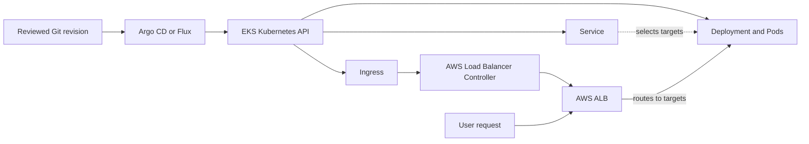

# GitOps on EKS

## Purpose

Use this page to follow one application change from Git to an EKS user
request. The important question is **which controller owns each step?**
Argo CD or Flux reconciles desired Kubernetes objects. Kubernetes then
reconciles workloads, while an Ingress implementation may create AWS
networking resources. A successful GitOps sync is only one part of a
working application.[^argo-sync][^flux-kustomizations][^eks-load-balancer]

If GitOps itself is new, start with [GitOps](../kubernetes/applications-and-tools/gitops.md).
This guide concentrates on the extra boundaries that appear on EKS.

## One change, several controllers

Imagine a building plan that names rooms and an entrance. The planning
office accepts the plan; builders make the rooms; a separate contractor
installs the entrance. Here, Git holds the plan, the GitOps controller
submits Kubernetes objects, Kubernetes runs the Pods, and a load-balancer
implementation handles external entry. The analogy stops there:
controllers continuously reconcile, can fail independently, and an
installed entrance does not prove the application answers correctly.

The following photo API is invented. No repository change, EKS cluster,
Ingress, load balancer, or user request was created or tested.

1. A reviewed Git change names a new photo API image digest and an
   `Ingress` that routes `/photos` to its Service.
2. Argo CD or Flux notices the desired state and applies the Deployment,
   Service, and Ingress to the EKS Kubernetes API. Automated sync and
   deletion of removed resources are separate settings; do not assume a
   deleted Git file automatically deletes a live object.[^argo-sync]
3. Kubernetes rolls out Pods and maintains the Service endpoints. With
   the **AWS Load Balancer Controller** selected for this Ingress, that
   controller observes it and creates or adjusts an Application Load
   Balancer (ALB) in AWS.[^eks-load-balancer]
4. A real user request must still reach a healthy ALB target and a Pod
   selected for the Service, which must serve the expected photo response.

Text alternative: the GitOps controller reads the reviewed Git revision
and submits objects to the EKS Kubernetes API. Kubernetes runs the
Deployment and Pods. The AWS Load Balancer Controller sees the Ingress
and reconciles an ALB. The Service selects application targets. A user's
request travels through the ALB to those targets; exact routing depends on
the target mode. Each arrow has its own owner and failure
signals; the diagram does not mean one controller performs every step.

EKS Auto Mode is another load-balancing implementation. It includes
AWS-managed application load balancing, with its own configuration and
resource ownership. Identify the chosen Ingress implementation before
following the ALB branch above; do not assume that installing the AWS
Load Balancer Controller is required for every EKS cluster.[^eks-auto-mode]

## Three permission boundaries

| Actor | Access it may need | What that access does not grant |
| --- | --- | --- |
| GitOps controller | Permission to read the desired source and apply approved Kubernetes objects in the target cluster. | The photo API's AWS permissions. Its namespace reach depends on its Kubernetes credentials and policy. |
| AWS Load Balancer Controller | Kubernetes access to watch its resources and an IAM role with the AWS permissions required to manage load-balancing resources. | Permission for the photo API to read its S3 bucket. |
| Photo API Pod | Its own service account and, if it calls S3, a scoped IAM role through IRSA or EKS Pod Identity. | Its IAM role does not grant permission to edit Deployments or Ingresses through the Kubernetes API. |

Kubernetes RBAC governs changes through the Kubernetes API; IAM governs
AWS API calls. A GitOps controller that only applies ordinary Kubernetes
objects does not need a workload IAM role merely because it runs on EKS.
It may need AWS credentials for a separate task, such as authenticating
to an AWS-hosted source or target cluster. Assign those credentials to
that specific need, and keep them separate from the application's
role.[^flux-kustomizations][^eks-service-accounts]

If a controller runs **inside each workload cluster**, it uses that
cluster's API and has a local failure boundary. If it runs in a
**tooling cluster**, it needs an authenticated and reachable connection
to each target cluster. Either layout still needs scoped Kubernetes
authorization in the target. Flux documents target-cluster credentials
and service-account impersonation; Argo CD Projects can restrict source
repositories, destinations, and resource kinds. Choose the layout from
the clusters and ownership boundaries you actually have.
[^flux-kustomizations][^argo-projects]

Keep secret values out of plain Git. Select an encrypted or external
secret workflow, then decide which controller or workload is allowed to
decrypt or fetch them. See [GitOps security and multi-tenancy](../kubernetes/applications-and-tools/gitops-security-and-multitenancy.md)
for the broader source, namespace, and controller boundaries.[^flux-secrets]

## What to verify after sync

| Signal | What it can establish | What to check next |
| --- | --- | --- |
| GitOps revision and sync state | The intended objects were compared with and, if configured, applied to the cluster. | Deployment rollout and object health. |
| Kubernetes rollout and endpoints | New Pods exist and may receive Service traffic. | Ingress implementation, ALB target health, and the application response. |
| Ingress address or GitOps health | A load-balancer address may be published. Argo CD's built-in Ingress health check looks for an address. | A request through the public path with the expected response and permissions. |
| User-path check | The tested route worked at that time. | Error rates and rollback readiness after traffic changes. |

Argo CD's Ingress health check is based on the presence of a load-balancer
address, not on a complete user request. A green GitOps view therefore
cannot replace a user-path check.[^argo-health]

If the new revision fails, find the owning step before changing Git:
source or sync error, Kubernetes rollout, load-balancer reconciliation,
or application response. A rollback in Git also reconciles
asynchronously; verify the previous image and user path after it lands.
For the general release chain, see [End-to-end deployment](end-to-end-deployment.md).

## Check your understanding

1. The Ingress object exists, but no ALB appears. Which controller or
   selected load-balancing implementation should you inspect?
2. Why does giving the photo API Pod S3 access not let the GitOps
   controller update Deployments?
3. If Argo CD reports a healthy Ingress, what user-facing behavior is
   still unproven?
4. What extra connection does a GitOps controller in a tooling cluster
   need to manage a different EKS cluster?

## Deeper study

- [Argo CD automated sync](https://argo-cd.readthedocs.io/en/stable/user-guide/auto_sync/)
  and [resource health](https://argo-cd.readthedocs.io/en/stable/operator-manual/health/)
  for what its status can mean.
- [Flux Kustomization](https://fluxcd.io/flux/components/kustomize/kustomizations/)
  for reconciliation, health, and target-cluster access.
- [AWS Load Balancer Controller](https://docs.aws.amazon.com/eks/latest/userguide/aws-load-balancer-controller.html)
  and [EKS Auto Mode](https://docs.aws.amazon.com/eks/latest/userguide/automode.html)
  for the chosen load-balancing path.
- [EKS workload identity](eks-workload-identity.md) for Pod IAM permissions;
  [Argo CD vs. Flux](../kubernetes/applications-and-tools/argo-cd-vs-flux.md)
  for selecting a GitOps controller.

[Back to cross-topic guides](index.md)

[^argo-sync]: [Argo CD - Automated Sync Policy](https://argo-cd.readthedocs.io/en/stable/user-guide/auto_sync/).
[^argo-health]: [Argo CD - Resource Health](https://argo-cd.readthedocs.io/en/stable/operator-manual/health/).
[^argo-projects]: [Argo CD - Projects](https://argo-cd.readthedocs.io/en/stable/user-guide/projects/).
[^flux-kustomizations]: [Flux - Kustomization](https://fluxcd.io/flux/components/kustomize/kustomizations/).
[^flux-secrets]: [Flux - Secrets Management](https://fluxcd.io/flux/security/secrets-management/).
[^eks-load-balancer]: [Amazon EKS - AWS Load Balancer Controller](https://docs.aws.amazon.com/eks/latest/userguide/aws-load-balancer-controller.html).
[^eks-auto-mode]: [Amazon EKS - EKS Auto Mode](https://docs.aws.amazon.com/eks/latest/userguide/automode.html).
[^eks-service-accounts]: [Amazon EKS - Workload IAM permissions](https://docs.aws.amazon.com/eks/latest/userguide/service-accounts.html).
