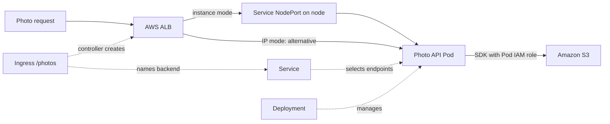

# Kubernetes on AWS

## Purpose

Kubernetes lets you declare Pods, Services, and storage needs. Amazon
EKS manages the Kubernetes control plane. Your chosen compute and
integrations connect those declarations to AWS networking, identity,
and storage. An Ingress, for example, needs a compatible controller
before it can create an AWS load balancer. The useful question
for a beginner is **which system owns the object I am looking at?**
That tells you where to inspect a problem and what a successful status
does, or does not, prove.[^eks-overview]

Start with [Kubernetes fundamentals](../kubernetes/fundamentals/kubernetes-fundamentals.md)
if the core objects are new. This page explains the AWS handoffs.

## The two sides of an EKS workload

Imagine a theatre. Kubernetes describes the show: performers, where
they stand, and which doorway an audience uses. EKS manages the
control room. Your chosen AWS capacity and integrations supply and
connect the building's facilities. Writing a doorway into the script
does not install a door: an Ingress needs a controller to make an ALB.
The analogy stops there: a green status cannot prove the performance
is good.

| Reader question | Kubernetes side | AWS/EKS side |
| --- | --- | --- |
| Where does the app run? | A Deployment asks for Pods; scheduling places them on suitable capacity. | Standard EC2 nodes, Fargate, or AWS-managed EC2 nodes in EKS Auto Mode provide different capacity paths. |
| How does a request find it? | A Service selects application endpoints; an Ingress or Gateway may declare external routing. | Pod networking and the selected AWS load-balancing implementation connect network traffic to targets. |
| Who may call AWS services? | A Pod uses a Kubernetes service account. | IRSA uses a service-account annotation and cluster OIDC provider; an EKS Pod Identity association is another way to grant temporary IAM role credentials. Pod Identity needs its agent and supports Pods on Linux EC2 nodes, not Fargate or Windows Pods. |
| Where can data live? | A PersistentVolumeClaim requests a volume through a StorageClass; an application may also call an object API. | A CSI implementation may provision EBS; an app can use S3 through its SDK and IAM role. |

The same object name can hide different responsibilities. A Kubernetes
`Service` provides a stable way to find application endpoints; it is
not itself an AWS load balancer unless its type and the cluster's
selected implementation arrange one. A claim for storage does not
create an EBS volume without a compatible provisioner and permissions.
[^k8s-service][^eks-load-balancer][^eks-ebs-csi]

## Example: a photo upload API

The application, accounts, permissions, and results here are invented.
No cluster, request, S3 object, load balancer, or EBS volume was
created or tested.

Suppose a photo API Deployment runs on EC2 nodes in standard EKS. A
Kubernetes Service selects its ready Pods. An Ingress points its
`/photos` rule to that Service and selects the AWS Load Balancer
Controller through its Ingress class. The separately installed
controller reads the Ingress and Service and creates an Application
Load Balancer (ALB). Without that controller, creating the Ingress
alone does not create an ALB. The controller's default ALB scheme is
internal; a public route requests `internet-facing`, and automatic
subnet discovery needs the public or private subnet role tags.
[^eks-load-balancer][^eks-alb-targets][^alb-controller-annotations]

The controller's default **instance target mode** sends requests from
the ALB to a node's Service `NodePort`, which forwards them to a Pod.
The Service must be type `NodePort` or `LoadBalancer`. In **IP target
mode**, the ALB targets Pod IPs directly; the Service still defines
which Pods are eligible. Fargate Pods require IP target mode. These
are alternative traffic paths, not two steps of one request. EKS Auto
Mode defaults to IP target mode instead.[^eks-alb-targets]
[^eks-auto-networking]

The API writes photo bytes to S3 using an SDK. Its Kubernetes service
account is associated with a scoped AWS IAM role, so the Pod can obtain
temporary AWS credentials. The ALB, Service, and Deployment do not
grant S3 permission by themselves. On EC2 nodes, also restrict access
to instance metadata as appropriate: otherwise a Pod may obtain the
node's IAM credentials and hide a broken workload-identity setup.
[^eks-service-accounts][^eks-pod-identity]

The identity that pulls a private ECR image is a separate concern:
EC2 nodes use their node IAM role, while Fargate uses a pod execution
role. Changing the photo API's runtime S3 role does not repair an ECR
pull failure.[^eks-ecr-images]

Text alternative: the Ingress names a Service for `/photos`; the
controller creates an AWS ALB from the Ingress. The Service selects
photo API Pods managed by a Deployment. A client request reaches the
ALB, then either a node's Service NodePort and a Pod in instance mode,
or a Pod IP directly in IP mode. The Pod separately uses temporary IAM
role credentials for an S3 API call. Solid arrows are traffic; dotted
arrows are configuration relationships. The ALB and S3 are AWS
resources. The Ingress, Service, Deployment, and Pod are Kubernetes
objects. The NodePort is a port the Service opens on each node, and
the request comes from an outside client.

If the application instead requests a Kubernetes persistent volume,
an EBS CSI driver can manage an EBS volume for that claim. EBS is a
volume in one Availability Zone, typically mounted read-write by one
node at a time. One claim cannot be assumed to serve photo API replicas
on several nodes or zones. S3 is a better fit for shared photo objects;
EFS is an option when replicas need a shared file system.
[^ebs-volumes][^eks-efs-csi]

On EKS Auto Mode, block storage uses the
`ebs.csi.eks.amazonaws.com` provisioner;
the standard driver uses `ebs.csi.aws.com`. Moving existing volumes
between them requires a snapshot migration, not merely changing a
claim. Fargate Pods cannot mount EBS volumes.
[^eks-ebs-csi][^k8s-persistent-volumes]

## Standard EKS and Auto Mode change ownership

In standard EKS, AWS manages the Kubernetes control plane. The team
chooses its compute path and configures the integrations it needs.
AWS manages the underlying hosts for Fargate. Managed node groups
automate EC2 node provisioning and updates, but those instances still
run in the team's account. The team installs and maintains the AWS
Load Balancer Controller if it chooses that standard EKS path.
EKS Auto Mode extends AWS management to nodes and core capabilities
such as Pod networking, load balancing, and block storage. Application
Deployments, service accounts, access decisions, data protection, and
user-facing verification still need deliberate design. First identify
the cluster mode before looking for a particular add-on, node group,
or load-balancer controller. In Auto Mode, an ALB needs an IngressClass
whose controller is `eks.amazonaws.com/alb` and an Ingress that uses
that class. ALB settings such as `scheme: internet-facing` belong in
IngressClassParams, and the subnets need role tags. The managed
capability does not create a public route by itself. Pod Identity needs
its agent on standard Linux EC2 nodes; Auto Mode includes that agent.
[^eks-overview][^eks-auto-mode][^eks-auto-alb]

For standard EKS on EC2, the Amazon VPC CNI assigns Pods private
addresses from the VPC; the team maintains the add-on. Fargate also
gives Pods VPC IP addresses through AWS-managed networking. On Auto
Mode, Pod networking is built in rather than a VPC CNI add-on to
install or upgrade. This changes where operators look for the owner
of an IP allocation problem;
it does not make Pod networking disappear.[^eks-vpc-cni]

## Ask the right question when something fails

| Symptom | First boundary to inspect |
| --- | --- |
| Pods cannot start | Deployment and Pod events, image access, scheduling, capacity, and available VPC subnet IPs. |
| Pods are Ready but the site fails | Service endpoints, Ingress or Gateway controller, ALB scheme, subnet tags, security groups, target health, then application response. |
| Pod receives an AWS authorization error | Its service account, eligible IRSA or Pod Identity path, role trust and permissions, the requested AWS resource, and possible node-role credential fallback. |
| PVC remains pending | First check whether `WaitForFirstConsumer` is waiting for a Pod to be scheduled; then check the StorageClass, CSI driver, its IAM permissions, and compute compatibility.[^k8s-storage-class] |

See [EKS operations](eks-operations.md) for a fuller symptom-first
sequence. A completed [EKS deployment](deploying-to-eks.md) still needs
an actual user-path check.

## Check your understanding

1. Which part does EKS manage in a standard cluster, and what extra
   responsibilities does Auto Mode take on?
2. Why does a healthy Kubernetes Service not prove that a public ALB
   route is working?
3. Which identity would the photo API use to call S3, and why is that
   separate from the identity that pulls its container image?
4. How is an S3 API call different from a PVC backed by EBS?

## Deeper study

- [What is Amazon EKS?](https://docs.aws.amazon.com/eks/latest/userguide/what-is-eks.html)
  and [EKS Auto Mode](https://docs.aws.amazon.com/eks/latest/userguide/automode.html)
  for the two management models.
- [VPC CNI](https://docs.aws.amazon.com/eks/latest/userguide/managing-vpc-cni.html)
  and [AWS Load Balancer Controller](https://docs.aws.amazon.com/eks/latest/userguide/aws-load-balancer-controller.html)
  for the network integrations in standard EKS.
- [ALB target modes](https://docs.aws.amazon.com/eks/latest/userguide/alb-ingress.html)
  and [Auto Mode Ingress classes](https://docs.aws.amazon.com/eks/latest/userguide/auto-configure-alb.html)
  for the two ALB configuration paths.
- [EKS workload IAM options](https://docs.aws.amazon.com/eks/latest/userguide/service-accounts.html)
  and [EBS CSI storage](https://docs.aws.amazon.com/eks/latest/userguide/ebs-csi.html)
  for AWS service and volume access.
- [EKS workload identity](eks-workload-identity.md) and
  [Gateway API and Ingress](../kubernetes/applications-and-tools/gateway-api-and-ingress.md)
  for more detailed boundaries.

[Back to cross-topic guides](index.md)

[^eks-overview]: [Amazon EKS - What is Amazon EKS?](https://docs.aws.amazon.com/eks/latest/userguide/what-is-eks.html).
[^eks-auto-mode]: [Amazon EKS - EKS Auto Mode](https://docs.aws.amazon.com/eks/latest/userguide/automode.html).
[^eks-vpc-cni]: [Amazon EKS - Amazon VPC CNI](https://docs.aws.amazon.com/eks/latest/userguide/managing-vpc-cni.html).
[^eks-load-balancer]: [Amazon EKS - AWS Load Balancer Controller](https://docs.aws.amazon.com/eks/latest/userguide/aws-load-balancer-controller.html).
[^eks-alb-targets]: [Amazon EKS - ALB target modes](https://docs.aws.amazon.com/eks/latest/userguide/alb-ingress.html).
[^eks-auto-alb]: [Amazon EKS - Auto Mode ALB IngressClass](https://docs.aws.amazon.com/eks/latest/userguide/auto-configure-alb.html).
[^eks-auto-networking]: [Amazon EKS - Auto Mode networking](https://docs.aws.amazon.com/eks/latest/userguide/auto-networking.html).
[^alb-controller-annotations]: [AWS Load Balancer Controller - Ingress annotations](https://kubernetes-sigs.github.io/aws-load-balancer-controller/latest/guide/ingress/annotations/).
[^eks-pod-identity]: [Amazon EKS - EKS Pod Identity](https://docs.aws.amazon.com/eks/latest/userguide/pod-identities.html).
[^eks-service-accounts]: [Amazon EKS - Workload IAM options](https://docs.aws.amazon.com/eks/latest/userguide/service-accounts.html).
[^eks-ecr-images]: [Amazon ECR - ECR images with EKS](https://docs.aws.amazon.com/AmazonECR/latest/userguide/ECR_on_EKS.html).
[^eks-ebs-csi]: [Amazon EKS - EBS CSI](https://docs.aws.amazon.com/eks/latest/userguide/ebs-csi.html).
[^ebs-volumes]: [Amazon EBS - Volumes](https://docs.aws.amazon.com/ebs/latest/userguide/ebs-volumes.html).
[^eks-efs-csi]: [Amazon EKS - EFS CSI](https://docs.aws.amazon.com/eks/latest/userguide/efs-csi.html).
[^k8s-service]: [Kubernetes - Service](https://kubernetes.io/docs/concepts/services-networking/service/).
[^k8s-persistent-volumes]: [Kubernetes - Persistent Volumes](https://kubernetes.io/docs/concepts/storage/persistent-volumes/).
[^k8s-storage-class]: [Kubernetes - Storage Classes](https://kubernetes.io/docs/concepts/storage/storage-classes/).
