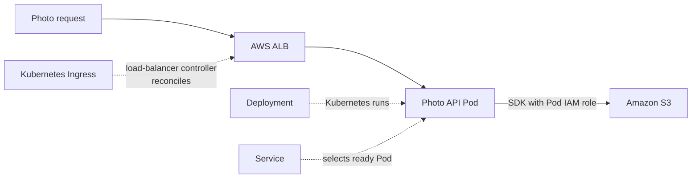

# Kubernetes on AWS

## Purpose

Kubernetes lets you declare Pods, Services, and storage needs. Amazon
EKS runs the Kubernetes control plane and connects those declarations
to AWS compute, networking, identity, and storage. The useful question
for a beginner is **which system owns the object I am looking at?**
That tells you where to inspect a problem and what a successful status
does, or does not, prove.[^eks-overview]

Start with [Kubernetes fundamentals](../kubernetes/fundamentals/kubernetes-fundamentals.md)
if the core objects are new. This page explains the AWS handoffs.

## The two sides of an EKS workload

Imagine a theatre. Kubernetes describes the show: performers, where
they stand, and which doorway an audience uses. AWS supplies the
building and services around it. EKS manages the control room that
coordinates the show. The analogy stops there: neither Kubernetes
nor AWS can infer that the performance is good from a green status.

| Reader question | Kubernetes side | AWS/EKS side |
| --- | --- | --- |
| Where does the app run? | A Deployment asks for Pods; scheduling places them on suitable capacity. | EC2 nodes, Fargate, or EKS Auto Mode provide the chosen capacity path. |
| How does a request find it? | A Service selects application endpoints; an Ingress or Gateway may declare external routing. | Pod networking and the selected AWS load-balancing implementation connect network traffic to targets. |
| Who may call AWS services? | A Pod runs as a Kubernetes service account. | IRSA or EKS Pod Identity can give that service account temporary IAM role credentials for AWS API calls. |
| Where can data live? | A PersistentVolumeClaim requests a volume through a StorageClass; an application may also call an object API. | A CSI implementation may provision EBS; an app can use S3 through its SDK and IAM role. |

The same object name can hide different responsibilities. A Kubernetes
`Service` provides a stable way to find application endpoints; it is
not itself an AWS load balancer unless its type and the cluster's
selected implementation arrange one. A claim for storage does not
create an EBS volume without a compatible provisioner and permissions.
[^k8s-service][^eks-load-balancer][^eks-ebs-csi]

## Example: a photo upload API

The application, accounts, permissions, and results here are invented.
No cluster, request, S3 object, load balancer, or EBS volume was
created or tested.

Suppose a photo API Deployment runs on EKS. A Kubernetes Service
selects its ready Pods. An external routing implementation sends
`/photos` traffic toward those Pods. In the illustrated variant, the
AWS Load Balancer Controller creates an Application Load Balancer
(ALB) from a Kubernetes Ingress. The ALB's target mode affects the
precise network path; the diagram shows the *ownership handoffs*, not
packet-level forwarding.[^eks-load-balancer]

The API writes photo bytes to S3 using an SDK. Its Kubernetes service
account is associated with a scoped AWS IAM role, so the Pod can obtain
temporary AWS credentials. The ALB, Service, and Deployment do not
grant S3 permission by themselves.[^eks-service-accounts]

The identity that pulls a private ECR image is a separate concern:
EC2 nodes use their node IAM role, while Fargate uses a pod execution
role. Changing the photo API's runtime S3 role does not repair an ECR
pull failure.[^eks-ecr-images]

Text alternative: a Kubernetes Ingress is reconciled into an AWS ALB,
and a Deployment runs the photo API Pod. A Service selects ready Pods.
A client request enters through the ALB and reaches an application
target. The Pod separately uses temporary IAM role credentials for an
S3 API call. The ALB and S3 are AWS resources; the Deployment, Service,
Ingress, and Pod are Kubernetes objects.

If the application instead requests a Kubernetes persistent volume,
an EBS CSI driver can manage an EBS volume for that claim. That is a
different storage contract from calling S3 as an object API. On EKS
Auto Mode, block storage is a managed capability with a distinct CSI
provisioner; standard EBS CSI volumes and Auto Mode volumes are not
interchangeable merely by changing a Pod's claim. EBS volumes cannot
be mounted by Fargate Pods.[^eks-ebs-csi][^k8s-persistent-volumes]

## Standard EKS and Auto Mode change ownership

In standard EKS, AWS manages the Kubernetes control plane while the
team selects and operates its compute and supporting integrations.
EKS Auto Mode extends AWS management to nodes and core capabilities
such as Pod networking, load balancing, and block storage. Application
Deployments, service accounts, access decisions, data protection, and
user-facing verification still need deliberate design. First identify
the cluster mode before looking for a particular add-on, node group,
or load-balancer controller.[^eks-overview][^eks-auto-mode]

For standard EKS on EC2, the Amazon VPC CNI can assign Pods private
addresses from the VPC. On Auto Mode, Pod networking is a built-in
capability rather than a VPC CNI add-on to install or upgrade. This
changes where operators look for the owner of an IP allocation problem;
it does not make Pod networking disappear.[^eks-vpc-cni]

## Ask the right question when something fails

| Symptom | First boundary to inspect |
| --- | --- |
| Pods cannot start | Deployment and Pod events, image access, scheduling, and the cluster's capacity path. |
| Pods are Ready but the site fails | Service endpoints, Ingress or Gateway implementation, AWS load-balancer targets, then application response. |
| Pod receives an AWS authorization error | Its service account, selected IRSA or Pod Identity path, role trust and permissions, and the requested AWS resource. |
| PVC remains pending | StorageClass, chosen CSI provisioner, driver permissions, and compute compatibility. |

See [EKS operations](eks-operations.md) for a fuller symptom-first
sequence. A completed [EKS deployment](deploying-to-eks.md) still needs
an actual user-path check.

## Check your understanding

1. Which part does EKS manage in a standard cluster, and what extra
   responsibilities does Auto Mode take on?
2. Why does a healthy Kubernetes Service not prove that a public ALB
   route is working?
3. Which identity would the photo API use to call S3, and why is that
   separate from the identity that pulls its container image?
4. How is an S3 API call different from a PVC backed by EBS?

## Deeper study

- [What is Amazon EKS?](https://docs.aws.amazon.com/eks/latest/userguide/what-is-eks.html)
  and [EKS Auto Mode](https://docs.aws.amazon.com/eks/latest/userguide/automode.html)
  for the two management models.
- [VPC CNI](https://docs.aws.amazon.com/eks/latest/userguide/managing-vpc-cni.html)
  and [AWS Load Balancer Controller](https://docs.aws.amazon.com/eks/latest/userguide/aws-load-balancer-controller.html)
  for the network integrations in standard EKS.
- [EKS workload IAM options](https://docs.aws.amazon.com/eks/latest/userguide/service-accounts.html)
  and [EBS CSI storage](https://docs.aws.amazon.com/eks/latest/userguide/ebs-csi.html)
  for AWS service and volume access.
- [EKS workload identity](eks-workload-identity.md) and
  [Gateway API and Ingress](../kubernetes/applications-and-tools/gateway-api-and-ingress.md)
  for more detailed boundaries.

[Back to cross-topic guides](index.md)

[^eks-overview]: [Amazon EKS - What is Amazon EKS?](https://docs.aws.amazon.com/eks/latest/userguide/what-is-eks.html).
[^eks-auto-mode]: [Amazon EKS - EKS Auto Mode](https://docs.aws.amazon.com/eks/latest/userguide/automode.html).
[^eks-vpc-cni]: [Amazon EKS - Amazon VPC CNI](https://docs.aws.amazon.com/eks/latest/userguide/managing-vpc-cni.html).
[^eks-load-balancer]: [Amazon EKS - AWS Load Balancer Controller](https://docs.aws.amazon.com/eks/latest/userguide/aws-load-balancer-controller.html).
[^eks-service-accounts]: [Amazon EKS - Workload IAM options](https://docs.aws.amazon.com/eks/latest/userguide/service-accounts.html).
[^eks-ecr-images]: [Amazon ECR - ECR images with EKS](https://docs.aws.amazon.com/AmazonECR/latest/userguide/ECR_on_EKS.html).
[^eks-ebs-csi]: [Amazon EKS - EBS CSI](https://docs.aws.amazon.com/eks/latest/userguide/ebs-csi.html).
[^k8s-service]: [Kubernetes - Service](https://kubernetes.io/docs/concepts/services-networking/service/).
[^k8s-persistent-volumes]: [Kubernetes - Persistent Volumes](https://kubernetes.io/docs/concepts/storage/persistent-volumes/).
