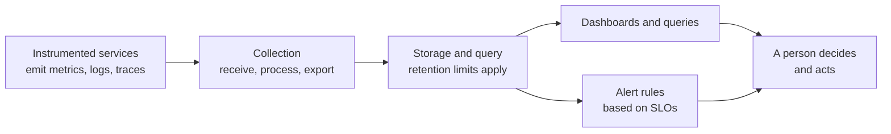

# Observability stack

## Purpose

Use this page to understand what an observability stack is for and how its
parts relate. After reading it you should be able to say which signal answers
which question, how a service level objective turns a measurement into a
decision, and what a dashboard can and cannot tell you.

The page is tool-neutral. It uses OpenTelemetry's vocabulary because that
project defines the terms publicly, not because a stack must use it.

## What observability is

Observability is the ability to understand what a system is doing from the
outside, by asking questions of the data it emits, without already knowing
what went wrong.[^opentelemetry-observability-primer]

Two conditions follow from that definition. The system has to emit data,
which is called being **instrumented**. And someone has to be able to query
that data in ways nobody planned in advance.

## Why it matters

A deployment can finish without error while users are failing to check out.
The platform reports what it knows: Pods are running. Only data from the
service and from the user's path can show whether the service is doing its
job. That is the last gate in the chain described in [End-to-end deployment](end-to-end-deployment.md).

The opposite mistake is just as common. A team collects everything, builds
dashboards, and still cannot answer "are users affected, and should someone
act?" Collecting signals does not by itself produce that answer.

## Three signals, three questions

A **signal** is a category of output that describes what a system is
doing.[^opentelemetry-signals] Three are widely used.

| Signal | Simple definition | The question it answers best | What it cannot tell you |
| --- | --- | --- | --- |
| Metric | A measurement of a service captured at runtime, such as a request count or a duration.[^opentelemetry-metrics] | "How much, how often, and is it changing?" | Which individual request failed, or why. |
| Log | A timestamped text record of an event, structured or unstructured.[^opentelemetry-logs] | "What exactly happened at this moment, in this component?" | How common the event is, unless you count the records. What happened in components that logged nothing. |
| Trace | The path one request takes through the system, made of spans, where each span is one unit of work.[^opentelemetry-traces] | "Where did this request spend its time, and which step failed?" | Whether this request is typical. |

The signals complement each other. A metric tells you there is a problem and
how large it is. A trace tells you where in the request path it sits. A log
tells you what the component said about it.

They are most useful when they can be connected. Context propagation passes
identifiers along with a request so that signals produced in different
services can be correlated.[^opentelemetry-context-propagation] Without it,
you have three separate piles of data about the same event.

## From a signal to a decision: SLI, SLO, and alert

Signals describe. They do not decide. Three terms turn a measurement into a
decision:

- A **service level indicator (SLI)** is a carefully defined quantitative
  measure of some aspect of the service, such as request latency or error
  rate.[^google-sre-book-slo] A good one measures the service from the
  users' perspective.[^opentelemetry-observability-primer]
- A **service level objective (SLO)** is a target value or range for an
  SLI.[^google-sre-book-slo] For example: 99.5% of booking requests succeed,
  measured over 30 days.
- An **alert** is a rule that notifies a person when the objective is at risk.

The chain runs: a user journey matters, an SLI measures it, an SLO says how
good is good enough, and an alert asks a person to act when the service is
falling short.

This is what separates an alert worth waking someone for from a graph that
looks alarming. "CPU is at 90%" is a fact about a machine. "Booking requests
are failing faster than our objective allows" is a statement about users and a
reason to act.

## The boundaries of a stack

Text alternative: instrumented services emit metrics, logs, and traces. A
collection layer receives, processes, and exports them. A storage and query
layer keeps them, within retention limits. From storage, two paths lead to a
person: dashboards and queries that someone looks at, and alert rules based on
SLOs that notify someone. In both cases the final step is a person deciding
and acting.

Each boundary is a place where data can be missing:

| Boundary | What it does | What is lost if it falls short |
| --- | --- | --- |
| Instrumentation | Code in the system emits signals. | Anything not instrumented is invisible. No later stage can recover it. |
| Collection | Receives, processes, and exports telemetry. The OpenTelemetry Collector is one vendor-neutral implementation of this layer.[^opentelemetry-collector] | Data dropped or filtered here never reaches storage. |
| Storage and query | Keeps data and answers questions about it. | Data older than the retention period is gone. Detail that was aggregated away cannot be recovered. |
| Dashboards and alerts | Present data and notify people. | A dashboard shows only the questions someone thought to ask. |

Traces have one more boundary. Tracing is often **sampled**, which means only
some traces are processed and exported.[^opentelemetry-sampling] The request
you want to examine may not be among them.

## Example: an incident on a booking service

This story is illustrative. The service, numbers, and findings are invented,
and it does not describe a real incident or a tested setup.

`bookings-api` has an illustrative SLO that 99.5% of `POST /bookings` requests
succeed over 30 days. Its team also uses an alert on a short window of fast
error-budget consumption. A new version was deployed twenty minutes ago and
the rollout completed.

| Step | Signal | What it reveals | What it cannot prove |
| --- | --- | --- | --- |
| 1 | A short-window error-budget alert fires for booking requests. | Recent failures put the 30-day SLO at risk and warrant investigation. | Why requests failed or whether the full 30-day objective is already missed. |
| 2 | Metrics show the error rate rose from 0.2% to 6% starting at the deployment time, and that latency for the payment step tripled. | How large, since when, and that it coincides with the deployment. | That the deployment caused it. Coincidence in time is a lead, not proof. |
| 3 | A trace of one failed request shows most of its time spent in a call to the payment provider, ending in a timeout. | Where in the request path the failure sits. | That every failing request looks like this one. If traces are sampled, the collection may not be representative. |
| 4 | Logs from the booking service around that span show "connection pool exhausted" errors. | What the component reported at that moment. | What happened inside the payment provider, which emits no logs into this stack. |
| 5 | The team compares versions and finds that the new release lowered the connection pool size. They roll back, and the recent success rate returns toward its former level. | The rollback is followed by recovery in the current traffic. | That the pool size was the only cause, or that the rolling 30-day objective has recovered. |

What to notice:

- Each signal narrowed the question. None answered it alone.
- The alert came from the SLO, not from a machine-level metric. CPU and memory
  were normal throughout.
- The dashboard for Pod health was green the whole time. It was accurate, and
  it was answering a different question.

## What a green dashboard does not prove

A dashboard with no red on it means that the things being measured are within
their thresholds. It does not mean the service is healthy.

- A user whose request never reaches the service, because of a DNS, network,
  or CDN problem in front of it, produces no signal inside the service.
- A component that is not instrumented cannot appear unhealthy.
- A threshold set too loosely stays green while users struggle.
- A collection pipeline that has stopped delivering data can look the same as
  a quiet system.

This is why a check from the user's side of the system, and an alert for
missing data, are worth having alongside internal signals.

## An analogy: a hospital ward

- **Metrics** are the bedside monitor: a few numbers, updated constantly,
  cheap to watch for every patient.
- **Logs** are the notes staff write: detailed, specific, and written only when
  someone thought an event was worth recording.
- **A trace** is following one patient from admission through every
  department to discharge.
- **The SLO** is the ward's agreed standard of care, and **an alert** is the
  call to a doctor when the monitor shows the standard is not being met.

Where the analogy stops being accurate:

- **Software emits only what it was built to emit.** A monitor measures a
  patient whether or not anyone planned for it. An uninstrumented service says
  nothing.
- **Most journeys are not followed.** With sampling, only some requests have a
  trace at all.
- **Records are discarded on a schedule.** Telemetry past its retention
  period is deleted, and cost usually decides how long that is.
- **The monitor can fail silently.** A broken collection pipeline produces
  calm, not an alarm, unless you alert on missing data.

## Trade-offs

- **Detail costs money.** More metrics, more log volume, and more traces mean
  more storage and more to query. Sampling and retention limits are how that
  cost is controlled, and both remove information.
- **Alerting on everything trains people to ignore alerts.** Alerts tied to
  user-facing objectives are fewer and more likely to be acted on.
- **Logs can carry sensitive data.** Personal data, tokens, and secrets
  written to logs spread to every system that stores them. Decide what must
  not be logged before collecting widely.

## Check your understanding

- An alert says the booking success rate is below its objective. Which signal
  would you open next, and what question would you ask of it?
- Why can a trace of one slow request not tell you how many requests are slow?
- In the example, the Pod health dashboard was green during the incident. Why
  was that not a contradiction?
- A service emits no telemetry. At which boundary is the information lost, and
  can a later stage recover it?

## Next steps

- Where this check sits in a delivery: [End-to-end deployment](end-to-end-deployment.md)
  and [GitHub Actions with Kubernetes](github-actions-with-kubernetes.md).
- Reading logs and events directly from a cluster: [kubectl basics](../kubernetes/commands/kubectl-basics.md).
- Working from a symptom to a cause: [Kubernetes troubleshooting](../kubernetes/troubleshooting/index.md)
  and [CrashLoopBackOff](../kubernetes/troubleshooting/crashloopbackoff.md).
- Day-to-day checks on AWS: [EKS operations](eks-operations.md).
- One component's signals in practice: [How APISIX policies shape one request](../kubernetes/applications-and-tools/apisix-security-traffic-and-observability.md).

## Official documentation for deeper study

- What observability means, with SLI and SLO definitions: [OpenTelemetry - Observability primer](https://opentelemetry.io/docs/concepts/observability-primer/).
- The signal categories: [OpenTelemetry - Signals](https://opentelemetry.io/docs/concepts/signals/), with [Metrics](https://opentelemetry.io/docs/concepts/signals/metrics/), [Logs](https://opentelemetry.io/docs/concepts/signals/logs/), and [Traces](https://opentelemetry.io/docs/concepts/signals/traces/).
- Connecting signals across services: [OpenTelemetry - Context propagation](https://opentelemetry.io/docs/concepts/context-propagation/).
- What sampling keeps and drops: [OpenTelemetry - Sampling](https://opentelemetry.io/docs/concepts/sampling/).
- The collection layer: [OpenTelemetry - Collector](https://opentelemetry.io/docs/collector/).
- Indicators, objectives, and choosing targets: [Google SRE Book - Service Level Objectives](https://sre.google/sre-book/service-level-objectives/). This is a published engineering text, not product documentation.

## Related links

- [AWS CloudWatch documentation](https://docs.aws.amazon.com/cloudwatch/)
- [Kubernetes monitoring documentation](https://kubernetes.io/docs/tasks/debug/debug-cluster/resource-usage-monitoring/)
- [End-to-end deployment](end-to-end-deployment.md)
- [Kubernetes troubleshooting](../kubernetes/troubleshooting/index.md)
- [Back to cross-topic guides](index.md)
- [Back to knowledge index](../index.md)

[^opentelemetry-observability-primer]: [OpenTelemetry - Observability primer](https://opentelemetry.io/docs/concepts/observability-primer/), source record `opentelemetry-observability-primer`.
[^opentelemetry-signals]: [OpenTelemetry - Signals](https://opentelemetry.io/docs/concepts/signals/), source record `opentelemetry-signals`.
[^opentelemetry-metrics]: [OpenTelemetry - Metrics](https://opentelemetry.io/docs/concepts/signals/metrics/), source record `opentelemetry-metrics`.
[^opentelemetry-logs]: [OpenTelemetry - Logs](https://opentelemetry.io/docs/concepts/signals/logs/), source record `opentelemetry-logs`.
[^opentelemetry-traces]: [OpenTelemetry - Traces](https://opentelemetry.io/docs/concepts/signals/traces/), source record `opentelemetry-traces`.
[^opentelemetry-context-propagation]: [OpenTelemetry - Context propagation](https://opentelemetry.io/docs/concepts/context-propagation/), source record `opentelemetry-context-propagation`.
[^opentelemetry-sampling]: [OpenTelemetry - Sampling](https://opentelemetry.io/docs/concepts/sampling/), source record `opentelemetry-sampling`.
[^opentelemetry-collector]: [OpenTelemetry - Collector](https://opentelemetry.io/docs/collector/), source record `opentelemetry-collector`.
[^google-sre-book-slo]: [Google SRE Book - Service Level Objectives](https://sre.google/sre-book/service-level-objectives/), source record `google-sre-book-slo`.
