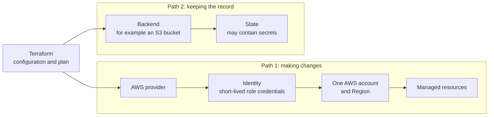

# Terraform on AWS

## Purpose

Use this page to understand where the boundaries are when Terraform manages
AWS infrastructure. After reading it you should be able to answer four
questions before any plan: which plugin is talking to AWS, as whom and where,
about which resources, and where the record of those resources is kept.

The page builds on [Terraform fundamentals](../terraform/fundamentals/terraform-fundamentals.md)
and does not repeat the plan and apply model. It creates nothing in AWS and
needs no credentials.

## What "Terraform on AWS" is made of

Terraform itself knows nothing about AWS. Four separate things combine:

| Part | Simple definition | What it decides |
| --- | --- | --- |
| AWS provider | The plugin that turns Terraform resource declarations into AWS API calls. | Which resource types exist and how they behave. |
| Identity, account, and region | The credentials the provider uses, the AWS account they belong to, and the AWS Region the calls go to. | Whose permissions apply, who is billed, and where resources are created. |
| Resources | The AWS objects that the configuration declares, such as a network or a bucket. | What exists in AWS. |
| Backend | The place Terraform stores its state. | Whether Terraform can find, share, and protect its record of those resources. |

The first three describe where changes are made. The backend describes where
the memory of those changes is kept. They are configured separately, and they
can point at different accounts or Regions.

## Why it matters

Most serious Terraform-on-AWS mistakes are boundary mistakes, not syntax
mistakes: a correct configuration applied with the wrong account's
credentials, resources created in an unintended Region, or a state file that
two people wrote at once.

AWS resources also cost money from the moment they exist, and some are slow or
impossible to recover once deleted. The boundaries are where those
consequences are decided.

## Visual: two separate paths



Text alternative: Terraform, holding the configuration and plan, connects to
two separate paths. Path 1 makes changes: the AWS provider uses an identity
with short-lived role credentials to act on one AWS account and Region, where
the managed resources live. Path 2 keeps the record: a backend, for example an
S3 bucket, holds the state, which may contain secrets. The two paths do not
connect to each other in the diagram, because they are configured and
protected separately.

## Boundary 1: the AWS provider

A provider is a plugin. The AWS provider supplies the AWS resource types and
makes the API calls. Its configuration can come from several places, applied
in a documented order: parameters in the provider block, then environment
variables, then shared credentials and configuration files, then container or
instance credentials.[^terraform-aws-provider]

That order is why the same configuration can behave differently on two
machines. What is set in a shell or a pipeline can decide which credentials
and Region are used when the provider block does not.

The provider documentation warns against hard-coding credentials in
configuration, because they can leak if the file is ever
committed.[^terraform-aws-provider]

## Boundary 2: identity, account, and region

**Identity.** AWS's own guidance is that workloads should use temporary
credentials from IAM roles, and that permissions should follow least
privilege.[^aws-iam-best-practices] For Terraform this means the role used to
apply should be able to manage the resource types in that configuration and
little else. A role with administrator access turns every mistake in a plan
into a possible account-wide mistake.

**Account.** Credentials belong to one AWS account, and nothing in a resource
declaration says which account it is meant for. The provider offers an
`allowed_account_ids` setting that lists the accounts the configuration may be
used with, to prevent mistakenly using the wrong one.[^terraform-aws-provider]

**Region.** Most AWS resources are created in one Region, and the provider
configuration selects it. Pointing at the wrong Region is often not an error.
Terraform may simply propose creating the resources again in that Region,
because it does not find the existing ones there.

Short-lived credentials in pipelines are covered in [GitHub Actions with
Terraform](github-actions-with-terraform.md) and [AWS OIDC federation](../git/github-actions/aws-oidc-federation.md).

## Boundary 3: the resources

Resources are the part everyone looks at, so this page says least about them.
Two points belong to the boundary view:

- **An apply can start resource charges.** A plan does not carry out its
  proposed resource changes, but planning can still use a paid remote service
  or backend and read provider data. An apply that creates billable resources
  can start charges that continue while those resources exist. [Cost
  allocation basics](../finops/cost-allocation-basics.md) covers ownership
  and tagging.
- **Some changes replace or destroy.** A plan line that replaces a database or
  deletes a bucket may not be recoverable from Terraform alone. Recovery then
  depends on backups and provider-side protection you arranged earlier.

## Boundary 4: the backend and its state

A backend determines where state is stored. The default is a local file on
disk.[^terraform-backends] For anything shared, teams use a remote backend,
and on AWS that is commonly the S3 backend, which stores the state as an
object in a bucket.[^terraform-s3-backend]

Three things about the S3 backend are easy to get wrong:

- **Locking is opt-in.** The S3 backend documentation describes state locking
  as an opt-in feature. It is enabled with the `use_lockfile` argument, which
  defaults to `false`. DynamoDB-based locking is deprecated and will be
  removed in a future minor version; the documentation keeps it only to
  support migration.[^terraform-s3-backend] Storing state in S3 does not by
  itself stop two runs from writing at once.
- **Locking only helps when the backend provides it.** Terraform locks state
  for write operations if the backend supports it, and stops if it cannot
  acquire the lock.[^terraform-state-locking]
- **Recovery depends on the bucket.** The documentation highly recommends
  enabling bucket versioning, so that state can be recovered after accidental
  deletion or human error. Server-side encryption of the state is an optional
  backend setting.[^terraform-s3-backend]

State is also sensitive. With a remote backend, Terraform does not keep state
on local disk in normal operation, which the documentation calls a major
benefit when state contains sensitive values.[^terraform-backends] The bucket
then becomes the thing to protect: whoever can read it can read the state.

The identity needs permissions on the backend that are separate from its
permissions on resources. For the S3 backend these are permissions to list
the bucket and to read and write the state object, plus read, write, and
delete on the lock file when lock files are used.[^terraform-s3-backend] See
[Terraform state management](../terraform/fundamentals/state-management.md).

## Example: the same configuration, the wrong account

This example is illustrative. The team, account numbers, and outcomes are
invented, and nothing was run or created. `111111111111` and `222222222222`
are placeholder account numbers.

A team keeps a sandbox account, `111111111111`, and a production account,
`222222222222`. The `bookings` network configuration is meant for the
sandbox. Its provider settings look like this:

```hcl
provider "aws" {
  region              = "eu-west-1"
  allowed_account_ids = ["111111111111"]
}
```

What it declares: the Region to use, and the only account this configuration
may be used with. It contains no credentials; those come from the environment
the command runs in.

An engineer who was working in production an hour ago runs a plan without
switching credentials.

| Setup | What happens | Why |
| --- | --- | --- |
| With `allowed_account_ids`, as above | The provider refuses to continue. | The credentials belong to `222222222222`, which is not in the allowed list. |
| Without `allowed_account_ids`, state stored locally in the working directory | The plan proposes changes against the production account, judged against a state that describes the sandbox. | Nothing ties the configuration, the state, and the account together. |
| Without the guard, and the engineer applies | Sandbox-style resources are created or changed in production, and billing starts there. | An apply does what the plan says, in whichever account the credentials reach. |

What to notice: the configuration was identical in all three rows. The
outcome was decided by identity and by the backend, the two boundaries that do
not appear in a code review of resource blocks.

## Trade-offs and failure boundaries

- **Narrow permissions cost effort.** A least-privilege role has to be
  updated when the configuration starts managing a new resource type. The
  alternative is a role that can do far more than any plan needs.
- **One state per account and environment limits the blast radius.** It also
  means more backends to configure and protect.
- **Losing state does not delete resources.** The resources keep running and
  keep costing money, and Terraform no longer knows they are its own.
  Bucket versioning is what makes this recoverable.
- **Destroy is as real as apply.** Removing resources through Terraform
  deletes them in AWS. Check the account and Region before a destroy with the
  same care as before an apply.

## Check your understanding

- The provider block sets no credentials. Where do they come from, and why can
  that differ between a laptop and a pipeline?
- State is stored in an S3 bucket. Is it locked during an apply? What
  determines the answer?
- In the example, why did the plan look wrong only in the second row, and what
  would have stopped it earlier?
- The state file is deleted by accident. What happens to the AWS resources,
  and what makes recovery possible?

## Next steps

- The model underneath: [Terraform fundamentals](../terraform/fundamentals/terraform-fundamentals.md).
- Backends, locking, and sensitive state: [Terraform state management](../terraform/fundamentals/state-management.md).
- Reviewing a plan before apply: [core Terraform workflow](../terraform/commands/core-workflow.md).
- Running this in a pipeline: [GitHub Actions with Terraform](github-actions-with-terraform.md).
- How AWS trusts external identities: [IAM OIDC provider and STS web identity](../cloud/aws/security/iam-oidc-provider-and-sts-web-identity.md).
- A different model for the same goal: [Crossplane on AWS](crossplane-on-aws.md).

## Official documentation for deeper study

- Provider configuration, credential sources, and `allowed_account_ids`: [Terraform Registry - AWS Provider](https://registry.terraform.io/providers/hashicorp/aws/latest/docs).
- State storage, `use_lockfile`, versioning, and required permissions: [Terraform - S3 backend](https://developer.hashicorp.com/terraform/language/backend/s3).
- What a backend is: [Terraform - Backends](https://developer.hashicorp.com/terraform/language/state/backends).
- How locking behaves: [Terraform - State locking](https://developer.hashicorp.com/terraform/language/state/locking).
- Temporary credentials and least privilege: [AWS IAM - Security best practices](https://docs.aws.amazon.com/IAM/latest/UserGuide/best-practices.html).

## Related links

- [Terraform AWS provider documentation](https://registry.terraform.io/providers/hashicorp/aws/latest/docs)
- [Terraform index](../terraform/index.md)
- [AWS index](../cloud/aws/index.md)
- [GitHub Actions with Terraform](github-actions-with-terraform.md)
- [Back to cross-topic guides](index.md)
- [Back to knowledge index](../index.md)

[^terraform-aws-provider]: [Terraform Registry - AWS Provider documentation](https://registry.terraform.io/providers/hashicorp/aws/latest/docs), source record `terraform-aws-provider`.
[^terraform-s3-backend]: [Terraform - S3 backend](https://developer.hashicorp.com/terraform/language/backend/s3), source record `terraform-s3-backend`.
[^terraform-backends]: [Terraform - Backends, state storage and locking](https://developer.hashicorp.com/terraform/language/state/backends), source record `terraform-backends`.
[^terraform-state-locking]: [Terraform - State locking](https://developer.hashicorp.com/terraform/language/state/locking), source record `terraform-state-locking`.
[^aws-iam-best-practices]: [AWS IAM User Guide - Security best practices in IAM](https://docs.aws.amazon.com/IAM/latest/UserGuide/best-practices.html), source record `aws-iam-best-practices`.
