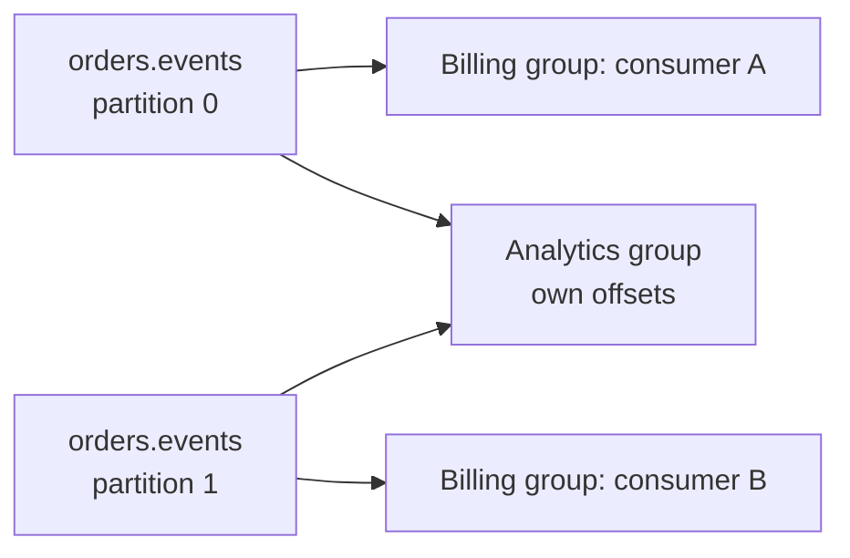

# Kafka consumer groups, lag, and replay

## The idea in plain language

A **consumer group** is one application reading a Kafka topic, possibly
through several consumer processes. Kafka assigns each topic partition to
one member of that group at a time. A different group has its own reading
position and can read the same stored events independently.[^kafka-design]

Imagine two teams reading several numbered paper strips. Members of one
team split the strips so they do not each read the same strip, while a
second team can read all the strips for its own job. Each team keeps a
bookmark per strip. The analogy has limits: real assignments change when
members join or leave, old events may expire, and a bookmark says where
the reader intends to resume, not whether a payment or email succeeded.

Read [Kafka fundamentals](fundamentals.md) first if producer, topic,
partition, or offset is new. This page starts with their relationship.

## Follow one group's assignment

Text alternative: the `orders.events` topic has two partitions. Within the
billing group, consumer A reads partition `0` and consumer B reads partition
`1`. A separate analytics group reads both partitions with its own offsets.
The assignment is illustrative and may change. The diagram explains why
adding a third billing consumer does not create a third partition or make
these two partitions process three ways at once.[^kafka-design]

An **offset** identifies a position in one partition. A group stores
committed offsets to remember where it should resume. If a billing member
stops, another member can take its partition after assignment changes;
the new member's starting point depends on the committed position and the
consumer's configuration. Work done in an external system may not match
that position after a crash.[^kafka-design]

## What lag measures

**Consumer lag** compares a group's committed position with the end of a
partition's log. Apache Kafka's consumer-group tool shows the committed
offset, log-end offset, and lag for each partition.[^kafka-ops]

Suppose an illustrative row shows `CURRENT-OFFSET 91`, `LOG-END-OFFSET
100`, and `LAG 9` for one partition. The group is nine offset positions
behind the log end in that snapshot. This is invented output, not a real
cluster measurement. It does **not** establish that exactly nine business
orders remain unpaid: records may not map one-to-one to business actions,
and a committed offset does not prove an external side effect succeeded.

| Lag pattern | First question |
| --- | --- |
| All partitions fall behind | Are incoming events faster than processing or a shared dependency? |
| One partition falls behind | Is one key or partition carrying more work, or is its consumer stalled? |
| Lag remains after adding members | Are there more members than partitions, or is processing blocked elsewhere? |

These are hypotheses to investigate, not diagnoses. For one topic in a
traditional group, useful partition parallelism cannot exceed its
partition count. More members can be idle; a single hot partition still
has one active member in that group.[^kafka-design]

## Why replay needs care

**Replay** means reading retained events again from an earlier position.
Kafka lets a consumer move its position backward, but it does not undo
the effects of the first read in a database, payment provider, or email
service.[^kafka-design]

For the invented billing group, replaying `OrderPaid` might rebuild a
report, or it might charge a customer twice if the consumer repeats a
payment action without an idempotency check. Before an offset reset, decide
which topic and group are in scope, confirm that the needed events still
exist, stop active members when resetting the group's committed offsets,
and decide how downstream effects will be handled. Kafka's operations
guide documents the reset tool and requires inactive consumer instances
for a group reset.[^kafka-ops]

Retention sets another boundary: a reset cannot recover events already
removed by the topic's retention or compaction policy.[^kafka-topic-configs]
For the processing and duplicate-effect boundary, continue to [delivery
guarantees and failure
handling](delivery-guarantees-and-failure-handling.md). For the actual
version-specific command, use [Kafka basic operations](https://kafka.apache.org/41/operations/basic-kafka-operations/)
with the running cluster's version and authorization.

## Check your understanding

- Why can two billing consumers divide two partitions while analytics
  reads the same topic independently?
- What does a lag value tell you, and what business outcome does it not prove?
- Why can moving a group offset backward repeat an external side effect?

## Official documentation for deeper study

- [Kafka 4.1 design](https://kafka.apache.org/41/design/design/) explains
  partition assignment, offsets, and replay semantics.
- [Kafka 4.1 basic operations](https://kafka.apache.org/41/operations/basic-kafka-operations/)
  explains how to inspect group position and reset offsets.
- [Kafka 4.1 topic configuration](https://kafka.apache.org/41/configuration/topic-configs/)
  explains the retention and compaction boundary.

Next, use [Kafka operations](operations.md) for health signals, or return
to the [Kafka index](index.md).

[^kafka-design]: [Apache Kafka 4.1: Design](https://kafka.apache.org/41/design/design/).
[^kafka-ops]: [Apache Kafka 4.1: Basic Kafka Operations](https://kafka.apache.org/41/operations/basic-kafka-operations/).
[^kafka-topic-configs]: [Apache Kafka 4.1: Topic Configs](https://kafka.apache.org/41/configuration/topic-configs/).
