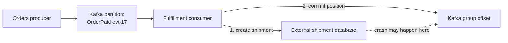

# Kafka delivery guarantees and failure handling

## Start with the outcome, not the label

An event reaching Kafka, a consumer reading it, and a business action
finishing are **three different outcomes**. Kafka's at-most-once,
at-least-once, and exactly-once terms describe specific delivery and
processing boundaries. They do not by themselves prove that an external
database, shipping service, or email provider performed one action exactly
once.[^kafka-design]

| Delivery label | What it can mean for the consumer's work |
| --- | --- |
| At most once | Commit progress before work; a crash can skip the work. |
| At least once | Finish work before committing; a crash can repeat the work. |
| Exactly once | Under Kafka's transaction conditions, a Kafka output and consumed offset can commit together; this does not include an unrelated external effect.[^kafka-design] |

If partitions and offsets are new, read [Kafka fundamentals](fundamentals.md)
and [consumer groups, lag, and replay](consumer-groups-lag-and-replay.md)
first. Here the reader outcome is to spot the failure window, then choose
what must be safe to repeat.

## One event through the boundary

Suppose an invented `OrderPaid` event has `eventId: evt-17` and
`orderId: order-42`. A fulfillment consumer creates a shipment in a
separate database, then commits its Kafka offset. In this **illustrative
sequence**, one paid order should create one shipment.

Text alternative: the producer publishes `evt-17` to a Kafka partition. The
fulfillment consumer reads it, creates a shipment in an external database,
then commits its Kafka group position. The dotted line marks the interval
after the database effect but before the offset commit; a crash there can
cause the event to be read again. Kafka does not make that database write
and offset commit one transaction.[^kafka-design]

Think of an offset as a bookmark in a numbered work queue. If you mark the
page *before* doing the job, a crash can skip the job. If you do the job
*before* marking the page, a crash can make you do it again. The analogy
stops at Kafka's partitions, retained records, group reassignments, and
producer transactions; the bookmark is not evidence of a shipment.

| Order of actions | Crash window | Business risk |
| --- | --- | --- |
| Commit offset, then create shipment | After commit, before shipment. | Restart may skip a shipment that never happened. |
| Create shipment, then commit offset | After shipment, before commit. | Restart can read `evt-17` again and request a duplicate shipment. |
| Make shipment creation repeat-safe, then commit | The event may still replay. | Repeating it finds the existing result instead of making another shipment, if the deduplication rule and write are correctly coordinated. |

The consumer's **current position** advances as it polls, while its
**committed position** is what it resumes from after a failure. The Kafka
client supports automatic or application-controlled offset commits, so the
processing order must match the chosen client and error
path.[^kafka-consumer-api]

For the invented one-shipment-per-order rule, a unique `orderId` in the
shipment database can reject a second shipment request. Another design
records `eventId` as processed in the **same database transaction** as the
business change. A processed-ID record written separately *before* the
shipment would simply create another loss window. If the effect is an
external API call, use that provider's documented idempotency mechanism or
reconcile the outcome; a local offset commit cannot make an unrelated API
transactional. These are design examples, not a tested implementation.

## The producer has a different retry boundary

The producer can retry a send whose result is uncertain. In Kafka 4.1,
`acks=all` waits for in-sync replica acknowledgements, while
`enable.idempotence=true` prevents the producer's own retries from writing
another copy of the same record when its required settings are satisfied.
Idempotence is enabled by default unless conflicting settings disable it.
The durability of `acks=all` also depends on the topic's replication and
minimum in-sync replica settings.[^kafka-producer-configs][^kafka-topic-configs]

That protection does **not** recognize a new application-level send of the
same business event, and the producer API limits its idempotence guarantee
to one producer session.[^kafka-producer-api] Nor can Kafka settings alone
make an application's database commit and event publication atomic. When a
service must save an order change and later publish its event, a
transactional outbox writes both the change and an outbox row in one local
database transaction; a separate publisher or change-data-capture connector
then publishes the row. Debezium documents one such outbox
route.[^debezium-outbox] The publisher and downstream consumers still need a plan
for repeated delivery.

## When processing fails repeatedly

First separate a **transient failure** (for example, a dependency briefly
unavailable) from a record that consistently fails (for example, a format
the consumer cannot read). A consumer design may retry with backoff and a
bounded attempt count, then move an unresolved record to a restricted
quarantine or dead-letter topic for inspection. This is an **application
pattern**, not a Kafka broker guarantee. A separate retry topic can also
change when records are processed relative to later events, so document
whether per-key order matters before choosing it.

Do not treat a dead-letter topic as successful processing. It needs an
owner, a repair or replay path, retention, and access controls suitable for
the original payload. Otherwise the queue can hide a failed business
outcome while consumer lag appears healthy. See [Kafka operations](operations.md)
for signals that separate broker progress from the user outcome.

## Where “exactly once” applies

Kafka transactions can put output records and consumed offsets in one
Kafka transaction for a read-process-write flow between Kafka topics;
consumers that should hide aborted transactions use `read_committed`
isolation. Kafka's design documentation says an external destination needs
cooperation with that destination for an equivalent end-to-end
outcome.[^kafka-design] For `evt-17`, the shipping database is outside the Kafka
transaction. Call the result **repeat-safe shipping** only after testing
the database or provider rule across retries and crashes.

## Check your understanding

1. What can happen if the consumer commits the offset before creating the
   shipment and then crashes?
2. Why can `evt-17` appear again after the shipment was created?
3. Which duplicate does producer idempotence address, and which duplicate
   does it leave to the application?
4. Why does a Kafka topic-to-topic transaction not prove that an external
   shipping request happened exactly once?

## Official documentation for deeper study

- [Kafka 4.1 design](https://kafka.apache.org/41/design/design/) explains
  delivery semantics, offset commits, and transaction scope.
- [Kafka 4.1 producer configurations](https://kafka.apache.org/41/configuration/producer-configs/)
  documents acknowledgements, retries, and idempotence conditions.
- [KafkaConsumer API](https://kafka.apache.org/41/javadoc/org/apache/kafka/clients/consumer/KafkaConsumer.html)
  documents current and committed positions.
- [Debezium Outbox Event Router](https://debezium.io/documentation/reference/stable/transformations/outbox-event-router.html)
  documents one implementation of the outbox pattern.

Continue with [consumer groups, lag, and replay](consumer-groups-lag-and-replay.md)
or return to the [Kafka index](index.md).

## Review boundary

The earlier version recorded a source review on 2026-09-19 and a static
syntax check of a Python example. That example is no longer on this page.
This rewrite was checked against the cited upstream documentation, but no
Kafka broker, external shipment database, crash sequence, or reader test
was run. The existing `stale_after` date is a review trigger, not proof that
the current explanation is verified. The page remains `draft`.

[^kafka-design]: [Apache Kafka 4.1: Design](https://kafka.apache.org/41/design/design/).
[^kafka-producer-configs]: [Apache Kafka 4.1: Producer Configs](https://kafka.apache.org/41/configuration/producer-configs/).
[^kafka-topic-configs]: [Apache Kafka 4.1: Topic Configs](https://kafka.apache.org/41/configuration/topic-configs/).
[^kafka-producer-api]: [Apache Kafka 4.1: KafkaProducer API](https://kafka.apache.org/41/javadoc/org/apache/kafka/clients/producer/KafkaProducer.html).
[^kafka-consumer-api]: [Apache Kafka 4.1: KafkaConsumer API](https://kafka.apache.org/41/javadoc/org/apache/kafka/clients/consumer/KafkaConsumer.html).
[^debezium-outbox]: [Debezium: Outbox Event Router](https://debezium.io/documentation/reference/stable/transformations/outbox-event-router.html).
