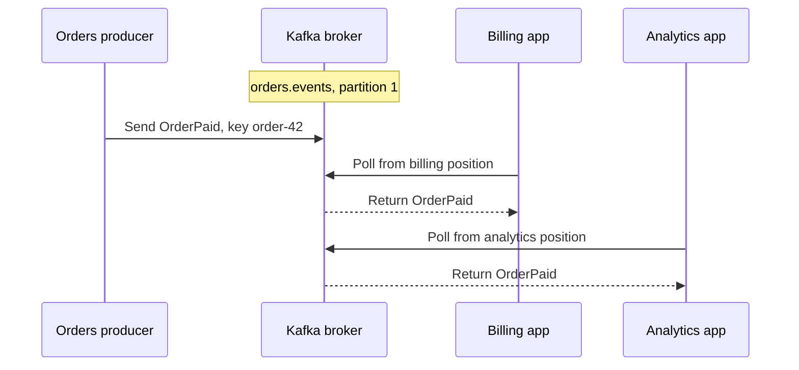

# Kafka fundamentals

## The idea in plain language

**Apache Kafka is a system for publishing, storing, and reading streams of
events.** An *event* is a record that something happened, such as "order
42 was paid." A **producer** writes an event; a **consumer** reads it.
Kafka stores events in named **topics** so several consumers can react to
the same event without the producer sending a separate copy to each
one.[^kafka-intro]

Think of a shared notice board. A writer posts a numbered notice, and
several teams keep their own place in the sequence. The analogy has limits:
Kafka has multiple ordered partitions rather than one global notice list;
old notices can expire or be compacted; and seeing a notice does not prove
that a team completed the work it triggered.

## The parts of one path

| Part | Simple meaning | Question it answers |
| --- | --- | --- |
| Producer | Client that writes an event. | Who published this fact? |
| Topic | Named stream of related events. | Where do readers find it? |
| Key | Optional value commonly used to choose a partition. | Which related events should stay together? |
| Partition | One ordered slice of a topic. | Which events have a shared order? |
| Broker | Kafka server that stores and serves partition copies. | Which server holds the data? |
| Replica and leader | Copies of a partition can live on several brokers; one leader takes writes. | What can remain available if a broker fails? |
| Consumer group | Readers that divide a topic's partitions among themselves. | Which application is reading independently? |
| Offset | Number assigned to a record within one partition. | Where is this record? |
| Committed offset | A group's saved next position in a partition. | Where should this group resume? |

A topic may have several partitions on brokers. Events are appended to a
partition; order is defined **inside that partition**, not across an
entire multi-partition topic. A topic's replication factor determines
how many brokers hold a copy of each partition. The leader handles
writes; an in-sync replica can take over after a failure. In the consumer
group model shown here, one member reads a given partition at a time.
A different group can read that same partition independently.
[^kafka-intro][^kafka-design]

Consumers **poll** brokers for records when they are ready. The broker
does not push events to an idle consumer; a stopped consumer falls
behind while the topic continues receiving events.[^kafka-design]

Text alternative: an orders producer sends an event with key `order-42`
to one partition of `orders.events`, which a broker stores. The billing
and analytics consumers belong to separate groups. A billing consumer
polls the broker and receives it. A separate analytics consumer
polls the same broker and receives the same stored event. Each group's
consumer has its own reading position, and each group has a separate
committed position for that partition. Billing reading an event does
not prevent analytics from reading it too. The partition number
and group names are illustrative. The broker does not push records to
idle consumers.[^kafka-design]

## Follow an illustrative event

Suppose an online shop publishes `OrderPaid` for `order-42`. This is an
invented example, not a Kafka run. The producer sends a key such as
`order-42` and a value containing the fact that the order was paid. With
the usual key-based partition choice, events for the same key go to the
same partition while all producers use the same partitioner and the
topic's partition count stays the same. Adding partitions can change
which partition a key maps to.[^kafka-intro][^kafka-design]

1. The broker leading the partition chosen by the producer appends the
   event and gives it an offset within that partition.
2. The billing group reads it and may update a billing view. The analytics
   group can read the same stored event for a different purpose.
3. Each group tracks its own position. Reading an event does **not** delete
   it from the topic.[^kafka-intro][^kafka-design]

For a partition, distinguish a consumer's current position from its
group's committed position. The **current position** says which record
that consumer will receive next;
polling advances it. The **committed position** is the saved point used
after a restart or reassignment. For example, if the consumer receives
records at offsets 0 and 1, its current position may be 2 while its
last committed position, saved before this poll, is still 0. A crash
then lets the group read those records again. This example assumes no
later commit and that the records remain available.[^kafka-consumer-api]

A commit saves the **next** position to read, not proof that the last
record's business action finished. The application chooses when that
save is safe; automatic and manual commit settings can behave
differently.[^kafka-consumer-api]

Neither position proves that a side effect succeeded. A consumer can
fail before or after saving progress; the result depends on its
processing and commit order. A reader may need to handle a repeated
event safely. See [delivery guarantees and failure handling](delivery-guarantees-and-failure-handling.md)
before assuming exactly-once effects.

## Three limits beginners should remember

| Misunderstanding | More accurate model |
| --- | --- |
| "The whole topic is in one order." | Each partition is ordered; there is no single order across partitions. |
| "The event disappears when one app reads it." | Groups read independently; retention or compaction controls how long data stays. |
| "More brokers mean no data can be lost." | Stored durability depends on replication, in-sync replicas, and producer acknowledgments. Consumer commit order separately affects skipped or repeated application work. |

Kafka retains events independently of whether a group has read them.
With the delete policy, old segments expire by time or size even if a
slow group never caught up. With compaction, Kafka keeps the latest
value for each key while older values may be removed. A replay plan
must check which records still exist before resetting a position.
[^kafka-intro][^kafka-topic-configs]

## Check your understanding

- Why can billing and analytics both read `OrderPaid` without the producer
  sending two separate events?
- Where is ordering guaranteed when a topic has multiple partitions?
- Why does an offset not prove that an external payment or database update
  succeeded?

## Official documentation for deeper study

- [Apache Kafka introduction](https://kafka.apache.org/intro/) explains
  events, topics, partitions, producers, and consumers.
- [Kafka 4.3 design](https://kafka.apache.org/43/design/design/) explains
  consumer-group assignment, offsets, and processing guarantees.
- [Kafka 4.3 topic configuration](https://kafka.apache.org/43/configuration/topic-configs/)
  documents retention and compaction settings.
- [Kafka consumer API](https://kafka.apache.org/43/javadoc/org/apache/kafka/clients/consumer/KafkaConsumer.html)
  distinguishes the current position from the committed position.

Next, read [topic and event design](topic-and-event-design.md) for key and
contract choices, [consumer groups, lag, and
replay](consumer-groups-lag-and-replay.md) for reader progress, or return
to the [Kafka index](index.md).

[^kafka-intro]: [Apache Kafka: Introduction](https://kafka.apache.org/intro/).
[^kafka-design]: [Apache Kafka 4.3: Design](https://kafka.apache.org/43/design/design/).
[^kafka-topic-configs]: [Apache Kafka 4.3: Topic Configs](https://kafka.apache.org/43/configuration/topic-configs/).
[^kafka-consumer-api]: [Apache Kafka 4.3: KafkaConsumer API](https://kafka.apache.org/43/javadoc/org/apache/kafka/clients/consumer/KafkaConsumer.html).
