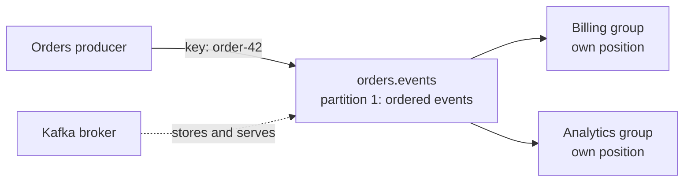

# Kafka fundamentals

## The idea in plain language

**Apache Kafka is a system for publishing, storing, and reading streams of
events.** An *event* is a record that something happened, such as "order
42 was paid." A **producer** writes an event; a **consumer** reads it.
Kafka stores events in named **topics** so several consumers can react to
the same event without the producer sending a separate copy to each
one.[^kafka-intro]

Think of a shared notice board. A writer posts a numbered notice, and
several teams keep their own place in the sequence. The analogy has limits:
Kafka has multiple ordered partitions rather than one global notice list;
old notices can expire or be compacted; and seeing a notice does not prove
that a team completed the work it triggered.

## The parts of one path

| Part | Simple meaning | Question it answers |
| --- | --- | --- |
| Producer | Client that writes an event. | Who published this fact? |
| Topic | Named stream of related events. | Where do readers find it? |
| Partition | One ordered slice of a topic. | Which events have a shared order? |
| Broker | Kafka server that stores and serves partitions. | Where is a slice held? |
| Consumer group | Readers that divide a topic's partitions among themselves. | Which application is reading independently? |
| Offset | A position within one partition. | How far has this reader progressed? |

A topic may have several partitions on brokers. Events are appended to a
partition; order is defined **inside that partition**, not across an entire
multi-partition topic. Within a traditional consumer group, one member
reads a given partition at a time. A different group can read that same
partition independently.[^kafka-intro][^kafka-design]

Text alternative: an orders producer sends an event with key `order-42`
to one partition of `orders.events`. A broker stores that partition.
Billing and analytics are separate consumer groups, each with its own
reading position. The diagram explains why billing reading an event does
not prevent analytics from reading it too. The partition number and group
names are illustrative.

## Follow an illustrative event

Suppose an online shop publishes `OrderPaid` for `order-42`. This is an
invented example, not a Kafka run. The producer sends a key such as
`order-42` and a value containing the fact that the order was paid. With
the usual key-based partition choice, events for the same key go to the
same partition while that partitioning scheme remains in place.[^kafka-intro]

1. Kafka appends the event to its chosen partition and gives it an offset
   within that partition.
2. The billing group reads it and may update a billing view. The analytics
   group can read the same stored event for a different purpose.
3. Each group tracks its own position. Reading an event does **not** delete
   it from the topic.[^kafka-intro][^kafka-design]

An offset is a position, not evidence that a side effect succeeded. A
consumer can fail after reading and before or after recording progress;
the result depends on its processing and offset-commit design. A reader
may need to handle a repeated event safely. See [delivery guarantees and
failure handling](delivery-guarantees-and-failure-handling.md) before
assuming exactly-once effects.

## Three limits beginners should remember

| Misunderstanding | More accurate model |
| --- | --- |
| "The whole topic is in one order." | Each partition is ordered; there is no single order across partitions. |
| "The event disappears when one app reads it." | Groups read independently; retention or compaction controls how long data stays. |
| "More brokers mean no data can be lost." | Replication and producer/consumer settings affect durability; inspect the configured path. |

Kafka can retain events after they are read, which permits another group or
the same group to read an earlier part again. That ability has a boundary:
topic retention can remove old segments, and compacted topics keep a
different history. A replay plan must check what events still exist before
resetting a position.[^kafka-intro][^kafka-topic-configs]

## Check your understanding

- Why can billing and analytics both read `OrderPaid` without the producer
  sending two separate events?
- Where is ordering guaranteed when a topic has multiple partitions?
- Why does an offset not prove that an external payment or database update
  succeeded?

## Official documentation for deeper study

- [Apache Kafka introduction](https://kafka.apache.org/intro/) explains
  events, topics, partitions, producers, and consumers.
- [Kafka 4.1 design](https://kafka.apache.org/41/design/design/) explains
  consumer-group assignment, offsets, and processing guarantees.
- [Kafka 4.1 topic configuration](https://kafka.apache.org/41/configuration/topic-configs/)
  documents retention and compaction settings.

Next, read [topic and event design](topic-and-event-design.md) for key and
contract choices, [consumer groups, lag, and
replay](consumer-groups-lag-and-replay.md) for reader progress, or return
to the [Kafka index](index.md).

[^kafka-intro]: [Apache Kafka: Introduction](https://kafka.apache.org/intro/).
[^kafka-design]: [Apache Kafka 4.1: Design](https://kafka.apache.org/41/design/design/).
[^kafka-topic-configs]: [Apache Kafka 4.1: Topic Configs](https://kafka.apache.org/41/configuration/topic-configs/).
