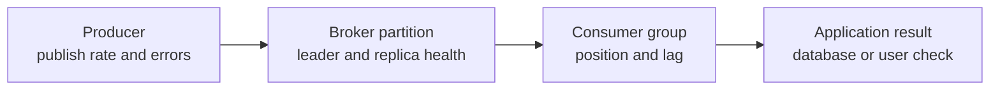

# Kafka operations

## The idea in plain language

When a Kafka-backed feature is late or missing, find **which part of the
path stopped moving**. A producer sends an event, a broker stores it in a
topic partition, a consumer reads it, and the application may write to a
database or call another service. One healthy metric along that path does
not prove the user-facing job finished.

Think of a delivery line: items arrive, are shelved, are picked up, and
are used at the destination. A growing pickup backlog points you toward
the pickup side, but it does not say *why* pickup slowed. The analogy ends
at business correctness: a consumer can advance its position even if an
external side effect failed, depending on how it commits offsets.

## Put each signal on the path

Text alternative: records move from producer through a broker partition to
a consumer group and then to an application result. Producer errors,
partition health, group position, and the actual application outcome are
different observations. The diagram helps choose where to look next when
the latest event has not produced its expected effect.

| Observation | What it can suggest | What it cannot prove |
| --- | --- | --- |
| Failed produce requests | A producer or broker write-path problem. | That every successful request reached its business consumer. |
| Offline partitions | A partition has no available leader. | Why the leader became unavailable. |
| Under-replicated partitions | Fewer in-sync replicas than configured. | Immediate data loss or that all client requests fail. |
| Group lag | A group is behind a partition's log end. | How many business actions failed or how long catch-up will take. |
| User-facing check | Whether a chosen action works now. | That every older event or recovery path works. |

Kafka documents failed request, offline partition, under-replicated
partition, and consumer metrics. The group-position tool reports committed
offsets and lag by partition.[^kafka-monitoring][^kafka-ops] These
measurements have different scopes. For example, Kafka's consumer-client
`records-lag-max` metric uses its current position rather than the group's
committed offset; do not assume it is identical to the group tool's lag
column.[^kafka-monitoring]

## One illustrative incident

Suppose `orders.events` has two partitions. Billing group lag rises on
partition `1` but not partition `0`. Broker monitoring shows no offline or
under-replicated partition in this invented snapshot. A billing consumer
reports repeated timeouts from its downstream database. No cluster was
used; these observations are an example of reasoning, not a diagnosis.

The first hypothesis is that this consumer cannot finish work quickly
enough for partition `1`. Check the consumer's errors, assigned partition,
and downstream latency before adding more consumer processes. Within one
traditional group, a partition is assigned to one member at a time;
another member does not make the same hot partition process in parallel.
If the dependency recovers, watch whether the partition's position starts
advancing and whether a known order reaches the expected database
state.[^kafka-design]

If *every* partition's lag rises, investigate a shared dependency,
consumer deployment change, or producer-rate increase. If produce
requests fail or partitions go offline, inspect broker and cluster health
first. These are first checks, not universal cause-and-effect rules.

## Decide what is actually recovered

Before declaring the incident over, compare three kinds of evidence:

1. **Kafka state:** the relevant partitions have leaders and their replica
   state is understood.
2. **Consumer progress:** the intended group is assigned and advancing;
   lag and errors are moving in the expected direction.
3. **Application outcome:** a representative event produced the right
   external result, without an unintended duplicate.

Recovery actions can create new work or data risk. Changing retention,
resetting offsets, or replaying events needs an explicit scope and a plan
for duplicate side effects. See [consumer groups, lag, and
replay](consumer-groups-lag-and-replay.md) for that model and [Kafka basic
operations](https://kafka.apache.org/41/operations/basic-kafka-operations/)
for version-specific procedures.

## Check your understanding

- Why does rising lag on one partition lead to a different first check from
  rising lag on all partitions?
- What can an under-replicated partition tell you, and what cannot it prove?
- Which observation shows that an expected order update actually happened?

## Official documentation for deeper study

- [Kafka 4.1 monitoring](https://kafka.apache.org/41/operations/monitoring/)
  names broker, producer, and consumer signals and their measurement scope.
- [Kafka 4.1 basic operations](https://kafka.apache.org/41/operations/basic-kafka-operations/)
  explains group-position inspection and administrative operations.
- [Kafka 4.1 design](https://kafka.apache.org/41/design/design/) explains
  partition assignment, replicas, and consumer positions.

Start with [Kafka fundamentals](fundamentals.md) if the path is unfamiliar,
or return to the [Kafka index](index.md).

[^kafka-monitoring]: [Apache Kafka 4.1: Monitoring](https://kafka.apache.org/41/operations/monitoring/).
[^kafka-ops]: [Apache Kafka 4.1: Basic Kafka Operations](https://kafka.apache.org/41/operations/basic-kafka-operations/).
[^kafka-design]: [Apache Kafka 4.1: Design](https://kafka.apache.org/41/design/design/).
