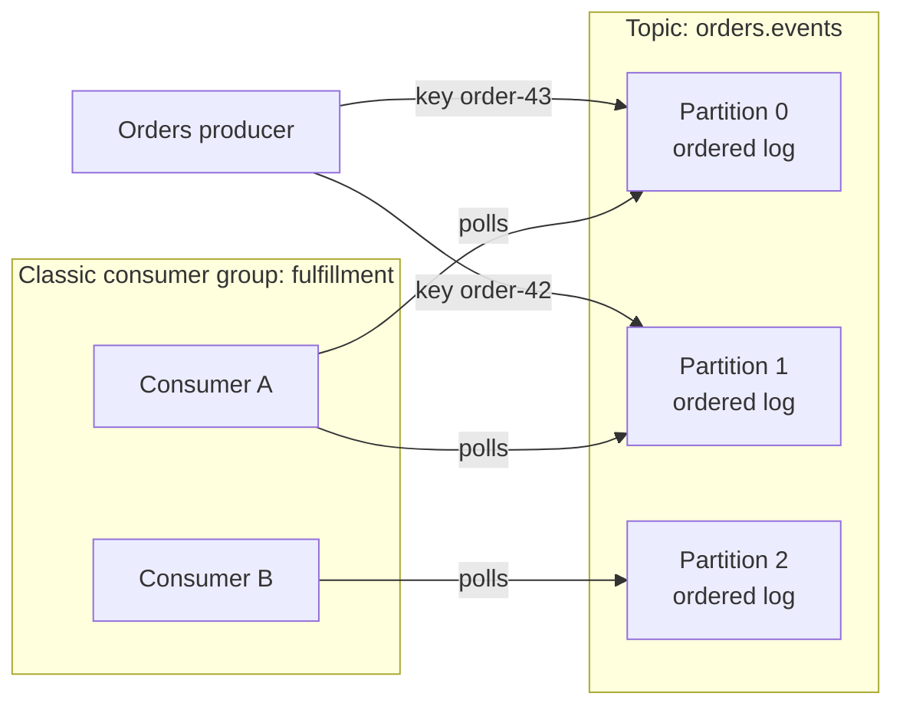

# Topic and event design

## Purpose

Use this page to understand the decisions you make when you design a Kafka
topic and the events in it, and why each decision is hard to change later. It
explains the reasoning; it is not a configuration procedure.

If producers, partitions, and offsets are new to you, read [Kafka
fundamentals](fundamentals.md) first. This page repeats only what the design
decisions depend on.

## What topic and event design is

An **event** is a record that something happened, such as "order `order-42`
was paid". In Kafka a record has a value, a timestamp, an optional key, and
optional headers.[^apache-kafka-introduction] A **topic** is a named stream of
records. This page designs a topic of business-fact events; Kafka can also
carry other kinds of records.

Designing a topic means answering four questions:

1. What is one event? (event boundary)
2. Which events must stay in order relative to each other? (key)
3. How can the event's structure change without breaking readers? (schema)
4. How long are events kept, and what happens when they are read again?
   (retention and replay)

## Why it matters

Producers and consumers in Kafka do not know about each other, and a topic can
have many of each.[^apache-kafka-introduction] That independence is the point
of Kafka, and it is also why design mistakes are expensive: the topic is a
shared contract. Changing the key, the meaning of an event, or its structure
affects every consumer, including ones written by other teams.

## The relationships that design depends on



Text alternative: a producer sends `order-42` events to partition 1 and
`order-43` events to partition 0 of the illustrative `orders.events` topic.
Each partition is an ordered log. In a classic consumer group named
`fulfillment`, consumer A polls partitions 0 and 1, while consumer B polls
partition 2. Kafka does not define which partition A processes first. The
topic name, partition assignment, and key mapping are invented.

Three facts from the Kafka documentation drive the design decisions:

- When producers let the same key-aware partitioner choose a partition from
  the same serialized key and an unchanged partition count, events go to the
  same partition. A consumer
  reads that partition's records in append
  order.[^apache-kafka-introduction][^apache-kafka-producer-configs]
- In a classic consumer group, each partition is assigned to one member at a
  time. A former owner may still be finishing records it already fetched
  during a reassignment.[^apache-kafka-design]
- Events are not deleted when they are read. A per-topic setting decides how
  long they are kept.[^apache-kafka-introduction]

These are **classic consumer groups**, where members divide partitions. Kafka
4.3 also documents share groups, which divide work differently; the
one-member-per-partition rule below concerns classic groups only.
[^apache-kafka-design]

## An analogy: a logbook in several volumes

[Kafka fundamentals](fundamentals.md) compared a topic to a notice board.
For the partition and retention decisions here, picture a more detailed
logbook split into numbered volumes:

- Each **volume** is a partition. New entries are only ever added at the end.
- The **key** helps choose the volume. While the partition count and key
  encoding stay the same, entries about `order-42` go into one volume.
- Each **team of readers** (a consumer group) keeps a bookmark per volume.
- In a classic group, one reader has a volume assigned at a time; several
  volumes let the team divide the work.
- Old pages may be removed by age or size. Compaction instead keeps the
  latest value for each key, rather than a full history.

Where the analogy stops being accurate:

- **There is no page numbering across volumes.** Position numbers restart in
  each volume, so they say nothing about whether an entry in volume 0 came
  before an entry in volume 1.
- **Pages are removed whether or not anyone read them.** Cleanup is about
  age, size, or compaction, not about consumption.
- **A bookmark can be moved backwards on purpose.** Re-reading is a feature,
  and everything the reader did the first time may be done again.
- **Adding a volume changes where keys go.** Entries for an existing key may
  start appearing in a different volume, which the paper picture hides.
- **One volume still needs a correct writer.** Kafka preserves append order;
  it cannot repair business events sent in the wrong order.

## Decision 1: the event boundary

For this business-fact topic, make one event describe one fact that has
already happened, and name it in the past tense: `OrderPlaced`, `OrderPaid`,
`OrderShipped`. Put order events whose relative append order matters in the
same topic and use the same order key. Putting each type in a different topic
cannot provide an order between them.[^apache-kafka-introduction]

A well-bounded event can be understood by a consumer that knows nothing about
the producer's internals. In this example its value carries the order ID,
the business time when the fact occurred, and an event ID. The Kafka record's
timestamp can instead represent producer creation time or broker append
time, depending on configuration, so do not use it as the only business-time
field.[^apache-kafka-topic-configs] The event ID helps consumers recognize a
repeat delivery of that event; a business key such as one shipment per order
is also needed if the same fact is published again with a new event ID.

Signs of a poor boundary:

- One event type whose meaning depends on which optional fields are filled in.
- A command ("please charge this card") labelled as if payment had already
  happened. Commands can be valid Kafka records, but their meaning differs
  from a past-tense business fact.
- A notification that only says "something changed" when consumers need the
  old fact for replay. Small notifications are useful in some designs, but
  they make consumers call another service for the details.

## Decision 2: the key, and what ordering you actually get

Kafka preserves the order in which records are **appended within one
partition**. There is no single order across partitions.[^apache-kafka-introduction][^apache-kafka-design]
The key helps choose which records share a partition; it does not prove the
order in which business facts occurred. If separate services publish
`OrderPaid` and `OrderPlaced`, payment could be appended first even with the
same order key. Have one owner publish the sequence or make consumers handle
out-of-order facts deliberately.

Choose the key by asking: "Which records must share one append order?" For
these order events, the key is the order identifier. Keying by event ID would
scatter one order's records; keying every order by a single shop ID would
crowd them into one busy partition. The key balances per-order grouping
against the ability to spread load.[^apache-kafka-producer-configs]

Three consequences follow:

- **An unsuitable key breaks ordering quietly.** The producing client decides
  which partition each event goes to, either by spreading events for load
  balancing or by a partitioning function based on the
  key.[^apache-kafka-design] If order events had no key, events for one order
  could land in different partitions. Even with the right key, producers must
  publish the order's facts in the intended sequence.
- **Changing the number of partitions later disturbs key ordering.** When
  partitions are added, existing data is not moved, and with hash-based
  partitioning a key can map to a different partition from then on. Kafka also
  does not support reducing a topic's partition count. An old record for a key
  can stay in the former partition while a new one enters a different one, so
  a consumer group has no single order across both.[^apache-kafka-operations]
- **Changing key serialization can have the same effect.** Producers choose a
  partition from the serialized key. Keep the encoding and partitioner stable
  for keys whose history must stay together; a logical `order-42` represented
  by different bytes may map elsewhere.[^apache-kafka-producer-configs]

There is no universally correct partition count. The partition count sets the
upper limit on how many consumers in one classic group can have assigned
partitions and work in parallel.[^apache-kafka-operations] It depends on
event volume, the work consumers do, and what the cluster can operate. Treat
any fixed number you see quoted as a starting assumption to test.

## Decision 3: schema evolution

The event's value has a **schema**: the fields and meanings that a consumer
expects. Producers and consumers may run different versions at the same time,
and replay may expose a new consumer to every older version still retained in
the topic. For a compacted topic, an old value for a key that was never
updated can remain for a long time.[^apache-kafka-design]

There are two directions to check:

- **New reader, old event:** can a newly deployed consumer still read the
  records already stored?
- **Old reader, new event:** can an existing consumer still read what the new
  producer sends?

For example, suppose version 1 of `OrderPaid` has `eventId`, `type`, `orderId`,
and `occurredAt`. Version 2 adds `receiptEmail` with Avro type
`["null", "string"]` and default `null`. The
following table describes **Apache Avro with the writer schema available**;
other formats and reader settings need their own test.[^apache-avro-specification]

| Change | New reader of old events | Old reader of new events | Decision |
| --- | --- | --- | --- |
| Add `receiptEmail` with a reader default | Uses the default when the old writer did not provide the field. | Ignores the new field if its Avro reader schema lacks it. | Check both directions with the deployed schemas. |
| Remove a field | Ignores the old writer's extra field. | Works only if the already deployed old reader schema has a default for the now-missing field; a consumer that relied on its value may still be wrong. | Migrate readers and business logic first. |
| Change a field's meaning | May decode without an error but interpret the value incorrectly. | May do the same. | Use a new field or event type for the new meaning. |

Avro also has format-specific rules for renames and type changes; do not treat
those as universally safe or universally impossible. A strict JSON reader,
for example, may reject an extra field that an Avro reader would ignore.
A reader must know how to decode the writer's bytes before a schema version
inside the value can help. Decide how readers find the writer schema, such as
an agreed header or envelope, and test it with old and new records. Some
platforms provide a separate schema registry. Apache Kafka stores keys and
values as opaque bytes; its broker does not check an application schema or
the business meaning of the payload.[^apache-kafka-messages]

When a change cannot be made compatibly, publish a new event type or topic
and move consumers deliberately. A new topic does not inherit the old topic's
history, and sending to both topics creates two writes that can succeed or
fail separately. Plan that transition and its recovery path.

## Decision 4: retention and replay

A topic keeps events according to its cleanup settings, whether or not any
consumer has read them. With the default `delete` policy, Kafka eventually
discards old log **segments** (files holding ranges of one partition's
records), not individual events, according to
`retention.ms` (seven days by default) or an optional size limit. This is a
replay window, not an exact deletion deadline; segment cleanup can happen
later.[^apache-kafka-topic-configs] `compact` instead removes older values
for a key while retaining its latest value, subject to tombstones: records
with a key and null value that mark deletion of that key.
It suits a "current value per key" topic, not the full event history in
`orders.events`. A topic can also combine both policies.[^apache-kafka-design][^apache-kafka-topic-configs]

Retained history makes **replay** possible. An **offset** identifies a record's
position within one partition. A consumer's current position is the next
offset it will fetch; its group's **committed position** is the next offset
from which it will resume after restart. A consumer can deliberately move
back to an older retained offset and read again.[^apache-kafka-design]
Replay is how you rebuild a derived view, recover from a consumer bug, or start
a new consumer on existing history.

Set retention from the history consumers need and the data rules you must
meet. A consumer cannot rely on events after they have been cleaned up.
If exact removal by a deadline is required, check the whole data-lifecycle
design; `retention.ms` alone is not that guarantee.[^apache-kafka-topic-configs]

Deliberate replay repeats records by choice. Ordinary failure recovery can
repeat them too: if a consumer performs work and then crashes before
committing its position, its replacement resumes from the earlier committed
offset. This process-then-commit order gives **at-least-once processing**.
Committing before work can instead skip work after a crash.[^apache-kafka-design]

> [!IMPORTANT]
> With at-least-once processing, any side effect a consumer performs can happen
> again: a second email, shipment, or database row. Design consumers so
> that repeating an event is harmless. Kafka's exactly-once features cover
> coordinated Kafka read-process-write paths, not an external email or
> shipment by themselves. [Delivery guarantees and failure
> handling](delivery-guarantees-and-failure-handling.md) explains the options.

## Example: order events

This example is illustrative. The topic name, partition numbers, and offsets
are invented to show the behaviour; they are not recorded output.

A shop publishes business-fact events to `orders.events` with the order ID as
the key. The rows are grouped by partition and offset, **not** arranged as a
single timeline across partitions. Two orders are active.

| Partition | Offset | Key | Event ID | Type |
| --- | --- | --- | --- | --- |
| 0 | 31 | order-43 | evt-a31 | `OrderPlaced` |
| 0 | 32 | order-43 | evt-b92 | `OrderCancelled` |
| 1 | 10 | order-42 | evt-k03 | `OrderPlaced` |
| 1 | 11 | order-42 | evt-17 | `OrderPaid` |
| 1 | 12 | order-42 | evt-h41 | `OrderShipped` |

For example, the value of `evt-17` could be represented as readable JSON:

```json
{
  "eventId": "evt-17",
  "type": "OrderPaid",
  "orderId": "order-42",
  "occurredAt": "2026-10-09T10:15:00Z"
}
```

This is an invented sketch, not output from Kafka or an Avro-encoded record.
Event IDs are opaque labels, not a timeline across partitions.
The key is separately `order-42`; `occurredAt` is the business time in the
value, not a promise about the Kafka record timestamp.

What to notice:

- All three `order-42` events are in partition 1 in append order. In this
  invented case, any consumer of that partition sees placed, then paid, then
  shipped. The key grouped them; the producers still had to publish the facts
  in that sequence.
- Consumer A polls both partitions 0 and 1. Kafka promises no order between
  `order-43` at offset 31 and `order-42` at offset 10.
- A fulfillment consumer processes offset 11 (`evt-17`) and creates a shipment,
  but its group's last committed position for partition 1 is still 11. If it
  crashes, the replacement can resume at offset 11 and receive `OrderPaid`
  again. A repeat-safe shipment rule, such as one shipment per order ID,
  prevents another shipment. Checking `evt-17` can also catch a redelivery,
  but a newly published duplicate fact could have a new event ID.
- A new analytics consumer can start from the earliest retained offset and
  read the available history. A compacted topic would not preserve the full
  sequence of past order facts.

## Common misconceptions

- **"A topic is ordered."** A partition is ordered. For a topic with more than
  one partition, the documentation promises no single order.
- **"Once a consumer reads an event, it is gone."** Events stay until
  retention removes them, and other consumer groups read them independently.
- **"Kafka checks my event format."** The broker accepting bytes does not
  show that old and new readers agree on their meaning. Check your format,
  deserializers, and any separate schema tooling in both directions.
- **"Each event is processed exactly once unless something is badly wrong."**
  Repeats are normal with process-then-commit handling. Kafka transactions
  can coordinate Kafka-to-Kafka work, but an external shipment still needs a
  repeat-safe business action.

## Check your understanding

- What does using the order ID as the key guarantee about `OrderPlaced` and
  `OrderPaid` for one order, and what must the producers still ensure?
- Two events have different keys and land in different partitions. What can
  you say about the order in which a consumer group handles them?
- In the Avro example, why can a new reader use `receiptEmail` when it reads
  an old event, and what must an old reader know to ignore the new field?
- A consumer sends a confirmation email for each `OrderShipped` event. What
  can happen after a crash, and what would make it harmless?

**Check your answers:**

1. When producers let a stable key-aware partitioner choose the partition
   from the same serialized key and unchanged partition count, the key groups
   both records into one partition. Kafka
   preserves their append order; producers must still publish them in the
   intended business order.
2. Nothing is promised across those partitions. A consumer assigned both
   can fetch and handle their records in either relative order.
3. The new Avro reader uses its field default when the old writer schema lacks
   `receiptEmail`. An old reader ignores a writer's extra field when Avro
   resolves the writer and reader schemas; a different reader or format may
   reject it.[^apache-avro-specification]
4. The consumer can send the email and crash before committing its next
   offset, then send it again on retry. If the email service supports an
   idempotency key (a key that makes repeated requests count as one), use a
   stable shipment or order key for the send request;
   otherwise plan for duplicate emails. An event ID helps with redelivery but
   not a newly published duplicate fact.

## Next steps

- Review the building blocks in [Kafka fundamentals](fundamentals.md).
- Learn how replay is carried out safely in [consumer groups, lag, and
  replay](consumer-groups-lag-and-replay.md).
- Design for repeats and failures in [delivery guarantees and failure
  handling](delivery-guarantees-and-failure-handling.md).
- Operate topics in [Kafka operations](operations.md).

## Official documentation for deeper study

- Events, topics, partitions, and keys: [Apache Kafka - Introduction](https://kafka.apache.org/intro).
- Delivery semantics, consumer position, and log compaction: [Apache Kafka 4.3 - Design](https://kafka.apache.org/43/design/design/).
- `retention.ms`, `retention.bytes`, and `cleanup.policy`: [Apache Kafka 4.3 - Topic Configs](https://kafka.apache.org/43/configuration/topic-configs/).
- What changing a partition count does: [Apache Kafka 4.3 - Basic Kafka Operations](https://kafka.apache.org/43/operations/basic-kafka-operations/).
- How producer keys choose partitions: [Apache Kafka 4.3 - Producer Configs](https://kafka.apache.org/43/configuration/producer-configs/).
- How Kafka stores opaque keys and values: [Apache Kafka 4.3 - Messages](https://kafka.apache.org/43/implementation/messages/).
- One format's compatibility rules: [Apache Avro specification, Schema Resolution](https://avro.apache.org/docs/1.12.0/specification/).
- Entry point for all versions: [Apache Kafka documentation](https://kafka.apache.org/documentation/).

## Related links

- [Kafka fundamentals](fundamentals.md)
- [Delivery guarantees and failure handling](delivery-guarantees-and-failure-handling.md)
- [Consumer groups, lag, and replay](consumer-groups-lag-and-replay.md)
- [Kafka operations](operations.md)
- [Apache Kafka documentation](https://kafka.apache.org/documentation/)
- [Back to Kafka index](index.md)
- [Back to databases index](../index.md)
- [Back to knowledge index](../../index.md)

[^apache-kafka-introduction]: [Apache Kafka - Introduction](https://kafka.apache.org/intro), source record `apache-kafka-introduction`.
[^apache-kafka-design]: [Apache Kafka 4.3 documentation - Design](https://kafka.apache.org/43/design/design/), source record `apache-kafka-design`.
[^apache-kafka-topic-configs]: [Apache Kafka 4.3 documentation - Topic Configs](https://kafka.apache.org/43/configuration/topic-configs/), source record `apache-kafka-topic-configs`.
[^apache-kafka-operations]: [Apache Kafka 4.3 documentation - Basic Kafka Operations](https://kafka.apache.org/43/operations/basic-kafka-operations/), source record `apache-kafka-operations`.
[^apache-kafka-producer-configs]: [Apache Kafka 4.3 documentation - Producer Configs](https://kafka.apache.org/43/configuration/producer-configs/), source record `apache-kafka-producer-configs`.
[^apache-kafka-messages]: [Apache Kafka 4.3 documentation - Messages](https://kafka.apache.org/43/implementation/messages/), source record `apache-kafka-messages`.
[^apache-avro-specification]: [Apache Avro 1.12.0 specification](https://avro.apache.org/docs/1.12.0/specification/), source record `apache-avro-specification`.
