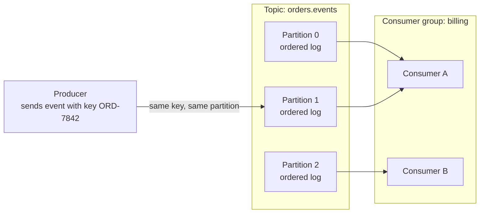

# Topic and event design

## Purpose

Use this page to understand the decisions you make when you design a Kafka
topic and the events in it, and why each decision is hard to change later. It
explains the reasoning; it is not a configuration procedure.

If producers, partitions, and offsets are new to you, read [Kafka
fundamentals](fundamentals.md) first. This page repeats only what the design
decisions depend on.

## What topic and event design is

An **event** is a record that something happened, such as "order ORD-7842 was
paid". In Kafka an event has a key, a value, a timestamp, and optional
headers.[^apache-kafka-introduction] A **topic** is a named stream of events.

Designing a topic means answering four questions:

1. What is one event? (event boundary)
2. Which events must stay in order relative to each other? (key)
3. How can the event's structure change without breaking readers? (schema)
4. How long are events kept, and what happens when they are read again?
   (retention and replay)

## Why it matters

Producers and consumers in Kafka do not know about each other, and a topic can
have many of each.[^apache-kafka-introduction] That independence is the point
of Kafka, and it is also why design mistakes are expensive: the topic is a
shared contract. Changing the key, the meaning of an event, or its structure
affects every consumer, including ones written by other teams.

## The relationships that design depends on

Text alternative: a producer sends an event whose key is `ORD-7842` to the
topic `orders.events`. The topic has three partitions, each an ordered log.
Events with the same key go to the same partition, here partition 1. A
consumer group named `billing` has two consumers; consumer A reads partitions
0 and 1, and consumer B reads partition 2. The topic name, the number of
partitions, and which consumer reads which partition are illustrative.

Three facts from the Kafka documentation drive the design decisions:

- Events with the same key are written to the same partition, and a consumer
  reads a partition's events in the order they were
  written.[^apache-kafka-introduction]
- Within a consumer group, each partition is read by exactly one consumer at a
  time.[^apache-kafka-design]
- Events are not deleted when they are read. A per-topic setting decides how
  long they are kept.[^apache-kafka-introduction]

## Decision 1: the event boundary

Make one event describe one business fact that has already happened, and name
it in the past tense: `OrderPlaced`, `OrderPaid`, `OrderShipped`.

A well-bounded event can be understood by a consumer that knows nothing about
the producer's internals. It carries a stable identifier for the thing it is
about, the time the fact occurred, and an identifier for the event itself. The
event identifier matters later, because consumers use it to recognize a
repeat.

Signs of a poor boundary:

- One event type whose meaning depends on which optional fields are filled in.
- An event that is really a command ("please charge this card") aimed at one
  particular consumer.
- An event that only says "something changed" and forces every consumer to
  call the producer to find out what.

## Decision 2: the key, and what ordering you actually get

Kafka guarantees order **within one partition**.[^apache-kafka-introduction]
Its documentation describes a topic as a set of totally ordered partitions and
states the guarantee for a single partition.[^apache-kafka-design] The pages
cited here state no guarantee about the relative order of events in different
partitions, so this page treats that order as undefined. That is an inference
from the scope of the documented guarantee, not a quoted statement. The key
decides which events share a partition, so choosing the key is choosing which
events stay in order relative to each other.

Choose the key by asking: "For which thing must events never be seen out of
order?" For order events that thing is usually the order, so the key is the
order identifier.

Two consequences follow:

- **An unsuitable key breaks ordering quietly.** The producing client decides
  which partition each event goes to, either by spreading events for load
  balancing or by a partitioning function based on the
  key.[^apache-kafka-design] If order events had no key, events for one order
  could land in different partitions, and a consumer could see `OrderPaid`
  before `OrderPlaced` for the same order.
- **Changing the number of partitions later disturbs key ordering.** When
  partitions are added, existing data is not moved, and with hash-based
  partitioning a key can map to a different partition from then on. Kafka also
  does not support reducing a topic's partition count.[^apache-kafka-operations]

There is no universally correct partition count. The partition count sets the
upper limit on how many consumers in one group can work in
parallel,[^apache-kafka-operations] so it depends on your throughput, your
consumers, and what your cluster can operate. Treat any fixed number you see
quoted as a starting assumption to test.

## Decision 3: schema evolution

Agreeing on what an event's value means is a contract between producers and
consumers. That contract is the event schema, and it will need to change while
old events are still in the topic and old consumers are still running.

The Apache Kafka pages cited here describe events, keys, partitions, and
delivery. They do not describe any check on the structure of an event's value.
This page therefore treats compatibility as something producers and consumers
manage themselves, usually with a schema format and tooling around it. That is
a reasoned reading of those pages, not a quoted guarantee, and some Kafka
platforms add schema checks of their own. Confirm what yours does.

The safe direction is to make changes that old and new readers can both
handle:

| Change | Usually safe? | Why |
| --- | --- | --- |
| Add an optional field with a default | Yes | Readers that know the field use the default for old events; readers that do not know it ignore it. |
| Remove a field that readers treat as optional | Yes, with care | Readers must already cope with its absence. |
| Rename a field, change its type, or change its meaning | No | Existing readers misread or reject the event. |

The first row reflects how a schema format can define compatibility. In Apache
Avro, for example, a reader whose schema has a field with a default uses that
default when the writer's data lacks the field, and a reader ignores a
writer's field that its own schema does not have.[^apache-avro-specification]
Other formats have their own rules, so check the one you use.

When a change cannot be made compatibly, publish a new event type or a new
topic and run both until consumers have moved. Including a schema version in
each event makes that transition visible.

## Decision 4: retention and replay

A topic keeps events according to its retention settings, whether or not any
consumer has read them. With the default `delete` cleanup policy, old log
segments are discarded once they pass a time limit (`retention.ms`, seven days
by default) or an optional size limit.[^apache-kafka-topic-configs] The
alternative `compact` policy keeps at least the latest event for each key, which
suits topics that represent "the current value per key".[^apache-kafka-design]

Retention makes **replay** possible. A consumer's position in a partition is a
single number, the offset of the next event to read, and a consumer can
deliberately move back to an older offset and read again.[^apache-kafka-design]
Replay is how you rebuild a derived view, recover from a consumer bug, or start
a new consumer on existing history.

Set retention from two needs: how far back a consumer might have to replay,
and how long you are permitted or required to keep the data. An event that has
passed retention cannot be replayed.

Replay, and ordinary failure recovery, mean a consumer can see the same event
more than once. If a consumer processes events and then fails before saving
its position, the consumer that takes over receives events that were already
processed.[^apache-kafka-design] This is at-least-once delivery.

> [!IMPORTANT]
> With at-least-once processing, any side effect a consumer performs can happen
> again: a second email, a second charge, a second row. Design consumers so
> that repeating an event is harmless. [Delivery guarantees and failure
> handling](delivery-guarantees-and-failure-handling.md) explains the options.

## Example: order events

This example is illustrative. The topic name, partition numbers, and offsets
are invented to show the behaviour; they are not recorded output.

A shop publishes order events to `orders.events` with the order identifier as
the key. Two orders are active.

| Partition | Offset | Key | Event |
| --- | --- | --- | --- |
| 1 | 10 | ORD-7842 | `OrderPlaced` |
| 0 | 31 | ORD-7901 | `OrderPlaced` |
| 1 | 11 | ORD-7842 | `OrderPaid` |
| 0 | 32 | ORD-7901 | `OrderCancelled` |
| 1 | 12 | ORD-7842 | `OrderShipped` |

What to notice:

- All three events for `ORD-7842` are in partition 1, in the order they were
  written. Any consumer of partition 1 sees placed, then paid, then shipped.
- Nothing is promised about whether a consumer handles `ORD-7901` at offset 31
  before or after `ORD-7842` at offset 10. They are in different partitions.
- A billing consumer that has processed up to offset 11 in partition 1 and then
  crashes before saving its position may be given offset 11 again. If it
  charges the card on `OrderPaid` without checking the event identifier, the
  customer is charged twice.
- A new analytics consumer can start from the earliest retained offset and
  read the whole history, as long as the events are still within retention.

## An analogy: a logbook in several volumes

Think of a topic as a logbook split into numbered volumes:

- Each **volume** is a partition. New entries are only ever added at the end.
- The **key** decides the volume. Every entry about order `ORD-7842` goes into
  the same volume, so its story reads in order.
- Each **team of readers** (a consumer group) keeps a bookmark per volume.
- Old pages are removed from the front of each volume on a schedule.

Where the analogy stops being accurate:

- **There is no page numbering across volumes.** Position numbers restart in
  each volume, so they say nothing about whether an entry in volume 0 came
  before an entry in volume 1.
- **Pages are removed whether or not anyone read them.** Retention is about
  age, size, or compaction, not about consumption.
- **A bookmark can be moved backwards on purpose.** Re-reading is a feature,
  and everything the reader did the first time may be done again.
- **Adding a volume changes where keys go.** Entries for an existing key may
  start appearing in a different volume, which the paper picture hides.

## Common misconceptions

- **"A topic is ordered."** A partition is ordered. For a topic with more than
  one partition, the documentation promises no single order.
- **"Once a consumer reads an event, it is gone."** Events stay until
  retention removes them, and other consumer groups read them independently.
- **"Kafka checks my event format."** Do not assume so. The Kafka
  documentation cited here describes no such check, so plan to maintain
  compatibility yourself unless your platform documents otherwise.
- **"Each event is processed exactly once unless something is badly wrong."**
  Repeats are normal under at-least-once processing and must be designed for.

## Check your understanding

- Why does using the order identifier as the key keep `OrderPlaced` before
  `OrderPaid` for one order?
- Two events have different keys and land in different partitions. What can
  you say about the order in which a consumer group handles them?
- Why is adding a field with a default safer than renaming a field?
- A consumer sends a confirmation email for each `OrderShipped` event. What
  can happen after a crash, and what would make it harmless?

## Next steps

- Review the building blocks in [Kafka fundamentals](fundamentals.md).
- Design for repeats and failures in [delivery guarantees and failure
  handling](delivery-guarantees-and-failure-handling.md).
- Learn how replay is carried out safely in [consumer groups, lag, and
  replay](consumer-groups-lag-and-replay.md).
- Operate topics in [Kafka operations](operations.md).

## Official documentation for deeper study

- Events, topics, partitions, and keys: [Apache Kafka - Introduction](https://kafka.apache.org/intro).
- Delivery semantics, consumer position, and log compaction: [Apache Kafka 4.1 - Design](https://kafka.apache.org/41/design/design/).
- `retention.ms`, `retention.bytes`, and `cleanup.policy`: [Apache Kafka 4.1 - Topic Configs](https://kafka.apache.org/41/configuration/topic-configs/).
- What changing a partition count does: [Apache Kafka 4.1 - Basic Kafka Operations](https://kafka.apache.org/41/operations/basic-kafka-operations/).
- One format's compatibility rules: [Apache Avro specification, Schema Resolution](https://avro.apache.org/docs/1.12.0/specification/).
- Entry point for all versions: [Apache Kafka documentation](https://kafka.apache.org/documentation/).

## Related links

- [Kafka fundamentals](fundamentals.md)
- [Delivery guarantees and failure handling](delivery-guarantees-and-failure-handling.md)
- [Consumer groups, lag, and replay](consumer-groups-lag-and-replay.md)
- [Kafka operations](operations.md)
- [Apache Kafka documentation](https://kafka.apache.org/documentation/)
- [Back to Kafka index](index.md)
- [Back to databases index](../index.md)
- [Back to root index](../../../README.md)

[^apache-kafka-introduction]: [Apache Kafka - Introduction](https://kafka.apache.org/intro), source record `apache-kafka-introduction`.
[^apache-kafka-design]: [Apache Kafka 4.1 documentation - Design](https://kafka.apache.org/41/design/design/), source record `apache-kafka-design`.
[^apache-kafka-topic-configs]: [Apache Kafka 4.1 documentation - Topic Configs](https://kafka.apache.org/41/configuration/topic-configs/), source record `apache-kafka-topic-configs`.
[^apache-kafka-operations]: [Apache Kafka 4.1 documentation - Basic Kafka Operations](https://kafka.apache.org/41/operations/basic-kafka-operations/), source record `apache-kafka-operations`.
[^apache-avro-specification]: [Apache Avro 1.12.0 specification](https://avro.apache.org/docs/1.12.0/specification/), source record `apache-avro-specification`.
