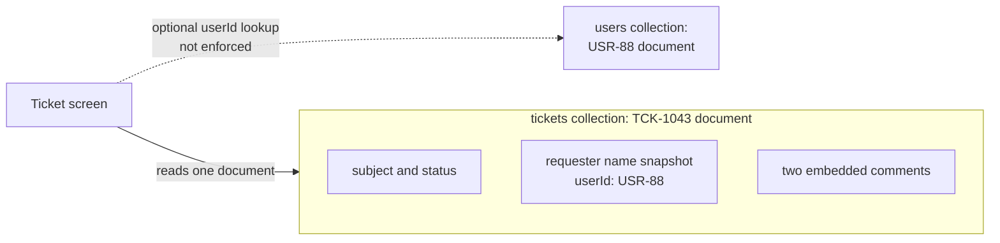
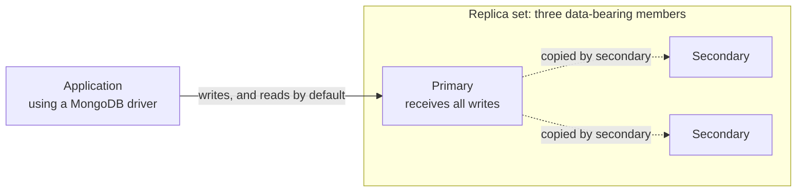

# MongoDB fundamentals

## Purpose

Use this page to build a first mental model of MongoDB: what it stores, how
records are identified and shaped, and how a deployment keeps data available
and grows. It prepares you for the deeper MongoDB pages in this section.

It does not compare MongoDB with relational databases in depth. For that, read
[Relational vs. document databases](../relational-vs-document-databases.md).

## What MongoDB is

MongoDB is a document database. It stores each record as a document, which is
a set of named fields whose values can be simple values, nested objects, or
lists. Documents are grouped into collections, and collections belong to a
database.[^mongodb-databases-collections]

## Why it matters

Application code often works with objects that contain other objects: a ticket
with its requester and comments, or a profile with its preferences. If the
related parts are embedded in one document, one read can return them together
and one document write can change them together.[^mongodb-embedding]

That convenience depends on choosing the document boundary deliberately.
MongoDB allows different document shapes by default, and optional validation
rules can enforce parts of a chosen shape.[^mongodb-schema-validation]

## The mental model

| Part | Simple definition | Worth knowing |
| --- | --- | --- |
| Document | One record, made of fields and values. | Stored as BSON, a binary form of JSON with more data types, such as dates. Its maximum size is 16 mebibytes.[^mongodb-documents] |
| `_id` | The field that identifies a document in a standard collection. | Unique in an unsharded collection and unchangeable after insert. If you leave it out, MongoDB generates an `ObjectId` identifier; a value such as `TCK-1043` is also allowed.[^mongodb-documents] |
| Collection | A named group of documents. | Comparable to a table, except that documents in it are not required to share the same fields by default.[^mongodb-databases-collections] |
| Database | A named group of collections. | A deployment can hold several databases. |

## Example: a support ticket

This document is illustrative. It is written as JSON for readability, and it
is not output from a running database. In MongoDB the date fields would be
stored as BSON dates, not as text.

```json
{
  "_id": "TCK-1043",
  "subject": "Cannot reset password",
  "status": "open",
  "priority": "high",
  "requester": { "userId": "USR-88", "name": "Dana Reyes" },
  "tags": ["login", "password"],
  "comments": [
    { "author": "USR-88", "text": "The reset email never arrives.", "at": "2026-08-02T10:15:00Z" },
    { "author": "AGT-7", "text": "Checking the mail logs now.", "at": "2026-08-02T10:32:00Z" }
  ],
  "createdAt": "2026-08-02T10:15:00Z"
}
```

What it shows:

- `_id` identifies this ticket. In an unsharded collection, no other document
  can use `TCK-1043`. A sharded-collection caveat appears below.
- `requester` is an **embedded** object: a small snapshot of who opened the
  ticket, kept inside the ticket because the screen always shows it. If Dana
  changes her name later, this stored snapshot does not change by itself.
- `tags` is a list of simple values, and `comments` is a list of embedded
  objects.
- `requester.userId` is a **reference**: a stored value intended to match the
  `_id` of a document in a separate `users` collection. MongoDB stores this
  value but does not check that `USR-88` exists there; the application must
  handle a missing or outdated reference.[^mongodb-data-consistency]



Text alternative: the ticket screen reads one `TCK-1043` document containing
the ticket details, a requester-name snapshot, and two comments. If it needs
the requester's current profile, the application follows `userId` to the
separate `USR-88` document in `users`. That second document is not inside the
ticket, and MongoDB does not enforce the link.

## Embedding and references

You can connect related data in two ways.

**Embedding** puts the related data inside the parent document, as `comments`
is here. The guiding principle in the MongoDB documentation is that data
accessed together should be stored together.[^mongodb-data-modeling] Embedding
gives you one read for the whole ticket and one atomic write when you change
it: a single update to one ticket either applies all of its field changes or
none of them. Two separate update calls are not automatically one
all-or-nothing change.[^mongodb-atomicity]

**Referencing** stores only an identifier and keeps the related data in its
own collection, as with `requester.userId`. The application follows the
reference with a second query or with the `$lookup` aggregation
stage, which combines matching documents from another collection.
MongoDB does not enforce the link to the other document.[^mongodb-referencing][^mongodb-data-consistency]

For this ticket, the choice follows from how the parts behave:

| Part | Choice | Reason |
| --- | --- | --- |
| Requester name | Embed a small snapshot and keep a reference. | Shown on every ticket view; the full user record is managed elsewhere. |
| Comments | Embed while tickets have a bounded, modest number. | Read together with the ticket. |
| Audit events for the ticket | Reference from a separate collection. | They grow without a clear bound, and a list that keeps growing can push a document towards the 16 mebibyte limit.[^mongodb-embedding] |

[MongoDB data modeling](data-modeling.md) covers this decision in more depth.
If a change must span the ticket and a separate user record, MongoDB supports
a multi-document transaction on a replica set or sharded cluster. See
[Relational vs. document databases](../relational-vs-document-databases.md)
for the write boundary in a second example.[^mongodb-atomicity]

## Flexible schema does not mean no schema

By default, MongoDB does not require the documents in a collection to have the
same fields, and the same field may hold different data types in different
documents.[^mongodb-data-modeling] A ticket with no `priority` field and a
ticket where `priority` is the number `1` could both be stored next to the
example above.

That flexibility helps while a design is changing. It does not remove the
schema. The shape your code expects is the schema; it has only moved out of
the database and into the application.

To put part of it back under the database's control, MongoDB offers schema
validation: rules for fields, such as allowed data types and value ranges,
set on a collection. By default, an insert or update that would produce an
invalid document is rejected. Adding rules does not go back and fix documents
already stored; the validation level and action can also be configured.
[^mongodb-schema-validation] See [schema validation and
indexing](schema-validation-and-indexing.md) for the existing-document check.

## Indexes

An **index** is extra lookup data for a field or combination of fields. It
can help MongoDB find matching documents without examining the whole
collection. A query without a suitable index may need a collection scan;
the query planner decides which path to use. Standard collections get a
unique index on `_id` automatically.[^mongodb-indexes][^mongodb-query-plan]

For the support team, imagine a list that filters on `status: "open"` and
sorts by `createdAt`, newest first. A compound index with `status` first and
`createdAt` second can help that filter and sort. It does not guarantee a
particular plan or speed: check the real query with `explain` and its
examined-document count.[^mongodb-esr-index][^mongodb-query-plan] Indexes
use storage and memory, and relevant entries need maintenance as documents
are inserted, removed, or changed. Start with the queries the application
actually runs.[^mongodb-indexes]

## Replica sets and sharding

These two features solve different problems. A **replica set** keeps data
copies on data-bearing server processes called `mongod`; a **sharded
cluster** distributes a sharded collection across shards, each a
replica set, with routing and configuration components.[^mongodb-replication][^mongodb-sharded-components]

In the three-data-bearing-member example below, an application uses a
MongoDB **driver**, a client library that sends its requests to the database.
One member is the
**primary**, which receives writes. Two **secondaries** copy its operations
asynchronously, so they may briefly be behind. If the primary becomes
unavailable and a voting majority can communicate, an eligible secondary can
be elected as the new primary. A two-member set cannot elect a replacement
when one member is unavailable. Some replica sets also have an **arbiter**
that votes but holds no data; the diagram does not include one.
[^mongodb-replication][^mongodb-replica-set-elections]



Text alternative: the application sends its writes to the primary, and by
default its reads too. Two secondaries pull the primary's operations, shown
by dashed arrows, and their copies may lag behind the primary.
The diagram shows a replica set only; a sharded cluster is not drawn.

**Sharding** can split a collection across shards; other collections can
remain unsharded. A field or set of fields called the **shard key** helps
decide which shard holds each document. The application connects through
`mongos`, a router, which sends operations toward the relevant shards; this
is distinct from a `mongod` data server. Config servers store the cluster's
metadata about shards and data placement. A query on the shard key, or a
useful prefix of a compound shard key, can target fewer shards. Other queries
may be broadcast to all shards.[^mongodb-sharding][^mongodb-sharded-components]
For example, if tickets were sharded by an unrelated key, a support-team
query for every open ticket using only `status` could need to visit all
shards; an index within a shard does not decide the cross-shard route.

For a sharded collection whose shard key is different from `_id`, the default
`_id` index enforces uniqueness within each shard, but not across all shards.
Applications must then ensure `_id` values are unique across shards.
[^mongodb-unique-indexes]

Replication helps a deployment continue after a member fails. Sharding helps
spread data or request load beyond one replica set. The MongoDB documentation
notes that a sharded cluster adds infrastructure and complexity, so it
is a step to take when the need is clear.[^mongodb-sharding] See [replication,
sharding, and consistency](replication-sharding-and-consistency.md).

## An analogy: a team keeping one logbook

Think of a replica set as a team that keeps copies of one logbook:

- One person, the **lead writer**, makes every new entry.
- The others **copy** each entry into their own books shortly afterwards.
- If the lead writer is away, enough team members must be able to agree on
  an eligible new lead before writing resumes.

Where the analogy stops being accurate:

- **Copies lag.** Secondaries replicate asynchronously, so a read sent to a
  secondary can return data that is slightly out of date.[^mongodb-replication]
- **Choosing a new lead takes time.** A replica set cannot process write
  operations until the election completes, and an election requires a voting
  majority. Reads can continue if they are configured to run on secondaries.
  [^mongodb-replica-set-elections]
- **A recent entry may not survive.** If a write had not met majority write
  concern before failover, it can be rolled back. **Write concern**
  controls when a write is acknowledged, including whether a majority has
  recorded it. **Read preference** controls which member receives a read;
  **read concern** controls which changes that read is allowed to see. Seeing
  a write on the primary does not, by itself, show how many members recorded
  it. See [replication,
  sharding, and consistency](replication-sharding-and-consistency.md) for
  read and write concern choices.[^mongodb-write-concern][^mongodb-read-preference][^mongodb-rollbacks]
- **Copying is not a backup.** Replication protects against a server failing.
  It does not protect against a wrong operation. Because secondaries apply
  the primary's operations, a mistaken delete reaches every copy. MongoDB's
  Atlas architecture guidance makes the same point for its managed service:
  automatic failover cannot address accidental deletion or data corruption,
  and backups are the tool for recovery.[^mongodb-atlas-disaster-recovery]
  Keep backups that you can restore
  from, separately from replication.
- **The analogy covers replication only.** Sharding is a different idea:
  separate teams, each keeping a different part of the records.

## Common misconceptions

- **"MongoDB has no schema."** It has the schema your application assumes, and
  optionally the one you enforce with validation.
- **"Embed everything."** Embedding suits bounded data that is read together.
  Independently growing lists often need separate documents, or a design that
  keeps only a bounded subset inside the parent.
- **"Replicas make reads current everywhere."** Secondaries can lag. Reads go
  to the primary by default, but freshness and durability also depend on
  read and write concern.[^mongodb-read-preference][^mongodb-write-concern]
- **"Sharding is the way to make MongoDB fast."** Sharding addresses size and
  throughput beyond one replica set. First inspect the query plan and model
  of a slow query; sharding adds routing and coordination work.

## Check your understanding

- In the ticket example, which parts are embedded and which value is a
  reference?
- Why can two tickets in the same collection have different fields, and what
  would you add to prevent that for `status`?
- A query filters tickets by `status`, but no usable index supports it. What
  does MongoDB have to do?
- What problem does a replica set solve that sharding does not, and the other
  way round?

**Check your answers:**

1. The requester snapshot, tags, and comments are inside the ticket;
   `requester.userId` points toward a separate user document. MongoDB does
   not enforce that reference.
2. The collection has no uniform shape rule by default. Add a collection
   validator that requires `status` and limits its type or allowed values;
   check already stored documents separately.
3. With no usable index for an unrestricted `status` query, MongoDB scans the
   collection and examines every ticket. In `explain`, `COLLSCAN` names that
   path and the examined-document count shows its scope.[^mongodb-query-plan]
4. A replica set keeps data copies so service can recover from a member
   failure; sharding distributes a collection across shards for data or
   traffic scale. A sharded cluster uses replica sets for its shards,
   so it can need both. Replication does not replace a backup.

## Next steps

- Decide document shapes in [MongoDB data modeling](data-modeling.md).
- Add rules and indexes in [schema validation and
  indexing](schema-validation-and-indexing.md).
- Go deeper on availability and scale in [replication, sharding, and
  consistency](replication-sharding-and-consistency.md).
- Run and maintain a deployment with [MongoDB operations](operations.md).

## Official documentation for deeper study

- Document structure, BSON, `_id`, and size limit: [Documents](https://www.mongodb.com/docs/manual/core/document/).
- Databases and collections: [Databases and Collections](https://www.mongodb.com/docs/manual/core/databases-and-collections/).
- Modeling principles and flexible schema: [Data Modeling](https://www.mongodb.com/docs/manual/data-modeling/).
- When to embed: [Embedded Data](https://www.mongodb.com/docs/manual/data-modeling/embedding/).
- When to reference: [Reference Data](https://www.mongodb.com/docs/manual/data-modeling/referencing/).
- Keeping references consistent: [Data Consistency](https://www.mongodb.com/docs/manual/data-modeling/data-consistency/).
- Validation rules: [Schema Validation](https://www.mongodb.com/docs/manual/core/schema-validation/).
- Index behaviour and types: [Indexes](https://www.mongodb.com/docs/manual/indexes/).
- Single-document write boundaries: [Atomicity and Transactions](https://www.mongodb.com/docs/manual/core/write-operations-atomicity/).
- How query plans show index use and collection scans: [Interpret Explain Plan Results](https://www.mongodb.com/docs/manual/tutorial/analyze-query-plan/).
- Choosing field order in a compound index: [The ESR Guideline](https://www.mongodb.com/docs/manual/tutorial/equality-sort-range-guideline/).
- Primaries, secondaries, and failover: [Replication](https://www.mongodb.com/docs/manual/replication/).
- What happens to writes during failover: [Replica Set Elections](https://www.mongodb.com/docs/manual/core/replica-set-elections/).
- Write acknowledgment and possible rollback: [Write Concern](https://www.mongodb.com/docs/manual/reference/write-concern/) and [Rollbacks During Replica Set Failover](https://www.mongodb.com/docs/manual/core/replica-set-rollbacks/).
- Where reads go by default: [Read Preference](https://www.mongodb.com/docs/manual/core/read-preference/).
- `_id` uniqueness across shards: [Unique Indexes](https://www.mongodb.com/docs/manual/core/index-unique/).
- Why failover is not recovery, written for Atlas: [Atlas Architecture Center - Disaster Recovery](https://www.mongodb.com/docs/atlas/architecture/current/disaster-recovery/).
- Shards, shard keys, and routing: [Sharding](https://www.mongodb.com/docs/manual/sharding/).
- Routers, shards, and config servers: [Sharded Cluster Components](https://www.mongodb.com/docs/manual/core/sharded-cluster-components/).

## Related links

- [MongoDB documentation](https://www.mongodb.com/docs/manual/)
- [MongoDB data modeling](data-modeling.md)
- [Schema validation and indexing](schema-validation-and-indexing.md)
- [Replication, sharding, and consistency](replication-sharding-and-consistency.md)
- [MongoDB operations](operations.md)
- [Relational vs. document databases](../relational-vs-document-databases.md)
- [Back to MongoDB index](index.md)
- [Back to databases index](../index.md)
- [Back to knowledge index](../../index.md)

[^mongodb-documents]: [MongoDB manual - Documents](https://www.mongodb.com/docs/manual/core/document/), source record `mongodb-documents`.
[^mongodb-databases-collections]: [MongoDB manual - Databases and Collections](https://www.mongodb.com/docs/manual/core/databases-and-collections/), source record `mongodb-databases-collections`.
[^mongodb-data-modeling]: [MongoDB manual - Data Modeling](https://www.mongodb.com/docs/manual/data-modeling/), source record `mongodb-data-modeling`.
[^mongodb-embedding]: [MongoDB manual - Embedded Data](https://www.mongodb.com/docs/manual/data-modeling/embedding/), source record `mongodb-embedding`.
[^mongodb-referencing]: [MongoDB manual - Reference Data](https://www.mongodb.com/docs/manual/data-modeling/referencing/), source record `mongodb-referencing`.
[^mongodb-data-consistency]: [MongoDB manual - Data Consistency](https://www.mongodb.com/docs/manual/data-modeling/data-consistency/), source record `mongodb-data-consistency`.
[^mongodb-schema-validation]: [MongoDB manual - Schema Validation](https://www.mongodb.com/docs/manual/core/schema-validation/), source record `mongodb-schema-validation`.
[^mongodb-indexes]: [MongoDB manual - Indexes](https://www.mongodb.com/docs/manual/indexes/), source record `mongodb-indexes`.
[^mongodb-replication]: [MongoDB manual - Replication](https://www.mongodb.com/docs/manual/replication/), source record `mongodb-replication`.
[^mongodb-sharding]: [MongoDB manual - Sharding](https://www.mongodb.com/docs/manual/sharding/), source record `mongodb-sharding`.
[^mongodb-sharded-components]: [MongoDB manual - Sharded Cluster Components](https://www.mongodb.com/docs/manual/core/sharded-cluster-components/), source record `mongodb-sharded-components`.
[^mongodb-replica-set-elections]: [MongoDB manual - Replica Set Elections](https://www.mongodb.com/docs/manual/core/replica-set-elections/), source record `mongodb-replica-set-elections`.
[^mongodb-atomicity]: [MongoDB manual - Atomicity and Transactions](https://www.mongodb.com/docs/manual/core/write-operations-atomicity/), source record `mongodb-atomicity`.
[^mongodb-write-concern]: [MongoDB manual - Write Concern](https://www.mongodb.com/docs/manual/reference/write-concern/), source record `mongodb-write-concern`.
[^mongodb-read-preference]: [MongoDB manual - Read Preference](https://www.mongodb.com/docs/manual/core/read-preference/), source record `mongodb-read-preference`.
[^mongodb-rollbacks]: [MongoDB manual - Rollbacks During Replica Set Failover](https://www.mongodb.com/docs/manual/core/replica-set-rollbacks/), source record `mongodb-rollbacks`.
[^mongodb-unique-indexes]: [MongoDB manual - Unique Indexes](https://www.mongodb.com/docs/manual/core/index-unique/), source record `mongodb-unique-indexes`.
[^mongodb-query-plan]: [MongoDB manual - Interpret Explain Plan Results](https://www.mongodb.com/docs/manual/tutorial/analyze-query-plan/), source record `mongodb-query-plan`.
[^mongodb-esr-index]: [MongoDB manual - The ESR Guideline](https://www.mongodb.com/docs/manual/tutorial/equality-sort-range-guideline/), source record `mongodb-esr-index`.
[^mongodb-atlas-disaster-recovery]: [MongoDB Atlas Architecture Center - Disaster Recovery](https://www.mongodb.com/docs/atlas/architecture/current/disaster-recovery/), source record `mongodb-atlas-disaster-recovery`.
