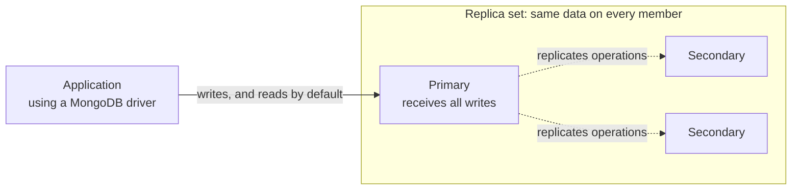

# MongoDB fundamentals

## Purpose

Use this page to build a first mental model of MongoDB: what it stores, how
records are identified and shaped, and how a deployment keeps data available
and grows. It prepares you for the deeper MongoDB pages in this section.

It does not compare MongoDB with relational databases in depth. For that, read
[Relational vs. document databases](../relational-vs-document-databases.md).

## What MongoDB is

MongoDB is a document database. It stores each record as a document, which is
a set of named fields whose values can be simple values, nested objects, or
lists. Documents are grouped into collections, and collections belong to a
database.[^mongodb-databases-collections]

## Why it matters

Application code usually works with objects that contain other objects: a
ticket with its requester and comments, or a profile with its preferences. A
document can store such an object in one piece, so one read fetches it and one
write changes it.

The cost is that you must decide the shape of each document deliberately.
MongoDB does not force a shape on you, which means it also does not stop you
from choosing a poor one.

## The mental model

| Part | Simple definition | Worth knowing |
| --- | --- | --- |
| Document | One record, made of fields and values. | Stored as BSON, a binary form of JSON with more data types, such as dates. A document must be smaller than 16 mebibytes.[^mongodb-documents] |
| `_id` | The field that uniquely identifies a document in its collection. | Required, unique, and unchangeable after insert. If you leave it out, MongoDB generates one.[^mongodb-documents] |
| Collection | A named group of documents. | Comparable to a table, except that documents in it are not required to share the same fields by default.[^mongodb-databases-collections] |
| Database | A named group of collections. | A deployment can hold several databases. |
| Index | A sorted lookup structure for one or more fields. | Without a suitable index, a query must scan every document in the collection.[^mongodb-indexes] |
| Replica set | A group of MongoDB servers holding the same data. | Provides redundancy and high availability.[^mongodb-replication] |
| Sharded cluster | Several replica sets, each holding part of the data. | Spreads a very large data set across machines.[^mongodb-sharding] |

## Example: a support ticket

This document is illustrative. It is written as JSON for readability, and it
is not output from a running database. In MongoDB the date fields would be
stored as BSON dates, not as text.

```json
{
  "_id": "TCK-1043",
  "subject": "Cannot reset password",
  "status": "open",
  "priority": "high",
  "requester": { "userId": "USR-88", "name": "Dana Reyes" },
  "tags": ["login", "password"],
  "comments": [
    { "author": "USR-88", "text": "The reset email never arrives.", "at": "2026-08-02T10:15:00Z" },
    { "author": "AGT-7", "text": "Checking the mail logs now.", "at": "2026-08-02T10:32:00Z" }
  ],
  "createdAt": "2026-08-02T10:15:00Z"
}
```

What it shows:

- `_id` identifies this ticket. No other document in the collection can use
  `TCK-1043`.
- `requester` is an embedded object: a small snapshot of who opened the
  ticket, kept here because the ticket screen always shows it.
- `tags` is a list of simple values, and `comments` is a list of embedded
  objects.
- `requester.userId` is a reference: a stored value that identifies a document
  in a separate `users` collection.

## Embedding and references

You can connect related data in two ways.

**Embedding** puts the related data inside the parent document, as `comments`
is here. The guiding principle in the MongoDB documentation is that data
accessed together should be stored together.[^mongodb-data-modeling] Embedding
gives you one read for the whole ticket and one atomic write when you change
it.[^mongodb-embedding]

**Referencing** stores only an identifier and keeps the related data in its
own collection, as with `requester.userId`. The application follows the
reference with a second query or with the `$lookup` aggregation
stage.[^mongodb-referencing]

For this ticket, the choice follows from how the parts behave:

| Part | Choice | Reason |
| --- | --- | --- |
| Requester name | Embed a small snapshot and keep a reference. | Shown on every ticket view; the full user record is managed elsewhere. |
| Comments | Embed while tickets have a bounded, modest number. | Read together with the ticket. |
| Audit events for the ticket | Reference from a separate collection. | They grow without a clear bound, and a list that keeps growing can push a document towards the 16 mebibyte limit.[^mongodb-embedding] |

[MongoDB data modeling](data-modeling.md) covers this decision in more depth.

## Flexible schema does not mean no schema

By default, MongoDB does not require the documents in a collection to have the
same fields, and the same field may hold different data types in different
documents.[^mongodb-data-modeling] A ticket with no `priority` field and a
ticket where `priority` is the number `1` could both be stored next to the
example above.

That flexibility helps while a design is changing. It does not remove the
schema. The shape your code expects is the schema; it has only moved out of
the database and into the application.

To put part of it back under the database's control, MongoDB offers schema
validation: rules for fields, such as allowed data types and value ranges. By
default, an insert or update that would produce an invalid document is
rejected.[^mongodb-schema-validation] See [schema validation and
indexing](schema-validation-and-indexing.md) for how rules are written.

## Indexes

An index lets MongoDB find matching documents without reading the whole
collection. Every collection gets a unique index on `_id`
automatically.[^mongodb-indexes]

If the support team lists open tickets by priority, an index on `status` and
`priority` lets that query avoid scanning every ticket. Indexes are not free:
each one must be updated on every insert, so indexes slow writes
down.[^mongodb-indexes] Index the queries you actually run.

## Replica sets and sharding

These two features solve different problems.

A **replica set** keeps copies of the same data on several servers. One
member, the primary, receives all writes. The other members, the secondaries,
copy the primary's operations. If the primary becomes unavailable, an eligible
secondary is elected as the new primary.[^mongodb-replication]



Text alternative: the application sends its writes to the primary, and by
default its reads too. The primary replicates its operations to two
secondaries, shown by dashed arrows. All three members hold the same data set.
The diagram shows a replica set only; a sharded cluster is not drawn.

**Sharding** splits one large collection across several replica sets, called
shards. A field or set of fields called the shard key decides which shard
holds each document. Applications connect through a router process, `mongos`,
which sends each operation to the right shard. A query that does not include
the shard key has to be sent to every shard.[^mongodb-sharding]

Replication is about surviving failures. Sharding is about data or traffic too
large for one replica set. The MongoDB documentation notes that a sharded
cluster adds infrastructure and complexity that need careful planning, so it
is a step to take when the need is clear.[^mongodb-sharding] See [replication,
sharding, and consistency](replication-sharding-and-consistency.md).

## An analogy: a team keeping one logbook

Think of a replica set as a team that keeps copies of one logbook:

- One person, the **lead writer**, makes every new entry.
- The others **copy** each entry into their own books shortly afterwards.
- If the lead writer is away, the team **chooses a new lead** from the people
  whose copies are up to date.

Where the analogy stops being accurate:

- **Copies lag.** Secondaries replicate asynchronously, so a read sent to a
  secondary can return data that is slightly out of date.[^mongodb-replication]
- **Choosing a new lead takes time.** A replica set cannot process write
  operations until the election completes. Reads can continue if they are
  configured to run on secondaries.[^mongodb-replica-set-elections]
- **Copying is not a backup.** Replication protects against a server failing.
  It does not protect against a wrong operation. Because secondaries apply
  the primary's operations, a mistaken delete is applied on every member;
  that sentence is this page's reasoning from how replication works. MongoDB's
  Atlas architecture guidance makes the matching point for its managed
  service: automatic failover cannot address accidental deletion or data
  corruption, and backups are the tool for recovering from
  them.[^mongodb-atlas-disaster-recovery] Keep backups that you can restore
  from, separately from replication.
- **The analogy covers replication only.** Sharding is a different idea:
  separate teams, each keeping a different part of the records.

## Common misconceptions

- **"MongoDB has no schema."** It has the schema your application assumes, and
  optionally the one you enforce with validation.
- **"Embed everything."** Embedding suits bounded data that is read together.
  Unbounded lists belong in their own collection.
- **"Replicas make reads current everywhere."** Only the primary is guaranteed
  to have the latest write.
- **"Sharding is the way to make MongoDB fast."** Sharding addresses size and
  throughput beyond one replica set. Slow queries are usually an indexing or
  modeling question first.

## Check your understanding

- In the ticket example, which parts are embedded and which value is a
  reference?
- Why can two tickets in the same collection have different fields, and what
  would you add to prevent that for `status`?
- A query filters tickets by `status` and there is no index on it. What does
  MongoDB have to do?
- What problem does a replica set solve that sharding does not, and the other
  way round?

## Next steps

- Decide document shapes in [MongoDB data modeling](data-modeling.md).
- Add rules and indexes in [schema validation and
  indexing](schema-validation-and-indexing.md).
- Go deeper on availability and scale in [replication, sharding, and
  consistency](replication-sharding-and-consistency.md).
- Run and maintain a deployment with [MongoDB operations](operations.md).

## Official documentation for deeper study

- Document structure, BSON, `_id`, and size limit: [Documents](https://www.mongodb.com/docs/manual/core/document/).
- Databases and collections: [Databases and Collections](https://www.mongodb.com/docs/manual/core/databases-and-collections/).
- Modeling principles and flexible schema: [Data Modeling](https://www.mongodb.com/docs/manual/data-modeling/).
- When to embed: [Embedded Data](https://www.mongodb.com/docs/manual/data-modeling/embedding/).
- When to reference: [Reference Data](https://www.mongodb.com/docs/manual/data-modeling/referencing/).
- Validation rules: [Schema Validation](https://www.mongodb.com/docs/manual/core/schema-validation/).
- Index behaviour and types: [Indexes](https://www.mongodb.com/docs/manual/indexes/).
- Primaries, secondaries, and failover: [Replication](https://www.mongodb.com/docs/manual/replication/).
- What happens to writes during failover: [Replica Set Elections](https://www.mongodb.com/docs/manual/core/replica-set-elections/).
- Why failover is not recovery, written for Atlas: [Atlas Architecture Center - Disaster Recovery](https://www.mongodb.com/docs/atlas/architecture/current/disaster-recovery/).
- Shards, shard keys, and routing: [Sharding](https://www.mongodb.com/docs/manual/sharding/).

## Related links

- [MongoDB documentation](https://www.mongodb.com/docs/manual/)
- [MongoDB data modeling](data-modeling.md)
- [Schema validation and indexing](schema-validation-and-indexing.md)
- [Replication, sharding, and consistency](replication-sharding-and-consistency.md)
- [MongoDB operations](operations.md)
- [Relational vs. document databases](../relational-vs-document-databases.md)
- [Back to MongoDB index](index.md)
- [Back to databases index](../index.md)
- [Back to knowledge index](../../index.md)

[^mongodb-documents]: [MongoDB manual - Documents](https://www.mongodb.com/docs/manual/core/document/), source record `mongodb-documents`.
[^mongodb-databases-collections]: [MongoDB manual - Databases and Collections](https://www.mongodb.com/docs/manual/core/databases-and-collections/), source record `mongodb-databases-collections`.
[^mongodb-data-modeling]: [MongoDB manual - Data Modeling](https://www.mongodb.com/docs/manual/data-modeling/), source record `mongodb-data-modeling`.
[^mongodb-embedding]: [MongoDB manual - Embedded Data](https://www.mongodb.com/docs/manual/data-modeling/embedding/), source record `mongodb-embedding`.
[^mongodb-referencing]: [MongoDB manual - Reference Data](https://www.mongodb.com/docs/manual/data-modeling/referencing/), source record `mongodb-referencing`.
[^mongodb-schema-validation]: [MongoDB manual - Schema Validation](https://www.mongodb.com/docs/manual/core/schema-validation/), source record `mongodb-schema-validation`.
[^mongodb-indexes]: [MongoDB manual - Indexes](https://www.mongodb.com/docs/manual/indexes/), source record `mongodb-indexes`.
[^mongodb-replication]: [MongoDB manual - Replication](https://www.mongodb.com/docs/manual/replication/), source record `mongodb-replication`.
[^mongodb-sharding]: [MongoDB manual - Sharding](https://www.mongodb.com/docs/manual/sharding/), source record `mongodb-sharding`.
[^mongodb-replica-set-elections]: [MongoDB manual - Replica Set Elections](https://www.mongodb.com/docs/manual/core/replica-set-elections/), source record `mongodb-replica-set-elections`.
[^mongodb-atlas-disaster-recovery]: [MongoDB Atlas Architecture Center - Disaster Recovery](https://www.mongodb.com/docs/atlas/architecture/current/disaster-recovery/), source record `mongodb-atlas-disaster-recovery`.
