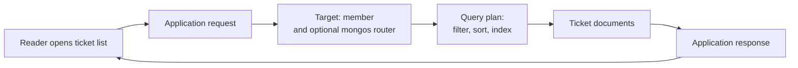

# MongoDB operations

## What to do first when something feels wrong

A slow page, missing ticket, or failed write is a **user symptom**, not yet a
MongoDB diagnosis. The first operational job is to locate the boundary where
the behavior changed. Start with the application action and its database
operation; then inspect the query plan, chosen member, and shard routing that
apply to that operation. Do not add an index, change a read preference, or
raise capacity simply because one metric looks unusual.

If replica sets, shards, and read settings are new, read [replication,
sharding, and consistency](replication-sharding-and-consistency.md) first.

## Follow the request

Text alternative: the reader opens a ticket list. The application sends a
database operation to a selected member, through `mongos` if the collection
is sharded. That member executes a query plan against the ticket data, and
the result returns through the application to the reader. Time or errors can
appear at any step. The diagram omits network, cache, and authorization
details; it is a path to investigate, not a complete MongoDB architecture.

Think of a meal arriving late: the delay might be in taking the order,
preparing it, or carrying it to the table. Watching only the kitchen cannot
explain every slow meal. This analogy helps separate *where time is spent*;
it does not explain query plans, replication, or database correctness.

## A bounded slow-list example

Suppose a support worker says the open-ticket list now takes four seconds.
The following numbers are **invented** to show how evidence changes the next
question; they are not logs or measurements from this repository.

| Observation | What it suggests | Next check |
| --- | --- | --- |
| Application request: 4 seconds; database operation: 30 milliseconds. | Most measured time lies outside this database operation. | Check application work, other calls, and response delivery before altering MongoDB. |
| Application request: 4 seconds; database operation: 3.5 seconds. | The database path may explain much of the wait. | Identify the exact filter, sort, collection, and member used. |
| The query returns 20 tickets but examines 80,000 documents. | The query may be doing far more work than the result needs. | Inspect its winning plan, data distribution, and candidate index. |

An `explain("executionStats")` result can show `nReturned`,
`totalDocsExamined`, and plan stages such as collection or index
scans.[^mongodb-explain-slow] Compare these with the **same query shape** and a
representative data set. A large examined-to-returned gap is a reason to
investigate; it does not by itself prove that adding one index will meet the
user's time target. Indexes consume storage and add work to
writes.[^mongodb-index-use]

If no query trace already identifies the slow operation, a profiler may help,
but enabling database profiling can add overhead and use disk space. Check
the deployment's existing observability first and choose profiling settings
deliberately rather than turning on every-operation recording in a busy
system.[^mongodb-profiler]

## Other symptoms, different checks

| User or operator sees | Question before changing anything | Deeper route |
| --- | --- | --- |
| A recently changed ticket looks old | Which member served the read, and is a secondary behind? | [Replication and consistency](replication-sharding-and-consistency.md) and [replica-set troubleshooting](https://www.mongodb.com/docs/manual/tutorial/troubleshoot-replica-sets/). |
| One tenant's queries slow down in a sharded collection | Did the router target a shard or broadcast, and is load concentrated? | [Routing with mongos](https://www.mongodb.com/docs/manual/core/sharded-cluster-query-router/). |
| A deletion must be undone | What independent backup covers the point before deletion, and has a restore been tested? | [Atlas disaster recovery](https://www.mongodb.com/docs/atlas/architecture/current/disaster-recovery/) or the backup procedure for the actual deployment. |
| A write is rejected | Did validation, a unique index, authorization, or availability reject it? | [Schema validation and indexing](schema-validation-and-indexing.md), then the server's reported error. |

The linked official procedures give the deployment-specific detail. The
table is a map of first questions, not a claim that a symptom has one cause.
Changing indexes or topology can affect live traffic; collect a baseline and
test a proposed change in a suitable environment before rollout.

## Know what the evidence proves

- A successful database query does not prove the reader saw a correct page.
- An index scan does not prove a query meets its latency target under real
  load.
- Healthy replica members do not prove that an accidental deletion can be
  restored. MongoDB's disaster recovery guidance treats backup and restore
  planning as protection against failures that automatic failover cannot
  address.[^mongodb-atlas-recovery]

No MongoDB deployment, query, backup, or restore was exercised for this page.
Its examples show the investigation pattern a reader can apply to their own
system; they are not operational evidence.

## Check your understanding

1. If the database operation takes 30 milliseconds but the page takes four
   seconds, where should you look next?
2. What does a query returning 20 documents after examining 80,000 suggest,
   and what does it *not* prove?
3. Why is a healthy replica set insufficient evidence for deletion recovery?

## Continue learning

- [Schema validation and indexing](schema-validation-and-indexing.md) explains
  the write guardrail and query access path.
- [Replication, sharding, and consistency](replication-sharding-and-consistency.md)
  explains the topology and read/write meaning behind several symptoms.
- [MongoDB explain-slow-queries guidance](https://www.mongodb.com/docs/manual/tutorial/explain-slow-queries/)
  gives the official plan-interpretation procedure.
- [Back to MongoDB index](index.md)

[^mongodb-explain-slow]: [MongoDB manual: Explain Slow Queries](https://www.mongodb.com/docs/manual/tutorial/explain-slow-queries/).
[^mongodb-index-use]: [MongoDB manual: Measure Index Use](https://www.mongodb.com/docs/manual/tutorial/measure-index-use/).
[^mongodb-profiler]: [MongoDB manual: Database Profiler](https://www.mongodb.com/docs/manual/tutorial/manage-the-database-profiler/).
[^mongodb-atlas-recovery]: [MongoDB Atlas Architecture Center: Disaster Recovery](https://www.mongodb.com/docs/atlas/architecture/current/disaster-recovery/).
