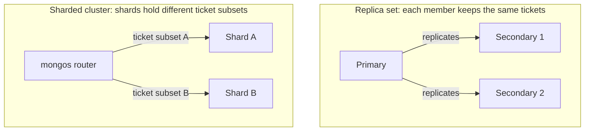

# MongoDB replication, sharding, and consistency

## Three questions, three different levers

When a MongoDB application grows, three questions often get mixed together:

| Question | Main lever | Plain meaning |
| --- | --- | --- |
| What happens if a database server fails? | Replica set | Keep copies of the **same** data on several members. |
| What if one data set needs more capacity? | Sharding | Divide a collection's data between **different** shards. |
| What does a successful write or read mean? | Write concern, read concern, and read preference | Decide when a write is acknowledged, what data a read may see, and which member serves it. |

These levers can work together. A shard is commonly a replica set, so a
sharded cluster can have both partitioned data and replicated
copies.[^mongodb-sharding] This page helps you recognize which problem each lever
addresses. It is not a deployment recipe; settings need a design tied to
the application's failure and consistency requirements.

## Copies for availability: a replica set

In a replica set, one **primary** accepts writes. **Secondaries** copy the
primary's operations asynchronously. If the primary becomes unavailable,
eligible members hold an election and one can become the new primary. Reads
normally go to the primary unless a different read preference is
chosen.[^mongodb-replication][^mongodb-read-preference]

Think of a team keeping copies of one ticket ledger. If the lead writer
disappears, another member can take over. This analogy ends where timing and
failure details begin: copies can lag, an election interrupts writes, and a
copy of an accidental deletion is still a deletion. A replica set does not
replace a separate, tested backup.[^mongodb-replication][^mongodb-atlas-recovery]

## Partitions for capacity: a sharded cluster

Sharding divides a collection across shards. A **shard key** is the field or
fields MongoDB uses to place and locate documents. An application connects
through a **`mongos` router**, which directs an operation to the relevant
shard or shards.[^mongodb-sharding][^mongodb-router]

Imagine moving from several copies of one ledger to several cabinets, each
holding a different part of the ledger. More cabinets can spread storage and
work, but a request without a useful location clue may require searching all
of them. Likewise, a query that omits the shard key is broadcast to the
shards; a query that includes it may be targeted, depending on the query and
data distribution.[^mongodb-router] The cabinets analogy does not model
chunk movement, hot keys, or cross-shard work.

Text alternative: the replica-set group shows a primary copying the same
tickets to two secondaries. The sharded-cluster group shows a router sending
operations to two shards that hold different subsets of tickets. Each shard
can itself be a replica set; the sharded-cluster group omits those internal
copies for clarity.

## What an acknowledgement tells you

Return to the invented support ticket `TCK-1043`. A user submits it and sees
"saved." That message should have an explicit meaning:

- **Write concern** sets the acknowledgement condition. In a three
  data-bearing voting-member replica set, `w: 1` can acknowledge after the
  primary accepts the write; if it fails before the write reaches a secondary,
  that write can roll back. `w: "majority"` asks for acknowledgement from a
  calculated majority, which is two members in this simple topology. Exact
  durability also depends on journaling and deployment
  settings.[^mongodb-write-concern]
- **Read preference** chooses the member type used for a read. `primary` is
  the default. If an application chooses a secondary, it may see an older
  ticket because replication and application of changes are
  asynchronous.[^mongodb-read-preference][^mongodb-replication]
- **Read concern** controls which state a read is allowed to return. The
  `"majority"` level returns majority-acknowledged data for reads outside
  multi-document transactions, but it is **not** a promise that a chosen
  secondary has applied the newest write.[^mongodb-read-concern]

For example, a majority-acknowledged ticket write can still be followed by
a stale read from a secondary shortly afterwards. MongoDB 8.0 and later can
acknowledge a majority write when the required members have durably written
its oplog entry, before those members apply the change to their collections.
If immediate read-your-own-write behavior across members matters, study
causally consistent sessions and test the actual driver and deployment
configuration.[^mongodb-write-concern] This is a **possible sequence**, not
an observed ticket or a guarantee about a specific deployment.

## Decide what to investigate first

| Symptom or requirement | First question |
| --- | --- |
| One server fails and writes stop | Is there an electable, healthy replica-set majority, and did an election complete? |
| A secondary read shows the previous ticket status | Which member served the read, and what read preference and consistency behavior does the application require? |
| One replica set cannot meet measured storage or throughput needs | Would sharding help this workload, and do common queries include a useful shard key? |
| The user needs recovery from a wrong deletion | What independent backup and restore test covers this data? |

Do not infer a restore time, recovery point, or safe shard key from this
table. Measure the workload, define acceptable data loss and downtime, and
test recovery before selecting an architecture. [MongoDB operations](operations.md)
is the route for operational checks.

## Check your understanding

1. If all three replica-set members hold the same ticket data, what extra
   problem would sharding solve?
2. Why can a secondary read show an older ticket even after a write was
   acknowledged?
3. Why can a healthy replica set still need a backup?

## Continue learning

- [MongoDB fundamentals](fundamentals.md) introduces replica sets and
  sharding before these trade-offs.
- [MongoDB operations](operations.md) covers monitoring and recovery checks.
- [MongoDB replication](https://www.mongodb.com/docs/manual/replication/),
  [sharding](https://www.mongodb.com/docs/manual/sharding/), and
  [write concern](https://www.mongodb.com/docs/manual/reference/write-concern/)
  provide the official detail.
- [Back to MongoDB index](index.md)

[^mongodb-replication]: [MongoDB manual: Replication](https://www.mongodb.com/docs/manual/replication/).
[^mongodb-sharding]: [MongoDB manual: Sharding](https://www.mongodb.com/docs/manual/sharding/).
[^mongodb-router]: [MongoDB manual: Routing with mongos](https://www.mongodb.com/docs/manual/core/sharded-cluster-query-router/).
[^mongodb-write-concern]: [MongoDB manual: Write Concern](https://www.mongodb.com/docs/manual/reference/write-concern/).
[^mongodb-read-concern]: [MongoDB manual: Read Concern majority](https://www.mongodb.com/docs/manual/reference/read-concern-majority/).
[^mongodb-read-preference]: [MongoDB manual: Read Preference](https://www.mongodb.com/docs/manual/core/read-preference/).
[^mongodb-atlas-recovery]: [MongoDB Atlas Architecture Center: Disaster Recovery](https://www.mongodb.com/docs/atlas/architecture/current/disaster-recovery/).
