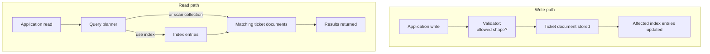

# MongoDB schema validation and indexing

## Why these are two different tools

MongoDB can accept documents with different fields in one collection. That
flexibility helps a design evolve, but an application still needs to know
which fields it can rely on. **Schema validation** checks whether a write
produces an allowed document. An **index** helps MongoDB find documents for a
read without examining every one. An index does not decide whether a document
has the right shape, and a validator does not speed up a query.
[^mongodb-schema-validation][^mongodb-query-optimization]

This page continues the invented support-ticket example in [MongoDB data
modeling](data-modeling.md). The primary question is: after choosing a ticket
document's shape, how do you protect that shape and support the ticket list?

## A small mental model

Imagine a library with two separate aids:

- An **intake rule** says that every new book record needs a title and a valid
  category. That resembles a validator.
- A **catalog sorted by category and date** helps a reader find the newest
  books in one category. That resembles an index.

The analogy stops at the mechanism: a database validates updates as well as
inserts, maintains indexes when indexed data changes, and chooses an access
plan for each query. Neither aid proves that the *meaning* of the data is
correct or that a person is authorized to read it.



Text alternative: on a write, the application sends a document to the
validator; accepted data goes into the ticket collection, and affected index
entries are updated. On a read, the query planner may use an index to locate
matching ticket documents before returning results. The index is a possible
path, not a promise that every query will use it. The two paths show the same
ticket collection and index, duplicated only to make the flow easier to read.

## Example: protect the ticket shape

Suppose every ticket must have a string `subject` and a `status` of `open` or
`closed`. A MongoDB JSON Schema validator can express those rules:

```javascript
{
  $jsonSchema: {
    bsonType: "object",
    required: ["subject", "status"],
    properties: {
      subject: { bsonType: "string" },
      status: { enum: ["open", "closed"] }
    }
  }
}
```

This is an **illustrative validator definition**, not a command to run. With
the default `validationAction: "error"`, an insert or update that produces a
ticket without `subject`, or with `status: "waiting"`, is rejected. If the
collection instead uses `validationAction: "warn"`, MongoDB records the
violation but allows that write.[^mongodb-invalid-documents]

Adding a validator to an existing collection does **not** prove all old
documents are valid. Check the existing documents against the rule and plan
any migration before assuming application code can rely on it.
[^mongodb-existing-documents] Application validation still helps give a user
an immediate, understandable error; the database rule protects the shared
collection boundary.

## Example: support the ticket list

Suppose the support screen repeatedly asks for **open tickets, newest
first**. The query filters `status: "open"` and sorts by `createdAt`
descending. A candidate compound index is:

```javascript
{ status: 1, createdAt: -1 }
```

The first field groups tickets by status; within each status, the second
orders them by creation time. Field order matters in a compound index: an
index can help with its first field or a matching prefix, but a query on only
`createdAt` is not served by this index's prefix.[^mongodb-compound-index]
Whether it improves *this* screen depends on the real collection and query.
MongoDB must also update the index when indexed fields change, so an extra
index has a write cost.[^mongodb-query-optimization]

On a representative data set, inspect the plan for the actual query. The
`executionStats` output can show `nReturned`, `totalDocsExamined`, and whether
the winning plan scanned an index or the collection.[^mongodb-explain] If a
query returns 20 tickets but examines nearly every ticket, investigate the
filter, sort, data distribution, and index before calling the design fast.
This is a **check to perform**, not a measured result for this repository.

## Choose the next check

| Reader question | Check |
| --- | --- |
| Can an invalid status enter the collection? | Inspect the validator and its validation action; test an invalid write in a safe environment. |
| Are existing tickets valid? | Query for documents that violate the proposed schema before relying on it. |
| Does the ticket list avoid unnecessary work? | Inspect the real query's explain plan and documents examined. |
| Is the index worth its cost? | Compare the important read with the write and storage cost on representative data. |

These checks have not been run here. The examples do not establish a live
MongoDB configuration, measured performance, or a reviewed production schema.

## Check your understanding

1. Would adding `{ status: 1, createdAt: -1 }` stop a ticket with no subject
   from being written? Why?
2. Would a validator on `status` make the newest-open-tickets query fast?
3. Why might an existing ticket still violate a rule added today?

## Continue learning

- [MongoDB data modeling](data-modeling.md) explains what belongs inside a
  ticket document before choosing validation and indexes.
- [MongoDB operations](operations.md) covers broader performance and
  operational checks.
- [MongoDB schema validation](https://www.mongodb.com/docs/manual/core/schema-validation/)
  and [query optimization](https://www.mongodb.com/docs/manual/core/query-optimization/)
  provide the official detail.
- [Back to MongoDB index](index.md)

[^mongodb-schema-validation]: [MongoDB manual: Schema Validation](https://www.mongodb.com/docs/manual/core/schema-validation/).
[^mongodb-invalid-documents]: [MongoDB manual: Choose How to Handle Invalid Documents](https://www.mongodb.com/docs/manual/core/schema-validation/handle-invalid-documents/).
[^mongodb-existing-documents]: [MongoDB manual: Query for Valid or Invalid Documents](https://www.mongodb.com/docs/manual/core/schema-validation/use-json-schema-query-conditions/).
[^mongodb-query-optimization]: [MongoDB manual: Query Optimization](https://www.mongodb.com/docs/manual/core/query-optimization/).
[^mongodb-compound-index]: [MongoDB manual: Create a Compound Index](https://www.mongodb.com/docs/manual/core/indexes/index-types/index-compound/create-compound-index/).
[^mongodb-explain]: [MongoDB manual: Explain Results](https://www.mongodb.com/docs/manual/reference/explain-results/).
