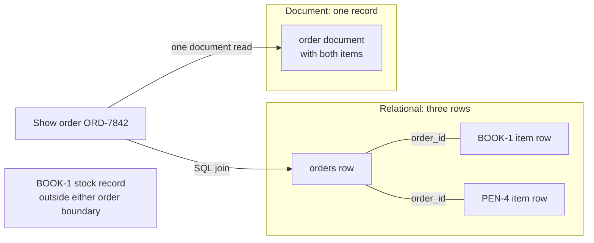

# Relational vs. document databases

## Purpose

Use this page to decide whether a relational database or a document database
is a better starting point for a workload. It explains how each one shapes the
same data, so that the choice follows from how your application reads and
changes that data.

It uses PostgreSQL as the relational example and MongoDB as the document
example, because those are the systems the official sources below describe.
Other products differ in detail.

## What the two models are

A **database** stores information so an application can find and change it.
A **query** is a request to find or combine that information. A
**relational database** organizes it in tables: named, typed columns and
rows. The table definition describes its columns now; it can be changed
later. A common design stores orders and their line items in separate tables
connected by matching identifiers.[^postgresql-table-basics][^postgresql-joins]

A **document database** stores data as documents: records with named fields
that can hold nested objects and lists. A document can carry related data
inside itself or refer to another document; it need not contain everything
about an entity.[^mongodb-data-modeling]

## Why it matters

The data model affects how an application answers questions and which mistakes
the database can stop for you. Choosing by habit or fashion can lead to data
split across tables when it is almost always read together, or to a document
that copies the same shared fact into many places.

Neither model is faster or more modern in general. Each makes a different set
of reads and writes simple.

## An analogy: ledgers and folders

Picture an office that keeps order records on paper:

- The **relational** office keeps separate ledgers for orders and line items.
  Matching order numbers connect entries across the ledgers.
- The **document** office keeps one folder per order. Everything about that
  order's line items is inside, so one trip to the cabinet shows that order.

Where the analogy stops being accurate:

- **A folder is not always complete.** Current product details can live in
  another record, and a report across every order still has to find matching
  line items across many folders.
- **Both offices can mix the approaches.** PostgreSQL can keep document-shaped
  JSON in a table, and MongoDB can link separate documents and combine them
  with `$lookup`.[^postgresql-json-types][^mongodb-lookup]
- **Paper does not enforce rules.** Real databases can reject invalid links
  or document shapes when the relevant constraints or validation rules are
  configured.[^postgresql-constraints][^mongodb-schema-validation]

## One order, two shapes

The example is an illustrative order, `ORD-7842`, for customer `CUST-52`, with
two line items. The values are placeholders, and nothing here is recorded
output.

### Relational shape

The order is split across tables. Key values repeat on purpose: `order_id`
appears on the order and again on each of its line items, because that is how
rows point at each other. Descriptive facts that several rows share, such as a
product's name, can be kept in one row and referred to by an identifier.
PostgreSQL uses **SQL**, a language for defining tables and asking for or
changing data.[^postgresql-table-basics][^postgresql-joins]

Table `orders`:

| order_id | customer_id | status | created_at |
| --- | --- | --- | --- |
| ORD-7842 | CUST-52 | paid | 2026-07-18 09:30 UTC |

Table `order_items`:

| order_id | sku | quantity | unit_price |
| --- | --- | --- | --- |
| ORD-7842 | BOOK-1 | 1 | 29.99 |
| ORD-7842 | PEN-4 | 3 | 1.50 |

`orders.order_id` is the **primary key**: it uniquely names an order row.
`order_items.order_id` is a **foreign key** to that row. When the constraint
is configured, PostgreSQL refuses a line item whose order does not exist.
To show the order page, the application uses a **join**: a query that pairs
the one `orders` row with its two `order_items` rows.[^postgresql-constraints][^postgresql-joins]
`customer_id` refers to a customer record not shown in this small example;
it would need its own constraint if the database must reject missing customers.

### Document shape

The order is one document. The line items live inside it.

```json
{
  "_id": "ORD-7842",
  "customerId": "CUST-52",
  "status": "paid",
  "createdAt": "2026-07-18T09:30:00Z",
  "items": [
    { "sku": "BOOK-1", "quantity": 1, "unitPrice": 29.99 },
    { "sku": "PEN-4", "quantity": 3, "unitPrice": 1.50 }
  ]
}
```

**JSON** is the text notation used for this readable sketch. MongoDB stores
documents as **BSON**, a binary format with types beyond JSON. In real MongoDB
data, a BSON Date represents `createdAt`; money needing exact decimal
precision can use Decimal128 rather than a floating-point number.[^mongodb-bson-types]
The relational example would likewise use suitable date and money types.

What it shows: an illustrative document in which the order and its line items
are read and written together. To show the order page, the application reads
one document. Adding a line item and changing the status in the same update is
one all-or-nothing write to one document.[^mongodb-atomicity]

### The all-or-nothing write boundary

A **transaction** groups changes so they take effect together or not at all.
**Atomic** describes that all-or-nothing property. A SQL **statement** is one
command sent to the database.[^postgresql-transactions]

To create this order in PostgreSQL, the application would insert one `orders`
row and two `order_items` rows. If those are three separate statements,
group them in one transaction (`BEGIN` through `COMMIT`) so a failed item
insert does not leave only part of the order committed. Without that group,
PostgreSQL can commit each successful statement separately. In MongoDB, one
insert of the order document includes both embedded items, and that
single-document write is atomic.[^postgresql-transactions][^mongodb-atomicity]

Now add a stock count for `BOOK-1` in a separate `products` row or document.
Creating the order and reducing stock cross two records. PostgreSQL can put
the row changes in one transaction; MongoDB can use a multi-document
transaction. Embedding line items alone does not make the separate stock
change atomic.[^postgresql-transactions][^mongodb-transactions]

An **index** is extra lookup data that can help a database find matching
records without scanning every one; maintaining it also has a cost when data
changes. An index helps locate candidates but does not calculate an order
total by itself.[^postgresql-indexes][^mongodb-multikey-embedded]
An **aggregation** is a sequence of steps that filters, reshapes, and totals
data, such as MongoDB's `$unwind` and `$group` stages.[^mongodb-unwind][^mongodb-group]

### What each shape makes easy

| Task | Relational shape | Document shape |
| --- | --- | --- |
| Show one order with its items | A join across two tables. | One document read. |
| Find total units sold of `BOOK-1` across all orders | Find matching `order_items` rows and sum their quantities. An index on `sku` can help find rows; the matching quantities still need to be totalled.[^postgresql-indexes] | Match orders on `items.sku` so an index can narrow the search. Use `$unwind` to turn each array item into a separate result, match `items.sku` to `BOOK-1` again so `PEN-4` is excluded, then `$group` and `$sum` the matching `items.quantity` values.[^mongodb-multikey-embedded][^mongodb-unwind][^mongodb-group] |
| Create the order and its two items together | Three inserts grouped in one transaction. | One atomic document insert. |
| Create the order and reduce stock in a separate product record | A transaction across the order, item, and product rows. | A multi-document transaction, or a different model that still preserves the stock rule. |
| Guarantee every line item belongs to a real order | Enforced by the foreign key. | True by construction while items are embedded. |
| Show the current product name, if the order page needs it | Look up the name by `sku` in a separate `products` table; that table is not shown above. | Reference a separate product document for the current name, or copy the name into orders. Copies can make reads simpler but must be updated when the name changes. Neither choice is required by the document model. |

One detail applies to both models: the price a customer paid is a historical
fact about the order. It is normally copied onto the line item in either
model, so that a later price change does not rewrite old orders.

## The mental model

A **schema** describes expected fields and their types. A MongoDB
**collection** is a group of documents, much as a table groups rows.

| Question | Relational | Document |
| --- | --- | --- |
| What is the unit of storage? | A row in a table. | A document in a collection. |
| How is related data connected? | Separate tables linked by keys. A declared foreign key constraint rejects a non-null value that points at a missing row.[^postgresql-constraints] | Often embedded inside the parent document. It can also be stored separately and referenced by a key value.[^mongodb-data-modeling] |
| How do you read related data? | A join query pairs rows from several tables.[^postgresql-joins] | If embedded, one read returns the document and its parts. If referenced, another query or a `$lookup` join is needed.[^mongodb-embedding][^mongodb-lookup] |
| Who fixes the shape? | The table definition lists columns and types; a value can be empty (`NULL`) unless a constraint forbids it. `ALTER TABLE` can change the definition later.[^postgresql-table-basics][^postgresql-modifying-tables] | By default, documents in one collection can differ; validation rules can limit types and allowed values.[^mongodb-schema-validation] |
| What is the natural unit of an all-or-nothing change? | Each statement runs in a transaction, even if it changes many rows. An explicit transaction can group several statements across tables.[^postgresql-transactions] | Each single-document write is atomic. A write affecting multiple documents is not atomic as a whole unless it runs in a multi-document transaction.[^mongodb-atomicity] |

## Visual: what the order boundary changes



Text alternative: to show `ORD-7842`, the relational route joins one order row
with its two item rows by `order_id`; creating those three rows as one
all-or-nothing change needs one transaction. The document route reads one
order document containing both items, and creates that document with one
atomic insert. A product stock record is outside either boundary. Use the
diagram to ask whether your common read and write stays inside an order or
crosses shared records.

## The decision question

Ask this first:

> Which pieces of data does the application read and change together, and
> which facts must stay consistent across separate records?

| What you observe about the workload | Lean towards | Why |
| --- | --- | --- |
| A record and its parts are nearly always read and written as one unit, and the parts are bounded in number. | Document | One read and one atomic write match the unit of work.[^mongodb-embedding] |
| New reports often combine orders, customers, and products in ways you did not plan when storing them. | Relational | Separate tables can be joined in new combinations, with useful indexes added for frequent questions.[^postgresql-joins][^postgresql-indexes] |
| A product or customer fact is shared by many orders and must be kept in one place. | Relational, or documents with references | A shared record avoids copies. A configured foreign key can reject a missing relational row; MongoDB references need application or transaction logic for cross-document rules.[^postgresql-constraints][^mongodb-data-modeling] |
| Changes routinely span several independent records and must be all-or-nothing. | Relational, or a document model with deliberate use of transactions | MongoDB supports multi-document transactions, but its documentation notes that they cost more than single-document writes and should not replace good schema design.[^mongodb-transactions] |
| Records of the same kind differ in their fields, and the set of fields is still changing. | Document with validation, or a relational table with a `jsonb` column for the varying part | MongoDB permits different shapes by default, but the application must still handle shapes already stored. PostgreSQL can change table definitions and store varying JSON data.[^mongodb-schema-validation][^postgresql-modifying-tables][^postgresql-json-types] |

For `ORD-7842`, embedding fits the whole-order read and write. A shared
product name or stock count points toward a separate record and an explicit
cross-record rule. A relational design can also keep JSON in a column, and
MongoDB can use references and joins; neither model rules out the other's
techniques.
Running both database systems can be justified, but it adds two systems to
operate, monitor, secure, and recover. These are leanings, not rules.

## Common misconceptions

- **"MongoDB has no joins."** It has `$lookup`.[^mongodb-lookup] The design
  guidance is to need joins less often, not that they are impossible.
- **"MongoDB has no transactions."** Single-document writes are atomic, and
  multi-document transactions are supported on replica sets (a group of
  MongoDB servers that maintain copies) and sharded clusters (data split
  across server groups).[^mongodb-transactions]
- **"Relational databases cannot store JSON."** PostgreSQL stores and indexes
  it.[^postgresql-json-types]
- **"Document databases have no schema."** The schema moves from the table
  definition into validation rules and application code. It does not
  disappear.[^mongodb-schema-validation]

## Check your understanding

- In the example, where is the quantity of `PEN-4` stored in each model?
- What must each model find and total to answer "how many units of `BOOK-1`
  were sold?" How could an index help either one?
- A comment thread can grow to tens of thousands of comments. Why is embedding
  every comment in the parent document risky?
- Your workload reads whole orders and also needs shared product data that
  must never disagree. What does the decision question suggest?

**Check your answers:**

1. `PEN-4` is an `order_items` row in the relational shape and an `items`
   entry inside the document.
2. Both totals need matching `BOOK-1` line-item quantities; an index may
   help locate records, but the quantities still need to be summed. In the
   document shape, filter again after `$unwind` so `PEN-4` does not enter the
   total.
3. A huge comment list can outgrow a useful document and may hit MongoDB's
   16 mebibyte limit.[^mongodb-limits]
4. Whole-order reads favour embedding, while shared product facts favour a
   separate record. A relational design can link an order to `products` with
   a foreign key and update stock in a transaction. A document design can
   embed the order items, reference a product document, and use a
   multi-document transaction for a stock change. Frequent unplanned reports
   across orders and products strengthen the relational case. Check the
   actual read and write patterns before choosing.

## Next steps

- Learn the document side in [MongoDB fundamentals](mongodb/fundamentals.md).
- Choose document shapes in [MongoDB data modeling](mongodb/data-modeling.md).
- Add guardrails with [schema validation and
  indexing](mongodb/schema-validation-and-indexing.md).
- Explore the relational side with the [PostgreSQL introductory
  tutorial](https://www.postgresql.org/docs/current/tutorial.html) while
  dedicated PostgreSQL pages are still planned.

## Official documentation for deeper study

- What a table is: [PostgreSQL - Table Basics](https://www.postgresql.org/docs/current/ddl-basics.html).
- Primary keys, foreign keys, and referential integrity: [PostgreSQL - Constraints](https://www.postgresql.org/docs/current/ddl-constraints.html).
- How joins pair rows: [PostgreSQL tutorial - Joins Between Tables](https://www.postgresql.org/docs/current/tutorial-join.html).
- All-or-nothing changes: [PostgreSQL tutorial - Transactions](https://www.postgresql.org/docs/current/tutorial-transactions.html).
- Changing columns in a table: [PostgreSQL - Modifying Tables](https://www.postgresql.org/docs/current/ddl-alter.html).
- How an index helps a query: [PostgreSQL - Introduction to Indexes](https://www.postgresql.org/docs/current/indexes-intro.html).
- JSON in a relational database: [PostgreSQL - JSON Types](https://www.postgresql.org/docs/current/datatype-json.html).
- Document modeling principles: [MongoDB - Data Modeling](https://www.mongodb.com/docs/manual/data-modeling/).
- Rules for document fields: [MongoDB - Schema Validation](https://www.mongodb.com/docs/manual/core/schema-validation/).
- When and how to embed: [MongoDB - Embedded Data](https://www.mongodb.com/docs/manual/data-modeling/embedding/).
- Joining collections: [MongoDB - `$lookup`](https://www.mongodb.com/docs/manual/reference/operator/aggregation/lookup/).
- Multi-document changes: [MongoDB - Transactions](https://www.mongodb.com/docs/manual/core/transactions/).
- The scope of an atomic write: [MongoDB - Atomicity and Transactions](https://www.mongodb.com/docs/manual/core/write-operations-atomicity/).
- Querying an array field with an index: [MongoDB - Index on an Embedded Field in an Array](https://www.mongodb.com/docs/manual/core/indexes/index-types/index-multikey/create-multikey-index-embedded/).
- Totalling array values: [MongoDB - `$unwind`](https://www.mongodb.com/docs/manual/reference/operator/aggregation/unwind/) and [`$group`](https://www.mongodb.com/docs/manual/reference/operator/aggregation/group/).
- Document size limits: [MongoDB - Limits and Thresholds](https://www.mongodb.com/docs/manual/reference/limits/).
- BSON Date and Decimal128 types: [MongoDB - BSON Types](https://www.mongodb.com/docs/manual/reference/bson-types/).

## Related links

- [MongoDB fundamentals](mongodb/fundamentals.md)
- [MongoDB data modeling](mongodb/data-modeling.md)
- [Back to databases index](index.md)
- [Back to knowledge index](../index.md)

[^postgresql-table-basics]: [PostgreSQL documentation - Table Basics](https://www.postgresql.org/docs/current/ddl-basics.html), source record `postgresql-table-basics`.
[^postgresql-constraints]: [PostgreSQL documentation - Constraints](https://www.postgresql.org/docs/current/ddl-constraints.html), source record `postgresql-constraints`.
[^postgresql-joins]: [PostgreSQL tutorial - Joins Between Tables](https://www.postgresql.org/docs/current/tutorial-join.html), source record `postgresql-joins`.
[^postgresql-json-types]: [PostgreSQL documentation - JSON Types](https://www.postgresql.org/docs/current/datatype-json.html), source record `postgresql-json-types`.
[^postgresql-transactions]: [PostgreSQL tutorial - Transactions](https://www.postgresql.org/docs/current/tutorial-transactions.html), source record `postgresql-transactions`.
[^postgresql-modifying-tables]: [PostgreSQL documentation - Modifying Tables](https://www.postgresql.org/docs/current/ddl-alter.html), source record `postgresql-modifying-tables`.
[^postgresql-indexes]: [PostgreSQL documentation - Introduction to Indexes](https://www.postgresql.org/docs/current/indexes-intro.html), source record `postgresql-indexes`.
[^mongodb-data-modeling]: [MongoDB manual - Data Modeling](https://www.mongodb.com/docs/manual/data-modeling/), source record `mongodb-data-modeling`.
[^mongodb-schema-validation]: [MongoDB manual - Schema Validation](https://www.mongodb.com/docs/manual/core/schema-validation/), source record `mongodb-schema-validation`.
[^mongodb-embedding]: [MongoDB manual - Embedded Data](https://www.mongodb.com/docs/manual/data-modeling/embedding/), source record `mongodb-embedding`.
[^mongodb-lookup]: [MongoDB manual - $lookup aggregation stage](https://www.mongodb.com/docs/manual/reference/operator/aggregation/lookup/), source record `mongodb-lookup`.
[^mongodb-transactions]: [MongoDB manual - Transactions](https://www.mongodb.com/docs/manual/core/transactions/), source record `mongodb-transactions`.
[^mongodb-atomicity]: [MongoDB manual - Atomicity and Transactions](https://www.mongodb.com/docs/manual/core/write-operations-atomicity/), source record `mongodb-atomicity`.
[^mongodb-multikey-embedded]: [MongoDB manual - Create an Index on an Embedded Field in an Array](https://www.mongodb.com/docs/manual/core/indexes/index-types/index-multikey/create-multikey-index-embedded/), source record `mongodb-multikey-embedded`.
[^mongodb-unwind]: [MongoDB manual - $unwind aggregation stage](https://www.mongodb.com/docs/manual/reference/operator/aggregation/unwind/), source record `mongodb-unwind`.
[^mongodb-group]: [MongoDB manual - $group aggregation stage](https://www.mongodb.com/docs/manual/reference/operator/aggregation/group/), source record `mongodb-group`.
[^mongodb-limits]: [MongoDB manual - Limits and Thresholds](https://www.mongodb.com/docs/manual/reference/limits/), source record `mongodb-limits`.
[^mongodb-bson-types]: [MongoDB manual - BSON Types](https://www.mongodb.com/docs/manual/reference/bson-types/), source record `mongodb-bson-types`.
