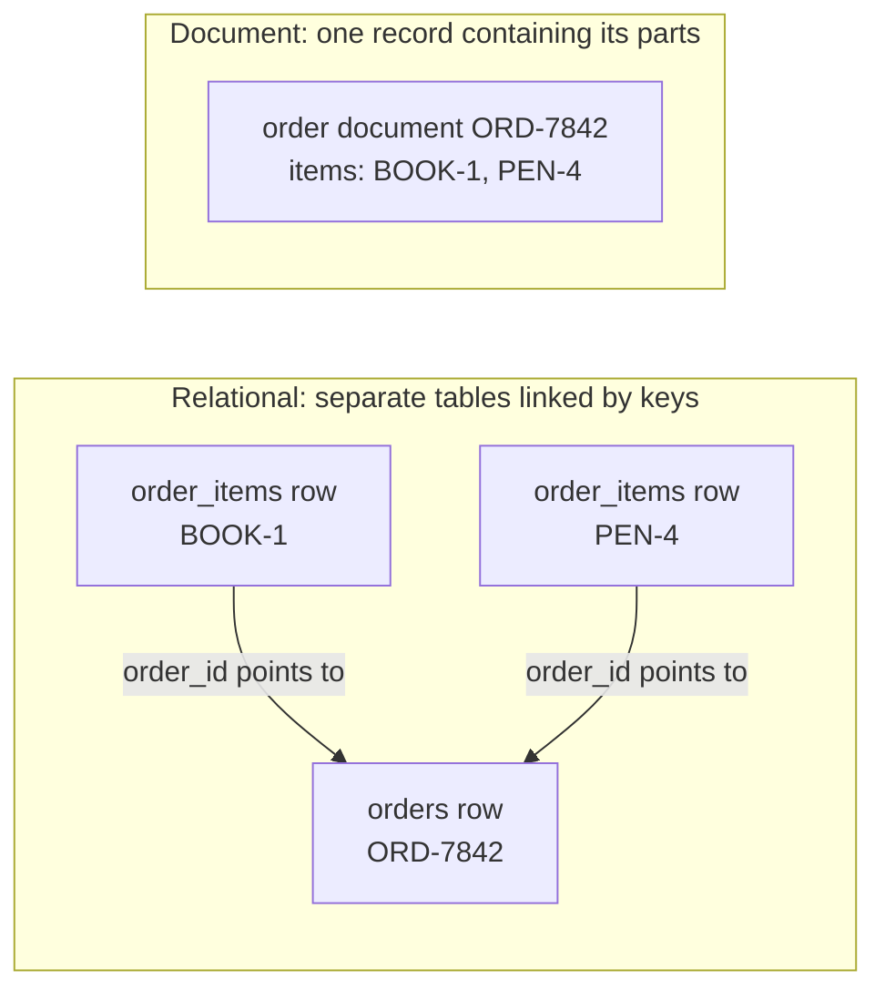

# Relational vs. document databases

## Purpose

Use this page to decide whether a relational database or a document database
is a better starting point for a workload. It explains how each one shapes the
same data, so that the choice follows from how your application reads and
changes that data.

It uses PostgreSQL as the relational example and MongoDB as the document
example, because those are the systems the official sources below describe.
Other products differ in detail.

## What the two models are

A **relational database** stores data in tables. A table has a fixed set of
named, typed columns and any number of rows.[^postgresql-table-basics] Each
kind of thing gets its own table, and rows point at each other through key
values.

A **document database** stores data as documents: self-contained records with
named fields that can hold nested objects and lists. A document can carry its
related data inside itself instead of pointing at other
records.[^mongodb-data-modeling]

## Why it matters

The data model affects how an application answers questions and which mistakes
the database can stop for you. Choosing by habit or fashion can lead to data
split across tables when it is almost always read together, or to a document
that copies the same shared fact into many places.

Neither model is faster or more modern in general. Each makes a different set
of reads and writes simple.

## The mental model

A **schema** describes the expected fields and their types. A **collection**
is a group of MongoDB documents, roughly like a table as a place to keep
records. A **join** combines related records from separate tables or
collections. A **primary key** uniquely identifies a relational row. A
**foreign key** holds a key from another table, allowing the database to
reject a non-null reference to a missing row.[^postgresql-constraints]

An **all-or-nothing** change is also called *atomic*: either the complete
change takes effect or none of it does. That promise has a different default
scope in the two examples below.

| Question | Relational | Document |
| --- | --- | --- |
| What is the unit of storage? | A row in a table. | A document in a collection. |
| How is related data connected? | Separate tables linked by keys. A foreign key makes the database reject a row that points at something missing.[^postgresql-constraints] | Often embedded inside the parent document. It can also be stored separately and referenced by a key value.[^mongodb-data-modeling] |
| How do you read related data? | A join query pairs rows from several tables.[^postgresql-joins] | If embedded, one read returns the document and its parts. If referenced, another query or a `$lookup` join is needed.[^mongodb-embedding][^mongodb-lookup] |
| Who fixes the shape? | The table definition fixes columns and types for every row. | By default, documents in one collection can differ; validation rules can be added where a fixed shape is needed.[^mongodb-data-modeling] |
| What is the natural unit of an all-or-nothing change? | Each statement runs in a transaction, even if it changes many rows. An explicit transaction can group several statements across tables.[^postgresql-transactions] | Each single-document write is atomic. A write affecting multiple documents is not atomic as a whole unless it runs in a multi-document transaction.[^mongodb-atomicity] |

## One order, two shapes

The example is an illustrative order, `ORD-7842`, for customer `CUST-52`, with
two line items. The values are placeholders, and nothing here is recorded
output.

### Relational shape

The order is split across tables. Key values repeat on purpose: `order_id`
appears on the order and again on each of its line items, because that is how
rows point at each other. Descriptive facts that several rows share, such as a
product's name or a customer's address, can each be kept in one row and
referred to by key.

Table `orders`:

| order_id | customer_id | status | created_at |
| --- | --- | --- | --- |
| ORD-7842 | CUST-52 | paid | 2026-07-18 09:30 |

Table `order_items`:

| order_id | sku | quantity | unit_price |
| --- | --- | --- | --- |
| ORD-7842 | BOOK-1 | 1 | 29.99 |
| ORD-7842 | PEN-4 | 3 | 1.50 |

`orders.order_id` is the primary key of `orders`.
`order_items.order_id` is a foreign key to `orders.order_id`. The database
refuses a line item for an order that does not exist. To show the order page,
the application runs a join that pairs the one `orders` row with its two
`order_items` rows.

### Document shape

The order is one document. The line items live inside it.

```json
{
  "_id": "ORD-7842",
  "customerId": "CUST-52",
  "status": "paid",
  "createdAt": "2026-07-18T09:30:00Z",
  "items": [
    { "sku": "BOOK-1", "quantity": 1, "unitPrice": 29.99 },
    { "sku": "PEN-4", "quantity": 3, "unitPrice": 1.50 }
  ]
}
```

The JSON is a readable sketch, not production BSON types. In real MongoDB
data, a BSON Date represents `createdAt`; money needing exact decimal
precision can use Decimal128 rather than a floating-point number.[^mongodb-bson-types]
The relational example would likewise use suitable date and money types.

What it shows: an illustrative document in which the order and its line items
are read and written together. To show the order page, the application reads
one document. Adding a line item and changing the status in the same update is
one atomic write to one document.[^mongodb-embedding]

### What each shape makes easy

| Task | Relational shape | Document shape |
| --- | --- | --- |
| Show one order with its items | A join across two tables. | One document read. |
| Find total units sold of `BOOK-1` across all orders | Query and total matching rows in `order_items`. | Filter orders by `items.sku`, then total matching item quantities. An index on that array field can find matching orders; the total still needs to examine their matching items.[^mongodb-multikey-embedded] |
| Guarantee every line item belongs to a real order | Enforced by the foreign key. | True by construction while items are embedded. |
| Show the current product name, if the order page needs it | Look up the name by `sku` in a separate `products` table; that table is not shown above. | Reference a separate product document for the current name, or copy the name into orders. Copies can make reads simpler but must be updated when the name changes. Neither choice is required by the document model. |

One detail applies to both models: the price a customer paid is a historical
fact about the order. It is normally copied onto the line item in either
model, so that a later price change does not rewrite old orders.

## Visual: where the line items live



Text alternative: on the relational side there are three separate rows. Each
of the two `order_items` rows holds an `order_id` that points to the single
`orders` row. On the document side there is one order document, and both line
items are inside it. The diagram shows where the line items are stored, which
is the difference that drives everything else on this page.

## An analogy: ledgers and folders

Picture an office that keeps order records on paper:

- The **relational** office keeps separate ledgers: one for customers, one for
  orders, one for line items. Each entry carries reference numbers that point
  into the other ledgers. A shared detail, such as a customer's address, can
  be written in one ledger and looked up from the others by number.
- The **document** office keeps one folder per order. Everything about that
  order is stapled inside, so one trip to the cabinet answers most questions.

Where the analogy stops being accurate:

- **Ledgers can hold copies too.** A relational design can duplicate data
  deliberately, for example to make a frequent report faster. A foreign key
  checks only that the row being pointed at exists. It does not check that two
  copies of the same fact agree, so duplicated facts can drift apart in either
  model.
- **You are not forced into one office.** PostgreSQL has `json` and `jsonb`
  column types, and `jsonb` values can be indexed, so a relational table can
  hold document-shaped data.[^postgresql-json-types] MongoDB has a `$lookup`
  stage that performs a left outer join between collections.[^mongodb-lookup]
- **Folders are not free-form.** A document collection can have validation
  rules, and the application still depends on documents having a predictable
  shape.[^mongodb-data-modeling]
- **A folder has a size limit and can go stale.** A MongoDB document can be
  at most 16 mebibytes, so a list that grows without bound does not belong
  inside it.[^mongodb-limits] Copies of shared facts stapled into many
  folders must all be updated when the fact changes.
- **Paper has no indexes.** Both kinds of database depend on indexes to find
  records quickly. The analogy says nothing about performance.

## The decision question

Ask this first:

> Which pieces of data does the application read and change together, and
> which facts must stay consistent across separate records?

| What you observe about the workload | Lean towards | Why |
| --- | --- | --- |
| A record and its parts are nearly always read and written as one unit, and the parts are bounded in number. | Document | One read and one atomic write match the unit of work.[^mongodb-embedding] |
| New questions often combine several kinds of separately stored entities, such as orders, customers, and products. | Relational | Tables that store each shared fact once can be joined in new combinations without changing where the facts are stored; useful indexes may still be needed.[^postgresql-joins] |
| Many facts are shared between records, and you want each kept in one place. | Relational | A shared fact can live in one referenced row, and a foreign key ensures the referenced row exists.[^postgresql-constraints] This protects only the facts you choose not to copy. |
| Changes routinely span several independent records and must be all-or-nothing. | Relational, or a document model with deliberate use of transactions | MongoDB supports multi-document transactions, but its documentation notes that they cost more than single-document writes and should not replace good schema design.[^mongodb-transactions] |
| Records of the same kind differ in their fields, and the set of fields is still changing. | Document, with validation on the fields that matter | Documents in a collection may differ by default, and rules can be added selectively.[^mongodb-data-modeling] |

These are leanings, not rules. Many systems use both: a relational database
for shared, heavily cross-referenced records and a document store for
self-contained ones.

## Common misconceptions

- **"MongoDB has no joins."** It has `$lookup`.[^mongodb-lookup] The design
  guidance is to need joins less often, not that they are impossible.
- **"MongoDB has no transactions."** Single-document writes are atomic, and
  multi-document transactions are supported on replica sets (a group of
  MongoDB servers that maintain copies) and sharded clusters (data split
  across server groups).[^mongodb-transactions]
- **"Relational databases cannot store JSON."** PostgreSQL stores and indexes
  it.[^postgresql-json-types]
- **"Document databases have no schema."** The schema moves from the table
  definition into validation rules and application code. It does not
  disappear.

## Check your understanding

- In the example, where is the quantity of `PEN-4` stored in each model?
- Which model answers "how many units of `BOOK-1` were sold?" more directly,
  and why?
- A comment thread can grow to tens of thousands of comments. Why is embedding
  every comment in the parent document risky?
- Your workload reads whole orders and also needs shared product data that
  must never disagree. What does the decision question suggest?

## Next steps

- Learn the document side in [MongoDB fundamentals](mongodb/fundamentals.md).
- Choose document shapes in [MongoDB data modeling](mongodb/data-modeling.md).
- Add guardrails with [schema validation and
  indexing](mongodb/schema-validation-and-indexing.md).
- Explore the relational side with the [PostgreSQL introductory
  tutorial](https://www.postgresql.org/docs/current/tutorial.html) while
  dedicated PostgreSQL pages are still planned.

## Official documentation for deeper study

- What a table is: [PostgreSQL - Table Basics](https://www.postgresql.org/docs/current/ddl-basics.html).
- Primary keys, foreign keys, and referential integrity: [PostgreSQL - Constraints](https://www.postgresql.org/docs/current/ddl-constraints.html).
- How joins pair rows: [PostgreSQL tutorial - Joins Between Tables](https://www.postgresql.org/docs/current/tutorial-join.html).
- All-or-nothing changes: [PostgreSQL tutorial - Transactions](https://www.postgresql.org/docs/current/tutorial-transactions.html).
- JSON in a relational database: [PostgreSQL - JSON Types](https://www.postgresql.org/docs/current/datatype-json.html).
- Document modeling principles: [MongoDB - Data Modeling](https://www.mongodb.com/docs/manual/data-modeling/).
- When and how to embed: [MongoDB - Embedded Data](https://www.mongodb.com/docs/manual/data-modeling/embedding/).
- Joining collections: [MongoDB - `$lookup`](https://www.mongodb.com/docs/manual/reference/operator/aggregation/lookup/).
- Multi-document changes: [MongoDB - Transactions](https://www.mongodb.com/docs/manual/core/transactions/).
- The scope of an atomic write: [MongoDB - Atomicity and Transactions](https://www.mongodb.com/docs/manual/core/write-operations-atomicity/).
- Querying an array field with an index: [MongoDB - Index on an Embedded Field in an Array](https://www.mongodb.com/docs/manual/core/indexes/index-types/index-multikey/create-multikey-index-embedded/).
- Document size limits: [MongoDB - Limits and Thresholds](https://www.mongodb.com/docs/manual/reference/limits/).
- BSON Date and Decimal128 types: [MongoDB - BSON Types](https://www.mongodb.com/docs/manual/reference/bson-types/).

## Related links

- [MongoDB fundamentals](mongodb/fundamentals.md)
- [MongoDB data modeling](mongodb/data-modeling.md)
- [Back to databases index](index.md)
- [Back to root index](../../README.md)

[^postgresql-table-basics]: [PostgreSQL documentation - Table Basics](https://www.postgresql.org/docs/current/ddl-basics.html), source record `postgresql-table-basics`.
[^postgresql-constraints]: [PostgreSQL documentation - Constraints](https://www.postgresql.org/docs/current/ddl-constraints.html), source record `postgresql-constraints`.
[^postgresql-joins]: [PostgreSQL tutorial - Joins Between Tables](https://www.postgresql.org/docs/current/tutorial-join.html), source record `postgresql-joins`.
[^postgresql-json-types]: [PostgreSQL documentation - JSON Types](https://www.postgresql.org/docs/current/datatype-json.html), source record `postgresql-json-types`.
[^postgresql-transactions]: [PostgreSQL tutorial - Transactions](https://www.postgresql.org/docs/current/tutorial-transactions.html), source record `postgresql-transactions`.
[^mongodb-data-modeling]: [MongoDB manual - Data Modeling](https://www.mongodb.com/docs/manual/data-modeling/), source record `mongodb-data-modeling`.
[^mongodb-embedding]: [MongoDB manual - Embedded Data](https://www.mongodb.com/docs/manual/data-modeling/embedding/), source record `mongodb-embedding`.
[^mongodb-lookup]: [MongoDB manual - $lookup aggregation stage](https://www.mongodb.com/docs/manual/reference/operator/aggregation/lookup/), source record `mongodb-lookup`.
[^mongodb-transactions]: [MongoDB manual - Transactions](https://www.mongodb.com/docs/manual/core/transactions/), source record `mongodb-transactions`.
[^mongodb-atomicity]: [MongoDB manual - Atomicity and Transactions](https://www.mongodb.com/docs/manual/core/write-operations-atomicity/), source record `mongodb-atomicity`.
[^mongodb-multikey-embedded]: [MongoDB manual - Create an Index on an Embedded Field in an Array](https://www.mongodb.com/docs/manual/core/indexes/index-types/index-multikey/create-multikey-index-embedded/), source record `mongodb-multikey-embedded`.
[^mongodb-limits]: [MongoDB manual - Limits and Thresholds](https://www.mongodb.com/docs/manual/reference/limits/), source record `mongodb-limits`.
[^mongodb-bson-types]: [MongoDB manual - BSON Types](https://www.mongodb.com/docs/manual/reference/bson-types/), source record `mongodb-bson-types`.
