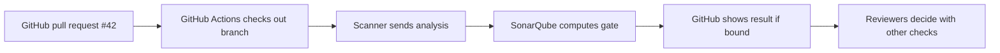

# SonarQube GitHub integration

## The idea in plain language

GitHub holds the code and pull request. A GitHub Actions job can run a
SonarScanner against that checked-out code and send analysis to SonarQube
Server. When the SonarQube project is bound to the GitHub repository and pull
request analysis is configured, SonarQube can return a quality gate result
and findings to the pull request.[^sonar-github-actions][^sonar-github-binding]

Think of GitHub as the workshop and SonarQube as a specialist inspection
bench. A worker takes a copy of a proposed change to the bench; the bench
reports what it found. Connecting the workshop to the bench does not send
every code change automatically: a configured analysis job still has to run.

## Three connections, three jobs

| Connection | What it does | What it does not do |
| --- | --- | --- |
| GitHub App and project binding | Let SonarQube associate a project with a GitHub repository and report back to it.[^sonar-github-app][^sonar-github-binding] | Analyze the code by itself. |
| GitHub Actions and scanner | Check out code and submit analysis to SonarQube.[^sonar-github-actions] | Guarantee a quality gate passes. |
| Pull request decoration | Display analysis summary, gate status, and supported findings in GitHub after a valid pull request analysis.[^sonar-github-binding] | Replace human review or a required-check policy. |

These are distinct steps. A successful scanner job without repository binding
can leave a result visible in SonarQube but absent from the GitHub pull
request. A bound project without a working scanner has no fresh analysis to
report.[^sonar-github-binding][^sonar-pr-analysis]

## Follow one pull request

Suppose a developer opens pull request `#42` to add a validation function.
This is an illustrative sequence, not an observed run.

Text alternative: the pull request triggers a workflow; the scanner sends
the checked-out code's analysis to SonarQube; SonarQube computes the gate and
reports it to the bound GitHub repository; reviewers consider the result with
tests and code review. GitHub Actions can supply pull request parameters
automatically in supported SonarQube Server editions.[^sonar-github-actions][^sonar-pr-analysis]

The job needs a SonarQube token, kept in GitHub Actions secrets, and the
server URL. SonarQube recommends a full Git checkout so it can find the
target branch and source history for pull request analysis. The runner also
needs network access to the SonarQube Server.[^sonar-github-actions][^sonar-pr-analysis]

## What a required check changes

Pull request decoration makes the gate *visible*. A GitHub ruleset or branch
protection rule can make that reported check *required* before merge. That is
a separate GitHub policy choice; a failing gate alone does not necessarily
block a merge.[^sonar-github-binding]

Before requiring the check, run it on a representative pull request and
confirm that it reports for the expected repository and revision. Then check
whether the team's gate conditions match its policy. A missing check can
otherwise block merging for reasons unrelated to the proposed code. This is
operational advice based on how required checks work, not a claim that any
repository here has been configured.

## Security alerts are another path

SonarQube can also report supported security issues as GitHub code scanning
alerts when a bound project and the additional alert integration are set up.
This is separate from the quality gate summary on the pull request. The
SonarQube Server documentation identifies the alert feature as available
starting in Developer Edition; check the installed edition and current
GitHub App permissions before planning around it.[^sonar-security-alerts]

## If a result is missing

| What you see | First question to answer |
| --- | --- |
| No SonarQube analysis | Did the workflow run, reach the server, and authenticate? |
| Analysis in SonarQube but no pull request result | Is this project bound to the right GitHub repository, and was it recognized as pull request analysis? |
| Wrong changed-code findings | Did CI check out the source and target branches with usable Git history? |
| Gate result appears but merge is not blocked | Is the SonarQube check required by the target branch's ruleset or protection rule? |

Start at the first missing step in the path instead of changing the quality
gate to compensate for an integration problem. See [SonarQube](sonarqube.md)
for the difference between analysis, profiles, and gates.

## Check your understanding

- What does the scanner send, and what does project binding enable?
- Why can a gate be visible in a pull request without blocking merge?
- Why are GitHub code scanning alerts a separate setup decision?

## Official documentation for deeper study

- [GitHub Actions analysis](https://docs.sonarsource.com/sonarqube-server/2026.1/analyzing-source-code/ci-integration/github-actions) covers tokens, checkout, and scanner choices.
- [GitHub App setup](https://docs.sonarsource.com/sonarqube-server/2026.1/instance-administration/devops-platforms/github/setting-up-github-app) explains the global integration and permissions.
- [Project binding](https://docs.sonarsource.com/sonarqube-server/2026.1/project-administration/creating-project/github/configure-binding) explains pull request reporting and required checks.
- [Pull request analysis](https://docs.sonarsource.com/sonarqube-server/2026.1/analyzing-source-code/setting-up-the-pull-request-analysis) lists the repository and branch prerequisites.
- [Security alert reporting](https://docs.sonarsource.com/sonarqube-server/2026.1/instance-administration/devops-platforms/github/report-security-alerts) describes its separate configuration.

See the [code quality index](index.md) or the [DevOps index](../index.md).

[^sonar-github-actions]: [GitHub Actions analysis](https://docs.sonarsource.com/sonarqube-server/2026.1/analyzing-source-code/ci-integration/github-actions).
[^sonar-github-binding]: [Configuring GitHub project binding](https://docs.sonarsource.com/sonarqube-server/2026.1/project-administration/creating-project/github/configure-binding).
[^sonar-pr-analysis]: [Setting up the pull request analysis](https://docs.sonarsource.com/sonarqube-server/2026.1/analyzing-source-code/setting-up-the-pull-request-analysis).
[^sonar-github-app]: [Setting up a GitHub App](https://docs.sonarsource.com/sonarqube-server/2026.1/instance-administration/devops-platforms/github/setting-up-github-app).
[^sonar-security-alerts]: [Setting up the report of security alerts](https://docs.sonarsource.com/sonarqube-server/2026.1/instance-administration/devops-platforms/github/report-security-alerts).
