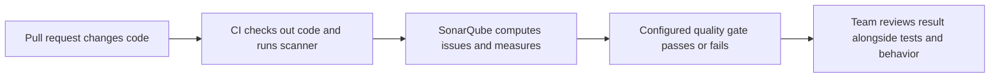

# SonarQube

## The idea in plain language

SonarQube Server reads code and reports patterns that deserve attention. It
can highlight reliability, security, and maintainability issues and combine
selected measures into a **quality gate**: a pass or fail result for the
conditions a team chose.[^sonar-analysis-process][^sonar-quality-gates]

Imagine an editor checking a draft. The editor can flag repeated phrases and
possible mistakes, but cannot know whether the story answers its readers'
real question. SonarQube plays a similar supporting role for code. Its
findings and gate help reviewers focus; they do not prove that software works
for users or that it is secure.

## Four pieces to keep separate

| Piece | Simple meaning | What to ask |
| --- | --- | --- |
| Scanner | A tool run during a build or CI job that analyzes checked-out code and sends results to the server.[^sonar-analysis-process] | Did it analyze the code we intend to merge? |
| Quality profile | The set of language rules used to find issues.[^sonar-new-code] | Which rules are active for this project? |
| New code definition | The boundary for recently added or changed code. In a pull request, SonarQube compares the branch with its target.[^sonar-new-code] | Which changes count as new here? |
| Quality gate | Conditions on analysis measures that decide pass or fail.[^sonar-quality-gates] | Which measures and thresholds decide the result? |

A rule can raise an **issue**. A quality gate then checks its configured
conditions against the analysis result. The gate is a policy decision, not a
second independent analysis. SonarQube's built-in *Sonar way* gate focuses on
new code, including new issues, reviewed security hotspots, coverage, and
duplication.[^sonar-quality-gates]

## Follow one change

Suppose a team adds a new function to a service. This is an invented example;
no repository or SonarQube instance was analyzed for this page.

Text alternative: a pull request triggers CI; the scanner sends its analysis
to SonarQube; SonarQube calculates the gate; the team considers that result
with other evidence before merging. The gate result can be reported back to
CI or a pull request when integration is configured.[^sonar-analysis-process][^sonar-quality-gates]

If the new function contains a pattern forbidden by an active rule, the
scanner may report an issue. If that issue meets a failing gate condition,
the gate fails. A reviewer should inspect the specific finding and either
fix it or follow the team's documented triage policy. Changing the gate just
to make this one pull request pass would hide the signal.

If the gate passes, the team still needs tests, human review, and any
domain-specific checks. The scanner cannot infer that a user journey is
correct, and coverage is a measure of executed code, not proof of useful
assertions. This is a limit of what static analysis and its metrics can show,
not a claim about a particular project.

## Why teams focus on new code

A mature repository may contain years of findings. Trying to clear all of
them before the next change can make a gate unusable. A new-code gate asks a
smaller question: **did this change introduce a problem under our current
policy?** SonarQube distinguishes new-code results from overall-code
results; pull request gates apply new-code conditions.[^sonar-new-code][^sonar-quality-gates]

That approach does not erase older problems. Teams still need to prioritize
old issues by risk and improve them deliberately. Also inspect the actual
gate definition: a custom gate can use different measures and thresholds
from *Sonar way*.

## Where confusion usually starts

| Observation | Likely explanation | First check |
| --- | --- | --- |
| Scanner job failed | Analysis may not have completed. | Look at the scanner error before interpreting any prior gate result. |
| Analysis completed; gate failed | A configured condition was not met. | Open the failing condition and the underlying findings. |
| Gate passed; tests failed | The checks answer different questions. | Fix the failed test; do not treat the gate as a substitute. |
| New-code results look wrong | The target branch, new-code definition, or Git history may be wrong. | Check the analyzed revision and the checkout metadata. |

For GitHub Actions, SonarQube recommends a full checkout (`fetch-depth: 0`)
so analysis has the Git history needed for blame and new-code context.[^sonar-analysis-process]
See [GitHub integration](sonarqube-github-integration.md) for how a result
reaches a pull request.

## Check your understanding

- What does a quality profile decide, and what does a quality gate decide?
- If a gate passes but a user flow is broken, which additional evidence is
  missing?
- Why should a team check the analyzed revision before trusting a gate?

## Official documentation for deeper study

- [Analysis process](https://docs.sonarsource.com/sonarqube-server/2026.1/discovering/analysis-overview/process-steps) follows code from CI checkout through scanner submission and gate calculation.
- [Quality standards and new code](https://docs.sonarsource.com/sonarqube-server/2026.1/user-guide/about-new-code) explains profiles, new-code boundaries, and the default gate approach.
- [Understanding quality gates](https://docs.sonarsource.com/sonarqube-server/2026.1/quality-standards-administration/managing-quality-gates/introduction-to-quality-gates) details gate conditions and pull request behavior.

See the [code quality index](index.md) or the [DevOps index](../index.md).

[^sonar-analysis-process]: [SonarQube Server analysis process](https://docs.sonarsource.com/sonarqube-server/2026.1/discovering/analysis-overview/process-steps).
[^sonar-new-code]: [Quality standards and new code](https://docs.sonarsource.com/sonarqube-server/2026.1/user-guide/about-new-code).
[^sonar-quality-gates]: [Understanding quality gates](https://docs.sonarsource.com/sonarqube-server/2026.1/quality-standards-administration/managing-quality-gates/introduction-to-quality-gates).
