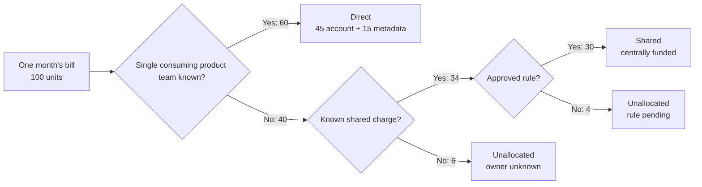

# Cost allocation basics

## Purpose

Use this guide to create a first cost-allocation policy that lets engineering,
product, and finance explain who owns cloud usage and what to do with shared
costs. It assumes access to a cost report and agreement on the teams or
products that will receive costs. The example is illustrative; no billing
system was changed for this page.

**Allocation** means assigning a cost to a responsible group. It may use
account or project ownership, tags, labels, a business mapping, or a shared
cost rule. A tag is one input, not the policy itself. The FinOps Framework
separates allocation, metadata, and shared-cost strategies for this
reason.[^finops-allocation]

Think of a bill for a shared building: a team can own its room directly, while
the lobby needs an agreed rule. The analogy stops at measurement. Cloud
providers expose different usage data, and a cost line may be impossible to
attribute to one resource.

## Define the allocation model

Start with a small set of mandatory ownership dimensions. Use names that match
systems people already recognize. Ask finance and product owners which
groupings they need before creating metadata keys.[^finops-allocation]

| Dimension | Example values | Decision it supports |
| --- | --- | --- |
| Owner | `payments`, `platform`, `data` | Who investigates cost and usage? |
| Application or service | `checkout-api`, `event-pipeline` | Which product or technical service consumed it? |
| Environment | `development`, `staging`, `production` | Which lifecycle boundary generated the cost? |
| Cost center or product | `cc-1042`, `subscriptions` | Which budget or business outcome receives the cost? |

Keep authoritative values in one owned registry. Do not create a tag key unless
a report, budget, policy, or decision will use it. Decide whether the first
report is **showback** (visibility) or **chargeback** (an internal financial
transfer); the second needs explicit agreement with finance on transfers,
disputes, and adjustments.[^finops-cost-allocation-guide]

## Roll out the first policy

1. Agree which bills, charge types, month, currency, and **cost basis** form
   the report total. Billed cost follows what is invoiced for the period.
   Effective cost allocates eligible commitment purchase amounts to the usage
   they cover, so its monthly total can differ from the invoice. Never add
   billed purchase lines to effective usage lines in one total. Record how
   any currency conversion was made.[^focus-billed-cost][^focus-effective-cost]
2. Define the teams and products that may receive costs, the required
   ownership fields, allowed values, and who approves exceptions. Give the
   policy a version and an effective date.
3. Map accounts, projects, subscriptions, and resource tags to those values
   where the provider supplies that data. Record which source wins if they
   disagree, for example an approved account owner mapping versus a resource
   tag. Apply the same precedence to every billing line.
4. Put ownership metadata in provisioning templates and checks, with an
   exception route for resources that genuinely cannot use those fields.
   Record charges that cannot carry resource tags; use account or business
   mappings when appropriate.[^finops-allocation]
5. Record shared charges separately with their rule, funding owner or split
   driver, approver, effective date, and review date. Assign someone to
   investigate still-unallocated cost by the next reporting cycle.
6. Produce a baseline report before enforcing new checks. Separate direct,
   shared with an approved rule, and unresolved cost; reconcile their sum to
   the chosen total. Review the report with engineering and finance each
   month. Label an open month's figures as provisional.
7. Correct missing ownership metadata for future usage and decide how to
   classify older billing lines for the period in which they occurred.
   Retagging now does not create historical tag values that never existed;
   provider backfill has separate limits.[^aws-cost-tag-backfill]

Expected result: a report can answer both "which team owns this cost?" and
"which costs still need a decision?" If the two answers disagree with an
account or resource inventory, inspect the mapping and report time period
before changing tags.

> [!IMPORTANT]
> Cost data and tag availability vary by provider and service. Validate
> reporting behavior in the target provider before treating a tag as an
> immediate allocation signal. For AWS, see the separate [cost allocation tags
> explanation](../cloud/aws/finops/cost-allocation-tags.md): a resource tag
> alone does not make it available in billing reports.

## Decide how shared costs work

Shared networking, observability, security, platform clusters, and support
plans often cannot be assigned directly to one application. For each shared
cost, document one of these choices:

- Keep it centrally funded and visible.
- Split it by a fixed percentage.
- Split it proportionally by direct spend or a usage metric.
- Assign it to a platform product with an agreed internal price model.

The important outcome is that a shared cost is visible and has a documented
rule, rather than silently appearing as unallocated spend. The FinOps
Framework explicitly allows a shared cost to remain centrally funded when
that is a deliberate business choice.[^finops-allocation]
Splitting a shared bill later does not turn it into a direct cost: keep the
shared classification and show how the split was calculated. For a
proportional split, name the base, such as *direct product spend*, and do not
quietly include unresolved cost in it.[^finops-cost-allocation-guide]

## Illustrative first report

Suppose one closed month has 100 units of billed cloud cost in one currency.
Account mappings identify 45 units consumed by product teams; valid resource
metadata identifies another 15 in a mixed account. A shared platform account
costs 30, and finance approves central funding. Of the last 10, a 4-unit
support charge is known to be shared but has no approved rule yet; 6 units in
a mixed account lack a reliable consuming owner. These are invented amounts,
not measured usage.

| Bucket | Amount | How to explain it |
| --- | ---: | --- |
| Direct by account | 45 | The account mapping identifies the consuming product team. |
| Direct by resource metadata | 15 | Resource metadata identifies the consuming product team in a mixed account. |
| Shared, rule recorded | 30 | Platform holds the central budget; no product team is charged. |
| Shared, no rule yet | 4 | The charge is known to be shared, but its funding or split is undecided. |
| Consuming owner unknown | 6 | No trustworthy account or resource mapping identifies the consumer. |

The buckets add to 100. Here, *direct* means that a consuming product team is
identified. A platform team holding the budget for a shared charge is a
funding decision, not direct consumption. Direct coverage is `(45 + 15) / 100
= 60%`. Decision coverage is `(45 + 15 + 30) / 100 = 90%`. Unallocated cost
is `4 + 6 = 10`, and shared-rule coverage is `30 / (30 + 4)`, about 88%.
Do not count the 30-unit shared charge twice.[^finops-allocation]
"Shared" describes the kind of charge; "unallocated" means that no funding
or split decision has been approved. The 4-unit support charge is both known
to be shared and still unallocated. Add the five table rows to reach 100;
do not add percentages from different measures. The measures below are
definitions for this guide, not named FinOps Framework metrics.

Text alternative: of the invented 100 units, 60 map directly to consuming
teams; 34 are known shared charges, of which 30 have a central-funding rule
and 4 have no rule; the remaining 6 have no identified consumer.

## Measure coverage

Track these measures at a consistent cadence:

| Measure | Calculation | Use |
| --- | --- | --- |
| Direct allocation coverage | Direct cost mapped to one consuming owner / total cost | 60% in the example. Shared cost stays outside the numerator even after a split. |
| Decision coverage | (Direct cost + shared cost with an approved rule) / total cost | 90% in the example; central funding counts as a decision, not direct usage. |
| Unallocated cost | Cost with neither a valid direct owner nor an approved shared-cost rule | 10 units in the example: 4 known shared plus 6 with an unknown consumer. |
| Shared-cost rule coverage | Shared cost with an approved rule / all identified shared cost | About 88% in the example: `30 / 34`. |
| Resource-tag compliance by cost | Taggable resource cost with valid required tags / taggable resource cost | Measures the tag policy, separately from allocation. Report untaggable cost too. |

The example does not give enough information to calculate tag compliance:
cost assigned by account might also be tagged, and shared cost might be
taggable or untaggable. Define which tags count as required, and show the
excluded untaggable amount beside the compliance rate. Reconcile every report
to the provider's total for the same period, currency, and cost basis: the
invoice total for billed cost, or summed effective cost for an effective-cost
view. A higher coverage percentage is useful only when assignments are
accurate; do not hide
uncertain costs in a catch-all owner to improve the number.

## Check your understanding

- Can you identify a direct owner and a shared-cost rule without relying on
  the same tag for every charge?
- In the example, why is direct coverage 60% when 90% has an approved
  decision, and where did the other 30 units go?
- Who approves the rule for the shared platform account?

## Official documentation for deeper study

- [FinOps Framework: Allocation](https://framework.finops.org/framework/capabilities/allocation/) defines the allocation, metadata, and shared-cost strategies.
- [FinOps cloud cost allocation guide](https://www.finops.org/wg/cloud-cost-allocation/) discusses shared-cost choices and organizational practice.
- [FOCUS Billed Cost](https://focus.finops.org/docs/specification/v1-4/columns/invoice-detail/billed-cost/) and [Effective Cost](https://focus.finops.org/docs/specification/v1-4/columns/cost-and-usage/effective-cost/) explain two different bases for financial and usage views.
- [AWS cost allocation tag backfill](https://docs.aws.amazon.com/awsaccountbilling/latest/aboutv2/cost-allocation-backfill.html) shows why adding a tag now cannot create past values that were never present.

## Related links

- [AWS cost allocation tags](../cloud/aws/finops/cost-allocation-tags.md)
- [FinOps Framework allocation capability](https://framework.finops.org/framework/capabilities/allocation/)
- [Back to FinOps](index.md)
- [Back to knowledge index](../index.md)

[^finops-allocation]: [FinOps Framework - Allocation](https://framework.finops.org/framework/capabilities/allocation/), source record `finops-allocation`.
[^finops-cost-allocation-guide]: [FinOps cloud cost allocation guide](https://www.finops.org/wg/cloud-cost-allocation/), source record `finops-cost-allocation-guide`.
[^focus-billed-cost]: [FOCUS specification - Billed Cost](https://focus.finops.org/docs/specification/v1-4/columns/invoice-detail/billed-cost/), source record `focus-billed-cost`.
[^focus-effective-cost]: [FOCUS specification - Effective Cost](https://focus.finops.org/docs/specification/v1-4/columns/cost-and-usage/effective-cost/), source record `focus-effective-cost`.
[^aws-cost-tag-backfill]: [AWS Billing - Backfill cost allocation tags](https://docs.aws.amazon.com/awsaccountbilling/latest/aboutv2/cost-allocation-backfill.html), source record `aws-cost-tag-backfill`.
