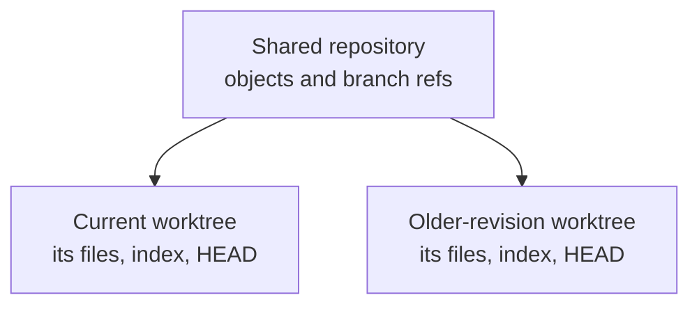

# Inspect an older Git revision in a second worktree

## The simple idea

A Git **worktree** is another working directory attached to the same
repository. Each worktree has its own checked-out files, index, and `HEAD`;
they share the repository's object store and most refs. You can inspect an
older commit in a second directory while current, uncommitted edits stay in
the first.[^git-worktree]

Picture two desks reading from one archive. Papers spread across one desk
do not appear on the other. The analogy stops at the archive: new commits
and branch ref updates are shared, and a worktree is not a separate remote
repository or a security boundary.[^git-worktree]



Text alternative: both worktrees use one repository's object store and
branch refs, while each worktree has separate checked-out files, index,
and `HEAD`. A file edit in one directory does not copy into the other.

## Use a temporary checkout to inspect a change

Imagine a lesson project with at least two commits. You have an unfinished
edit in the current directory and want to see how the previous revision
behaved. `HEAD~1` means the first parent of the current commit. This
example does not fetch, push, or change either branch.[^git-worktree]

1. Inspect the current directory and make sure you are in the intended
   repository:

   ```bash
   git status --short --branch
   git rev-parse --show-toplevel
   ```

   Run the remaining commands from the repository root reported above;
   relative paths use your shell's current directory. Record the current
   branch and unfinished paths. Choose a sibling path that does not already
   contain files; here it is `../lesson-older`. Stop if `HEAD~1` does not
   exist or that path is already in use.

2. Add a detached worktree at the previous commit:

   ```bash
   git worktree add --detach ../lesson-older HEAD~1
   git worktree list
   ```

   `--detach` lets you inspect the commit without moving or creating a
   branch. `git worktree list` should show both directories, with the
   second at the older commit.[^git-worktree]

3. Read from the second directory without changing your shell location:

   ```bash
   git -C ../lesson-older status --short --branch
   git -C ../lesson-older log -1 --oneline
   ```

   Open the files or run a safe inspection there. A detached `HEAD` is fine
   for reading. If you decide to make and keep a fix, first create a
   properly named branch in that worktree; commits left only on a detached
   tip are easy to lose track of.

4. Check both directories before cleanup:

   ```bash
   git -C ../lesson-older status --short
   git status --short
   ```

   The temporary worktree should be clean. Your original unfinished edits
   should still be visible in the second status output from the original
   directory.
   If the temporary worktree has work you need, commit it on a branch or
   copy it to a reviewed location before removing the worktree.

5. Remove only the clean temporary worktree:

   ```bash
   git worktree remove ../lesson-older
   git worktree list
   ```

   Git refuses ordinary removal of a worktree with uncommitted changes.
   Do not force removal as a cleanup shortcut. The original directory
   remains in the worktree list.[^git-worktree]

This sequence was checked in a disposable Git 2.53.0 repository with two
commits and one uncommitted edit in the original directory. It did not
exercise a remote or a shared team branch.

## Know which advanced operation you actually need

The worktree example changes **which files you inspect**. Other advanced
commands affect history, refs, or repository data. Start from the task
rather than trying commands in sequence:

| Need | Official command | Boundary to understand first |
| --- | --- | --- |
| Revise your own commit series | [`git rebase`](https://git-scm.com/docs/git-rebase) | Replayed commits get new IDs; save the old tip and avoid rewriting others' work. |
| Compare an old and revised series | [`git range-diff`](https://git-scm.com/docs/git-range-diff) | It compares patch series; it does not prove the application behaves the same. |
| Apply one commit on another branch | [`git cherry-pick`](https://git-scm.com/docs/git-cherry-pick) | It creates a new commit and may conflict or duplicate a change. |
| Locate a regression with a reliable test | [`git bisect`](https://git-scm.com/docs/git-bisect) | It checks out other revisions; start with known good and bad points and restore your starting state afterward. |
| Limit a large working tree | [`git sparse-checkout`](https://git-scm.com/docs/git-sparse-checkout) | It changes which paths are populated locally, not which repository data you may access. |
| Diagnose object integrity | [`git fsck`](https://git-scm.com/docs/git-fsck) | Diagnose first; do not run pruning or repair commands without a backup and a specific cause. |
| Update a remote after a coordinated rewrite | [`git push --force-with-lease`](https://git-scm.com/docs/git-push) | The lease checks an expected remote value but still replaces history; confirm the branch and team agreement. |

The [Git recovery guide](../troubleshooting/undo-and-recovery.md) covers
mistakes by location, and [common use cases](common-use-cases.md) covers
the ordinary branch-to-review path. The
[Git command map](complete-command-catalog.md) helps find official
references for other tasks.

## Check your understanding

- Which parts of two worktrees are separate, and which repository data do
  they share?
- Why does `--detach` suit reading an older commit but need extra care
  before keeping a new commit?
- What would you inspect before `git worktree remove`?
- Why does `--force-with-lease` still need coordination on a shared branch?

## Official documentation and next routes

- [Worktree](https://git-scm.com/docs/git-worktree) and
  [status](https://git-scm.com/docs/git-status) define the inspected
  directory and cleanup behavior.
- [Rebase](https://git-scm.com/docs/git-rebase),
  [range-diff](https://git-scm.com/docs/git-range-diff),
  [cherry-pick](https://git-scm.com/docs/git-cherry-pick), and
  [bisect](https://git-scm.com/docs/git-bisect) cover separate history tasks.
- Return to [Git commands](index.md), [Git](../index.md), or the
  [knowledge index](../../index.md).

[^git-worktree]: [Git documentation, git-worktree](https://git-scm.com/docs/git-worktree).
