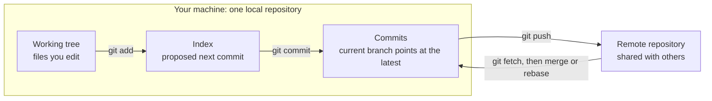

# Git fundamentals

## Purpose

Read this before learning Git commands or recovery steps. It explains where a
change lives at each moment, so that later commands such as `git add`,
`git commit`, `git push`, `git restore`, and `git revert` have an obvious
meaning instead of feeling like spells.

After reading it, you should be able to say which version of a file is in your
working tree, in the index, and in your latest commit, which commit your branch
points at, and whether the remote repository has that commit yet.

## What Git is

Git is a version-control system: it records snapshots of a project folder so
you can compare versions, return to an earlier one, work on several lines of
change at once, and exchange that history with other people.

Git keeps a repository's history and settings as metadata alongside your
files. In an ordinary repository that metadata is in a hidden `.git` directory
at the top of the project folder. You get one either by running `git init` in
an existing folder or by copying an existing repository with `git clone`, which
downloads its history and checks out a working copy of the latest
version.[^pro-git-getting-repository]

You may occasionally see a `.git` that is a small text file instead of a
directory. Linked worktrees and submodules use that file to point at metadata
stored elsewhere.[^git-repository-layout] The model on this page is the same
either way.

## Why the model matters

Most beginner Git trouble comes from one misunderstanding: assuming a change is
somewhere it is not. Typical examples are "I committed, so my teammate has it"
or "I ran `git add`, so my later edits will be committed too". Neither is true,
and both become obvious once you can picture where each version of a file is
held.

The same model decides how safe an undo is. A change that exists only on your
machine can usually be reshaped freely. A change that has been pushed to a
shared branch is part of other people's history and needs a gentler undo.

## The mental model: three holders, two pointers, one other repository

Git's parts do three different jobs. Keeping the jobs apart is most of the
mental model.

**Three things hold versions of your files.** A change moves through them in
this order:

| Holder | Simple definition | What moves a change here |
| --- | --- | --- |
| Working tree | The ordinary files you see and edit in your folder. | Your editor, or Git checking files out. |
| Index (staging area) | Git's proposed next commit: the exact file contents that will be saved if you commit now. | `git add` copies the current contents of a file into it. |
| Commit | A saved snapshot of the whole project, with an author, a message, and a link to the commit before it. | `git commit` turns the index into a new commit. |

The Pro Git book calls these Git's "three trees": the working directory, the
index, and `HEAD`, meaning the snapshot of the last commit on your current
branch.[^pro-git-reset-demystified]

**Two things are pointers. They hold no file contents; they only say which
commit is meant.**

| Pointer | Simple definition | How it moves |
| --- | --- | --- |
| Branch | A lightweight, movable label that points at one commit. | When you commit, the current branch moves forward to the new commit. |
| `HEAD` | Git's marker for "where you are now". It normally points at the current branch. | It changes when you switch branches. |

A commit stores a pointer to a full project snapshot plus pointers to its
parent commits, and a branch is simply a movable pointer to one
commit.[^pro-git-branches]

`HEAD` can also point directly at a commit instead of at a branch. Git calls
this a detached `HEAD`. It happens when you check out a specific commit, and
commits made in that state do not move any branch.[^git-glossary] If Git tells
you that you are in a detached `HEAD` state, stop and read the message before
committing.

**One thing is a separate repository.** A remote is another repository that you
exchange commits with, often a hosted copy. It has its own commits and its own
branches. `git push` sends your commits to it and `git fetch` downloads commits
from it. It is "remote" only in the sense of being a different repository: it
is usually on a server, but it can be another folder on the same
machine.[^pro-git-remotes]

## An analogy: packing boxes for a shared depot

Imagine you are shipping parts from a workshop:

- The **workbench** is your working tree. You can move, break, and rearrange
  things freely.
- The **packing tray** is the index. You deliberately place the exact versions
  of the parts you want in the next box.
- A **sealed, labelled box on your own shelf** is a commit. Each box notes
  which box came before it.
- A **sticky note** that says "latest box for the checkout feature" is a
  branch. It is not a box and holds no parts; it only marks one. When you seal
  a new box, the note moves to it.
- The **shared depot** is the remote: a separate shelf with its own boxes and
  its own sticky notes. Your colleagues see a box only after you deliver it
  there.

The analogy is useful for one idea: preparing, saving, and sharing are three
separate actions. It breaks down in several places, and each break teaches
something true about Git:

- **The tray is never empty after sealing.** In Git, the index is a full
  proposed snapshot, not a list of changes. Straight after a commit, the index
  matches the new commit exactly.
- **A box contains the whole project, not only the parts you just placed.**
  Each commit is a snapshot of every tracked file. Git avoids storing unchanged
  content twice, so this is cheaper than it sounds.
- **Placing a part in the tray freezes that version.** If you keep editing a
  file after `git add`, the tray still holds the older copy until you run
  `git add` again.[^pro-git-recording-changes]
- **The depot can refuse a delivery.** If someone else delivered newer boxes to
  the same branch first, the remote rejects your push until you fetch their
  work and combine it with yours.[^pro-git-remotes]
- **Sealed boxes are not truly permanent on your shelf.** Local commits can be
  rewritten or hidden by some commands, which is why recovery tools such as the
  reflog exist.

## Visual: how a change moves

Text alternative: inside your machine, a change starts in the working tree.
`git add` copies it into the index. `git commit` turns the index into a new
commit, and the current branch moves to point at it. Everything so far is
local. Only `git push` sends commits to the remote repository, and changes from
the remote arrive back through `git fetch` followed by a merge or rebase. The
diagram shows the three holders and the remote; branches and `HEAD` are
pointers to commits, so they are not drawn as boxes.

Use the diagram to answer one question before any command: which arrow am I
about to cross, and who will be affected when I do?

## Walk-through: one file change

This is an illustrative sequence, not recorded command output. Start with a
clean repository on branch `main`, where the committed file `greeting.txt`
contains `Hello`. The remote `origin` has the same `main` commit.

1. You edit `greeting.txt` to `Hello, world`.
2. You run `git add greeting.txt`.
3. You edit the file again to `Hello, world!` and do not run `git add` again.
4. You run `git commit -m "Greet the world"`.
5. You run `git push origin main`.

| After step | Working tree | Index | Latest commit on local `main` | `main` on the remote |
| --- | --- | --- | --- | --- |
| Start | `Hello` | `Hello` | `Hello` | `Hello` |
| 1. Edit | `Hello, world` | `Hello` | `Hello` | `Hello` |
| 2. Stage | `Hello, world` | `Hello, world` | `Hello` | `Hello` |
| 3. Edit again | `Hello, world!` | `Hello, world` | `Hello` | `Hello` |
| 4. Commit | `Hello, world!` | `Hello, world` | `Hello, world` | `Hello` |
| 5. Push | `Hello, world!` | `Hello, world` | `Hello, world` | `Hello, world` |

What to notice:

- After step 3, `git status` reports the file as both staged and not staged.
  That is correct: the index and the working tree hold different
  versions.[^pro-git-recording-changes]
- The commit in step 4 saves the index, so it contains `Hello, world` without
  the exclamation mark. The exclamation mark is still only in your working
  tree.
- Until step 5, the new commit exists only on your machine. If that disk failed
  before the push, the commit would be lost unless something else had backed
  it up.
- Step 5 succeeds only if you have write access and nobody else has pushed new
  commits to the remote `main` in the meantime.[^pro-git-remotes]

## Local commit versus remote push

`git commit` changes only your repository. It is fast, works offline, and is
invisible to everyone else. Think of it as a save point for yourself.

`git push` asks another repository to accept your commits and move its branch
to include them. After that, other people can fetch them and build on them.

Two related commands work in the opposite direction. `git fetch` downloads new
commits from the remote without changing your working tree or your current
branch. `git pull` fetches and then integrates the remote branch into your
current branch in one step.[^pro-git-remotes]

This difference drives the safest way to undo a mistake:

| Where the unwanted commit is | Usual safe direction |
| --- | --- |
| Only in your local repository | You can usually amend or reset it, after making a backup branch. |
| Pushed to a branch others use | Add a new commit that reverses it with `git revert`, instead of rewriting shared history. |

The [undo and recovery guide](troubleshooting/undo-and-recovery.md) explains
how to tell which case you are in and which command to choose.

## Common misconceptions

- **"Committing backs up my work."** Not until you push. A commit protects you
  against your own later edits, not against losing the machine.
- **"`git add` tracks a file, so future edits are included."** `git add` stages
  the file's contents at that moment. Later edits need another `git add`.
- **"A branch is a copy of the project."** A branch is a label pointing at one
  commit. Creating a branch does not copy any files.[^pro-git-branches]
- **"My change is on the branch."** Changes are in commits. The branch only
  points at the latest one, which is why moving a branch does not by itself
  delete a commit.
- **"Fetching changes my files."** Fetch only downloads. Merging or rebasing is
  a separate step.[^pro-git-remotes]

## Check your understanding

- You edited three files and staged one. If you commit now, which changes are
  saved, and where do the other two remain?
- You made two commits this morning and have not pushed. What can your
  teammate see?
- Your push was rejected because the remote branch has new commits. What must
  happen before you push again?
- Why is `git revert` preferred over rewriting history for a commit that is
  already on a shared branch?

## Next steps

- Practise safe inspection and recovery in [Git undo and
  recovery](troubleshooting/undo-and-recovery.md); start with its [first
  checks](troubleshooting/undo-and-recovery.md#first-checks).
- Look up everyday commands in [Git daily commands](commands/daily-commands.md).
- See branching and remote workflows in [common Git use
  cases](commands/common-use-cases.md).
- Return to the [Start here](../start-here.md) learning route.

## Official documentation for deeper study

- The three trees and how `reset` moves between them: [Pro Git - Reset
  Demystified](https://git-scm.com/book/en/v2/Git-Tools-Reset-Demystified).
- Creating or cloning a repository: [Pro Git - Getting a Git
  Repository](https://git-scm.com/book/en/v2/Git-Basics-Getting-a-Git-Repository).
- Tracked, untracked, modified, and staged files: [Pro Git - Recording Changes
  to the
  Repository](https://git-scm.com/book/en/v2/Git-Basics-Recording-Changes-to-the-Repository).
- Commits, branches, and `HEAD` as pointers: [Pro Git - Branches in a
  Nutshell](https://git-scm.com/book/en/v2/Git-Branching-Branches-in-a-Nutshell).
- Precise definitions, including `HEAD` and detached `HEAD`: [Git
  glossary](https://git-scm.com/docs/gitglossary).
- What is inside `.git`, and the `.git` file used by linked worktrees: [Git
  repository layout](https://git-scm.com/docs/gitrepository-layout).
- Remotes, fetch, pull, and push: [Pro Git - Working with
  Remotes](https://git-scm.com/book/en/v2/Git-Basics-Working-with-Remotes).
- Every command's options: [Git reference documentation](https://git-scm.com/docs).

## Related links

- [Git undo and recovery](troubleshooting/undo-and-recovery.md)
- [Git commands](commands/index.md)
- [Start here](../start-here.md)
- [Back to Git index](index.md)
- [Back to knowledge index](../index.md)

[^pro-git-reset-demystified]: [Pro Git - Reset Demystified](https://git-scm.com/book/en/v2/Git-Tools-Reset-Demystified), source record `pro-git-reset-demystified`.
[^pro-git-getting-repository]: [Pro Git - Getting a Git Repository](https://git-scm.com/book/en/v2/Git-Basics-Getting-a-Git-Repository), source record `pro-git-getting-repository`.
[^pro-git-recording-changes]: [Pro Git - Recording Changes to the Repository](https://git-scm.com/book/en/v2/Git-Basics-Recording-Changes-to-the-Repository), source record `pro-git-recording-changes`.
[^pro-git-branches]: [Pro Git - Branches in a Nutshell](https://git-scm.com/book/en/v2/Git-Branching-Branches-in-a-Nutshell), source record `pro-git-branches`.
[^pro-git-remotes]: [Pro Git - Working with Remotes](https://git-scm.com/book/en/v2/Git-Basics-Working-with-Remotes), source record `pro-git-remotes`.
[^git-glossary]: [Git glossary](https://git-scm.com/docs/gitglossary), source record `git-glossary`.
[^git-repository-layout]: [Git repository layout](https://git-scm.com/docs/gitrepository-layout), source record `git-repository-layout`.
