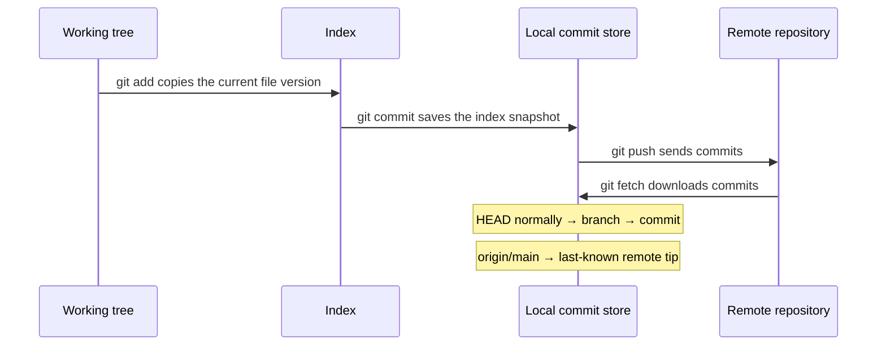

# Git fundamentals

## Purpose

Read this before learning Git commands or recovery steps. It explains where a
change lives at each moment, so that later commands such as `git add`,
`git commit`, `git push`, `git restore`, and `git revert` have an obvious
meaning instead of feeling like spells.

After reading it, you should be able to say which version of a file is in your
working tree, in the index, and in your latest commit, which commit your branch
points at, and what your last contact with the remote showed. That local record
can be stale if someone else has pushed since then.

## What Git is

Git is a version-control system: it records snapshots of a project folder so
you can compare versions, return to an earlier one, work on several lines of
change at once, and exchange that history with other people.

Git is the tool and data format. GitHub and GitLab are services that can host
a separate repository for your team; you can use Git without either one.

Git keeps a repository's history and settings as metadata alongside your
files. In an ordinary repository that metadata is in a hidden `.git` directory
at the top of the project folder. You get one either by running `git init` in
an existing folder or by copying an existing repository with `git clone`, which
downloads its history and checks out a working copy of the remote's default
branch.[^pro-git-getting-repository]

You may occasionally see a `.git` that is a small text file instead of a
directory. Linked worktrees and submodules use that file to point at metadata
stored elsewhere.[^git-repository-layout] The model on this page is the same
either way.

## Why the model matters

Much beginner Git trouble comes from one misunderstanding: assuming a change is
somewhere it is not. Typical examples are "I committed, so my teammate has it"
or "I ran `git add`, so my later edits will be committed too". Neither is true,
and both become obvious once you can picture where each version of a file is
held.

The same model decides how safe an undo is. A change that exists only on your
machine can usually be reshaped freely. A change that has been pushed to a
shared branch is part of other people's history and usually needs an undo
that adds a new commit.

## The mental model: three holders, three pointers, one other repository

Git's parts do three different jobs. Keeping the jobs apart is most of the
mental model.

**Three things hold versions of your files.** A change moves through them in
this order:

| Holder | Simple definition | What moves a change here |
| --- | --- | --- |
| Working tree | The ordinary files you see and edit in your folder. | Your editor, or Git checking files out. |
| Index (staging area) | Git's proposed next commit: the exact file contents that will be saved if you commit now. | `git add` copies the current contents of a file into it. |
| Commit | A saved snapshot of the tracked project files, with an author, a message, and links to its parent commits when it has them. | `git commit` turns the index into a new commit. |

A **tracked** file has an entry in the index, either because it was in the
latest commit or because you just staged it. An **untracked** file has no
index entry. `git add` begins tracking a new file. `.gitignore` hides matching
untracked files from normal status output; it does not untrack files that Git
already tracks.[^pro-git-recording-changes]

The Pro Git book calls these Git's "three trees": the working directory, the
index, and `HEAD`. Here `HEAD` is shorthand for the **snapshot of the commit
it currently resolves to**; the `HEAD` marker itself is only a
pointer.[^pro-git-reset-demystified]

**Three things are pointers. They hold no file contents; they only say which
commit is meant.**

| Pointer | Simple definition | How it moves |
| --- | --- | --- |
| Branch | A lightweight, movable label that points at one commit. | When you commit, the current branch moves forward to the new commit. |
| `HEAD` | Git's marker for "where you are now". It normally points at a branch, which is then your current branch. | It changes when you switch branches. |
| Remote-tracking branch, such as `origin/main` | Your local bookmark of where a branch on the remote was when Git last contacted it. It is not a live view of the server. | A fetch or pull updates it; a successful push to that branch can update it too.[^pro-git-remote-branches] |

Each commit has an ID, which `git log` shows, and refers to a project snapshot
and any parent commits. A branch is a movable pointer to one commit.
[^pro-git-branches]

`HEAD` can also point directly at a commit instead of at a branch. Git calls
this a detached `HEAD`. It happens when you check out a specific commit, and
commits made in that state do not move any branch.[^git-glossary] It can
happen when you inspect a commit, tag, or remote-tracking branch directly.
If you made commits while detached, `git switch -c <new-branch>` gives those
commits and future work a branch name. `git switch <existing-branch>` returns
to an existing branch when you do not need to keep detached commits. If
`git status` says a rebase or bisect is in progress, finish or exit that
operation first.[^git-switch]

**One thing is a separate repository.** A remote is another repository that you
exchange commits with, often a hosted copy. It has its own commits and its own
branches. `git push` sends your commits to it and `git fetch` downloads commits
from it. `origin` is the name `git clone` normally gives the repository it
copied. It is "remote" only in the sense of being a different repository: it
is usually on a server, but it can be another folder on the same
machine.[^pro-git-remotes]

## An analogy: packing boxes for a shared depot

Imagine you are shipping parts from a workshop:

- The **workbench** is your working tree. You can move, break, and rearrange
  things freely.
- The **packing tray** is the index. You deliberately place the exact versions
  of the parts you want in the next box.
- A **sealed, labelled box on your own shelf** is a commit. Each box notes
  which box came before it.
- A **sticky note** that says "latest box for the checkout feature" is a
  branch. It is not a box and holds no parts; it only marks one. When you seal
  a new box, the note moves to it.
- The **shared depot** is the remote: a separate shelf with its own boxes and
  its own sticky notes. Your colleagues see a box only after you deliver it
  there.
- Your **copy of the depot's sticky note**, as it looked at your last visit,
  is a remote-tracking branch such as `origin/main`. It can be out of date.
- A **"you are here" arrow** pointing at your current sticky note is `HEAD`.

The analogy is useful for one idea: preparing, saving, and sharing are three
separate actions. It breaks down in several places, and each break teaches
something true about Git:

- **The tray is never empty after sealing.** In Git, the index is a full
  proposed snapshot, not a list of changes. Straight after a commit, the index
  matches the new commit exactly.
- **A box contains the whole project, not only the parts you just placed.**
  Each commit is a snapshot of every tracked file. Git avoids storing unchanged
  content twice, so this is cheaper than it sounds.
- **Placing a part in the tray freezes that version.** If you keep editing a
  file after `git add`, the tray still holds the older copy until you run
  `git add` again.[^pro-git-recording-changes]
- **The depot can refuse a delivery.** If someone else delivered newer boxes to
  the same branch first, the remote rejects your push until you fetch their
  work and combine it with yours.[^pro-git-remotes]
- **Sealed boxes are not truly permanent on your shelf.** A commit no branch
  can reach may remain recoverable through the reflog for a time, but old
  reflog entries expire and unreachable objects can later be removed.
  [^git-reflog]

The reflog records where local pointers have been, not every edit to your
files. A change you never committed has no guaranteed recovery path. Inspect
before using a command that replaces working files.[^git-reflog][^git-restore]

## Visual: how a change moves

Text alternative: inside your machine, a change starts in the working tree.
`git add` copies it into the index. `git commit` turns the index into a new
commit, and the current branch moves to point at it. Everything so far is
local. Only `git push` sends commits to the remote repository. `git fetch`
brings remote commits into this repository's commit store and updates the
local remote-tracking pointer `origin/main`. The fetched commits are in the
same local store as your commits; the pointer only names their tip. A later
merge or rebase can integrate them into your current branch. Fetch alone
does not move that branch or edit your working files. A successful push can
also update your local remote-tracking pointer. `HEAD` points at the current
branch and is not drawn separately. If a push is rejected because the remote
branch moved, fetch and integrate its commits before retrying.

Use the diagram to answer one question before any command: which arrow am I
about to cross, and who will be affected when I do?

## See where a change lives

These commands inspect without moving a change:

| Question | Command | What it shows |
| --- | --- | --- |
| What is staged, unstaged, or untracked? | `git status` | File-level differences between the latest commit, index, and working tree. |
| What have I changed but not staged? | `git diff` | Working-tree changes compared with the index. New untracked files do not appear here; use `git status` to find them. |
| What will my next commit include? | `git diff --staged` | Index changes compared with the latest commit. |
| Where do my branch labels point? | `git log --oneline --graph --all --decorate` | Commit history and the local branch and remote-tracking pointers Git currently knows. |

These views use your local repository; they do not ask the remote server
whether someone pushed a newer commit.[^pro-git-recording-changes]
[^pro-git-remote-branches][^git-log]

## Walk-through: one file change

This is an illustrative sequence, not recorded command output; its state
transitions were checked in a disposable local repository. Start with a
clean repository on branch `main`, where the committed file `greeting.txt`
contains `Hello`. The remote `origin` has the same `main` commit. Assume
local `main` tracks `origin/main` and this is a personal practice remote
that allows a direct push; team repositories may require a branch and pull
request instead. To try it yourself, set your commit name and email and
use your repository's actual branch name, which may differ from `main`.
[^pro-git-first-time-setup]

1. You edit `greeting.txt` to `Hello, world`.
2. You run `git add greeting.txt`.
3. You edit the file again to `Hello, world!` and do not run `git add` again.
4. You run `git commit -m "Greet the world"`.
5. You run `git push origin main`.

| After step | Working tree | Index | Local `main` commit | Local `origin/main` pointer | Remote `main` commit |
| --- | --- | --- | --- | --- | --- |
| Start | `Hello` | `Hello` | `Hello` | `Hello` | `Hello` |
| 1. Edit | `Hello, world` | `Hello` | `Hello` | `Hello` | `Hello` |
| 2. Stage | `Hello, world` | `Hello, world` | `Hello` | `Hello` | `Hello` |
| 3. Edit again | `Hello, world!` | `Hello, world` | `Hello` | `Hello` | `Hello` |
| 4. Commit | `Hello, world!` | `Hello, world` | `Hello, world` | `Hello` | `Hello` |
| 5. Push | `Hello, world!` | `Hello, world` | `Hello, world` | `Hello, world` | `Hello, world` |

What to notice:

- After step 3, `git status` lists the file under both "Changes to be
  committed" and "Changes not staged for commit". The index and working
  tree hold different versions.[^pro-git-recording-changes]
- The commit in step 4 saves the index, so it contains `Hello, world` without
  the exclamation mark. The exclamation mark is still only in your working
  tree.
- Until step 5, the new commit exists only on your machine. If that disk failed
  before the push, the commit would be lost unless something else had backed
  it up.
- Step 5 requires write access and a remote that accepts the update. New
  commits on remote `main`, branch rules, or server hooks can reject the
  push.[^pro-git-remotes]

The remote column describes the real remote for this invented sequence.
`origin/main` is only the last-known position on your machine. It stays at
the starting commit while you edit and commit; after step 4, `git status`
reports that your branch is ahead of `origin/main` by one commit. A push or
fetch can update that bookmark, but another person's later push can make it
stale again. Even an "up to date with `origin/main`" status message does not
check the server live.[^pro-git-remote-branches]

## Local commit versus remote push

`git commit` changes only your repository. It is fast, works offline, and is
invisible to everyone else. Think of it as a save point for yourself.

`git push` asks another repository to accept your commits and move its branch
to include them. After that, other people can fetch them and build on them.

Two related commands work in the opposite direction. `git fetch` downloads new
commits and updates remote-tracking branches such as `origin/main` without
changing your working tree or current branch. `git pull` fetches and then
integrates the remote branch into your current branch in one step.
[^pro-git-remotes][^pro-git-remote-branches]

This difference drives the safest way to undo a mistake:

| Where the unwanted commit is | Usual safe direction |
| --- | --- |
| Only in your local repository | You can usually amend or reset it; first keep a branch at any commit you might need again. |
| Pushed to a branch others use | Add a new commit that reverses it with `git revert`, instead of rewriting shared history. |

This table concerns **commits**. A backup branch and the reflog do not save
unstaged or staged edits that were never committed. If you pushed to a
branch only you use, rewriting it may be acceptable; read the recovery
guide before any force push.

The [undo and recovery guide](troubleshooting/undo-and-recovery.md) explains
how to tell which case you are in and which command to choose.

Two reverse moves also follow from the three-holder model. For a tracked
file, `git restore <file>` replaces its working-tree contents with the index
version; this discards unstaged edits. `git restore --staged <file>` replaces
the index version with the latest commit's version while leaving the working
file alone. A staged version that differs from the working file can be lost
from the index. If the file was new and never committed, unstaging it makes
it untracked again. Inspect `git status` and both diffs before either
command, then use the recovery guide for the exact situation.[^git-restore]

## Common misconceptions

- **"Committing backs up my work."** A local commit protects you against your
  own later edits, not against losing the machine. A push to a repository on
  another machine provides another copy.
- **"Once a file is tracked, my later edits are committed automatically."**
  `git add` stages its contents at that moment. Later edits need another
  `git add`. The separate `git commit -a` option stages changes to already
  tracked files, but does not add untracked files.[^pro-git-recording-changes]
- **"A branch is a copy of the project."** A branch is a label pointing at one
  commit. Creating a branch does not copy any files.[^pro-git-branches]
- **"Moving a branch deletes its old commits."** A branch points at one commit
  and makes that commit and its parents reachable. Moving the pointer does not
  immediately delete old commits, but unreachable ones are only recoverable
  for a limited time through local recovery records.
  [^pro-git-branches][^git-reflog]
- **"Fetching changes my files."** Fetch only downloads. Merging or rebasing is
  a separate step.[^pro-git-remotes]
- **"Uncommitted edits belong to this branch."** There is one working tree
  and one index in this checkout. When you switch branches, Git updates them
  toward the target branch and carries edits across when it safely can; it
  refuses a switch that would overwrite them. Untracked files also stay in
  the working tree unless they block the switch. Commit first or follow the
  [task-switching guide](commands/common-use-cases.md#other-common-tasks)
  to store edits temporarily.[^git-switch]

## Check your understanding

- You edited three files and staged one. If you commit now, which changes are
  saved, and where do the other two remain?
- You made two commits this morning and have not pushed. What can your
  teammate see?
- Your push was rejected because the remote branch has new commits. What must
  happen before you push again?
- Why is `git revert` preferred over rewriting history for a commit that is
  already on a shared branch?

**Answers:** A normal commit saves the index, so the other two edits remain
only in the working tree. Your teammate cannot see your two local commits
until you push them. If a push is rejected because the remote moved forward,
fetch and integrate the new history before retrying. On a shared branch,
`git revert` records the reversal in a new commit so teammates do not have to
repair their copies of rewritten history.

## Next steps

- Look up everyday commands in [Git daily commands](commands/daily-commands.md).
- Practise safe inspection and recovery in [Git undo and
  recovery](troubleshooting/undo-and-recovery.md); start with its [first
  checks](troubleshooting/undo-and-recovery.md#first-find-out-where-the-mistake-lives).
- See branching and remote workflows in [common Git use
  cases](commands/common-use-cases.md).
- Return to the [Start here](../start-here.md) learning route.

## Official documentation for deeper study

- The three trees and how `reset` moves between them: [Pro Git - Reset
  Demystified](https://git-scm.com/book/en/v2/Git-Tools-Reset-Demystified).
- Creating or cloning a repository: [Pro Git - Getting a Git
  Repository](https://git-scm.com/book/en/v2/Git-Basics-Getting-a-Git-Repository).
- Configuring your commit identity and default branch: [Pro Git - First-Time
  Git Setup](https://git-scm.com/book/en/v2/Getting-Started-First-Time-Git-Setup).
- Tracked, untracked, modified, and staged files: [Pro Git - Recording Changes
  to the
  Repository](https://git-scm.com/book/en/v2/Git-Basics-Recording-Changes-to-the-Repository).
- Commits, branches, and `HEAD` as pointers: [Pro Git - Branches in a
  Nutshell](https://git-scm.com/book/en/v2/Git-Branching-Branches-in-a-Nutshell).
- Precise definitions, including `HEAD` and detached `HEAD`: [Git
  glossary](https://git-scm.com/docs/gitglossary).
- What is inside `.git`, and the `.git` file used by linked worktrees: [Git
  repository layout](https://git-scm.com/docs/gitrepository-layout).
- Remotes, fetch, pull, and push: [Pro Git - Working with
  Remotes](https://git-scm.com/book/en/v2/Git-Basics-Working-with-Remotes).
- Your local record of remote branches: [Pro Git - Remote
  Branches](https://git-scm.com/book/en/v2/Git-Branching-Remote-Branches).
- Working-tree and index recovery: [Git restore](https://git-scm.com/docs/git-restore).
- Switching branches with pending work: [Git switch](https://git-scm.com/docs/git-switch).
- Inspecting local commits and pointers: [Git log](https://git-scm.com/docs/git-log).
- Temporary recovery records for moved branch tips: [Git reflog](https://git-scm.com/docs/git-reflog).
- Every command's options: [Git reference documentation](https://git-scm.com/docs).

## Related links

- [Git undo and recovery](troubleshooting/undo-and-recovery.md)
- [Git commands](commands/index.md)
- [Start here](../start-here.md)
- [Back to Git index](index.md)
- [Back to knowledge index](../index.md)

[^pro-git-reset-demystified]: [Pro Git - Reset Demystified](https://git-scm.com/book/en/v2/Git-Tools-Reset-Demystified), source record `pro-git-reset-demystified`.
[^pro-git-getting-repository]: [Pro Git - Getting a Git Repository](https://git-scm.com/book/en/v2/Git-Basics-Getting-a-Git-Repository), source record `pro-git-getting-repository`.
[^pro-git-first-time-setup]: [Pro Git - First-Time Git Setup](https://git-scm.com/book/en/v2/Getting-Started-First-Time-Git-Setup), source record `pro-git-first-time-setup`.
[^pro-git-recording-changes]: [Pro Git - Recording Changes to the Repository](https://git-scm.com/book/en/v2/Git-Basics-Recording-Changes-to-the-Repository), source record `pro-git-recording-changes`.
[^pro-git-branches]: [Pro Git - Branches in a Nutshell](https://git-scm.com/book/en/v2/Git-Branching-Branches-in-a-Nutshell), source record `pro-git-branches`.
[^pro-git-remotes]: [Pro Git - Working with Remotes](https://git-scm.com/book/en/v2/Git-Basics-Working-with-Remotes), source record `pro-git-remotes`.
[^pro-git-remote-branches]: [Pro Git - Remote Branches](https://git-scm.com/book/en/v2/Git-Branching-Remote-Branches), source record `pro-git-remote-branches`.
[^git-glossary]: [Git glossary](https://git-scm.com/docs/gitglossary), source record `git-glossary`.
[^git-repository-layout]: [Git repository layout](https://git-scm.com/docs/gitrepository-layout), source record `git-repository-layout`.
[^git-reflog]: [Git reflog reference](https://git-scm.com/docs/git-reflog), source record `git-reflog`.
[^git-restore]: [Git restore reference](https://git-scm.com/docs/git-restore), source record `git-restore`.
[^git-switch]: [Git switch reference](https://git-scm.com/docs/git-switch), source record `git-switch`.
[^git-log]: [Git log reference](https://git-scm.com/docs/git-log), source record `git-log`.
