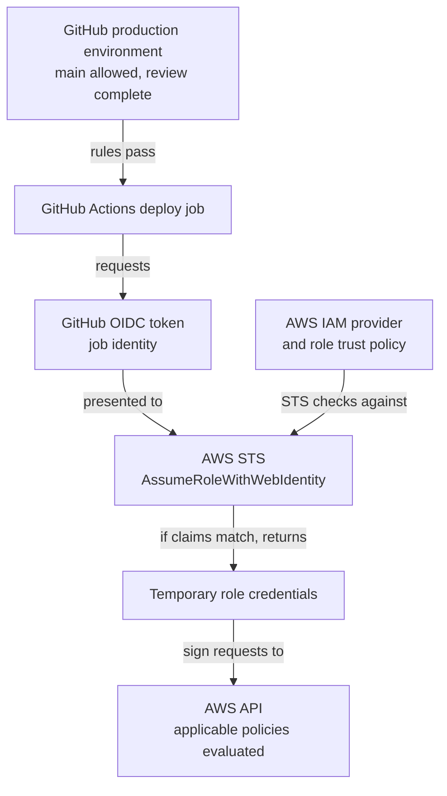

# AWS OIDC federation

## The problem it solves

A GitHub Actions job sometimes needs to publish an artifact or update a
resource in AWS. Storing an AWS access key in a GitHub secret gives that job
a long-lived credential to protect and rotate. **OpenID Connect (OIDC)
federation** lets the job present a short-lived, signed identity token from
GitHub to AWS instead. If AWS accepts that identity for a particular IAM
role, AWS Security Token Service (STS) returns temporary AWS credentials.
This page explains the GitHub-to-AWS boundary; [OIDC
fundamentals](../../security/identity-federation/oidc-fundamentals.md)
explains the token vocabulary first.[^github-oidc-aws]

> [!IMPORTANT]
> This is a conceptual guide, not a ready-to-deploy trust policy. The exact
> `sub` claim depends on the repository and job context. Read the current
> GitHub and AWS instructions before granting a role access.

## One job's path to AWS

Text alternative: GitHub checks the deploy job's `production` environment
rules before the job runs. The job then requests a signed OIDC token. AWS checks
the token's issuer, audience, and subject against the IAM identity provider
and the chosen role's trust policy. If the role can be assumed, STS returns
temporary role credentials. The job then signs AWS API requests with those
credentials, and AWS evaluates the policies that apply to those requests.

Think of the GitHub token as an identity badge checked at the AWS entrance.
The role trust policy decides which badges may enter; the role's permissions
decide which rooms are accessible afterward. The analogy stops at the
boundary: a real token is a bearer credential with a signature, claims, and
an expiry. It must not be printed in logs or shared. A badge that merely
names GitHub is insufficient because many repositories use the same issuer.
Other AWS policies can also allow or deny an API request after the role is
assumed; the role policy is not the whole building map.[^aws-policy-evaluation]

## Three separate controls

| Control | Question it answers | Failure if too broad |
| --- | --- | --- |
| GitHub `id-token: write` job permission | May this job request an OIDC token? | More jobs can request tokens than intended. This permission alone does not grant AWS or repository write access.[^github-oidc-reference] |
| IAM role trust policy | Does this token match the repository and ref or environment allowed to assume the role? | Another repository, branch, or environment may assume the role.[^aws-github-role] |
| IAM role permissions | What AWS actions and resources does the role's identity policy grant? | A legitimate job may gain broad access; resource and organization policies also affect the final decision.[^aws-github-role][^aws-policy-evaluation] |

The AWS credentials action can request the token and exchange it for role
credentials. Its `role-to-assume` and `aws-region` inputs select the role and
region; they do not replace the IAM trust or permissions policies. At the
job level, `id-token: write` enables the request. Specifying it makes
unspecified GitHub token permissions `none`, so add `contents: read` if this
job uses `actions/checkout`.[^aws-credentials-action][^github-oidc-reference]

The `id-token: write` permission belongs to the whole job, not just the
credentials-action step. Another action or script running in that job can
request its own GitHub OIDC token. Put it only on a job whose steps and inputs
you trust; keep pull-request code and untrusted artifacts out of that job.
[^github-oidc-reference]

By default, the AWS credentials action makes the temporary AWS credentials
available as environment variables to later steps in the same job. Build and
test before this action, or use a separate job; review every later action and
script as code that can call AWS with the assumed role.
[^aws-credentials-action]

## A bounded deployment example

Imagine an invented `northwind/docs` repository that publishes one static
site to AWS after a reviewed change reaches `main`. Its deployment role is
limited to that site's resources. These are **illustrative settings**, not a
tested deployment or a policy to paste into a repository:

| Boundary | Invented choice | What it checks |
| --- | --- | --- |
| GitHub trigger | Configure the publishing workflow for a reviewed `main` push. | This is the intended release path; the later trust checks do not prove which event started a run. |
| GitHub environment | The `production` environment allows only `main` and requires a reviewer. | GitHub decides whether this ref and job may proceed. |
| Deploy job | Give only this job `id-token: write`; add `contents: read` if it checks out source. | Steps in the job may request a GitHub OIDC token. |
| AWS role trust | Match GitHub's provider, `aud` of `sts.amazonaws.com`, and this repository's **actual** `production` environment subject with exact conditions. | STS decides whether to issue role credentials. |
| AWS role permissions | Limit identity-policy writes to this site's resources. | AWS combines the role policy with applicable resource, session, boundary, and organization policies. |

The role's identity policy is not the whole AWS decision. A same-account
resource policy may also allow access, while a permissions boundary, session
policy, or organization policy may reduce it; an explicit deny wins. For a
failed upload, inspect the target bucket and any encryption key policy as
well as the role.[^aws-policy-evaluation][^aws-role-session-permissions]

The default environment-shaped `sub` does **not** contain the branch, workflow
file, or job name. The GitHub environment's branch rule keeps an unintended
ref out; the IAM trust condition checks the environment subject. Another
workflow job in the same repository that can use `production` and request an
OIDC token may match the same default subject. Review workflow changes and
keep the environment and job permission narrow. A broad condition such as
`repo:northwind/docs:*` also accepts other refs and contexts in that
repository. Use exact `aud` and `sub` values for this example's intended
context; account for the immutable-ID subject format when it applies.
[^github-oidc-reference][^github-oidc-aws][^aws-github-role]

The environment branch rule checks the run's `GITHUB_REF`, **not** whether its
event was `push` or which workflow file started it. A different workflow on
an allowed `main` ref can also name `production`; its job can pass the branch
rule and request a token after any required reviewer approves. AWS sees the
token claims, not GitHub's environment settings. If an administrator loosens
those settings, the IAM trust condition does not notice. Protect workflow
changes and review the job before approving its deployment.
[^github-deployment-environments][^github-oidc-reference]

The important token fields are:

| Claim | Meaning in this flow |
| --- | --- |
| `iss` | GitHub's OIDC issuer, `https://token.actions.githubusercontent.com`, represented by the IAM provider. |
| `aud` | The intended recipient. The standard AWS credentials action requests `sts.amazonaws.com`; configure the provider and trust condition consistently. Other AWS partitions may need a different audience. |
| `sub` | The repository and `production` environment in this example. Other default formats use a ref or pull-request context instead. Its actual value also depends on the repository's subject format. |

The exact `sub` needs special care. Repositories created after **15 July
2026**, older repositories that opt in, and repositories renamed or
transferred after that date use an immutable default subject with owner
and repository IDs. Earlier repositories can retain the previous name-only
format. A job using a GitHub environment has an environment segment rather
than a branch segment. GitHub also documents claim customization. Match the
format your actual repository and job use; do not paste a sample subject
unchanged. Protect deployment environments with their own branch or tag
rules when using them.[^github-oidc-reference][^github-oidc-aws]

## What a failure tells you

If the job cannot request a token, check its `id-token` permission. If STS
denies role assumption, compare the configured provider, audience, exact
subject, and selected role with the documented job context; do not widen a
wildcard merely to make the error disappear. If the role is assumed but an
AWS API call is denied, inspect the requested action and resource, the role's
identity policy, and any applicable resource, permissions-boundary, session,
or organization policy. These are different failures at different boundaries.
[^aws-policy-evaluation][^aws-role-session-permissions]

## Check your understanding

1. Why does granting `id-token: write` not authorize an AWS deployment?
2. Why must the role trust policy identify a repository and environment,
   rather than just GitHub as the issuer?
3. If STS succeeds but an S3 upload is denied, which AWS policies could you
   inspect next?

## Continue learning

- [IAM OIDC provider and STS web identity](../../cloud/aws/security/iam-oidc-provider-and-sts-web-identity.md)
  explains the AWS side of the exchange.
- [GitHub Actions security, secrets, and permissions](security-secrets-and-permissions.md)
  covers the wider workflow permission boundary.
- [GitHub's AWS OIDC setup guide](https://docs.github.com/en/actions/how-tos/secure-your-work/security-harden-deployments/oidc-in-aws)
  gives current configuration details.
- [GitHub's OIDC reference](https://docs.github.com/en/actions/reference/security/oidc)
  lists subject formats and job permissions.
- [AWS IAM's role guide](https://docs.aws.amazon.com/IAM/latest/UserGuide/id_roles_create_for-idp_oidc.html)
  explains GitHub trust-policy conditions.
- [AWS IAM policy evaluation](https://docs.aws.amazon.com/IAM/latest/UserGuide/reference_policies_evaluation-logic.html)
  explains other policies that can change the effective AWS decision.
- [AWS credentials action](https://github.com/aws-actions/configure-aws-credentials)
  documents the current action inputs and examples.

[Back to GitHub Actions](index.md) | [Back to Git index](../index.md)

[^github-oidc-reference]: [GitHub Docs - OpenID Connect reference](https://docs.github.com/en/actions/reference/security/oidc), source record `github-oidc-reference`.
[^github-oidc-aws]: [GitHub Docs - Configuring OpenID Connect in Amazon Web Services](https://docs.github.com/en/actions/how-tos/secure-your-work/security-harden-deployments/oidc-in-aws), source record `github-oidc-aws`.
[^github-deployment-environments]: [GitHub Docs - Deployments and environments](https://docs.github.com/en/actions/reference/workflows-and-actions/deployments-and-environments), source record `github-deployment-environments`.
[^aws-github-role]: [AWS IAM - Create a role for OpenID Connect federation](https://docs.aws.amazon.com/IAM/latest/UserGuide/id_roles_create_for-idp_oidc.html), source record `aws-github-role`.
[^aws-credentials-action]: [AWS Configure AWS Credentials action](https://github.com/aws-actions/configure-aws-credentials), source record `aws-credentials-action`.
[^aws-policy-evaluation]: [AWS IAM - Policy evaluation logic](https://docs.aws.amazon.com/IAM/latest/UserGuide/reference_policies_evaluation-logic.html), source record `aws-policy-evaluation`.
[^aws-role-session-permissions]: [AWS IAM - Permissions for assumed-role sessions](https://docs.aws.amazon.com/IAM/latest/UserGuide/id_credentials_temp_control-access_assumerole.html), source record `aws-role-session-permissions`.
