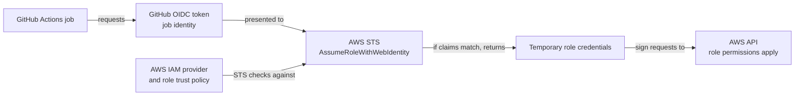

# AWS OIDC federation

## The problem it solves

A GitHub Actions job sometimes needs to publish an artifact or update a
resource in AWS. Storing an AWS access key in a GitHub secret gives that job
a long-lived credential to protect and rotate. **OpenID Connect (OIDC)
federation** lets the job present a short-lived, signed identity token from
GitHub to AWS instead. If AWS accepts that identity for a particular IAM
role, AWS Security Token Service (STS) returns temporary AWS credentials.
This page explains the GitHub-to-AWS boundary; [OIDC
fundamentals](../../security/identity-federation/oidc-fundamentals.md)
explains the token vocabulary first.[^github-oidc-aws]

> [!IMPORTANT]
> This is a conceptual guide, not a ready-to-deploy trust policy. The exact
> `sub` claim depends on the repository and job context. Read the current
> GitHub and AWS instructions before granting a role access.

## One job's path to AWS

Text alternative: the GitHub job requests a signed OIDC token. AWS checks
the token's issuer, audience, and subject against the IAM identity provider
and the chosen role's trust policy. If the role can be assumed, STS returns
temporary role credentials. The job then signs AWS API requests with those
credentials, and the role's permissions limit what those requests can do.

Think of the GitHub token as an identity badge checked at the AWS entrance.
The role trust policy decides which badges may enter; the role's permissions
decide which rooms are accessible afterward. The analogy stops at the
boundary: a real token is a bearer credential with a signature, claims, and
an expiry. It must not be printed in logs or shared. A badge that merely
names GitHub is insufficient because many repositories use the same issuer.

## Three separate controls

| Control | Question it answers | Failure if too broad |
| --- | --- | --- |
| GitHub `id-token: write` job permission | May this job request an OIDC token? | More jobs can request tokens than intended. This permission alone does not grant AWS or repository write access.[^github-oidc-reference] |
| IAM role trust policy | Does this token identify a job allowed to assume this role? | Another repository, branch, or environment may assume the role.[^aws-github-role] |
| IAM role permissions | What may the assumed role do in AWS? | A legitimate job can change unrelated resources.[^aws-github-role] |

The AWS credentials action can request the token and exchange it for role
credentials. Its `role-to-assume` and `aws-region` inputs select the role and
region; they do not replace the IAM trust or permissions policies. At the
job level, `id-token: write` enables the request. Add `contents: read` only
when a step such as checkout needs repository contents.[^aws-credentials-action]

## A bounded deployment example

Imagine an invented `northwind/docs` repository whose `main` workflow
publishes one static site to an AWS account. The maintainer creates a
deployment role with permissions limited to that site's resources. Its
trust policy names GitHub's OIDC provider, expects the AWS STS audience
`sts.amazonaws.com`, and matches the **exact subject** for the allowed job
context. A job from an unrelated repository or a non-deployment branch
should fail the trust check. A job that passes the trust check can still
perform only the AWS actions allowed by the role's permissions policy.
This is an invented scenario, not a tested deployment.[^github-oidc-aws][^aws-github-role]

The important token fields are:

| Claim | Meaning in this flow |
| --- | --- |
| `iss` | GitHub's OIDC issuer, `https://token.actions.githubusercontent.com`, represented by the IAM provider. |
| `aud` | The intended recipient. The standard AWS setup expects `sts.amazonaws.com`; configure the provider, action, and trust condition consistently. |
| `sub` | The repository and workflow context that the role is intended to trust. Its actual value depends on GitHub's subject format and whether the job uses an environment. |

The exact `sub` needs special care. Repositories created after **15 July
2026**, older repositories that opt in, and repositories renamed or
transferred after that date use an immutable default subject with owner
and repository IDs. Earlier repositories can retain the previous name-only
format. A job using a GitHub environment has an environment segment rather
than a branch segment. GitHub also documents claim customization. Match the
format your actual repository and job use; do not paste a sample subject
unchanged. Protect deployment environments with their own branch or tag
rules when using them.[^github-oidc-reference][^github-oidc-aws]

## What a failure tells you

If the job cannot request a token, check its `id-token` permission. If STS
denies role assumption, compare the configured provider, audience, exact
subject, and selected role with the documented job context; do not widen a
wildcard merely to make the error disappear. If the role is assumed but an
AWS API call is denied, inspect the role's permissions and the requested
action and resource. These are different failures at different boundaries.

## Check your understanding

1. Why does granting `id-token: write` not authorize an AWS deployment?
2. Why must the role trust policy identify a repository and job context,
   rather than just GitHub as the issuer?
3. Which policy would you inspect if STS succeeds but an S3 upload is denied?

## Continue learning

- [IAM OIDC provider and STS web identity](../../cloud/aws/security/iam-oidc-provider-and-sts-web-identity.md)
  explains the AWS side of the exchange.
- [GitHub Actions security, secrets, and permissions](security-secrets-and-permissions.md)
  covers the wider workflow permission boundary.
- [GitHub's AWS OIDC setup guide](https://docs.github.com/en/actions/how-tos/secure-your-work/security-harden-deployments/oidc-in-aws)
  gives current configuration details.
- [GitHub's OIDC reference](https://docs.github.com/en/actions/reference/security/oidc)
  lists subject formats and job permissions.
- [AWS IAM's role guide](https://docs.aws.amazon.com/IAM/latest/UserGuide/id_roles_create_for-idp_oidc.html)
  explains GitHub trust-policy conditions.
- [AWS credentials action](https://github.com/aws-actions/configure-aws-credentials)
  documents the current action inputs and examples.

[Back to GitHub Actions](index.md) | [Back to Git index](../index.md)

[^github-oidc-reference]: [GitHub Docs - OpenID Connect reference](https://docs.github.com/en/actions/reference/security/oidc), source record `github-oidc-reference`.
[^github-oidc-aws]: [GitHub Docs - Configuring OpenID Connect in Amazon Web Services](https://docs.github.com/en/actions/how-tos/secure-your-work/security-harden-deployments/oidc-in-aws), source record `github-oidc-aws`.
[^aws-github-role]: [AWS IAM - Create a role for OpenID Connect federation](https://docs.aws.amazon.com/IAM/latest/UserGuide/id_roles_create_for-idp_oidc.html), source record `aws-github-role`.
[^aws-credentials-action]: [AWS Configure AWS Credentials action](https://github.com/aws-actions/configure-aws-credentials), source record `aws-credentials-action`.
