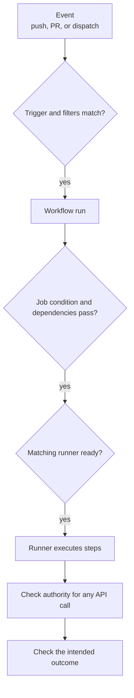

# GitHub Actions common solutions

## Start at the first missing handoff

When automation fails, ask **how far it got**. An event must match
a workflow trigger before a run exists. A run must admit a job
before the job can reach a step. A successful step can still
lack permission to publish or deploy. This order prevents
changing secrets or permissions when the workflow never
started at all.



Text alternative: a repository event reaches a workflow only
when its event and filters match. A run then decides which
jobs can start; a matching runner must be ready before it executes steps.
A step calling an API needs the right token, secret, or cloud identity.
Finally, a completed step needs an outcome check. Locate
the first missing stage before choosing a fix.

| What you see | First place to inspect | Common boundary |
| --- | --- | --- |
| No run exists | Event, workflow file, branch/path filters, and how the event was created. | Trigger did not match or the creating token does not trigger that event. |
| Run exists; job is skipped | Job `if`, `needs`, and upstream job results. | Condition or dependency prevented it. |
| Run exists; job stays queued | `runs-on` labels and the available runner pool. | No matching runner is ready yet. |
| Job starts; a step fails | Failed step log and the exact command. | Files, dependencies, runtime environment, or command behavior. |
| Step runs; publishing is denied | Job `permissions`, repository rules, and API response. | Token scope or policy. |
| Cloud login fails | OIDC permission, cloud trust policy, and provider response. | Token request or external trust/authorization. |
| Deployment waits or run is canceled | Environment approvals and concurrency group. | Intentional gate or cancellation policy. |

## 1. No workflow run appeared

First confirm that Actions and this workflow are enabled. The workflow file
must exist on the ref GitHub uses for the event: for a push, inspect the
pushed revision; for a scheduled or manually dispatched workflow, inspect
the default branch. `gh workflow list --all --repo OWNER/REPO` includes
disabled workflows.[^actions-events][^actions-trigger]

Read the event type and the workflow's `on` section. For
`push` and `pull_request`, a branch filter and a path
filter must **both** match. A commit-message skip instruction such as
`[skip ci]` can also prevent a run. If branch or path filters or a skip
instruction stop the workflow, a check required by repository rules can
remain pending because no job reported it.
[^actions-trigger][^actions-required-checks]

For example, this illustrative trigger runs for a push to
`main` only when a changed path matches `src/**`:

```yaml
on:
  push:
    branches: [main]
    paths:
      - "src/**"
```

A docs-only push to `main` does not satisfy the path filter.
A source change on another branch does not satisfy the branch
filter. Inspect the changed paths and actual event before
editing filters. Broadening a trigger can start more jobs
than intended.

For `pull_request`, `branches: [main]` means PRs **into** `main`; it does not
select the contributor's branch. A PR merge conflict prevents a normal
`pull_request` workflow from running until the conflict is resolved. For a
fork PR, first check whether the run exists but is waiting for maintainer
approval instead of treating it as a missing run.[^actions-events]

Also check *who created the event*. A push made using the repository's
`GITHUB_TOKEN` does not start another push workflow. `workflow_dispatch` and
`repository_dispatch` are exceptions to the usual suppression of
`GITHUB_TOKEN`-created events. A pull request opened or updated by a workflow
using that token can produce a `pull_request` run that waits for approval;
inspect the PR instead of assuming it ran automatically.
[^actions-events][^actions-trigger]

## 2. A run exists but a job or step did not run

Open the run graph and the first skipped or failed job. Job
`if` conditions and `needs` dependencies control whether
a job starts; a failed or skipped dependency normally skips
its dependents too, unless a status-aware condition changes that behavior.
A job skipped by its own `if:` can report a successful check even though it
did no work. A step that did start has its own log.
[^actions-syntax]

For a failed run, the GitHub UI shows job and step logs. With
GitHub CLI access to the repository, you can inspect a known
run ID:

```bash
gh run view RUN_ID --repo OWNER/REPO --log-failed
```

This reads failed logs; it does not rerun the job or change
the workflow. Logs may contain sensitive data, so avoid
pasting full logs into public issues.[^actions-logs]

If a step cannot find repository files, first confirm what
the runner checked out and its working directory. A runner
does not automatically have a usable copy of repository
source merely because a workflow file exists; a checkout
step or another explicit download supplies the files. Jobs have separate
runner workspaces, so a file built in one job needs an artifact transfer or
another explicit handoff before a later job can use it. In a normal
`pull_request` run, default checkout tests a temporary merge with the base
branch rather than the contributor branch tip alone.[^actions-events]
Follow [Workflow structure](workflow-structure.md) for job and step boundaries,
and [Inspect an Actions run](commands.md) for a complete terminal procedure.

## 3. A job ran but lacks authority

Separate three different questions:

| Question | Evidence to inspect | Meaning |
| --- | --- | --- |
| Can this job write to the repository? | Job or workflow `permissions`, `GITHUB_TOKEN` scope, API error, and branch rules. | GitHub authorization, not cloud authorization. |
| Can this job read a secret? | Event type, fork origin, secret scope, and environment gate. | Repository, organization, and environment secrets have different availability. |
| Can this job assume a cloud role? | `id-token: write`, OIDC exchange response, and cloud trust conditions. | GitHub can issue a token, but the cloud provider decides whether to trust it. |

`GITHUB_TOKEN` is job-scoped to the repository and limited by
its effective permissions. Grant only the permission an
authorized publishing job needs; granting `contents: write`
does not bypass a repository rule or make an unrelated cloud
role available.[^actions-token][^actions-syntax]

An explicit `permissions:` block sets every other configurable token scope
to `none`. Job-level permissions replace the workflow-level choice, so
repeat every required scope in that job. For example, a job with only
`id-token: write` lacks
`contents: read`; checkout of private repository code may then fail. List
the scopes each job actually needs.[^actions-syntax]

For a `pull_request` run from a fork, repository secrets are withheld and
`GITHUB_TOKEN` is read-only. Private-repository fork settings can change
these defaults. A missing secret may appear as an empty value and later
authentication failure. Environment secrets wait when that environment has
protection rules. Do not print a secret to test whether it exists; inspect
the event and configuration, then use a non-sensitive success signal.
[^actions-secrets][^actions-environments][^actions-events][^actions-fork-settings]

Do not move a test of untrusted PR code to `pull_request_target` merely to
obtain secrets. That event has the base repository's authority; checking out
and running the PR's code with privileged access needs a separate security
design. See [Security, secrets, and permissions](security-secrets-and-permissions.md).
[^actions-pr-target-security]

`id-token: write` lets a job request a GitHub OIDC token; it
does **not** grant cloud write access by itself. The cloud
trust policy must accept the token's claims, and the
resulting cloud role needs the intended service permissions.
If a job adds `environment:`, the OIDC subject usually names that environment
instead of the branch; a cloud trust rule matching a branch-shaped subject
can then stop matching. Inspect the actual subject format and configured
trust conditions, including any immutable-ID customization, before changing
the role.[^actions-oidc-reference]
See [AWS OIDC federation](aws-oidc-federation.md) for that
specific path.[^actions-oidc]

## 4. Deployment waits or a run is canceled

An environment can require approval or a wait before its
job runs and before environment secrets are available.
Check the job's environment and the repository's
protection rules before treating the wait as a failure.
If the workflow ref is not allowed by the environment's deployment branch or
tag policy, the job fails instead of waiting for approval; inspect that
policy and the run's ref before changing credentials.
[^actions-environments]

A concurrency group can keep one run active while another waits. By default,
a newer pending run cancels and replaces the older pending run in the same
group; the canceled run remains visible in history. `cancel-in-progress: true`
can also cancel a currently running run. If every deployment must wait its
turn, GitHub documents `queue: max` for multiple pending runs, subject to its
queue limit and ordering rules; it cannot be combined with
`cancel-in-progress: true`. Check the group name as well: the same name in
different workflows can make them affect one another.[^actions-concurrency]

## Check your understanding

1. If no run exists, why is changing a cloud secret unlikely
   to fix the problem?
2. Why does a job with `id-token: write` still need a cloud
   trust policy?
3. How can a workflow run exist while a deployment job
   remains waiting?
4. Why might a workflow-created push fail to start another
   workflow?

## Deeper study

- [Triggering a workflow](https://docs.github.com/en/actions/how-tos/write-workflows/choose-when-workflows-run/trigger-a-workflow)
  for event filters and token-created events.
- [Workflow syntax](https://docs.github.com/en/actions/reference/workflows-and-actions/workflow-syntax)
  for job conditions, dependencies, and permissions.
- [Workflow run logs](https://docs.github.com/en/actions/how-tos/monitor-workflows/use-workflow-run-logs)
  for locating the first failed step.
- [Using secrets](https://docs.github.com/en/actions/how-tos/write-workflows/choose-what-workflows-do/use-secrets),
  [OIDC](https://docs.github.com/en/actions/how-tos/secure-your-work/security-harden-deployments/oidc-in-cloud-providers),
  and [concurrency](https://docs.github.com/en/actions/concepts/workflows-and-actions/concurrency)
  for the later gates.
- [Required status checks](https://docs.github.com/en/pull-requests/how-tos/merge-and-close-pull-requests/troubleshooting-required-status-checks)
  distinguish a missing workflow check from a skipped job.

[Back to GitHub Actions](index.md)

[^actions-trigger]: [GitHub Actions - Triggering a workflow](https://docs.github.com/en/actions/how-tos/write-workflows/choose-when-workflows-run/trigger-a-workflow).
[^actions-syntax]: [GitHub Actions - Workflow syntax](https://docs.github.com/en/actions/reference/workflows-and-actions/workflow-syntax).
[^actions-logs]: [GitHub Actions - Using workflow run logs](https://docs.github.com/en/actions/how-tos/monitor-workflows/use-workflow-run-logs).
[^actions-token]: [GitHub Actions - GITHUB_TOKEN](https://docs.github.com/en/actions/concepts/security/github_token).
[^actions-secrets]: [GitHub Actions - Using secrets](https://docs.github.com/en/actions/how-tos/write-workflows/choose-what-workflows-do/use-secrets).
[^actions-oidc]: [GitHub Actions - Configuring OIDC](https://docs.github.com/en/actions/how-tos/secure-your-work/security-harden-deployments/oidc-in-cloud-providers).
[^actions-environments]: [GitHub Actions - Deploying with GitHub Actions](https://docs.github.com/en/actions/how-tos/deploy/configure-and-manage-deployments/control-deployments).
[^actions-concurrency]: [GitHub Actions - Concurrency](https://docs.github.com/en/actions/concepts/workflows-and-actions/concurrency).
[^actions-events]: [GitHub Actions - Events that trigger workflows](https://docs.github.com/en/actions/reference/workflows-and-actions/events-that-trigger-workflows).
[^actions-required-checks]: [GitHub Docs - Troubleshooting required status checks](https://docs.github.com/en/pull-requests/how-tos/merge-and-close-pull-requests/troubleshooting-required-status-checks).
[^actions-pr-target-security]: [GitHub Docs - Securely using pull_request_target](https://docs.github.com/en/actions/reference/security/securely-using-pull_request_target).
[^actions-oidc-reference]: [GitHub Docs - OpenID Connect reference](https://docs.github.com/en/actions/reference/security/oidc).
[^actions-fork-settings]: [GitHub Docs - Managing Actions settings for a repository](https://docs.github.com/en/repositories/managing-your-repositorys-settings-and-features/enabling-features-for-your-repository/managing-github-actions-settings-for-a-repository).
