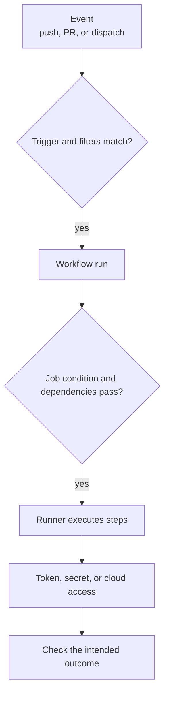

# GitHub Actions common solutions

## Start at the first missing handoff

When automation fails, ask **how far it got**. An event must match
a workflow trigger before a run exists. A run must admit a job
before the job can reach a step. A successful step can still
lack permission to publish or deploy. This order prevents
changing secrets or permissions when the workflow never
started at all.



Text alternative: a repository event reaches a workflow only
when its event and filters match. A run then decides which
jobs can start; a runner executes their steps. A step's
token, secret, or cloud identity controls later actions.
Finally, a completed step needs an outcome check. Locate
the first missing stage before choosing a fix.

| What you see | First place to inspect | Common boundary |
| --- | --- | --- |
| No run exists | Event, workflow file, branch/path filters, and how the event was created. | Trigger did not match or the creating token does not trigger that event. |
| Run exists; job is skipped | Job `if`, `needs`, and upstream job results. | Condition or dependency prevented it. |
| Job starts; a step fails | Failed step log and the exact command. | Files, dependencies, runtime environment, or command behavior. |
| Step runs; publishing is denied | Job `permissions`, repository rules, and API response. | Token scope or policy. |
| Cloud login fails | OIDC permission, cloud trust policy, and provider response. | Token request or external trust/authorization. |
| Deployment waits or run is canceled | Environment approvals and concurrency group. | Intentional gate or cancellation policy. |

## 1. No workflow run appeared

Read the event type and the workflow's `on` section. For
`push` and `pull_request`, a branch filter and a path
filter must **both** match. A skipped workflow may leave
a required check pending.[^actions-trigger]

For example, this illustrative trigger runs for a push to
`main` only when a changed path matches `src/**`:

```yaml
on:
  push:
    branches: [main]
    paths:
      - "src/**"
```

A docs-only push to `main` does not satisfy the path filter.
A source change on another branch does not satisfy the branch
filter. Inspect the changed paths and actual event before
editing filters. Broadening a trigger can start more jobs
than intended.

Also check *who created the event*. Most events caused by
the repository's `GITHUB_TOKEN` do not start another
workflow. GitHub documents exceptions, including
`workflow_dispatch` and `repository_dispatch`, and
special approval behavior for pull requests created by
automation. Do not assume a workflow-created push will
start a second push workflow.[^actions-trigger]

## 2. A run exists but a job or step did not run

Open the run graph and the first skipped or failed job. Job
`if` conditions and `needs` dependencies control whether
a job starts; a failed or skipped dependency normally skips
its dependents too. A step that did start has its own log.
[^actions-syntax]

For a failed run, the GitHub UI shows job and step logs. With
GitHub CLI access to the repository, you can inspect a known
run ID:

```bash
gh run view <run-id> --log-failed
```

This reads failed logs; it does not rerun the job or change
the workflow. Logs may contain sensitive data, so avoid
pasting full logs into public issues.[^actions-logs]

If a step cannot find repository files, first confirm what
the runner checked out and its working directory. A runner
does not automatically have a usable copy of repository
source merely because a workflow file exists; a checkout
step or another explicit download supplies the files.
Follow [Workflow structure](workflow-structure.md) for
job and step boundaries.

## 3. A job ran but lacks authority

Separate three different questions:

| Question | Evidence to inspect | Meaning |
| --- | --- | --- |
| Can this job write to the repository? | Job or workflow `permissions`, `GITHUB_TOKEN` scope, API error, and branch rules. | GitHub authorization, not cloud authorization. |
| Can this job read a secret? | Event type, fork origin, secret scope, and environment gate. | Repository, organization, and environment secrets have different availability. |
| Can this job assume a cloud role? | `id-token: write`, OIDC exchange response, and cloud trust conditions. | GitHub can issue a token, but the cloud provider decides whether to trust it. |

`GITHUB_TOKEN` is job-scoped to the repository and limited by
its effective permissions. Grant only the permission an
authorized publishing job needs; granting `contents: write`
does not bypass a repository rule or make an unrelated cloud
role available.[^actions-token][^actions-syntax]

Most secrets other than `GITHUB_TOKEN` are not supplied to
workflows triggered from a fork. Environment secrets also
wait for the environment's protection rules. Do not print a
secret to test whether it exists; inspect the event and
configuration, then use a non-sensitive success signal.
[^actions-secrets][^actions-environments]

`id-token: write` lets a job request a GitHub OIDC token; it
does **not** grant cloud write access by itself. The cloud
trust policy must accept the token's claims, and the
resulting cloud role needs the intended service permissions.
See [AWS OIDC federation](aws-oidc-federation.md) for that
specific path.[^actions-oidc]

## 4. Deployment waits or a run disappears

An environment can require approval or a wait before its
job runs and before environment secrets are available.
Check the job's environment and the repository's
protection rules before treating the wait as a failure.
[^actions-environments]

A concurrency group can keep one run active while another
waits. With the default single pending slot, a newer
pending run replaces an older pending run in the same
group; `cancel-in-progress: true` can also cancel a
currently running one. If every deployment must run in
order, inspect the configured queue behavior rather than
assuming `cancel-in-progress: false` retains every pending
run.[^actions-concurrency]

## Check your understanding

1. If no run exists, why is changing a cloud secret unlikely
   to fix the problem?
2. Why does a job with `id-token: write` still need a cloud
   trust policy?
3. How can a workflow run exist while a deployment job
   remains waiting?
4. Why might a workflow-created push fail to start another
   workflow?

## Deeper study

- [Triggering a workflow](https://docs.github.com/en/actions/how-tos/write-workflows/choose-when-workflows-run/trigger-a-workflow)
  for event filters and token-created events.
- [Workflow syntax](https://docs.github.com/en/actions/reference/workflows-and-actions/workflow-syntax)
  for job conditions, dependencies, and permissions.
- [Workflow run logs](https://docs.github.com/en/actions/how-tos/monitor-workflows/use-workflow-run-logs)
  for locating the first failed step.
- [Using secrets](https://docs.github.com/en/actions/how-tos/write-workflows/choose-what-workflows-do/use-secrets),
  [OIDC](https://docs.github.com/en/actions/how-tos/secure-your-work/security-harden-deployments/oidc-in-cloud-providers),
  and [concurrency](https://docs.github.com/en/actions/concepts/workflows-and-actions/concurrency)
  for the later gates.

[Back to GitHub Actions](index.md)

[^actions-trigger]: [GitHub Actions - Triggering a workflow](https://docs.github.com/en/actions/how-tos/write-workflows/choose-when-workflows-run/trigger-a-workflow).
[^actions-syntax]: [GitHub Actions - Workflow syntax](https://docs.github.com/en/actions/reference/workflows-and-actions/workflow-syntax).
[^actions-logs]: [GitHub Actions - Using workflow run logs](https://docs.github.com/en/actions/how-tos/monitor-workflows/use-workflow-run-logs).
[^actions-token]: [GitHub Actions - GITHUB_TOKEN](https://docs.github.com/en/actions/concepts/security/github_token).
[^actions-secrets]: [GitHub Actions - Using secrets](https://docs.github.com/en/actions/how-tos/write-workflows/choose-what-workflows-do/use-secrets).
[^actions-oidc]: [GitHub Actions - Configuring OIDC](https://docs.github.com/en/actions/how-tos/secure-your-work/security-harden-deployments/oidc-in-cloud-providers).
[^actions-environments]: [GitHub Actions - Deploying with GitHub Actions](https://docs.github.com/en/actions/how-tos/deploy/configure-and-manage-deployments/control-deployments).
[^actions-concurrency]: [GitHub Actions - Concurrency](https://docs.github.com/en/actions/concepts/workflows-and-actions/concurrency).
