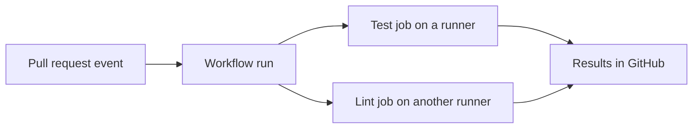

# GitHub Actions components and concepts

## The idea in plain language

GitHub Actions lets a repository react to an event, such as a push or pull
request, by running a set of tasks. The instructions live in a YAML
**workflow** file under `.github/workflows/`. A workflow contains **jobs**;
each job runs **steps** on a **runner**.[^github-actions-basics]

Think of a workshop order. An event places the order, the workflow describes
the whole job, each job gets a workbench, and each step is one instruction at
that bench. The analogy has a limit: separate jobs normally run on separate
runners, so a file created in one job does not appear automatically in
another.[^github-actions-basics]

## Follow one run

Suppose a repository has a workflow that checks a proposed change. This is
an illustrative path, not a workflow run observed in this repository.



Text alternative: a pull request event starts this workflow's run. The same
event can start other workflow files whose triggers match. GitHub may
schedule independent test and lint jobs on different runners. Each job runs
its own ordered steps and sends its result back to the workflow. Jobs without
declared dependencies can run in parallel; `needs:` gives a job a dependency
on another.[^github-actions-basics][^github-workflow-syntax]

## The building blocks

| Word | What it means | Example question |
| --- | --- | --- |
| Event | Activity that starts a workflow run. | Did a push, pull request, schedule, or manual request trigger it? |
| Workflow | One YAML definition of automated work. | Which file describes this run? |
| Job | Steps that share one runner. | Which checks can run in parallel, and which must wait using `needs:`? |
| Runner | The machine or environment executing one job. | Does it have the needed operating system and network access? |
| Step | One shell command or script, or a reusable action, inside a job. | Which step failed first? |
| Action | Reusable code called by a step with `uses:`. | Whose code is this action, and which revision runs? |

These are the core relationships in GitHub's model.[^github-actions-basics]
The word **workflow run** means one execution of one workflow in response to
an event. A new event can start a new run of the same file.[^github-actions-basics]

## Read a tiny workflow

This example has no checkout or project test. If saved as
`.github/workflows/hello.yml` on the repository's default branch, a user with
write access can start it manually from GitHub Actions; the only work is
printing a line.[^github-manual-run]
It has not been run as part of this page.

```yaml
name: Hello

on:
  workflow_dispatch:

permissions:
  contents: read

jobs:
  greet:
    runs-on: ubuntu-latest
    steps:
      - name: Say hello
        run: echo "Hello from this runner"
```

Read it from top to bottom: `on` names the manual event;
`permissions` sets the workflow's `GITHUB_TOKEN` scopes: `contents: read`
allows repository reads, and other configurable scopes become `none`.
If you omit `permissions`, the token follows the repository or organization
default, which may grant more access.[^github-workflow-syntax]
`jobs.greet` names the job; `runs-on` chooses a runner; and `run` executes a
shell command inside that runner.[^github-workflow-syntax]

To test a real project, a job usually needs more: checkout, language setup,
dependency installation, and a project-specific test command. See
[workflow structure](workflow-structure.md) for where those keys belong and
[examples](examples-and-use-cases.md) for larger patterns. Do not copy an
example's command until its repository and dependencies match your project.

## Data that moves through a run

| Item | Purpose | Boundary to remember |
| --- | --- | --- |
| Context or expression | Read event, repository, job, and step data in workflow YAML, often through `${{ ... }}`.[^github-workflow-syntax] | A pull request title may be attacker-controlled. Pass it to `run:` through `env:` instead of inserting the expression directly into a shell script.[^github-secure-use] |
| Configuration variable | Store non-secret configuration reused by a workflow through `vars.NAME`.[^github-variables] | Do not put tokens or passwords here; `env:` and `GITHUB_ENV` serve different step and job scopes. |
| Secret | Provide a sensitive value to a step that references it, for example through `secrets.NAME`.[^github-secrets] | Repository secrets are not injected automatically. `GITHUB_TOKEN` is special: actions can access it through `github.token` even without an explicit input. Keep its permissions narrow.[^github-token] |
| Artifact | Save a run output such as a report for download or another job.[^github-artifacts] | It is a result of a run, not a permanent source repository. |
| Cache | Reuse dependency files across runs to save setup time.[^github-caching] | It may be absent or stale; correctness must not depend on a cache hit. |

If a later job needs a file made by an earlier job, upload it as an artifact
in the first job and download it in the later job, or recreate it. Declare
`needs:` so the consumer waits for the producer; that ordering does not share
a working directory. Steps in one job share workspace files, but each
`run:` step starts a new process. A shell `cd` or `export` in one step does
not carry into the next; use `working-directory:`, `env:`, or `GITHUB_ENV`
for the appropriate scope.[^github-actions-basics][^github-artifacts][^github-variables]

## Check your understanding

- What starts a workflow run, and where is the workflow defined?
- Which steps share files without an artifact transfer?
- Why does `needs:` solve ordering but not file sharing?
- Where should a token go, and what should remain a variable?

## Official documentation for deeper study

- [Understanding GitHub Actions](https://docs.github.com/en/actions/get-started/understand-github-actions) explains events, workflows, jobs, steps, actions, and runners.
- [Workflow syntax](https://docs.github.com/en/actions/reference/workflows-and-actions/workflow-syntax) defines the YAML keys and their conditions.
- [Using secrets](https://docs.github.com/en/actions/how-tos/write-workflows/choose-what-workflows-do/use-secrets) covers secret storage and access limits.
- [Workflow artifacts](https://docs.github.com/en/actions/concepts/workflows-and-actions/workflow-artifacts) and [dependency caching](https://docs.github.com/en/actions/concepts/workflows-and-actions/dependency-caching) explain the two different ways to retain files.
- [Store information in variables](https://docs.github.com/en/actions/how-tos/write-workflows/choose-what-workflows-do/use-variables) explains how to pass values between steps and jobs.
- [Secure use reference](https://docs.github.com/en/actions/reference/security/secure-use) explains why untrusted event text needs careful handling in shell scripts.
- [Using `GITHUB_TOKEN`](https://docs.github.com/en/actions/tutorials/authenticate-with-github_token) explains the token's special availability to actions and its permissions.

See the [GitHub Actions index](index.md) and [Git fundamentals](../git-fundamentals.md).

[^github-actions-basics]: [Understanding GitHub Actions](https://docs.github.com/en/actions/get-started/understand-github-actions).
[^github-workflow-syntax]: [Workflow syntax](https://docs.github.com/en/actions/reference/workflows-and-actions/workflow-syntax).
[^github-secrets]: [Using secrets in GitHub Actions](https://docs.github.com/en/actions/how-tos/write-workflows/choose-what-workflows-do/use-secrets).
[^github-artifacts]: [Workflow artifacts](https://docs.github.com/en/actions/concepts/workflows-and-actions/workflow-artifacts).
[^github-caching]: [Dependency caching](https://docs.github.com/en/actions/concepts/workflows-and-actions/dependency-caching).
[^github-variables]: [Store information in variables](https://docs.github.com/en/actions/how-tos/write-workflows/choose-what-workflows-do/use-variables).
[^github-secure-use]: [Secure use reference](https://docs.github.com/en/actions/reference/security/secure-use).
[^github-manual-run]: [Manually running a workflow](https://docs.github.com/en/actions/how-tos/manage-workflow-runs/manually-run-a-workflow).
[^github-token]: [Use `GITHUB_TOKEN` for authentication](https://docs.github.com/en/actions/tutorials/authenticate-with-github_token).
