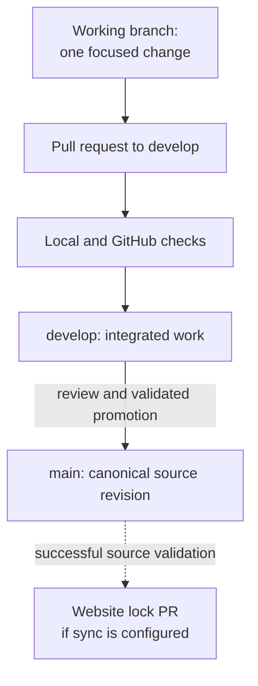

# Content CI/CD process

## What the process is for

**Continuous integration (CI)** checks a proposed knowledge change before
it becomes part of a shared branch. **Publication** means selecting a
validated commit for readers. For this repository, Markdown under
`knowledge/` is the source of truth; `main` is the canonical branch that a
separate reading site can pin to an exact commit. A green check says the
automated rules passed. It does **not** prove that a technical explanation
is clear, current, or correct for every environment.

The current [agent instructions](../../../AGENTS.md#validation-and-publication) route
knowledge-base upgrades through `develop`, require the repository checks,
and allow promotion to `main` only after the bundle and governance checks
pass. The [contribution guide](../../../CONTRIBUTING.md) also requires
evidence-aware authoring. Use those live files for the exact commands.

## One change through the branches

Think of a draft page moving through three places: a contributor's desk,
an editing table shared by maintainers, and a published shelf. A working
branch is the desk, `develop` is the editing table, and `main` is the
published shelf. The analogy has limits: Git commits are immutable
snapshots, two branches can share commits, and publication or site sync
does not happen merely because a document looks finished.

Text alternative: a contributor prepares a focused change on a working
branch and opens a pull request to `develop`. The local and GitHub checks
run before integration. After appropriate review and a passing bundle and
governance check, maintainers can promote `develop` to `main`. A successful
validated `main` push can signal the separate website repository if that
integration has been configured; the website then reviews a pinned source
revision before its own release.

## Follow an illustrative page edit

Suppose a contributor improves the [Kafka delivery explanation](../../databases/kafka/delivery-guarantees-and-failure-handling.md).
This is an example of the process, not a claim about a completed merge.

1. Update the concept, its nearest parent index, and `knowledge/log.md` as
   required. Cite the upstream documentation actually consulted. If the
   concept metadata changed, rebuild the generated catalog. The
   [contribution guide](../../../CONTRIBUTING.md) explains these authoring
   rules.
2. Run the [required local checks](../../../AGENTS.md#validation-and-publication):
   OKF structure, command paths, catalog freshness, retrieval cases,
   teaching coverage, issue templates, labels, Markdown, local links, and
   diff whitespace. A failure is a reason to fix the change before it is
   presented as ready.
3. Open a pull request to `develop`. The repository's validation workflows
   run on pull requests, and they also run on pushes to `develop` and
   `main`. GitHub's event rules determine when those runs
   start.[^github-workflow-events]
4. Review the explanation and its evidence separately from CI. Automated
   validators can confirm metadata, references, and links; they cannot
   observe whether a new learner understands the page or whether an
   example was executed in a real Kafka cluster.
5. After integration on `develop`, promote to `main` only when the required
   bundle and governance checks have passed. Do not treat a green topic
   branch as evidence that a later `main` commit passed the same checks.

The precise workflow files are in [`.github/workflows/`](../../../.github/workflows/okf-validation.yml).
They currently run OKF, link, Markdown, issue-template, and Terraform-format
jobs on pull requests and on pushes to `develop` and `main`. The
[teaching-coverage validator](../../../scripts/validate-teaching-coverage.py)
checks accounting, not prose quality. Branch protection or required review
settings, if enabled on GitHub, are separate enforcement rules; inspect
their current configuration before describing them as
mandatory.[^github-protected-branches]

## Where the website fits

The [Git-backed reading-site decision](../../decision-records/adr-0005-git-backed-reading-site.md)
keeps the `knowledge/` Markdown canonical. The source repository's
[`website-dispatch` workflow](../../../.github/workflows/website-dispatch.yml)
is designed to send an event **only after** a successful OKF validation run
for a `main` push, and only when the website repository variable is set.
That event is a signal, not a publication: the website plan requires a
separate pull request that updates its pinned source commit, passes its own
checks, and is reviewed before deployment. See the [website rollout
plan](../../../knowledge-base-upgrade/features/knowledge-website/rollout.md).

This distinction matters for a reader: source `main` can have a newer
explanation than the website's pinned revision until the site's update is
approved and released. The displayed source SHA identifies what the site
actually rendered.

## What checks can and cannot establish

| Evidence | What it supports | What it does not prove |
| --- | --- | --- |
| OKF and catalog checks pass | Required metadata and derived catalog are consistent. | The explanation is technically accurate. |
| Local-link check passes | Paths and heading fragments resolve in the repository. | An external source remains current or a reader follows the route easily. |
| Markdown lint passes | The files meet configured style rules. | The page teaches its subject well. |
| Reviewed source and example | Specific claims or examples have been assessed. | Every version or deployment behaves the same way. |
| Reader-task result | An observed reader completed a stated task. | Every future reader will succeed. |

Record actual evidence and remaining uncertainty in the page or review
queue. Do not turn a passing CI badge into an invented review or runtime
test.

## Check your understanding

1. Why does a branch with passing Markdown lint still need technical review?
2. Which branch is the canonical source for a published site revision?
3. Why might the website display an older explanation than source `main`?

## Official documentation for deeper study

- [GitHub workflow events](https://docs.github.com/en/actions/reference/workflows-and-actions/events-that-trigger-workflows)
  explains pull request, push, and chained workflow triggers.
- [Managing protected branches](https://docs.github.com/en/repositories/configuring-branches-and-merges-in-your-repository/managing-protected-branches)
  explains how a repository can enforce checks and reviews.

For practical examples, continue to [GitHub Actions examples](examples-and-use-cases.md)
or return to the [GitHub Actions index](index.md).

[^github-workflow-events]: [GitHub Docs: Events that trigger workflows](https://docs.github.com/en/actions/reference/workflows-and-actions/events-that-trigger-workflows).
[^github-protected-branches]: [GitHub Docs: Managing protected branches](https://docs.github.com/en/repositories/configuring-branches-and-merges-in-your-repository/managing-protected-branches).
