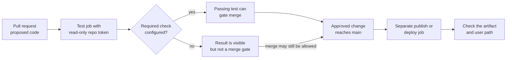

# Choosing a GitHub Actions workflow shape

## The simple idea

A workflow **shape** is the combination of an event, the jobs that event
starts, the permissions those jobs receive, and the result people can
inspect. Choose those four things before copying a YAML example. A
workflow file lives under `.github/workflows/`; its `on` key selects
events and its `jobs` contain steps that run on a runner.
[^github-syntax]

Read [components and concepts](components-and-concepts.md) and
[workflow structure](workflow-structure.md) first if event, runner,
job, or step is new.

## Why the shape matters

A successful test job means its commands passed for that run. It does
not, by itself, stop a merge, publish an artifact, deploy a service,
or prove that users can reach the result. Those outcomes require
separate repository rules, credentials, release steps, and checks.
A required status check in a branch protection rule can make a
check necessary before merge.[^github-protected]

A useful analogy is a building:

- The **event** is the doorbell that starts an activity.
- **Permissions** are the badge a job receives.
- **Steps** are the checklist the worker follows.
- The **run result** is the record of what the worker reported.

The analogy stops at three points. A doorbell can be filtered by branch,
path, or activity type, so an expected run may never start. A badge
does not grant more access than the repository, environment, or external
cloud trust policy allows. A completed checklist shows what the job ran;
it is not proof that a customer can use the deployed service.
[^github-syntax][^github-events][^github-token]

## Choose by the result you need

| Need | Start event and job shape | Boundary to check |
| --- | --- | --- |
| Test a proposed change | `pull_request` with a test job whose repository token has read permission. | PR code may be untrusted. Configure a required check separately if passing CI must gate merge.[^github-protected] |
| Test supported runtimes | A matrix expands the test job over version or operating-system values. | Each matrix leg must report its own result; use versions the project actually supports.[^github-syntax] |
| Publish a container | `push` to an approved branch or tag, then a job with package write permission. | Publishing needs registry authentication and an artifact identifier; a successful build alone publishes nothing.[^github-container] |
| Deploy an environment | A manual or approved push trigger, a deployment job, and an environment with configured protection rules. | Merely naming an environment does not create an approval rule. Verify the target and user path after deploy.[^github-environments] |
| Run maintenance | `schedule` or `workflow_dispatch` with a job that produces a report or issue. | Scheduled work runs from the default branch and may be delayed; make the result inspectable.[^github-events] |
| Check Terraform | PR job for format and validation; a separate reviewed plan and guarded apply path for real changes. | Backend, cloud identity, plan sensitivity, and approval need their own design. See [GitHub Actions with Terraform](../../cross-topic-guides/github-actions-with-terraform.md). |

The table gives starting shapes, not deployment-ready workflows. The
[security guide](security-secrets-and-permissions.md) covers fork code,
token scope, secrets, and cloud identity before you add privileged jobs.

## One bounded example: test a proposed lesson-site change

Imagine a `lesson-site` repository with a `package-lock.json` and an
`npm test` script. A contributor opens a pull request. The desired
result is a test report for that proposed change, with no publication
or deployment from the PR job.

This illustrative workflow has **not** been run in `lesson-site`.
Check the repository's Node version, lockfile, test script, action
revisions, and runner policy before adopting it.

```yaml
name: Test proposed change

on:
  pull_request:

permissions:
  contents: read

jobs:
  test:
    runs-on: ubuntu-latest
    steps:
      - name: Check out proposed code
        uses: actions/checkout@v7
      - name: Set up Node
        uses: actions/setup-node@v7
        with:
          node-version: '22'
      - name: Install locked dependencies
        run: npm ci
      - name: Run tests
        run: npm test
```

The PR event starts one job. The job checks out the proposed code,
sets up the selected Node version, installs from the lockfile, and
runs the project's tests. `contents: read` scopes the repository
token used by this workflow; it does not provide package publishing
or cloud deployment authority.[^github-syntax][^github-token]
[^github-checkout][^github-setup-node]

The expected result is a visible pass or failure for the `test` job.
To make it a merge gate, a maintainer must configure the repository's
branch rule to require that check. A passing job says nothing about
browser rendering, deployment, or a customer's learning experience.
[^github-protected]

## See how the next shape changes

Suppose `lesson-site` later publishes a built website. Keep the PR
check focused on untrusted proposed code. A separate workflow can
start on a `main` push after required review, build a static artifact, and publish
it using only the permissions that target needs. Configure branch
rules to control how changes reach `main`, and use an environment
with actual protection settings if deployment approval is required.
Then check the live site, not only the Actions run.[^github-syntax]
[^github-protected][^github-environments]



Text alternative: proposed PR code reaches a test job whose repository
token has read permission.
A configured required check can make that result part of merge
eligibility; without it, the result is only visible and a merge may
still be allowed. Once an approved change reaches `main`, a separate publishing or deployment
job can run. The final check inspects the artifact and the path a
user takes, because a green job alone is not the user outcome.

## Before adapting any example

1. Name the event and which branch, tag, path, or input should start it.
2. Name the job's actual outcome: test result, image, deployment, or report.
3. Grant the smallest repository token permission and separately define
   any cloud or registry access.[^github-token]
4. Decide which result must block merge or wait for configured environment
   approval.[^github-protected][^github-environments]
5. Add a result check outside the workflow itself when the goal is a
   working service for people.

## Check your understanding

- Why does `pull_request` CI not automatically prevent a merge?
- What must change before the example can publish a package?
- What does an environment name provide, and where are approval rules set?
- What would you check after a workflow reports a successful deployment?

## Official documentation and next routes

- [Workflow syntax](https://docs.github.com/en/actions/reference/workflows-and-actions/workflow-syntax)
  and [event behavior](https://docs.github.com/en/actions/reference/workflows-and-actions/events-that-trigger-workflows).
- [Repository token permissions](https://docs.github.com/en/actions/tutorials/authenticate-with-github_token),
  [protected branches](https://docs.github.com/en/repositories/configuring-branches-and-merges-in-your-repository/managing-protected-branches/about-protected-branches),
  and [environments](https://docs.github.com/en/actions/how-tos/deploy/configure-and-manage-deployments/manage-environments).
- [Container registry authentication](https://docs.github.com/en/packages/working-with-a-github-packages-registry/working-with-the-container-registry)
  when publishing an image.
- [AWS OIDC federation](aws-oidc-federation.md) for cloud identity,
  [GitHub Actions with Terraform](../../cross-topic-guides/github-actions-with-terraform.md)
  for infrastructure, and [common solutions](common-solutions.md) when
  a run does not behave as expected.
- Return to [GitHub Actions](index.md) or the
  [knowledge index](../../index.md).

[^github-syntax]: [GitHub Actions workflow syntax](https://docs.github.com/en/actions/reference/workflows-and-actions/workflow-syntax).
[^github-events]: [Events that trigger workflows](https://docs.github.com/en/actions/reference/workflows-and-actions/events-that-trigger-workflows).
[^github-token]: [Use GITHUB_TOKEN for authentication](https://docs.github.com/en/actions/tutorials/authenticate-with-github_token).
[^github-environments]: [Managing environments for deployment](https://docs.github.com/en/actions/how-tos/deploy/configure-and-manage-deployments/manage-environments).
[^github-protected]: [About protected branches](https://docs.github.com/en/repositories/configuring-branches-and-merges-in-your-repository/managing-protected-branches/about-protected-branches).
[^github-checkout]: [actions/checkout](https://github.com/actions/checkout).
[^github-setup-node]: [actions/setup-node](https://github.com/actions/setup-node).
[^github-container]: [Working with the Container registry](https://docs.github.com/en/packages/working-with-a-github-packages-registry/working-with-the-container-registry).
