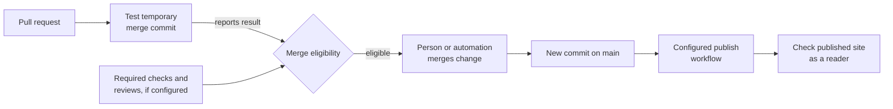

# Choosing a GitHub Actions workflow shape

## The simple idea

A workflow **shape** is the combination of an event, the jobs that event
starts, the permissions those jobs receive, and the result people can
inspect. Choose those four things before copying a YAML example. A
workflow file lives under `.github/workflows/`; its `on` key selects
events and its `jobs` contain steps that run on a runner.
[^github-syntax]

Read [components and concepts](components-and-concepts.md) and
[workflow structure](workflow-structure.md) first if event, runner,
job, or step is new.

## Why the shape matters

A successful test job means its commands passed for that run. It does
not, by itself, stop a merge, publish an artifact, deploy a service,
or prove that users can reach the result. Those outcomes require
separate repository rules, credentials, release steps, and checks.
A required status check in a branch protection rule or ruleset can make a
check necessary before merge.[^github-protected][^github-required]

A useful analogy is a building:

- The **event** is the doorbell that starts an activity.
- **Permissions** are the badge a job receives.
- **Jobs and steps** are the workbench and its checklist.
- The **run result** is the record of what the worker reported.

The analogy stops at three points. A doorbell can be filtered by branch,
path, or activity type, so an expected run may never start. A badge
does not grant more access than the repository, environment, or external
cloud trust policy allows. A completed checklist shows what the job ran;
it is not proof that a customer can use the deployed service.
[^github-syntax][^github-events][^github-token]

## Choose by the result you need

| Need | Start event and job shape | Boundary to check |
| --- | --- | --- |
| Test a proposed change | `pull_request` with a test job whose repository token has read permission. | PR code may be untrusted. Configure a required check separately if passing CI must gate merge; if filters skip the workflow containing that check, it can stay pending.[^github-required] |
| Test supported runtimes | A matrix expands the test job over version or operating-system values. | Each leg runs separately; check its result and require the appropriate check names in repository rules.[^github-syntax][^github-required] |
| Publish a container | `push` to a branch or tag restricted by repository rules, then a job authorized for the chosen registry. | For GitHub's container registry with `GITHUB_TOKEN`, use `packages: write` and verify the package grants this repository write access; record the pushed digest. Other registries use their own credentials and rules.[^github-container][^github-package] |
| Deploy to an environment | A reviewed `main` change or a manual trigger, a deployment job, and an environment with configured protection rules. | A manual run can select a branch; restrict allowed deployment branches or tags and configure reviewers when available. Naming an environment alone creates no approval rule; availability varies by plan and repository visibility.[^github-manual][^github-environments] |
| Run maintenance | `schedule` or `workflow_dispatch` with a job that produces a report or issue. | Scheduled work runs from the default branch and may be delayed or dropped under high load; make the result inspectable.[^github-events] |
| Check Terraform | PR job for format and validation; a separate reviewed plan and guarded apply path for real changes. | Backend, cloud identity, plan sensitivity, and approval need their own design. See [GitHub Actions with Terraform](../../cross-topic-guides/github-actions-with-terraform.md). |

The table gives starting shapes, not deployment-ready workflows. The
[security guide](security-secrets-and-permissions.md) covers fork code,
token scope, secrets, and cloud identity before you add privileged jobs.

## One bounded example: test a proposed lesson-site change

Imagine a `lesson-site` repository with a `package-lock.json` and an
`npm test` script. A contributor opens a pull request. The desired
result is a test report for that proposed change, with no publication
or deployment from the PR job.

This illustrative workflow has **not** been run in `lesson-site`.
Check the repository's Node version, lockfile, test script, action
revisions, and runner policy before adopting it.

```yaml
name: Test proposed change

on:
  pull_request:

permissions:
  contents: read

jobs:
  lesson-site-test:
    runs-on: ubuntu-latest
    steps:
      - name: Check out PR test merge
        uses: actions/checkout@v7
        with:
          persist-credentials: false
      - name: Set up Node
        uses: actions/setup-node@v7
        with:
          node-version: '22'
      - name: Install locked dependencies
        run: npm ci
      - name: Run tests
        run: npm test
```

The PR event starts one job. For a mergeable PR, default checkout gets
GitHub's temporary merge of the proposed commits with the base branch, not
the proposed branch tip alone. The job sets up the selected Node version,
installs from the lockfile, and runs the project's tests.[^github-setup-node]
`persist-credentials: false` avoids leaving checkout's Git credential for
later steps that do not need authenticated Git. `contents: read` limits the
repository token; it does not provide package publishing or cloud deployment
authority.[^github-events][^github-syntax][^github-token][^github-checkout]

If the PR has a merge conflict, `pull_request` workflows do not run until
the conflict is resolved; a required check can then remain missing rather
than report a test failure.[^github-events][^github-required]

The example runs proposed code, so treat its install and test scripts as
untrusted. Fork pull requests normally get a read-only repository token and
no repository secrets. Depending on repository settings, a fork run may wait
for maintainer approval before the job starts. Approval allows the proposed
workflow and project code to run; inspect the diff, including install and
test scripts, before approving. Approval does not itself grant secrets or a
write token. Private-repository fork settings can change the default token
and secret rules.[^github-events][^github-fork]

Do not switch this test to `pull_request_target` to obtain secrets: that event
runs with the base repository's authority and needs a separate design that
does not execute untrusted PR code with privileged access.[^github-pr-target]

The expected result is a visible pass or failure for the `lesson-site-test`
job. To make it a merge gate, a maintainer must configure a branch rule or ruleset
to require the `lesson-site-test` check. Give required jobs distinctive names
so their checks are clear when a repository has several workflows. A passing
job says nothing about browser rendering, deployment, or a customer's
learning experience.
If a workflow filter prevents that required check from starting, the check
can remain pending and block merge. A job skipped by its own `if:` condition,
however, can report success without running the test; choose required checks
so they actually cover the changes you intend to gate.[^github-required]

## See how the next shape changes

Suppose `lesson-site` later publishes a built website. Keep the PR
check focused on untrusted proposed code. A separate workflow can
start on a `main` push, build a static artifact, and publish it using only
the permissions that target needs. Configure branch rules to require review
and checks before changes reach `main`, and use an environment
with actual protection settings if deployment approval is required.
Then check the live site, not only the Actions run.[^github-syntax]
[^github-protected][^github-environments]



Text alternative: a pull request produces a test result for its temporary
merge. Repository rules, when configured, use that result and any required
reviews to determine merge eligibility. A person or authorized automation
must still merge the change. A new commit on `main` can then start a separate
configured publishing workflow. The final check visits the published site
as a reader, because a green job alone is not the user outcome.

## Before adapting any example

1. Name the event and which branch, tag, path, or input should start it.
2. Name the job's actual outcome: test result, image, deployment, or report.
3. Grant the smallest repository token permission and separately define
   any cloud or registry access.[^github-token]
4. Decide which result must block merge or wait for configured environment
   approval.[^github-protected][^github-environments]
5. Add a result check outside the workflow itself when the goal is a
   working service for people.

## Check your understanding

- Why does `pull_request` CI not automatically prevent a merge?
- What must change before the example can publish a package?
- What does an environment name provide, and where are approval rules set?
- What would you check after a workflow reports a successful deployment?

## Official documentation and next routes

- [Workflow syntax](https://docs.github.com/en/actions/reference/workflows-and-actions/workflow-syntax)
  and [event behavior](https://docs.github.com/en/actions/reference/workflows-and-actions/events-that-trigger-workflows).
- [Repository token permissions](https://docs.github.com/en/actions/tutorials/authenticate-with-github_token),
  [protected branches](https://docs.github.com/en/repositories/configuring-branches-and-merges-in-your-repository/managing-protected-branches/about-protected-branches),
  and [environments](https://docs.github.com/en/actions/how-tos/deploy/configure-and-manage-deployments/manage-environments).
- [Container registry authentication](https://docs.github.com/en/packages/working-with-a-github-packages-registry/working-with-the-container-registry)
  when publishing an image.
- [Required status checks](https://docs.github.com/en/pull-requests/how-tos/merge-and-close-pull-requests/troubleshooting-required-status-checks)
  and [approving runs from forks](https://docs.github.com/en/actions/how-tos/manage-workflow-runs/approve-runs-from-forks)
  explain why a check can be pending before a PR is merged.
- [AWS OIDC federation](aws-oidc-federation.md) for cloud identity,
  [GitHub Actions with Terraform](../../cross-topic-guides/github-actions-with-terraform.md)
  for infrastructure, and [common solutions](common-solutions.md) when
  a run does not behave as expected.
- Return to [GitHub Actions](index.md) or the
  [knowledge index](../../index.md).

[^github-syntax]: [GitHub Actions workflow syntax](https://docs.github.com/en/actions/reference/workflows-and-actions/workflow-syntax).
[^github-events]: [Events that trigger workflows](https://docs.github.com/en/actions/reference/workflows-and-actions/events-that-trigger-workflows).
[^github-token]: [Use GITHUB_TOKEN for authentication](https://docs.github.com/en/actions/tutorials/authenticate-with-github_token).
[^github-environments]: [Managing environments for deployment](https://docs.github.com/en/actions/how-tos/deploy/configure-and-manage-deployments/manage-environments).
[^github-protected]: [About protected branches](https://docs.github.com/en/repositories/configuring-branches-and-merges-in-your-repository/managing-protected-branches/about-protected-branches).
[^github-checkout]: [actions/checkout](https://github.com/actions/checkout).
[^github-setup-node]: [actions/setup-node](https://github.com/actions/setup-node).
[^github-container]: [Working with the Container registry](https://docs.github.com/en/packages/working-with-a-github-packages-registry/working-with-the-container-registry).
[^github-required]: [Troubleshooting required status checks](https://docs.github.com/en/pull-requests/how-tos/merge-and-close-pull-requests/troubleshooting-required-status-checks).
[^github-fork]: [Approving workflow runs from forks](https://docs.github.com/en/actions/how-tos/manage-workflow-runs/approve-runs-from-forks).
[^github-pr-target]: [Securely using pull_request_target](https://docs.github.com/en/actions/reference/security/securely-using-pull_request_target).
[^github-manual]: [Manually running a workflow](https://docs.github.com/en/actions/how-tos/manage-workflow-runs/manually-run-a-workflow).
[^github-package]: [Publishing and installing a package with GitHub Actions](https://docs.github.com/en/packages/managing-github-packages-using-github-actions-workflows/publishing-and-installing-a-package-with-github-actions).
