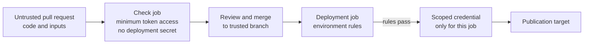

# GitHub Actions security, secrets, and permissions

## The decision before a job runs

A workflow job can execute code, read data, and sometimes publish or change
resources. Before giving it a credential, ask **who can influence the code
it runs**, **which credential it receives**, and **what that credential can
change**. A pull request from an outside contributor and a reviewed release
commit have different trust histories. This page gives a mental model for
separating their jobs; [Workflow structure](workflow-structure.md) explains
the YAML shape first.[^github-actions-secure-use]

Three terms matter:

| Term | Plain meaning |
| --- | --- |
| `GITHUB_TOKEN` | A short-lived token GitHub makes for each workflow job to call GitHub APIs. Its permissions can be narrowed in workflow YAML.[^github-actions-workflow-syntax] |
| Secret | A sensitive value stored at organization, repository, or environment level and deliberately passed to a workflow step. It is usable by code that receives it.[^github-actions-secrets] |
| Environment | A named deployment boundary whose configured rules can delay a job and its environment secrets until approval.[^github-actions-deployments] |

> [!IMPORTANT]
> The examples explain trust boundaries. They are not a complete deployment
> workflow or a claim about this repository's live protection settings.

## Follow the code and the credentials



Text alternative: a proposed change enters a check job with limited
GitHub token access and no deployment secret. A maintainer reviews and
merges an acceptable change. A separate deployment job on the trusted
branch follows its environment rules before it receives a credential scoped
for publication. The credential can then act on the target.

Think of a workshop with a public inspection table and a locked tool room.
Anyone can submit a part for inspection; only an approved worker enters the
tool room and receives its keys. The analogy is limited: a workflow can run
attacker-controlled scripts during inspection, a secret can be copied by
code that receives it, and a reviewed commit can still contain a mistake.
The runner, workflow trigger, and repository settings all matter.

## Give each job only the GitHub access it needs

The `permissions` key changes what the job's `GITHUB_TOKEN` can do. For
example, a check job that reads repository content can use:

```yaml
permissions:
  contents: read
```

This grants the token content read access. When any named permission is
specified, GitHub sets unspecified permissions to `none`; a separate job
that must publish a package can request `packages: write` in that job's own
`permissions` block. A job-level block applies to **all** steps and actions
in that job, so every dependency running there shares the token's effective
rights.[^github-actions-workflow-syntax]

The workflow file is not the whole boundary. A third-party action or build
script executed in the job can use the job's credentials too. Review the
action's source, owner, and inputs before using it; pin an action to a full
commit SHA when an immutable action version matters. A major tag such as
`@v4` can move and is not an immutable pin.[^github-actions-secure-use]

## Store secrets, then limit their exposure

Secrets keep sensitive values out of the repository. They do not make code
that receives a secret trustworthy. Give a secret only to the step that
needs it, prefer credentials with narrow permissions and short lifetimes,
and do not print secrets or whole environments in logs. GitHub tries to
redact known secrets, but transformed values and some other cases may not
be redacted.[^github-actions-secrets]

Use a **variable** for a non-sensitive setting such as an application name
or region. Use a **secret** for a credential. An environment secret is
available to a job only after that environment's configured protection
rules pass. Rules such as required reviewers and deployment branch or tag
restrictions must actually be configured; naming an environment alone
does not create an approval gate.[^github-actions-deployments]

For a cloud deployment, OpenID Connect (OIDC) can avoid a stored cloud
access key. `id-token: write` lets a job request a GitHub identity token;
it does not by itself grant repository or cloud write access. The cloud
role's trust policy and permissions are separate controls. See [AWS OIDC
federation](aws-oidc-federation.md) for the full
path.[^github-actions-oidc]

## Keep untrusted pull requests away from write credentials

For an invented documentation repository, imagine a contributor changing
a page and a build script in a pull request. The check job needs to read
and build those files. Treat the script as untrusted code: it can run during
the check, so the job should have no deployment secret and only the GitHub
rights necessary for validation. After review and merge, a different job
may deploy the resulting commit. This is an illustrative workflow shape,
not a test run or an assurance that a particular change is safe.

The event choice matters:

| Event or job | Security question |
| --- | --- |
| `pull_request` from a fork | What untrusted code or inputs will the check run, and which read permissions does it need? Forked pull request runs have restricted access to repository secrets.[^github-actions-secrets] |
| `pull_request_target` | Does privileged base-repository code ever check out and execute the pull request's code? GitHub documents this as a dangerous combination.[^github-actions-pull-request-target] |
| `workflow_run` after another workflow | Will a privileged follow-up consume artifacts or data made by an untrusted earlier run? Treat those outputs as untrusted input.[^github-actions-secure-use] |
| Deployment on a trusted branch | Are the environment rules, branch restrictions, token permissions, and target credentials actually scoped to this release?[^github-actions-deployments] |

`pull_request_target` is useful for carefully designed privileged work on
pull request metadata, but running the pull request head in that privileged
context can expose its token or secrets. GitHub has added specific
protections for some fork checkouts; they do not cover every way to fetch
or execute untrusted code. Consult its current
[event guide](https://docs.github.com/en/actions/reference/security/securely-using-pull_request_target)
before using that event.[^github-actions-pull-request-target]

## Check your understanding

1. Why can a script in a read-only PR check still be considered untrusted?
2. Why does storing a deployment token as a secret not make it safe to pass
   to that check job?
3. What must happen before an environment secret is available to a gated
   deployment job?
4. What do `contents: read`, `id-token: write`, and a cloud role's
   permissions each control?

## Official documentation and next steps

- [Secure use reference](https://docs.github.com/en/actions/reference/security/secure-use)
  covers least privilege, untrusted input, action pinning, and runner risks.
- [Workflow syntax](https://docs.github.com/en/actions/reference/workflows-and-actions/workflow-syntax)
  defines `permissions` and its defaults.
- [GitHub Actions secrets](https://docs.github.com/en/actions/concepts/security/secrets)
  explains secret scope and the limits of log redaction.
- [Deployments and environments](https://docs.github.com/en/actions/reference/workflows-and-actions/deployments-and-environments)
  explains protection rules and when environment secrets are released.
- [Securely using `pull_request_target`](https://docs.github.com/en/actions/reference/security/securely-using-pull_request_target)
  explains its current protections and remaining risks.
- [AWS OIDC federation](aws-oidc-federation.md) continues the cloud
  authentication example.

[Back to GitHub Actions](index.md) | [Back to Git index](../index.md)

[^github-actions-secure-use]: [GitHub Docs - Secure use reference](https://docs.github.com/en/actions/reference/security/secure-use), source record `github-actions-secure-use`.
[^github-actions-workflow-syntax]: [GitHub Docs - Workflow syntax for GitHub Actions](https://docs.github.com/en/actions/reference/workflows-and-actions/workflow-syntax), source record `github-actions-workflow-syntax`.
[^github-actions-secrets]: [GitHub Docs - Secrets](https://docs.github.com/en/actions/concepts/security/secrets), source record `github-actions-secrets`.
[^github-actions-pull-request-target]: [GitHub Docs - Securely using pull_request_target](https://docs.github.com/en/actions/reference/security/securely-using-pull_request_target), source record `github-actions-pull-request-target`.
[^github-actions-deployments]: [GitHub Docs - Deployments and environments](https://docs.github.com/en/actions/reference/workflows-and-actions/deployments-and-environments), source record `github-actions-deployments`.
[^github-actions-oidc]: [GitHub Docs - OpenID Connect reference](https://docs.github.com/en/actions/reference/security/oidc), source record `github-actions-oidc`.
