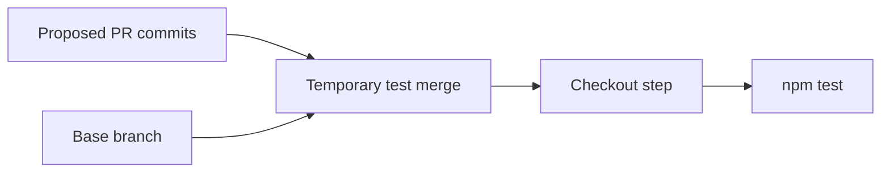

# GitHub Actions workflow structure

## The idea in plain language

A workflow file tells GitHub **when to start**, **what jobs exist**, and
**what each job does**. Put it directly under `.github/workflows/` with a
`.yml` or `.yaml` extension. GitHub reads the YAML as nested settings: a step
belongs to a job, and a job belongs to the workflow.[^github-workflow-syntax]

If YAML is new to you, picture labeled boxes inside other boxes. The amount
of indentation tells you which box owns a setting. The label `run` under a
step means “execute this shell command”; `runs-on` under a job means “choose
this runner.” Putting either key at the wrong level changes or invalidates
the workflow. A dash (`-`) starts a new step in the `steps` list, while
`name`, `uses`, `with`, or `run` indented under that dash describe that step.
Use spaces for indentation, not tabs. Quote version strings such as `'22'`
so YAML treats them as text rather than numbers.[^github-workflow-syntax]

Read [components and concepts](components-and-concepts.md) first if event,
job, step, or runner is unfamiliar.

## Read one complete file

This is an illustrative workflow for a repository with a Node project at its
root and an `npm test` script. It has not been run in this knowledge-base
repository. A real project should check its Node version, lockfile, script,
and action revisions before copying it.

```yaml
name: Test a proposed change

on:
  pull_request:
  push:
    branches:
      - main

permissions:
  contents: read

jobs:
  test:
    runs-on: ubuntu-latest
    steps:
      - name: Check out code
        uses: actions/checkout@v7
        with:
          persist-credentials: false
      - name: Set up Node
        uses: actions/setup-node@v7
        with:
          node-version: '22'
      - name: Install locked dependencies
        run: npm ci
      - name: Run tests
        run: npm test
```

The top-level `on` field starts a run for matching pull request activity and
pushes to `main`.[^github-triggering] For `pull_request`, the default
activities are opening, reopening, and adding commits to a pull request. In a
mergeable pull request, checkout uses a temporary merge of the proposed
change into its base branch;
the test is against that merged result, not just the branch tip. Pull requests
from forks normally receive no repository secrets and a read-only
`GITHUB_TOKEN`.[^github-events] See
[security, secrets, and permissions](security-secrets-and-permissions.md) before
adding credentials to a workflow.



Text alternative: GitHub combines the proposed pull request commits with the
base branch in a temporary merge. The default checkout step gives the test job
that merge, so `npm test` checks the combined result. A push to `main` instead
checks out the pushed commit.[^github-events][^github-checkout]

A green result describes the commit this run tested. If the base branch later
changes, check whether your repository requires an up-to-date branch or a new
run before merge; the earlier result alone does not test later commits.

`permissions` gives the workflow's `GITHUB_TOKEN` read access to repository
contents; other configurable scopes become `none`. If `permissions` is omitted,
the repository or organization default applies. The single `test` job uses an Ubuntu
runner and runs four steps in order: fetch the commit being tested, set up
Node, install from the lockfile, and run the project test
script.[^github-workflow-syntax][^github-token]

The checkout action is needed because a runner does not automatically have
your repository files. This example uses the major-version tags `@v7` shown
in the official action READMEs. Tags can move;
check each action's current version and runner requirements before adoption,
and use a full commit SHA when you need an immutable action revision. Checkout
fetches only one commit by default, so a task needing history must request a
greater `fetch-depth`. Checkout normally leaves Git credentials available to
later steps; this example sets `persist-credentials: false` because its tests
do not need authenticated Git commands. This does not replace narrow
`GITHUB_TOKEN` permissions.[^github-checkout][^github-setup-node]

## The nesting map

```text
.github/workflows/test.yml
  name                    label in the Actions view
  on                      events that can start a run
  permissions             GITHUB_TOKEN scopes for all jobs, unless a job overrides them
  jobs
    test                  job identifier
      runs-on             runner choice
      steps               ordered list within this job
        - uses            reusable action step (may have with inputs)
        - run             shell command step (instead of uses)
```

Text alternative: workflow settings sit at the top of the file; each entry
under `jobs` defines a job; each entry under a job's `steps` is an ordered
action or shell command. GitHub's workflow syntax reference is the source
for valid keys and levels.[^github-workflow-syntax]

## Change the run deliberately

| If you need... | Add or change | Effect |
| --- | --- | --- |
| A manual start | `workflow_dispatch` under `on` | Once the workflow file is on the default branch, a user with write access can request a run and select a branch through GitHub or the CLI.[^github-manual-run] |
| Another operating system or runtime | `runs-on` or a setup action | Changes the environment in which a job runs. |
| A second independent check | A sibling entry under `jobs` | GitHub can schedule it independently of `test`; the new job needs its own checkout and setup steps. |
| A job only after tests pass | `needs: test` on that job | Waits for the named job and normally skips if it fails or is skipped. Small declared job outputs can pass values; files need artifacts.[^github-workflow-syntax] |
| A conditional job or step | `if:` at that level | Runs only when the expression matches.[^github-workflow-syntax] |
| Token scopes for one job | `permissions` at job level | Replaces the workflow-level set for that job; list only the scopes it needs.[^github-workflow-syntax] |

This table shows where to look, not complete syntax for every feature. In
particular, adding a deploy job changes external state. Its credentials,
environment, and approval rules need a separate design; a successful test
job alone does not make deployment safe.

## A common two-job mistake

Suppose a `build` job creates `dist/app.zip`, and `deploy` declares
`needs: build`. The dependency orders the jobs; it does not move the ZIP.
Each job gets a separate runner environment. Upload the build result as an
artifact and download it in the later job, or build it again there. See
[components and concepts](components-and-concepts.md) for the artifact and
cache distinction.

Another common mistake is a trigger filter that excludes the change you
care about. If a workflow does not start, inspect `on` before debugging
steps that never ran. For a pull request, also check for merge conflicts;
`pull_request` workflows do not run on a conflicted PR. A failing step, by
contrast, means a run started and reached that job. GitHub's
[event reference](https://docs.github.com/en/actions/reference/workflows-and-actions/events-that-trigger-workflows)
shows event and filter behavior.[^github-events]

## Check your understanding

- Which top-level key decides whether a push to `main` starts this file?
- On a pull request, which commit does the default checkout test?
- Why does `npm ci` need checkout and a matching lockfile first?
- What changes when a second job adds `needs: test`?
- Where would you narrow `GITHUB_TOKEN` permissions for one job?

## Official documentation for deeper study

- [Workflow syntax](https://docs.github.com/en/actions/reference/workflows-and-actions/workflow-syntax) lists every supported key, level, and condition.
- [Triggering a workflow](https://docs.github.com/en/actions/how-tos/write-workflows/choose-when-workflows-run/trigger-a-workflow) explains event choices and manual starts.
- [Using `GITHUB_TOKEN`](https://docs.github.com/en/actions/tutorials/authenticate-with-github_token) explains token permissions.
- [Official checkout action](https://github.com/actions/checkout) documents action behavior and current examples.
- [Official Node setup action](https://github.com/actions/setup-node) documents supported Node versions and inputs.
- [Events that trigger workflows](https://docs.github.com/en/actions/reference/workflows-and-actions/events-that-trigger-workflows) explains the pull request merge ref and default activity types.

See the [GitHub Actions index](index.md) and [examples and use cases](examples-and-use-cases.md).

[^github-workflow-syntax]: [Workflow syntax for GitHub Actions](https://docs.github.com/en/actions/reference/workflows-and-actions/workflow-syntax).
[^github-triggering]: [Triggering a workflow](https://docs.github.com/en/actions/how-tos/write-workflows/choose-when-workflows-run/trigger-a-workflow).
[^github-token]: [Use `GITHUB_TOKEN` for authentication](https://docs.github.com/en/actions/tutorials/authenticate-with-github_token).
[^github-checkout]: [Official `actions/checkout` repository](https://github.com/actions/checkout).
[^github-setup-node]: [Official `actions/setup-node` repository](https://github.com/actions/setup-node).
[^github-events]: [Events that trigger workflows](https://docs.github.com/en/actions/reference/workflows-and-actions/events-that-trigger-workflows).
[^github-manual-run]: [Manually running a workflow](https://docs.github.com/en/actions/how-tos/manage-workflow-runs/manually-run-a-workflow).
