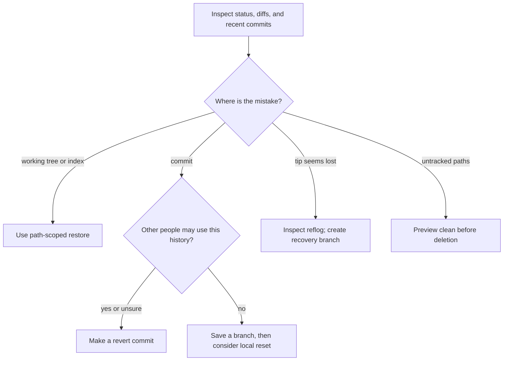

# Undo and recovery

## First, find out where the mistake lives

Git keeps your **working tree** (files on disk), the **index** (what is
staged for the next commit), and **commits** separately. A remote branch
is another copy of commit history. An undo command for one place can
damage useful work in another. Read [Git fundamentals](../git-fundamentals.md)
if these four places are unfamiliar.

From the repository you mean to repair, inspect before changing anything:

```bash
git status --short --branch
git diff
git diff --staged
git log --oneline --decorate --max-count=8
```

`git status` identifies the branch and changed paths. The first diff
shows tracked working-tree edits that are not staged; the staged diff
shows what the next commit would contain. The log helps locate recent
commits. An untracked file appears in status but not in either ordinary
diff.[^git-status][^git-diff]

| What you see | Where the mistake is | Start with |
| --- | --- | --- |
| A tracked file differs only in `git diff` | Working tree | Inspect that path, then restore only the unwanted working-tree edits. |
| A file appears in `git diff --staged` | Index | Unstage that path if the content should stay on disk. |
| A bad commit exists only in your private branch | Local history | Save a branch reference before changing commit history. |
| A bad commit is on a branch others may use | Shared history | Create a new revert commit instead of moving shared history. |
| A commit seems to have vanished after reset or rebase | Ref position | Find it in the local reflog and give it a branch name. |
| Status shows `??` build files | Untracked working tree | Preview exactly which paths would be deleted. |

If you do not know whether a commit has been shared, treat it as
shared until you check with the branch owner. A force push can make
collaborators' local histories diverge.[^git-reset][^git-revert]



Text alternative: inspection leads to a location decision. File and
index mistakes use a path-scoped restore. A shared or uncertain commit
uses revert; a private commit can be saved under a branch before reset.
A missing tip uses reflog and a recovery branch. Untracked paths require
a deletion preview. The diagram helps you avoid using a history command
for a file-state mistake.

## If a file was staged by mistake

Use this when you want to keep the file content but remove it from
the next commit:

```bash
git restore --staged -- path/to/file
git diff --staged -- path/to/file
git diff -- path/to/file
```

The first command copies the version from `HEAD` into the index for
that path; it leaves the working-tree file alone. The staged diff
should no longer show the path, while the working-tree diff still
shows the edit. A newly added file becomes untracked again.
[^git-restore]

## If only the unstaged edit is wrong

> [!WARNING]
> The next command discards **unstaged tracked edits** for the named path.
> Read `git diff -- path/to/file` first. Git may not be able to recover
> edits that were never committed.[^git-restore][^pro-git-undoing-things]

```bash
git diff -- path/to/file
git restore --worktree -- path/to/file
git diff -- path/to/file
```

`git restore --worktree` copies the index version into the working-tree
file. It does not remove a staged change. The final working-tree diff
should be empty for that path.[^git-restore]

### One concrete file example

This example was reproduced in a disposable local repository. Suppose
`notes.md` began as `published`. You changed it to `draft A` and staged
that version. Then you changed the same file again to `draft B` by
mistake. Before recovery, the two diffs mean different things:

| Inspection | What it shows |
| --- | --- |
| `git diff --staged -- notes.md` | The intended `published → draft A` change. |
| `git diff -- notes.md` | The unwanted `draft A → draft B` change. |

Running `git restore --worktree -- notes.md` removes only the second
edit. The working-tree file returns to `draft A`, and the staged
`draft A` remains ready for review. This is why "restore the file"
does not always mean "make it match the last commit."

If **both** the staged and unstaged versions are unwanted, inspect both
diffs first. Then restore the path in both places from `HEAD`:

> [!WARNING]
> This discards both staged and unstaged edits for the selected path.

```bash
git restore --source=HEAD --staged --worktree -- path/to/file
```

Check that both `git diff -- path/to/file` and
`git diff --staged -- path/to/file` are empty afterward.
[^git-restore]

## If a bad commit has been shared

A revert makes a **new commit** that reverses the selected commit's
changes. It keeps the existing commit history available to everyone.
Use the exact commit ID after checking the log and the diff. Git
requires a clean working tree for this ordinary revert flow.
[^git-revert]

```bash
git show --stat abc1234
git revert abc1234
git log --oneline --max-count=3
```

`abc1234` is an illustrative commit ID; replace it with the one you
verified. The final log should show a new revert commit. If revert
reports a conflict, follow its conflict instructions and use
`git revert --continue` after resolving and staging, or
`git revert --abort` to abandon that in-progress revert. A merge
commit needs extra mainline context; stop and consult the Git revert
reference rather than applying this ordinary-commit example to it.
[^git-revert]

## If the commit is private and its content should stay

Use this only when the commit has **not** been shared or used as a base
by anyone else. Save its current tip first:

```bash
git branch recovery/before-reset
git reset --soft HEAD~1
git status --short --branch
```

`--soft` moves the current branch back one commit but keeps the index
and working-tree content. The former commit's changes remain staged,
so you can review and recommit them. The recovery branch still names
the old commit if you choose the wrong target.[^git-reset]

This guide does not offer a generic `git reset --hard origin/main`
recipe. `--hard` also overwrites tracked working-tree changes, and
the correct target depends on your branch and remote state. Save
uncommitted work and identify the exact intended commit before any
hard reset.[^git-reset]

## If a branch tip or commit seems lost

A reset, amend, rebase, or branch move can leave a commit outside the
normal branch log. The **reflog** records recent local ref movements;
it is a recovery clue, not a remote backup and not permanent storage.
[^git-reflog]

```bash
git reflog --date=local
git show --stat abc1234
git switch -c recovery/lost-work abc1234
```

Replace `abc1234` with the ID you identified in the reflog. Inspect it
with `git show` before creating a new branch at that commit. The new
branch gives the commit a normal reference again. If the ID is absent,
check `git reflog show <branch>` for the affected local branch. A
different clone may not have that reflog entry.[^git-reflog]
[^git-switch]

## If untracked files should be deleted

> [!WARNING]
> Git cannot restore an untracked file that was never committed.
> Preview a **specific directory** and inspect every listed path before
> deleting it.[^git-clean]

```bash
git status --short --untracked-files=all -- build/
git clean -n -- build/
```

The status command lists individual untracked files. The clean preview
may summarize them as `Would remove build/`, so inspect the directory
contents before proceeding. Only when the directory contains exactly
the disposable files you intended:

```bash
git clean -f -- build/
```

`-n` is a dry run and `-f` allows deletion. The path limits the
operation to `build/`, including its matched untracked contents. Ignored
files need separate `-X` or `-x` choices; do not add either flag just because
the first preview shows nothing.[^git-status][^git-clean]

## Stop and get a focused procedure when

- A merge, rebase, cherry-pick, or revert is in progress and paths are
  unmerged. Finish or abort that operation using its own guidance.
- The repository uses sparse checkout or submodules; broad restore
  and reset commands can affect more than the visible path.
- A shared branch would require history rewriting or a force push.
- Object corruption, missing objects, or an unknown remote state is
  involved. See [Git troubleshooting commands](../commands/troubleshooting-commands.md).

## Check your understanding

1. Which diff shows an edit that is staged for the next commit?
2. In the `notes.md` example, why does working-tree restore keep
   `draft A`?
3. Why is revert safer for a commit others may have pulled?
4. What does a recovery branch add after you find a commit in reflog?

## Official documentation and next step

- [Restore files and index entries](https://git-scm.com/docs/git-restore)
  and [compare working and staged changes](https://git-scm.com/docs/git-diff).
- [Revert a commit](https://git-scm.com/docs/git-revert),
  [reset a private branch](https://git-scm.com/docs/git-reset), and
  [inspect reflog](https://git-scm.com/docs/git-reflog).
- [Preview untracked cleanup](https://git-scm.com/docs/git-clean).
- Return to [Solve Git issues](../commands/solve-issues.md) if you still
  need help locating the mistake, or [Git fundamentals](../git-fundamentals.md)
  for the working tree, index, commit, and remote model.
- Return to [Git troubleshooting](index.md) or the
  [knowledge index](../../index.md).

[^git-status]: [git status documentation](https://git-scm.com/docs/git-status).
[^git-diff]: [git diff documentation](https://git-scm.com/docs/git-diff).
[^git-restore]: [git restore documentation](https://git-scm.com/docs/git-restore).
[^git-revert]: [git revert documentation](https://git-scm.com/docs/git-revert).
[^git-reset]: [git reset documentation](https://git-scm.com/docs/git-reset).
[^git-reflog]: [git reflog documentation](https://git-scm.com/docs/git-reflog).
[^git-clean]: [git clean documentation](https://git-scm.com/docs/git-clean).
[^git-switch]: [git switch documentation](https://git-scm.com/docs/git-switch).
[^pro-git-undoing-things]: [Pro Git: Undoing Things](https://git-scm.com/book/en/v2/Git-Basics-Undoing-Things).
