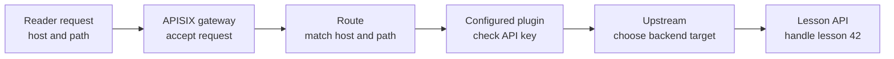
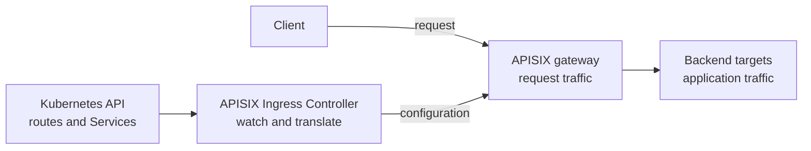

# What Apache APISIX does for an API

## The idea in one minute

An **API gateway** is an entry point in front of one or more backends.
Apache APISIX accepts a request, selects a **route**, runs any configured
**plugins**, and sends the request to an **upstream** backend. A route says
*which requests match*; an upstream says *where matched requests go*.
Plugins can add behavior such as authentication, rate limits, or request
logging, but that behavior exists only when it is configured for the
relevant traffic.[^apisix-route][^apisix-plugin]

Think of APISIX as a building lobby: it reads the address on a visitor's
invitation, may check a pass, and directs the visitor to an office. The
office still performs the actual work. The analogy stops at the network:
APISIX can transform or reject requests and can choose among multiple
backend targets, so it is more than a passive signpost.

## Follow one invented request

The names and paths below are **invented**. No gateway, route, request,
or backend was created or tested for this page.

A reader opens `https://learn.example.com/lessons/42`. Suppose the team
has configured APISIX to match host `learn.example.com` and path prefix
`/lessons`, require an API key for this route, and forward to a lesson API.
APISIX's route and plugin documentation describe these as separate pieces
of configuration.[^apisix-route][^apisix-plugin]

Text alternative: the reader sends a request with a host and path to the
APISIX gateway. A route matches those request details. In this invented
case, an API-key plugin checks the request. An upstream chooses a backend
target. The lesson API then handles the request for lesson 42.

| Step | APISIX asks | Who owns the answer? |
| --- | --- | --- |
| Route | Does this request match the configured host and path? | APISIX routing configuration.[^apisix-route] |
| Plugin | If enabled here, does the request satisfy this policy? | APISIX plugin configuration and the identity or policy system it uses.[^apisix-plugin] |
| Upstream | Which configured target should receive the matched request? | APISIX upstream configuration and backend discovery.[^apisix-route] |
| Application | Does lesson 42 exist, and may this user see it? | The lesson API and its business rules. |

A route that matches and a gateway that returns a response do not prove
the lesson is correct or available to the reader. The application owns
that result. A `404` might come from APISIX because no route matched or
from the application because lesson 42 does not exist; the
[APISIX 404 guide](../troubleshooting/apisix.md) shows how to separate
those cases.

## Two paths in Kubernetes

When APISIX runs with its Ingress Controller, a **request path** and a
**configuration path** operate at the same time:[^apisix-controller]

Text alternative: live requests go from a client through the APISIX gateway
to backend targets. Separately, the APISIX Ingress Controller watches
Kubernetes route and Service information and translates it into gateway
configuration. The controller is not an extra hop in each client request.

The Kubernetes authoring choices include standard `Ingress`, supported
Gateway API resources, and APISIX-specific custom resources. The
controller translates them into APISIX configuration. Gateway API support
is field-specific and version-sensitive, so check the current APISIX
[support table](https://apisix.apache.org/docs/ingress-controller/concepts/gateway-api/)
before relying on a field.[^apisix-controller][^apisix-gateway-api]

A Kubernetes `Service` identifies an application backend; APISIX's own
**Service** object is a different gateway abstraction for sharing upstream
or plugin configuration. In Kubernetes, the Ingress Controller watches
`EndpointSlice` changes and APISIX can proxy directly to Pod endpoints
instead of sending traffic through kube-proxy. That is why the simplified
request diagram says *backend targets* rather than promising an extra
network hop through a Kubernetes Service.[^apisix-resources]

## What APISIX helps with

- **One entry point:** several APIs can use host and path rules to share a
  gateway, with each matched route leading to its chosen upstream.
  [^apisix-route]
- **Shared traffic policy:** configured plugins can enforce or observe
  behavior at the gateway, for example an API-key check or request log.
  They do not automatically implement application-specific permission
  rules.[^apisix-plugin]
- **Kubernetes-driven configuration:** teams can declare supported route
  resources in Kubernetes and let the Ingress Controller translate them.
  The gateway serves traffic; the controller keeps its configuration in
  step with the declared resources.[^apisix-controller]

APISIX adds a component to operate. The team still needs to decide where
TLS terminates, which configuration API the controller uses, who can
change routes and credentials, and how to verify a request through the
whole path. Continue to [architecture and deployment](apisix-architecture-and-deployment.md)
for those boundaries and to [security, traffic, and observability](apisix-security-traffic-and-observability.md)
for plugin placement.

## Check your understanding

1. In the lesson example, which part chooses the API backend, and which
   part decides whether lesson 42 exists?
2. If a Kubernetes `HTTPRoute` exists but APISIX has not received its
   configuration, which path in the second diagram needs investigation?
3. Does adding APISIX automatically require API keys for every route?
4. Why does a Kubernetes `Service` in the route definition not always mean
   APISIX sends each request through kube-proxy?

## Explore further

- [Configure Routes](https://apisix.apache.org/docs/apisix/getting-started/configure-routes/)
  explains matching and upstreams.[^apisix-route]
- [Plugin](https://apisix.apache.org/docs/apisix/terminology/plugin/)
  explains how configured gateway behavior runs.[^apisix-plugin]
- [APISIX Ingress Controller](https://apisix.apache.org/docs/ingress-controller/getting-started/get-apisix-ingress-controller/)
  explains how Kubernetes resources reach APISIX.[^apisix-controller]
- [Ingress Controller Resources](https://apisix.apache.org/docs/ingress-controller/concepts/resources/)
  explains Kubernetes Services, EndpointSlices, and APISIX resource types.
  [^apisix-resources]
- [Gateway API and Ingress](gateway-api-and-ingress.md) introduces those
  Kubernetes route APIs.
- [Back to Kubernetes applications and tools](index.md).

[^apisix-route]: [Apache APISIX, Configure Routes](https://apisix.apache.org/docs/apisix/getting-started/configure-routes/), source record `apisix-route`.
[^apisix-plugin]: [Apache APISIX, Plugin](https://apisix.apache.org/docs/apisix/terminology/plugin/), source record `apisix-plugin`.
[^apisix-controller]: [Apache APISIX, Get APISIX and APISIX Ingress Controller](https://apisix.apache.org/docs/ingress-controller/getting-started/get-apisix-ingress-controller/), source record `apisix-controller`.
[^apisix-resources]: [Apache APISIX, Ingress Controller Resources](https://apisix.apache.org/docs/ingress-controller/concepts/resources/), source record `apisix-resources`.
[^apisix-gateway-api]: [Apache APISIX, Gateway API support](https://apisix.apache.org/docs/ingress-controller/concepts/gateway-api/), source record `apisix-gateway-api`.
