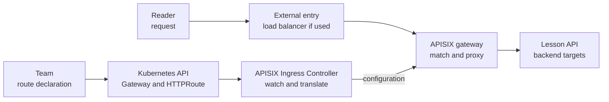

# How the APISIX gateway and controller fit together

## The idea in one minute

Two different programs usually appear in an APISIX installation on
Kubernetes. The **APISIX gateway** accepts client traffic and proxies it
to backends. The **APISIX Ingress Controller** watches supported Kubernetes
route resources and turns them into gateway configuration. The controller
configures the gateway; it is not an extra stop for each client request.
[^apisix-controller-architecture]

There is a third choice: **how APISIX itself receives and holds its
configuration**. APISIX documents traditional, decoupled, and standalone
deployment modes. That is separate from whether your team writes
`Ingress`, Gateway API routes, or APISIX custom resources in Kubernetes.
[^apisix-deployment-modes][^apisix-resources]

If you have not met routes and upstreams yet, begin with
[What Apache APISIX does for an API](apache-apisix.md).

## One service, two paths

Imagine the invented lesson API used in the introduction. A team wants
`learn.example.com/lessons` to reach a backend called `lesson-api`.
No gateway, controller, route, or backend was deployed or tested for this
example.

Text alternative: in the upper path, a reader's request reaches the
external entry point, when one is used, then the APISIX gateway, then
the lesson API backend targets. In the lower path, a team submits route
resources to Kubernetes. The APISIX Ingress Controller watches them and
updates the gateway configuration. The two paths meet at the gateway;
the controller is not in the reader's request path.

The entry point and APISIX gateway must be reachable and listening on
the intended ports. A Gateway API `Gateway` listener declaration does not
make APISIX open a new data-plane port: the APISIX support table states
that the port must already be configured on the gateway. Which layer
terminates TLS is also a deployment decision; do not infer it from the
presence of `HTTPS` in a route diagram.[^apisix-gateway-api]

## What each Kubernetes object contributes

For the Gateway API path, the team can reason from the outside toward
the backend:[^apisix-gateway-api]

| Object | Question it answers | What it does not do |
| --- | --- | --- |
| `GatewayClass` | Which implementation should reconcile this family of Gateways? | It does not receive requests. |
| `Gateway` | Which listeners and route attachments are requested? | It does not itself open an APISIX socket.[^apisix-gateway-api] |
| `HTTPRoute` | Which host, path, and backend should an HTTP request use? | It does not prove an actual request reached APISIX. |
| Kubernetes `Service` and `EndpointSlice` | Which application backend and endpoints are discoverable? | They do not make an unmatched APISIX route match.[^apisix-resources] |

The controller also supports `Ingress` and APISIX-specific resources.
These offer different configuration surfaces; current Gateway API support
varies by resource and field. Check the
[APISIX support table](https://apisix.apache.org/docs/ingress-controller/concepts/gateway-api/)
for the installed controller version rather than assuming every field in
the Gateway API specification is implemented.[^apisix-resources][^apisix-gateway-api]

Status conditions are valuable, but scoped. On an `HTTPRoute`, inspect
its parent status for `Accepted` and `ResolvedRefs`, which reports
whether references such as a backend target are valid. Inspect
`Programmed` on the `Gateway` and its listeners for the data-plane
configuration phase; do not look for it as a standard route condition.
Read each condition with its message and observed generation. Even a
programmed Gateway does not establish that a user request succeeds end
to end.[^gateway-api-implementation][^gateway-api-gateway]

## Where APISIX keeps its configuration

The deployment mode changes the *configuration* path, not the basic
purpose of the gateway. The current APISIX documentation describes these
modes:[^apisix-deployment-modes]

| Mode | Configuration and processes | Decision to make |
| --- | --- | --- |
| Traditional | One APISIX instance has data-plane and control-plane roles; etcd stores configuration and an Admin API can change it. | Who operates etcd, and how is the Admin API protected? |
| Decoupled | Separate APISIX control-plane and data-plane instances use etcd-backed configuration. | Does the extra separation justify the extra components and recovery path? |
| Standalone, file-driven | APISIX loads local YAML or JSON configuration without etcd. | How is the complete file delivered and restored on every gateway instance? |
| Standalone, API-driven | A dedicated API supplies full configuration held in memory; APISIX starts empty until updated. The APISIX documentation calls this an emerging mode designed for its Ingress Controller, and its controller deployment page labels standalone mode experimental. | Does the installed controller and gateway version support the required behavior, and how is configuration restored after restart? |

This is a map of the documented modes, not a claim that one is best for
every cluster. For example, choosing a controller to read `HTTPRoute`
objects does not, by itself, specify which APISIX mode stores the resulting
configuration. Conversely, choosing standalone mode does not make every
Gateway API feature available.[^apisix-controller-architecture][^apisix-gateway-api]

The APISIX documentation warns against directly using the API-driven
standalone endpoint without understanding its internal behavior. Use the
current [controller installation guide](https://apisix.apache.org/docs/ingress-controller/install/)
and [deployment architecture](https://apisix.apache.org/docs/ingress-controller/concepts/deployment-architecture/)
for a particular version. Its current installation guide gives a
Kubernetes version prerequisite and separate Helm paths for traditional
and standalone controller integration; check those prerequisites before
planning a rollout.[^apisix-deployment-modes][^apisix-controller-install]

## Follow a failure to the responsible path

The first question is whether the problem is in **request delivery** or
**configuration delivery**. Do not begin by changing the route or the
gateway until you have evidence about the failing boundary.

| Observation | Investigate first | Why |
| --- | --- | --- |
| Client cannot connect to the intended address or port. | External entry, Service exposure, gateway listener, and TLS placement. | The request may never reach APISIX. |
| Kubernetes route exists, but its status rejects a parent or backend reference. | Gateway API attachment, reference, and controller messages. | The controller has reported a configuration problem.[^gateway-api-implementation] |
| Route is accepted, but the same host and path produce an APISIX 404. | Exact request, supported match fields, and controller-to-gateway configuration. | Accepted configuration does not prove the gateway matched this request.[^apisix-gateway-api] |
| Route matches, but the backend fails. | Backend `Service`, endpoints, application status, and gateway upstream behavior. | The request crossed the route boundary but may fail afterward.[^apisix-resources] |

[Trace an APISIX 404](../troubleshooting/apisix.md) is the focused path
for that symptom. [APISIX on EKS](../../cross-topic-guides/apisix-on-eks.md)
adds AWS load-balancer ownership to the same model. Those guides keep
environment-specific steps out of this architectural explanation.

## Check your understanding

1. The team creates an `HTTPRoute`. Which component reads it, and which
   component handles the reader's HTTP request?
2. Does an accepted Gateway listener cause APISIX to open its port?
3. Which deployment mode uses a local file, and which documented mode
   starts with empty in-memory configuration until an API update?
4. The route is `Accepted` and the Gateway is `Programmed`, but a reader
   cannot load a lesson. What evidence would you seek before calling
   the problem solved?

## Explore further

- [APISIX deployment modes](https://apisix.apache.org/docs/apisix/deployment-modes/)
  explains the configuration choices and their mechanisms.
  [^apisix-deployment-modes]
- [Ingress Controller deployment architecture](https://apisix.apache.org/docs/ingress-controller/concepts/deployment-architecture/)
  explains how the controller configures APISIX.
  [^apisix-controller-architecture]
- [APISIX Gateway API support](https://apisix.apache.org/docs/ingress-controller/concepts/gateway-api/)
  lists supported resources and fields.[^apisix-gateway-api]
- [Gateway API implementer's guide](https://gateway-api.sigs.k8s.io/guides/implementers-guide/)
  explains the meaning and limits of status conditions.
  [^gateway-api-implementation]
- [Gateway API and Ingress](gateway-api-and-ingress.md) compares the
  Kubernetes authoring surfaces.
- [Back to Kubernetes applications and tools](index.md).

[^apisix-deployment-modes]: [Apache APISIX, Deployment modes](https://apisix.apache.org/docs/apisix/deployment-modes/), source record `apisix-deployment-modes`.
[^apisix-controller-architecture]: [Apache APISIX, Ingress Controller Deployment Architecture](https://apisix.apache.org/docs/ingress-controller/concepts/deployment-architecture/), source record `apisix-controller-architecture`.
[^apisix-controller-install]: [Apache APISIX, Install with Helm](https://apisix.apache.org/docs/ingress-controller/install/), source record `apisix-controller-install`.
[^apisix-gateway-api]: [Apache APISIX, Gateway API support](https://apisix.apache.org/docs/ingress-controller/concepts/gateway-api/), source record `apisix-gateway-api`.
[^apisix-resources]: [Apache APISIX, Ingress Controller Resources](https://apisix.apache.org/docs/ingress-controller/concepts/resources/), source record `apisix-resources`.
[^gateway-api-implementation]: [Gateway API, Implementer's Guide](https://gateway-api.sigs.k8s.io/guides/implementers-guide/), source record `gateway-api-implementation`.
[^gateway-api-gateway]: [Gateway API, Gateway](https://gateway-api.sigs.k8s.io/reference/api-types/gateway/), source record `gateway-api-gateway`.
